# Runpod 원격지를 로컬 VSCode에서 끌어쓰기

## 이 글을 쓰는 이유

Runpod의 Jupyter Lab만으로는 에이전트 활용이 불편해서 로컬 VSCode로 환경을 끌어오고 싶었음. SSH 연결부터 노트북 커널 연동까지, 더 쾌적하게 개발할 수 있는 환경 구축 방법을 단계별로 정리해봤음.

---

## 방법

### 1. Runpod에서 Pod 생성하기

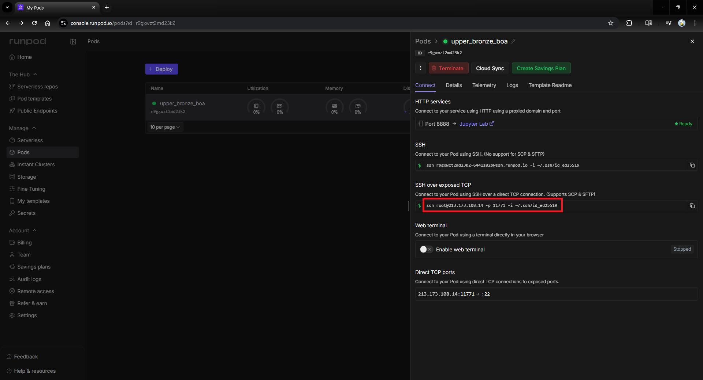

Pod를 생성하면 위 사진처럼 Pod가 만들어진다.  
빨간색으로 강조된 부분(SSH 명령어)을 복사한다.

---

### 2. VSCode에서 Remote-SSH로 Pod 연결하기

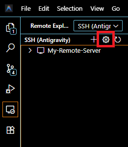

> 사진은 Antigravity라는 다른 IDE인데, VSCode랑 동일한 환경임.

여기서 강조된 부분인 **설정 버튼**을 클릭한다.

---

### 3. SSH Config에 설정하기

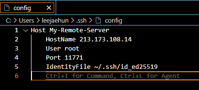

방금 복사했던 값을 아래 형식으로 변환한다:

**복사한 값:**
```bash
ssh root@213.173.108.14 -p 11771 -i ~/.ssh/id_ed25519
```

**변환된 값:**
```bash
Host My-Remote-Server
    HostName 213.173.108.14
    User root
    Port 11771
    IdentityFile ~/.ssh/id_ed25519
```

이렇게 설정하면 연결 조건이 모두 기록된 상황이다.

---

### 4. 접속하기

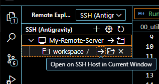

드롭다운을 누르면 `workspace` 디렉터리가 나온다.  
거기서 **화살표 버튼**을 누르면 작업 환경으로 접속할 수 있다.

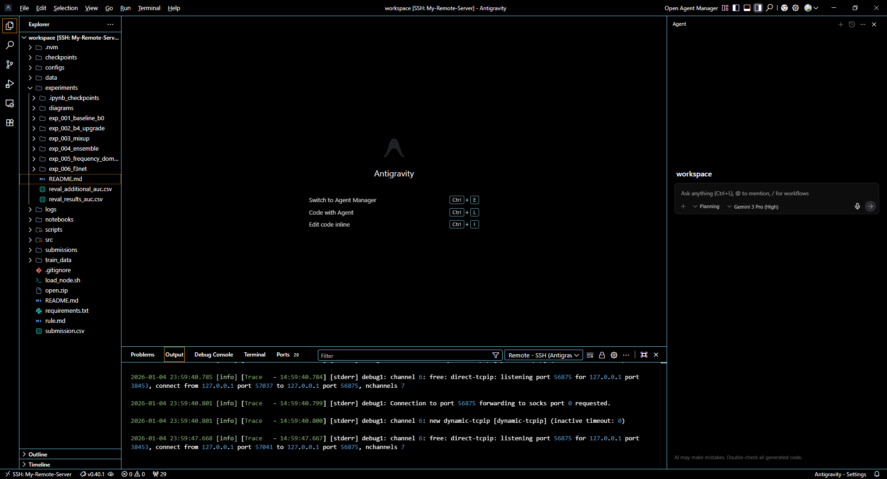

---

### 4-1. 뭔가 입력해야 한다면

`yes`라고 입력하고 엔터를 치면 된다.

별건 아니고 SSH 처음 접속할 때 로컬에서 호스트 키 저장하려고 하는 것이다.  
SSH 써본 사람은 아래 메시지를 본 적 있을 것이다:

```
Are you sure you want to continue connecting (yes/no/[fingerprint])?
```

이거랑 같은 것이다.

---

## 노트북 커널 연결하기

이제 에이전트와 작업할 수 있게 되었고, 이제는 커널을 연결해서 노트북을 써야한다.

### 1. 커널 상태 확인

노트북 우측 상단에서 커널 연결 상태를 확인할 수 있다.

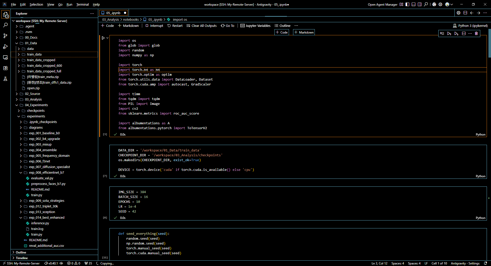

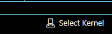

지금은 커널 연결이 안 되어있는 상태다. `Select Kernel` 버튼을 클릭한다.

### 2. 커널 추가 메뉴 진입

클릭하면 아래와 같은 메뉴가 나온다.

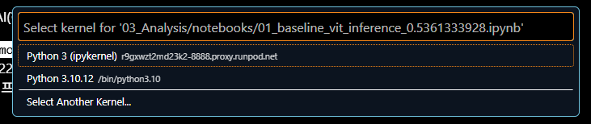

여기서 `Select Another Kernel...`을 선택한다.

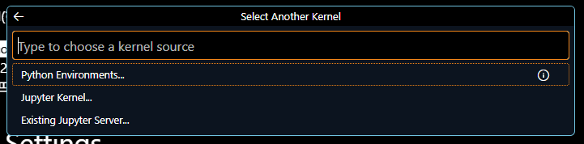

그 다음 `Existing Jupyter Server`를 선택한다.

### 3. Jupyter Server 주소 입력

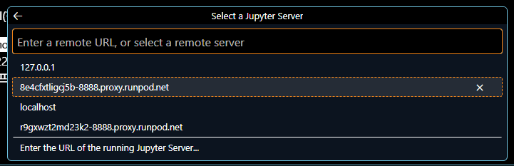

이제 `Enter the URL of the running Jupyter Server` 메뉴가 나오면, 여기에 직접 URL을 입력해야 한다.

### 4. Runpod에서 주소 및 토큰 확인

입력할 정보를 얻기 위해 Runpod 대시보드로 이동한다.

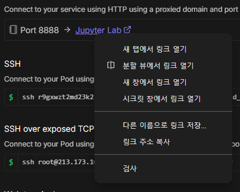

Runpod에서 'Connect to Jupyter Lab' 버튼에 우클릭 후 **링크 주소 복사**를 하면 URL과 토큰 정보를 얻을 수 있다.

**복사된 정보 예시:**
```
https://r9gxwzt2md23k2-8888.proxy.runpod.net/?token=8aw804df3azxxzmqc05g
```

여기서 필요한 정보는 다음과 같다:
- **URL**: `https://r9gxwzt2md23k2-8888.proxy.runpod.net`
- **Password(token)**: `8aw804df3azxxzmqc05g`

### 5. 연결 완료

VSCode 입력창에 URL을 넣고 엔터를 누른 뒤, 이어서 패스워드(토큰)를 입력하면 커널이 연결된다.

한 번 연결해두면, 이후 다른 노트북 파일을 열 때도 저장된 커널 목록에서 바로 선택하여 편하게 접근할 수 있다.