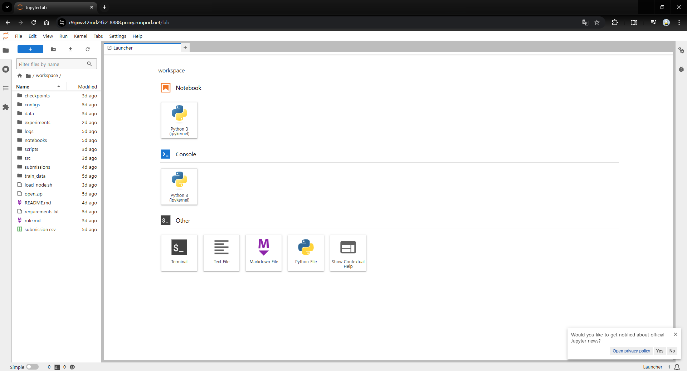
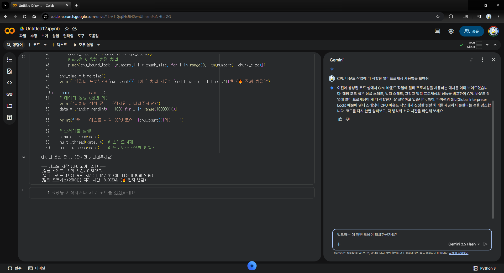

# Runpod 원격지를 로컬 VSCode에서 끌어쓰기

## 이 글을 쓰는 이유

Runpod을 사용할 때 Jupyter Notebook을 에이전트랑 같이 쓰고 싶은데, 단순 Jupyter Lab만 지원되니까 로컬 VSCode단으로 끌어오고 싶었음.



생각했던 건 Colab의 에이전트 느낌이었는데, 이건 고유 환경에서 써야 하니까 구속력이 좀 컸음.



그래서 VSCode에서 작업할 수 있는 환경을 구축했고, 이 방법을 공유하고 싶어서 작성하게 되었음.

---

## 방법

### 1. Runpod에서 Pod 생성하기


Pod를 생성하면 위 사진처럼 Pod가 만들어진다.  
빨간색으로 강조된 부분(SSH 명령어)을 복사한다.

---

### 2. VSCode에서 Remote-SSH로 Pod 연결하기


> 사진은 Antigravity라는 다른 IDE인데, VSCode랑 동일한 환경임.

여기서 강조된 부분인 **설정 버튼**을 클릭한다.

---

### 3. SSH Config에 설정하기


방금 복사했던 값을 아래 형식으로 변환한다:

**복사한 값:**
```bash
ssh root@213.173.108.14 -p 11771 -i ~/.ssh/id_ed25519
```

**변환된 값:**
```bash
Host My-Remote-Server
    HostName 213.173.108.14
    User root
    Port 11771
    IdentityFile ~/.ssh/id_ed25519
```

이렇게 설정하면 연결 조건이 모두 기록된 상황이다.

---

### 4. 접속하기


드롭다운을 누르면 `workspace` 디렉터리가 나온다.  
거기서 **화살표 버튼**을 누르면 작업 환경으로 접속할 수 있다.


---

### 4-1. 뭔가 입력해야 한다면

`yes`라고 입력하고 엔터를 치면 된다.

별건 아니고 SSH 처음 접속할 때 로컬에서 호스트 키 저장하려고 하는 것이다.  
SSH 써본 사람은 아래 메시지를 본 적 있을 것이다:

```
Are you sure you want to continue connecting (yes/no/[fingerprint])?
```

이거랑 같은 것이다.