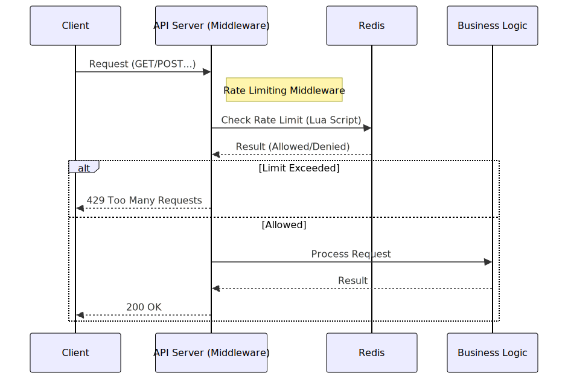

# 분산 환경에서도 요청량을 안전하게 제한해보기

## 이 글을 쓰는 이유

로스트아크 OpenAPI는 1분당 100회 호출량 제한이 있으며, 이를 고려하지 않는다면 서비스에서 429 에러를 반환할 수 있음. 그래서 전체 API 호출량을 제한해야 한다고 생각함. 이렇게 요청량을 제한하는 기술을 유량제어라고 함. 일반적으로 클라이언트(IP Based) 단위로 유량제어를 구현하는데, 프로젝트 전체 서비스 용량을 기반으로 실습을 설계함. 또한 관심사들을 추가해서 확인해보고자 함.

- OpenAI나 다른 LLM 서비스들이 요청횟수가 아닌 토큰량이라는 개념으로 제어하는 경우도 익혀보고자 요청별 비용을 다르게 설정해보기
- 분산 환경에서도 안전하게 동작하도록 로드밸런서와 여러 서버를 구성하여 실습해보기
- Redis의 싱글 스레드기반 동작 특성을 이용하여 동시성 문제를 해결해보기
- OpenAPI 서버와 시간이 달라 초기화 시점이 불일치하는 문제를 해결하기 위한 슬라이딩 윈도우 방식 적용하기
- 백엔드 프레임워크별 구현해보기(Python(FastAPI), Java(Spring Boot))


---

## 핵심 개념

### 1. 전체 용량 제어 (Global Rate Limiting)
일반적인 IP 기반 제어는 클라이언트가 많아지면 전체 트래픽이 무한정 늘어날 수 있음. 로스트아크 API처럼 프로젝트(API Key) 단위로 총량이 정해져 있는 경우, 모든 서버가 Redis의 `global` 키 하나를 공유해서 카운팅해야 함.

### 2. 요청별 비용 차등화 (Weighted Token)
LLM 서비스들이 단순히 "질문 횟수"가 아니라 "토큰 양"으로 과금하는 것과 같은 원리임.
요청별 비용이 다르기 때문에 남은 토큰을 초과한 요청이 들어오면 거절하는 방식으로 구현함.

| 요청 타입 | 비용 (Cost) | 비고 |
|:---:|:---:|:---|
| 단순 조회 (`GET`) | **1** | 가벼운 요청 |
| 검색 (`SEARCH`) | **3** | DB 부하가 있는 요청 |
| 생성/수정 (`POST`) | **5** | 쓰기 작업 |
| 삭제 (`DELETE`) | **10** | 가장 민감하고 무거운 작업 |

이렇게 가중치를 두면, 무거운 요청을 많이 보내는 클라이언트를 더 빨리 제한할 수 있어 전체 시스템 안정성을 높일 수 있음.

### 3. 시간 불일치 해결 (Sliding Window)
OpenAPI 서버와 우리 서버의 시간은 미세하게 다를 수밖에 없음. 만약 Fixed Window(매 분 00초 초기화)를 쓰면, 서로 기준이 달라서 `429` 에러가 터질 위험이 큼.

Sliding Window는 "현재 시점으로부터 과거 60초"를 매번 계산하기 때문에, 초기화 시점에 얽매이지 않고 훨씬 안전하게 유량을 제어할 수 있음.

현재 요청으로부터 60초전까지의 요청 기록으로부터 남은 토큰을 계산하고, 현재 요청이 요구하는 토큰이 여유가 있다면 요청을 처리하고, 여유가 없다면 거절함.

---

## 구현 과정

### 1. 동작 흐름 (Middleware Logic)



*   **Client**: 요청 전송
*   **API Server (Middleware)**: 비즈니스 로직 실행 전, 먼저 Redis와 통신하여 한도 체크
*   **Redis**: Lua Script를 통해 원자적으로 토큰 계산 후 결과 반환
*   **Logic**: 허용된 경우에만 실제 비즈니스 로직(DB 조회 등) 수행

### 2. 동시성 문제 해결 (Race Condition)

단일 서버라면 자원 점유로 인한 Lock 발생하지 않는다. 하지만 서버 3대가 동시에 `Redis 값을 읽음(99)` → `+1` → `저장(100)`을 시도하면, 타이밍 문제로 100을 훌쩍 넘겨버릴 수 있음.

Redis는 싱글 스레드 기반이라 한 번에 하나의 명령어만 처리하는데, Lua 스크립트를 통해 하나의 명령어처럼 원자적으로 실행되도록 할 수 있다. 따라서 동시 다발적인 요청이 와도 순차적으로 처리되어 Race Condition이나 초과 요청을 차단할 수 있다.

**사용된 Lua 스크립트 핵심 로직:**
```lua
-- 1. 60초 지난 과거 데이터 청소
redis.call('ZREMRANGEBYSCORE', key, 0, window_start)

-- 2. 현재 남은 토큰 합산 (데이터 포맷: "uuid:cost")
local members = redis.call('ZRANGEBYSCORE', key, window_start, now)
local current_usage = 0
for i, member in ipairs(members) do
    local cost = tonumber(string.match(member, ":(%d+)$"))
    current_usage = current_usage + cost
end

-- 3. 한도 체크 및 저장
if current_usage + request_cost <= limit then
    redis.call('ZADD', key, now, request_id_with_cost)
    return remaining
else
    return -1 -- 거절
end
```


## 검증 테스트

제대로 동작하는지 확인하려고 통합 테스트 스크립트(`test_rate_limit.ps1`)를 만들어서 돌려봤음.

### 테스트 시나리오
1.  **GET (1점)** × 5번 : 기본 조회 테스트 (누적 5)
2.  **POST (5점)** × 5번 : 쓰기 작업 테스트 (누적 30)
3.  **SEARCH (3점)** × 5번 : 검색 작업 테스트 (누적 45)
4.  **DELETE (10점)** × 5번 : 무거운 작업 테스트 (누적 95)
5.  **추가 POST (5점)** 1번 : 100 토큰 한도 꽉 채우기
6.  **초과 요청 날려보기** : 101번째 토큰 시도시 429 에러 확인

### 결과 화면 (실제 로그)

```text
[2] GET requests - 1 token each
    GET 1: remaining=99, server: api1 (total: 1)
    ...
    GET 5: remaining=95, server: api2 (total: 5)

[3] POST requests - 5 tokens each (누적 10~30)
    POST 1: remaining=90, server: api3 (total: 10)
    POST 2: remaining=85, server: api1 (total: 15)
    ...

[4] SEARCH requests - 3 tokens each (누적 33~45)
    SEARCH 1: remaining=42, server: api2 (total: 33)
    ...

[5] DELETE requests - 10 tokens each (누적 55~95)
    DELETE 1: remaining=45, server: api1 (total: 55)
    ...
    DELETE 5: remaining=5, server: api3 (total: 95)

[6] Final POST to reach limit (누적 100)
    POST 6: remaining=0, server: api1 (total: 100)

[7] EXCEEDED TEST (차단 확인)
    Response: {"detail":{"error":"Too Many Requests","message":"Token limit exceeded...","limit":100,"window":"60 seconds","server_id":"api2"}}
```

*   **로드밸런싱 확인**: `server: api1` → `api2` → `api3` 순서로 골고루 찍히는 걸 볼 수 있음.
*   **정확한 차단**: 100 토큰을 초과한 요청은 `429 Too Many Requests` 에러를 뱉음.

---

## 마무리하며

처음 유량 제어를 공부할때는 모든 요청이 동등한 가치를 전제로 서술되었다. 하지만 최근 LLM API 들은 사용량을 토큰으로 계산하는 구조를 가지고 있다. 이는 요청이 서버 리소스를 점유하는 만큼 가치를 매긴거라고 생각할 수 있다. 그래서 cost-aware rate limiting 개념을 고려하게 되었고 지금처럼 요청별 비용을 도입해보았다. 이외에도 다양한 유량 제어 알고리즘이 존재하지만 현재로썬 지금 방식이 가장 적합하다고 생각했고, 또한 lua 스크립트를 다른 언어환경에서 전달하는 방법을 알게되었다. 서버 유지보수 작업에서 lua 확장자 파일이 간혹 있었는데 이제야 어떻게 사용되는지 알게되었다.
