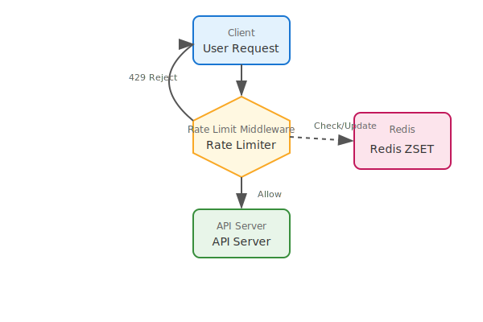
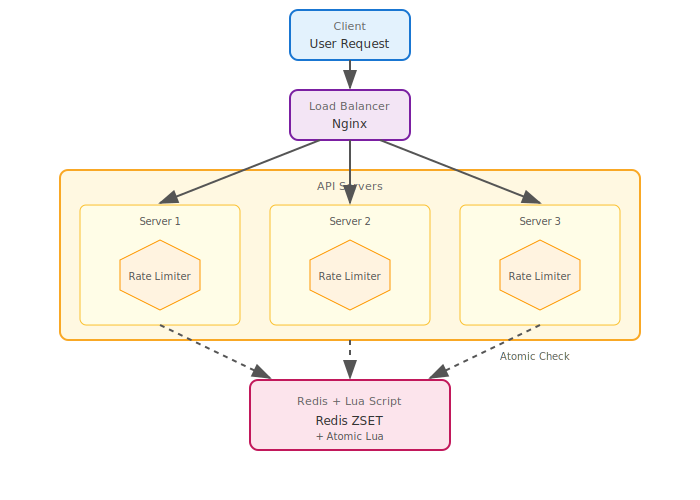

# Rate Limiting System Practice

서드파티 API 의존 서비스를 위한 **Global Weighted Rate Limiting** 시스템 실습

## 📋 개요

### 목표
- Redis를 활용한 분산 Rate Limiting 구현
- Sliding Window 알고리즘 이해 및 적용
- **Weighted Token** 기반 차등 비용 적용
- 단일 서버 vs 다중 서버 환경에서의 동시성 문제 이해
- Lua Script를 활용한 원자적 연산으로 Race Condition 해결

### 제한 조건
- **100 tokens / minute** (분당 100 토큰)
- **Global Rate Limiting**: 전체 서비스가 하나의 토큰 버킷 공유

### Token Costs (Weighted)

| Operation | Token Cost | Description |
|-----------|------------|-------------|
| GET (read) | 1 token | 경량 읽기 작업 |
| SEARCH | 3 tokens | 검색 작업 |
| POST/PUT (write) | 5 tokens | 쓰기 작업 |
| DELETE | 10 tokens | 삭제 작업 (무거움) |

> **Why Global?**  
> 서드파티 API (예: OpenAI, Stripe) 호출 시 전체 서비스 레벨에서 요청량을 관리해야 함.
> IP 기반 제한은 클라이언트별 공정성에, Global 제한은 외부 의존성 보호에 적합.

---

## 🏗️ 아키텍처

### 아키텍처 비교

<div align="center">
  <table width="100%">
    <tr>
      <th width="50%">단일 서버 (Single Server)</th>
      <th width="50%">다중 서버 (Multi Server)</th>
    </tr>
    <tr>
      <td align="center">
        
      </td>
      <td align="center">
        
      </td>
    </tr>
  </table>
</div>

---

## 🧮 Sliding Window Algorithm (Weighted)

```
Time: ----[-------- 60 seconds --------]--->
           ^                           ^
        windowStart                   now

1. 현재 시간(now)에서 60초 전(windowStart) 계산
2. windowStart 이전의 요청 기록 삭제 (ZREMRANGEBYSCORE)
3. 현재 윈도우 내 토큰 합산 (각 member에서 cost 추출)
4. 100 토큰 미만이면 요청 허용 및 기록 (ZADD)
5. 100 토큰 이상이면 429 반환
```

### Redis Data Structure
- **ZSET (Sorted Set)** 활용
- Key: `rate_limit:global`
- Member: `{UUID}:{cost}` (예: `abc-123:10`)
- Score: 요청 타임스탬프 (Unix milliseconds)

---

## 📁 디렉터리 구조

```
03_system/00_rate_limiting/
├── README.md               # 이 파일
├── scripts/
│   ├── test_rate_limit.ps1 # 통합 테스트 (PowerShell)
│   └── test_rate_limit.sh  # 통합 테스트 (Bash)
├── python_single/          # Python 단일 서버
├── python_multi/           # Python 다중 서버 + Lua Script
├── java_single/            # Java 단일 서버
└── java_multi/             # Java 다중 서버 + Lua Script
```

---

## 🐍 Python (FastAPI)

### 1. 단일 서버 (`python_single/`)
- FastAPI 인스턴스 1개 + Redis
- Global Weighted Sliding Window 구현

### 2. 다중 서버 (`python_multi/`)
- FastAPI 인스턴스 3개 + Nginx 로드밸런서 + Redis
- **Lua Script**로 원자적 연산 보장

---

## ☕ Java (Spring Boot)

### 1. 단일 서버 (`java_single/`)
- Spring Boot 인스턴스 1개 + Redis
- RedisTemplate 기반 Weighted Sliding Window 구현

### 2. 다중 서버 (`java_multi/`)
- Spring Boot 인스턴스 3개 + Nginx 로드밸런서 + Redis
- **Lua Script**로 원자적 연산 보장

---

## 🔧 기술 스택

| Category | Single Server | Multi Server |
|----------|---------------|--------------|
| **Python** | FastAPI, Redis-py | + Nginx, Lua Script |
| **Java** | Spring Boot 3.x, Spring Data Redis | + Nginx, Lua Script |
| **Infra** | Docker, Docker Compose | Docker Compose (scale) |

---

## 🚀 실행 방법

각 디렉터리에서 독립적으로 실행 가능:

```bash
cd python_single  # 또는 다른 디렉터리
docker-compose up --build -d
```

### 테스트

```bash
# 통합 테스트 스크립트 (상위 폴더에서)
./scripts/test_rate_limit.sh 8000       # Python Single (Linux/Mac)
./scripts/test_rate_limit.ps1 -Port 8000  # Python Single (Windows)

./scripts/test_rate_limit.sh 8080       # Multi Server (Linux/Mac)
./scripts/test_rate_limit.ps1 -Port 8080  # Multi Server (Windows)
```

---

## 🔒 단일 vs 다중 서버 비교

### 단일 서버
```python
# 문제 없음: 단일 프로세스에서 순차 처리
usage = sum_token_costs(redis.zrangebyscore(key, ...))
if usage + cost <= 100:
    redis.zadd(key, {f"{uuid}:{cost}": timestamp})
```

### 다중 서버 (Race Condition)
```
Server A: usage = 95 ✓
Server B: usage = 95 ✓
Server A: zadd (cost=10) → total = 105 ❌
Server B: zadd (cost=10) → total = 115 ❌ 제한 초과!
```

### 해결: Lua Script
```lua
-- 원자적 실행: 중간에 다른 명령 개입 불가
redis.call('ZREMRANGEBYSCORE', key, 0, window_start)
local usage = sum_costs(redis.call('ZRANGEBYSCORE', key, ...))
if usage + cost <= limit then
    redis.call('ZADD', key, timestamp, request_id)
    return limit - usage - cost
end
return -1
```

---

## 📊 테스트 시나리오

1. **정상 요청**: 100 토큰 이하 → 모두 200 OK
2. **초과 요청**: 100 토큰 초과 → 429 Too Many Requests
3. **Mixed Requests**: GET(1) + POST(5) + DELETE(10) 조합 테스트
4. **윈도우 리셋**: 1분 후 다시 100 토큰 허용
5. **로드밸런싱**: Multi Server에서 api1→api2→api3 순환 확인
