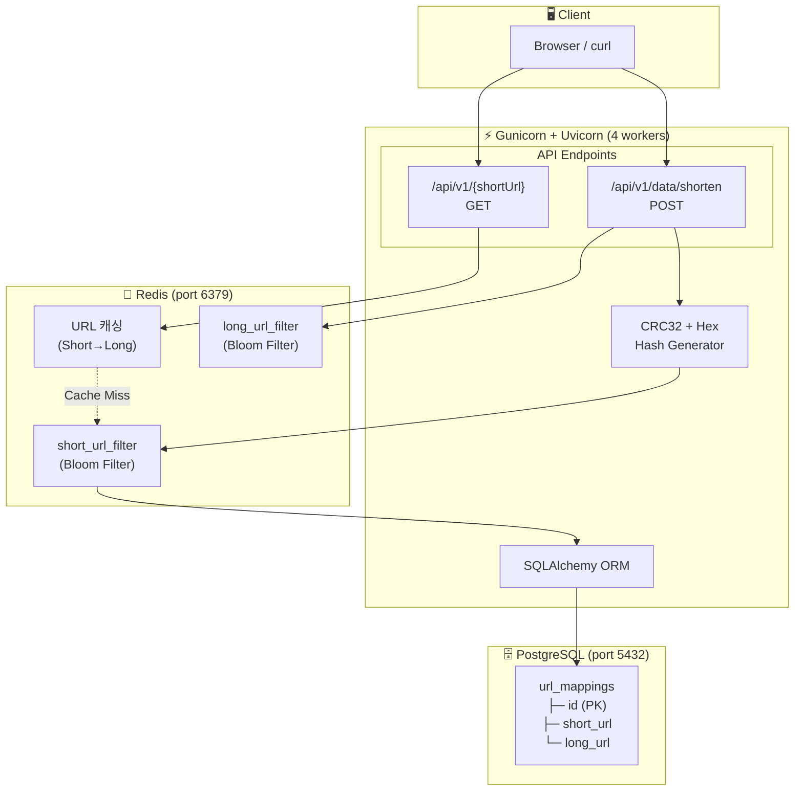
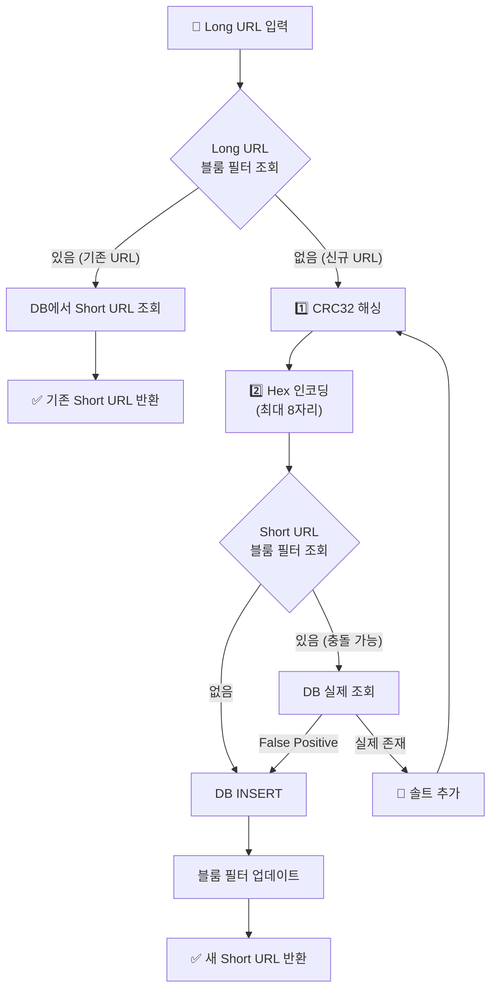
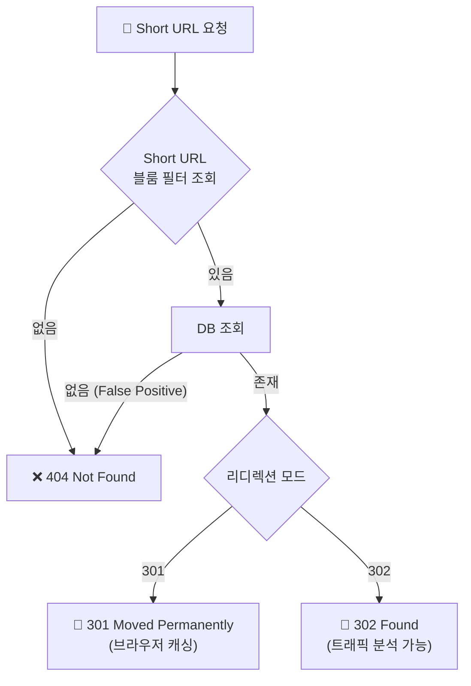

# URL Shortener Project

URL 단축기 시스템 설계 및 실습 프로젝트입니다. FastAPI와 PostgreSQL을 기반으로 구현되었으며, 301 vs 302 리디렉션의 차이를 실습하고 대용량 트래픽 처리를 위한 설계를 포함합니다.

---

## 📊 시스템 목표값

| 항목 | 목표 값 |
|------|---------|
| **일간 쓰기 연산** | 1억 개/일 |
| **초당 쓰기 연산 (TPS)** | 1,160 TPS |
| **초당 읽기 연산 (TPS)** | 11,600 TPS (읽기:쓰기 = 10:1) |
| **운영 기간** | 10년 |
| **총 레코드 수** | 3,650억 개 (1억 × 365 × 10) |
| **평균 URL 길이** | 100 bytes |
| **총 저장 용량** | 36.5 TB |
| **단축 URL 길이** | 7자리 (Base62: 62⁷ ≈ 3.5조) |

### 해시 함수 전략
- **CRC32** 해싱 (빠른 속도)
- **Hex Encoding** (Base62 인코딩 미사용, 단순화)
- 충돌 발생 시 랜덤 솔트 추가 후 재시도
- **블룸 필터**로 DB 조회 최적화

---

## 🎯 실습 시나리오

| # | 시나리오 | 목표 |
|---|----------|------|
| 1 | **URL 단축 API** | POST 요청으로 Long URL → Short URL 변환 |
| 2 | **리디렉션 동작 확인** | Short URL 접속 시 원본 URL로 이동 |
| 3 | **301 vs 302 비교** | 브라우저 캐싱 동작 차이 확인 |
| 4 | **블룸 필터 효과** | DB 조회 횟수 감소 확인 |
| 5 | **부하 테스트** | 1,160 TPS (쓰기), 11,600 TPS (읽기) 목표 달성 |
| 6 | **트래픽 분석** | 302 모드에서 로그 기반 접속 통계 집계 |

---

## 🏗️ 시스템 아키텍처




### URL 단축 플로우



### 리디렉션 플로우



---
## 🚀 프로젝트 실행 방법

### 요구 사항
- Docker 및 Docker Compose

### 실행
```powershell
cd d:\project\study\03_system\01_url_shortener\python_app
docker-compose up --build -d
```

서버가 시작되면 다음 주소에서 API를 확인할 수 있습니다:
- 엔드포인트: `http://localhost:8000/api/v1`
- 헬스 체크: `http://localhost:8000/`

---

## 🧪 테스트 방법

### 1. 단위 테스트 (Unit Tests)
API의 기능적 정확성을 검증합니다.
```powershell
# 컨테이너 내부에서 실행 (권장)
docker-compose exec app pytest tests/ -v
```

### 2. 통합 테스트 (Manual)
`curl` 또는 API 클라이언트를 사용해 동작을 확인합니다.
```powershell
# URL 단축 요청
curl -X POST http://localhost:8000/api/v1/data/shorten `
  -H "Content-Type: application/json" `
  -d '{"longUrl": "https://www.google.com"}'

# 리디렉션 확인 (반환된 shortUrl 사용)
curl -I http://localhost:8000/api/v1/{shortUrl}
```

### 3. 부하 테스트 (Load Testing)
`k6`를 사용하여 시스템 성능을 측정합니다.
```powershell
# 스크립트 디렉토리로 이동
cd d:\project\study\03_system\01_url_shortener\scripts

# k6 실행 (100 VUs, 60초간 테스트)
./run_k6.ps1
# 또는 직접 실행:
# k6 run load_test.js
```

---

## 🔍 301 vs 302 실습 가이드

이 프로젝트는 리디렉션 방식에 따른 동작 차이를 비교할 수 있습니다.

### 모드 변경 방법
`docker-compose.yml`에서 `REDIRECT_MODE` 환경 변수를 변경하고 재시작합니다.
```yaml
environment:
  - REDIRECT_MODE=302 # 또는 301
```

### 비교 포인트

| 모드 | HTTP 상태 코드 | 브라우저 동작 | 트래픽 분석 |
|------|----------------|---------------|-------------|
| **301 Moved Permanently** | 301 | 브라우저가 결과를 캐싱함. 이후 요청은 서버를 거치지 않음. | 불가능 (서버 로그 남지 않음) |
| **302 Found** (Default) | 302 | 매번 서버에 요청을 보냄. | 가능 (서버 로그로 집계 가능) |

### 트래픽 분석 실습 (302 모드)
1. 302 모드로 서버 실행
2. 부하 테스트 실행 (여러 번 리디렉션 요청 발생)
3. 로그 분석 스크립트 실행
```powershell
# Docker 로그를 파일로 저장
docker-compose logs app > access.log

# 분석 스크립트 실행
python d:\project\study\03_system\01_url_shortener\scripts\analytics.py access.log
```
실행 결과로 가장 많이 호출된 Short URL Top 20이 출력됩니다.
