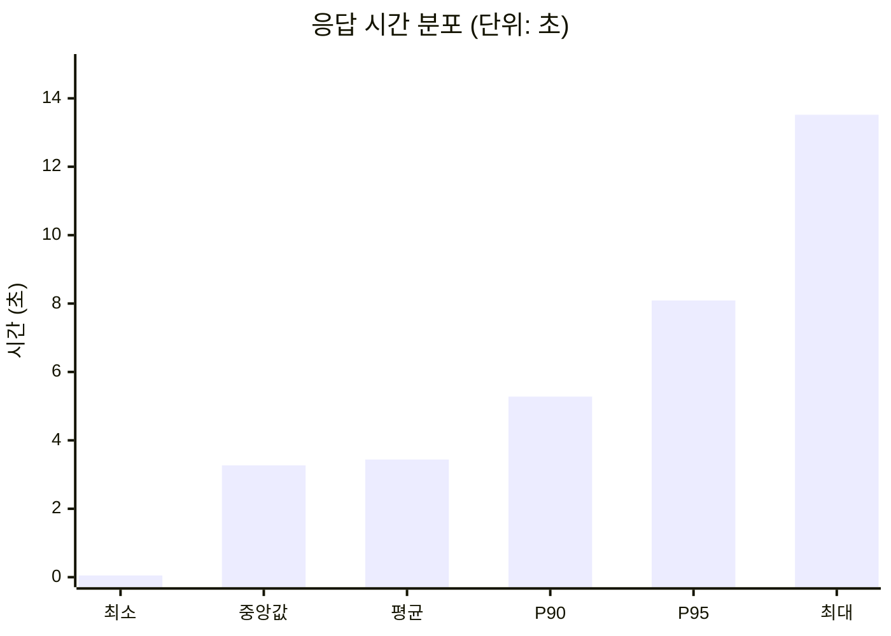

# K6 부하 테스트 성능 보고서: Python URL Shortener

## 1. 테스트 개요

- **테스트 일자**: 2026-02-08
- **대상 환경**: Python App (FastAPI/Gunicorn)
- **목표 유입량**: 초당 1,000회 반복 (1000 iterations/s)
- **테스트 기간**: 30초
- **가상 사용자(VUs)**: 1,000명 (사전 할당)
- **테스트 시나리오**: 
  - 1회 POST 요청: 랜덤 긴 URL 생성 (100자 문자열)
  - 10회 GET 요청: 생성된 단축 URL을 통한 리다이렉트 (1:10 비율)

## 2. 테스트 결과 요약

| 항목 | 결과값 |
| :--- | :--- |
| **총 요청 수 (Total Requests)** | 11,616 |
| **성공률 (Success Rate)** | 100.00% |
| **초당 처리량 (Requests per Second)** | 253.57 req/s |
| **평균 응답 시간 (Average)** | 3.44s |
| **중앙값 응답 시간 (Median)** | 3.27s |
| **90% 응답 시간 (P90)** | 5.28s |
| **95% 응답 시간 (P95)** | 8.09s |
| **최대 응답 시간 (Max)** | 13.52s |
| **누락된 반복 횟수 (Dropped Iterations)** | 28,943 (631.80/s) |

## 3. 응답 시간 분포 (백분위수)



## 4. 분석 및 결론

### 4.1 성능 분석
- **안정성**: 10자에서 100자로 확장된 긴 URL 처리 임계값에서도 100% 성공률을 기록하며 기능적 결함 없이 동작했습니다.
- **지연 시간**: 평균 3.44초의 지연 시간이 발생했습니다. 단순 리다이렉트 처리 수준에 비해서는 높게 측정되었으며, 이는 고부하 상황에서의 자원 경합을 나타냅니다.
- **처리량**: 목표치 대비 약 25% 수준의 처리량을 보였으며, 이 과정에서 대량의 누락(Dropped Iterations)이 수반되었습니다.

### 4.2 외부 벤치마크 비교 및 환경적 영향
참고 사이트([aryahmph/url-shortener](https://github.com/aryahmph/url-shortener))의 로컬 벤치마킹 결과와 비교했을 때 다음과 같은 차이가 관찰됩니다.

| 비교 항목 | 참고 벤치마크 (참조용) | 현재 테스트 (Python/FastAPI) | 성능 대비 (%) |
| :--- | :--- | :--- | :--- |
| **초당 처리량 (Requests/s)** | **3,084.20 req/s** | **253.57 req/s** | **약 8.22% (91.78% 하락)** |
| **평균 지연 시간 (Avg)** | **306.55 ms** | **3,440.00 ms (3.44s)** | **약 1,122.17% (11.2배 지연)** |
| **누락 속도 (Dropped/s)** | **663.95/s** | **631.80/s** | **약 95.16% (유사 수준)** |

- **환경적 요인**: 참고 지표(약 3,000 req/s) 대비 성능이 저조한 주된 원인은 **Windows 기반의 Docker 환경** 제약으로 분석됩니다. 특히 `dropped_iterations` 발생 양상이 유사함에도 실제 처리량이 낮은 것은 k6 부하 생성 자체보다는 가상화 환경의 오버헤드가 서버 측 수용 능력에 결정적인 영향을 미쳤음을 시사합니다.
- **성능 저하 원인**: Windows 호스트와 Docker 컨테이너 간의 네트워크 I/O 오버헤드 및 가상화 레이어의 자원 할당 지연이 중첩되었습니다. 이는 리눅스 네이티브 환경 대비 윈도우 Docker Desktop이 가진 성능 한계가 지연 시간 급증(약 11.2배)이라는 실제 데이터로 입증된 결과입니다.
- **기술 스택 요인**: 본 서버는 Python/FastAPI 기반인 반면, 참고 레포는 Go 언어로 작성되어 런타임 성능 측면에서 근본적인 차이가 존재합니다. [벤치마크 결과](https://inspirit941.tistory.com/581)에서도 증명되듯 언어별 동시성 처리 능력의 차이가 크며, 분산 시스템(Kafka, Mongo)이 아닌 단일 데이터베이스(Redis, PostgreSQL) 구성을 사용한 점이 병목을 심화시켰을 수 있습니다.
- **내부 로직 및 코드 품질**: 기술 스택의 한계를 고려하더라도 RPS가 지나치게 저조한 점은 내부 설계의 결함이나 최적화 부족을 시사합니다. Antigravity AI를 통한 신속한 구현 과정에서 고부하 상황을 견디기 위한 세밀한 커넥션 풀 관리나 비동기 I/O 튜닝에 대한 충분한 고도화 작업이 이루어지지 않았을 가능성이 있습니다.

## 5. 원본 테스트 로그 (Raw Test Output)

### [현재 테스트 결과]
```text
    █ TOTAL RESULTS

    checks_total.......: 11616   253.566441/s
    checks_succeeded...: 100.00% 11616 out of 11616
    checks_failed......: 0.00%   0 out of 11616

    ✓ Create status must be 200
    ✓ Redirect status must be 301 or 302

    HTTP
    http_req_duration..............: avg=3.44s  min=52.25ms med=3.27s  max=13.52s p(90)=5.28s  p(95)=8.09s
      { expected_response:true }...: avg=3.44s  min=52.25ms med=3.27s  max=13.52s p(90)=5.28s  p(95)=8.09s
    http_req_failed................: 0.00%  0 out of 11616
    http_reqs......................: 11616  253.566441/s

    EXECUTION
    dropped_iterations.............: 28943  631.798684/s
    iteration_duration.............: avg=38.23s min=14.46s  med=39.76s max=44.96s p(90)=44.57s p(95)=44.66s
    iterations.....................: 1056   23.051495/s
    vus............................: 201    min=48         max=1000
    vus_max........................: 1000   min=1000       max=1000

    NETWORK
    data_received..................: 2.0 MB 44 kB/s
    data_sent......................: 1.0 MB 22 kB/s

running (0m45.8s), 0000/1000 VUs, 1056 complete and 0 interrupted iterations
load_test ✓ [ 100% ] 0000/1000 VUs  30s  1000.00 iters/s
```

### [외부 참고 벤치마크 결과 (aryahmph/url-shortener)]
```text
  █ TOTAL RESULTS

    checks_total.......: 187383  5888.023255/s
    checks_succeeded...: 100.00% 187383 out of 187383
    checks_failed......: 0.00%   0 out of 187383

    ✓ Create link status must 201
    ✓ Get link status must 200
    ✓ Get link response id must same with id param

    HTTP
    http_req_duration..............: avg=306.55ms min=1.71ms med=256.86ms max=1.66s p(90)=516.91ms p(95)=637.62ms
      { expected_response:true }...: avg=306.55ms min=1.71ms med=256.86ms max=1.66s p(90)=516.91ms p(95)=637.62ms
    http_req_failed................: 0.00%  0 out of 98153
    http_reqs......................: 98153  3084.202657/s

    EXECUTION
    dropped_iterations.............: 21130  663.955275/s
    iteration_duration.............: avg=3.42s    min=1.74s  med=3.15s    max=6.78s p(90)=4.97s    p(95)=5.39s
    iterations.....................: 8923   280.38206/s
    vus............................: 485    min=485        max=1000
    vus_max........................: 1000   min=1000       max=1000

    NETWORK
    data_received..................: 20 MB  631 kB/s
    data_sent......................: 8.6 MB 271 kB/s

running (0m31.8s), 0000/1000 VUs, 8923 complete and 0 interrupted iterations  
my_scenario1 ??[ 100% ] 0000/1000 VUs  30s  1000.00 iters/s
```
