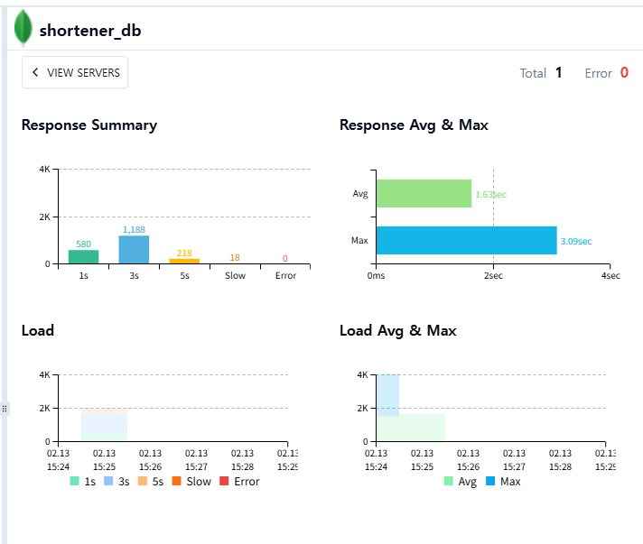

# MongoDB 연결 풀 튜닝 실험 (Before/After)
pinpoint 로 병목을 탐색했을 때, MongoDB에서 병목이 발생했습니다. 그래서 얼마나 병목이 발생하는지 측정하고 연결 풀을 확장하여 성능을 개선해보고자 합니다.
기존 DB-only 부하 테스트에서 최대 지연(max)이 튀는 구간이 보여서, MongoDB 연결 풀 옵션을 명시적으로 조정했을 때 개선되는지 확인했습니다.  
테스트 의도는 "평균 성능"보다 "tail latency(상위 지연/최대 지연)" 완화 여부 확인입니다.

## 변경 사항
- 대상 파일: `03_system/01_url_shortener/java_app/docker-compose.db-only.yml`
- 변경 전
  - `SPRING_DATA_MONGODB_URI=mongodb://db:27017/shortener_db`
- 변경 후
  - `SPRING_DATA_MONGODB_URI=mongodb://db:27017/shortener_db?maxPoolSize=500&minPoolSize=50&maxConnecting=20&waitQueueTimeoutMS=2000`

## 테스트 조건
- 실행 환경: Docker Compose (app + mongo + redis + k6)
- 스크립트: `03_system/01_url_shortener/scripts/mongo_db_load_test.js`
- 시나리오: read 80% / write 15% / update 5%
- ramp: `50 -> 200 -> 500 -> 800 iters/s`
- 실행 시간: 약 5m30s

## 측정 결과

| 항목 | Before | After | 변화 |
| :--- | :---: | :---: | :---: |
| HTTP req avg | 1.718 ms | 1.653 ms | **-3.8%** |
| HTTP req p95 | 2.758 ms | 2.726 ms | **-1.1%** |
| HTTP req max | 4996.821 ms | 3552.251 ms | **-28.9%** |
| Throughput (http_reqs/s) | 416.442 | 418.247 | **+0.4%** |
| iteration p95 | 13.791 ms | 13.755 ms | **-0.3%** |

## 해석
- 평균/중앙값 구간은 원래도 충분히 낮았고, 튜닝 후에도 소폭 개선 수준입니다.
- 이번 실험에서 의미 있는 변화는 **max 지연 감소(약 29%)**입니다.
- 즉, 병목의 중심은 "평균 처리 성능"보다는 "순간적인 대기열/스파이크"에 가까웠고, 연결 풀 튜닝이 tail 완화에는 효과가 있었습니다.

## 참고 로그/결과 파일
- Before summary: `03_system/01_url_shortener/scripts/results_mongo_pool_before.json`
- After summary: `03_system/01_url_shortener/scripts/results_mongo_pool_after.json`

## 추가 메모
- k6 실행 중 high-cardinality 경고가 반복 발생했습니다(고유 URL path 다수).  
  측정 오버헤드를 줄이려면 다음 실험에서 URL grouping(name tag) 적용이 필요합니다.
