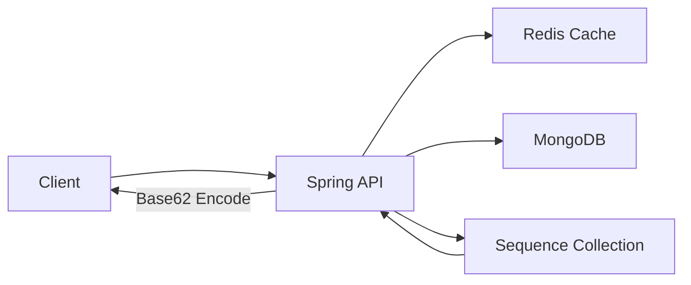

# 분산 환경에서 URL Shortener 성능 개선하기 (Spring + MongoDB + Redis)

## 이 글을 쓰는 이유

URL 단축기는 기능 자체는 단순하지만, 트래픽이 몰리면 병목이 빠르게 드러나는 시스템입니다.
이번 글은 `POST /api/v1/data/shorten` + `GET /api/v1/{shortUrl}` 흐름을 기준으로,
Spring 기반 구현에서 실제로 어떤 변경이 성능을 올렸는지 단계별로 정리한 기록입니다.

목표는 다음 3가지였습니다.
- 처리량(req/s)을 끌어올리기
- tail latency(p95, max)를 낮추기
- 실패율(`http_req_failed`) 0% 유지하기

---

## 핵심 개념

### 1) 충돌 재시도 해시 -> Sequence + Base62
초기 해시 기반 접근은 충돌/재시도 비용이 붙습니다.
최종 구조에서는 MongoDB 시퀀스로 고유 ID를 발급하고, 이를 Base62로 인코딩해 short URL을 생성했습니다.

- 장점: 충돌 검증/재시도 제거, 쓰기 경로 단순화
- 트레이드오프: short URL에 순서성이 생겨 URL 추측/열거 가능성이 상대적으로 증가

### 2) Look-aside 캐시 + TTL
조회는 Redis 우선 조회 후 miss 시 DB 조회, 이후 캐시 갱신 방식으로 구성했습니다.
핫 키 구간에서 DB hit를 줄이는 데 효과가 컸습니다.

### 3) 런타임/인프라 튜닝
알고리즘 변경만으로는 한계가 있어, 런타임과 자원도 함께 조정했습니다.

- Java 21 Virtual Thread 적용
- CPU 자원 확장(WSL2/Docker 기준 processors 2 -> 4)
- Mongo 연결 풀 튜닝 실험

---

## 구현 과정

### 1) 아키텍처

핵심 흐름:
1. `shorten`: 시퀀스 증가 -> Base62 인코딩 -> Mongo 저장 -> Redis 캐시
2. `redirect`: Redis 조회 -> miss면 Mongo 조회 -> Redis 갱신 -> 301/302 반환

### 2) API 엔드포인트
- `POST /api/v1/data/shorten`
- `GET /api/v1/{shortUrl}`
- `GET /health`

### 3) 부하 테스트 시나리오(k6)
가상 사용자 1,000명이 30초 동안 초당 1,000회 요청을 보내며, 매 반복마다 `shorten` 1회와 `redirect` 10회를 수행하는 테스트 입니다.  
`scripts/load_test.js` 기준:
- `constant-arrival-rate`: 1000 iters/s
- duration: 30s
- preAllocatedVUs: 1000
- 1회 shorten + 10회 redirect (1:10)

---

## 검증 테스트 결과

### 단계별 성능 변화

| 단계 | 기준 문서 | req/s | avg | p95 | 비고 |
|---|---|---:|---:|---:|---|
| Spring MVC 초기 | `experiments/03_spring_boot_mvc.md` | 897.63 | 1.04s | 2.17s | Spring 전환 기준점 |
| MongoDB 전환 | `experiments/04_replace_mongo_db.md` | 1962.70 | 478.59ms | 1.02s | DB 경로 개선 |
| Virtual Thread | `experiments/05_virtual_thread.md` | 2710.84 | 351.24ms | 691.74ms | 동시성 효율 개선 |
| CPU 4코어 확장 | `experiments/06_cpu_scale_up.md` | 5555.85 | 169.74ms | 350.82ms | 자원 병목 완화 |
| Sequence + Base62 최종 | `experiments/07_refact_url_generator.md` | 5982.34 | 155.94ms | 330.83ms | 최종 결과 |

초기(Spring MVC) 대비 최종 결과:
- 처리량: `897.63 -> 5982.34 req/s` (`+566.46%`, 약 `6.66배`)
- 평균 지연: `1.04s -> 155.94ms` (`85.01% 감소`)
- P95 지연: `2.17s -> 330.83ms` (`84.75% 감소`)
- 실패율: 전 구간 `0.00%`

### 측정 환경
- OS: `Windows 10`
- CPU: `Intel(R) Core(TM) i7-7700HQ CPU @ 2.80GHz, 2808Mhz, 4 코어, 8 논리 프로세서`

### 한계점
- 환경 차이: 현재 윈도우 10 + 도커/WSL2 환경입니다. 그렇기에 네트워크와 가상화에서 오버헤드를 발생시켜 지연현상이 발생할 수 있습니다.
- 프레임워크 차이: 참고 프로젝트는 Go 기반인데 반해, Spring Boot 환경입니다. 배경 언어의 성능차이가 있을 수 있습니다. Spinrg Boot도 FastAPI보다 성능이 높았기에 채택하기도 했기 때문입니다.
- 아키텍처 설계 차이: 참고 자료는 Zookeeper에서 범위 ID 할당으로 메모리 카운터만 증가시키는 방식을 사용했기에 DB상의 카운터 비용이 거의 없습니다. 이에 반해 현재 구조는 선형 할당으로 Mongo에 부하가 발생할 수 있습니다.
- 부하 테스트 문제: 부하 테스트에서 `iteration_duration`이 평균 1.74초입니다. 한 명의 유저가 작업을 마치는데 1.74초가 걸린다는 뜻인데, 이는 실제 초당 요청량 1,000 회를 달성하기 위해서는 1,740명의 사용자가 필요함을 의미합니다. 병목 지점을 찾아 `iteration_duration`을 낮추거나 사용자를 높이는 방안이 필요합니다.

---

## 트레이드오프와 운영 고려사항

- 순서성 노출: Sequence 기반 short URL은 예측 가능성이 증가할 수 있음
- 시퀀스 병목 가능성: `database_sequences` 컬렉션이 집중 쓰기 지점이 될 수 있음
- 캐시 일관성: TTL 기반 캐시는 강한 일관성보다 응답 성능 최적화에 초점을 둠

실무에서는 다음 보완이 권장됩니다.
- URL 열거 방어(랜덤 prefix/salt, ACL, rate limit)
- 시퀀스 샤딩 또는 ID 발급 전략 분산
- 모니터링 지표(`req/s`, `p95`, `cache hit ratio`, `db latency`) 상시 수집

---

## 마무리

이번 개선은 "프레임워크 교체" 하나로 끝난 작업이 아니라,
DB 경로, ID 생성 전략, 캐시 정책, 런타임, 인프라를 함께 조정한 결과였습니다.

핵심은 단순합니다.
- 충돌과 재시도를 줄이고
- 읽기 경로를 캐시 중심으로 만들고
- 병목 자원을 먼저 확인해서 확장한다

이 세 가지를 지키면 URL 단축기처럼 단순한 서비스도 성능 곡선을 확실히 바꿀 수 있습니다.
