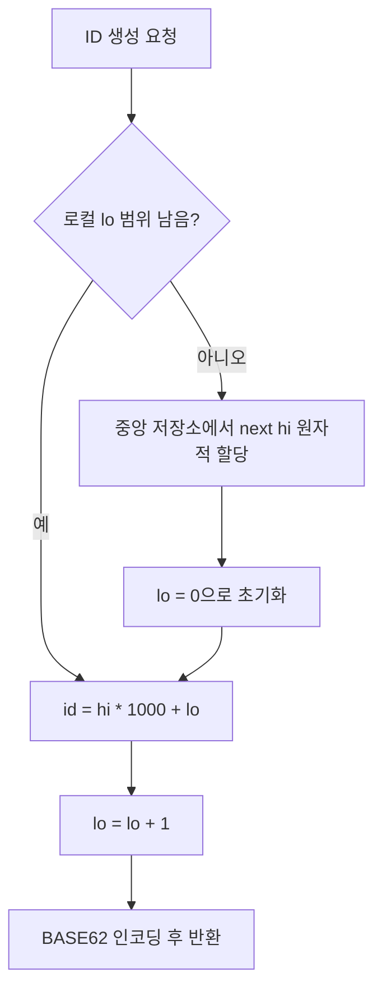
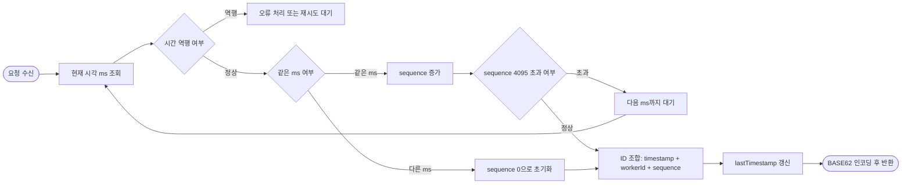

# ID 생성방식에 대한 고민
현재 시스템의 주요 병목은 고유 ID 발급 과정에서 발생한다. 현재 DB의 자동 증가 방식으로 단일 머신 환경에서는 단순하고 안정적으로 동작하지만, 트래픽이 증가하면 경합발생하고 따라서 지연이 누적되면서 SPOF로 이어지게 된다. 또한 단일 머신에 의존하는 구조는 스파이크 시 병목이 발생하여, SPOF가 될 위험이 있으므로 안정성이 낮은 시스템이라고 할 수 있다.
분산 환경을 통해 SPOF를 일부 해소하더라도 고유 ID 생성기의 문제는 여전히 남아있다. 이는 단순 난수 생성만으로 해결되기 어렵다. 성능, 확장성, 내결함성, 정렬 가능성 사이의 트레이드오프를 균형있게 설계하는 역량이 필요해진다. 따라서 분산 환경에서 고려해야 하는 대표 조건은 다음과 같다.

- 동시성: 여러 서버/서비스가 동시에 ID를 생성하므로 충돌 없이 발급되어야 한다.
- 확장성: 트래픽 증가에 따라 수평 확장이 가능해야 한다. (목표 트래픽: write 1,160/s, read 11,600/s)
- 내결함성: 일부 시스템에 장애가 발생하더라도 중복 ID가 발급되거나 ID 발급이 장시간 중단되지 않아야 한다.
- 정렬 가능성(선호): 필요 시 시간 흐름과 선후를 구분할 수 있는 ID가 유용할 수 있다. 단, 필수 요구사항은 아니다.
- 글로벌 분산(고려 사항): 멀티 리전 환경에서도 과도한 동기화 없이 충돌을 피할 수 있어야 한다.

## 요구사항 정의
요구사항을 ID 생성기 관점에서 다시 정리한다.
### 기능 요구사항
- 충돌 없는 고유 ID를 안정적으로 생성한다.
- 여러 노드에서의 동시 요청을 처리한다.
- 원래 달성 목표 스펙(공식)을 충족해야 한다.
  - 쓰기 연산: 매일 1억 개 URL 생성 -> `100,000,000 / 24 / 3600 = 1,160 write/s`
  - 읽기 연산: 읽기:쓰기 = 10:1 -> `1,160 x 10 = 11,600 read/s`
  - 10년 총 레코드: `100,000,000 x 365 x 10 = 365,000,000,000` (3,650억 개)
  - 저장 용량(평균 URL 100바이트): `365,000,000,000 x 100 = 36.5TB`
- BASE62 인코딩 시 7자리로 표현될 수 있어야 한다.(최대 42bit)
- 이 서비스는 향후 10년간 유지되어야 한다. 또한 저장될 예상 레코드는 3,650억개이다.

### 비기능 요구사항
- 확장성: 노드 추가로 처리량을 선형에 가깝게 확장할 수 있어야 한다.
- 낮은 지연 시간: ID 발급 지연은 전체 요청 지연에 직접 누적되므로 낮아야 한다.
- 내결함성: 장애 시에도 중복 발급과 유실이 없어야 하며, 복구 후에도 일관성이 유지되어야 한다.
- 정렬 가능성: 가능하다면 시간 기반 정렬/추적이 쉬운 형태가 바람직하다. 엄격한 전역 순서 대신, 약한 시간 순서를 보장한다.
- 자원 효율성: 불필요한 계산/메모리 오버헤드를 최소화한다.

## ID 생성 전략 제안
### Hi/Lo 범위 할당 방식
중앙 저장소에서 High 값(예: 100)을 가져오고 애플리케이션은 해당 hi 값에 대해 Low(0 ~ 999)을 증가시키며 붙여서 생성하는 방식. lo 범위를 소진하면 새로운 hi 값을 가져옴.

| 구분 | 내용 | 상세 설명 |
| --- | --- | --- |
| 장점 | DB 접근 최소화 | ID마다 DB를 호출하지 않아 DB 부하가 크게 감소함 |
|  | 구현 단순성 | 복잡한 인프라나 시계 동기화가 불필요함 |
|  | 높은 생성 성능 | 로컬 메모리 연산만 수행하여 락 경쟁이 거의 없음 |
|  | 단조 증가 보장 | 기본적으로 순차 증가하는 구조를 유지함 |
| 단점 | ID 공백 발생 | 인스턴스 장애 시 캐싱된 lo 범위만큼의 ID 유실 발생 |
|  | 중앙 DB 의존 | hi 값 발급을 위해 중앙 시퀀스에 의존하여 탈중앙화가 불완전함 |
|  | 확장성 제약 | 중앙 의존성으로 인해 글로벌 멀티 리전 확장에 불리함 |

ID 공백이 고갈에 미치는 영향은 매우 작다. BASE62 7자리는 약 3.52조 개의 공간을 제공하며, 10년 운영 기준 예상 사용량인 3,650억개가 전체의 10% 수준이기에 상당한 여유가 존재한다. lo 사이즈를 1,000으로 설정할 경우, 공백으로 인해 고갈되려면 하루 평균 약 86.8만 회의 인스턴스 장애가 발생해야 한다. 이는 현실적인 운영 환경에서는 사실상 불가능한 수준이므로, ID gap은 실질적인 제약 요소가 아니다.
따라서 Hi/Lo 방식의 문제는 ID 공간이 아니라 중앙 집중성에 있다. Hi 값은 중앙 저장소에 의해 할당되므로, hi 값을 범위 단위로 분할하는 방식으로 완화할 수 있다. 전체 ID 풀을 전제로 했기 때문에 이는 리전이나 여러 기준 단위를 설정해서 해결할 수 있다. 하지만 운영 복잡도가 높아지는 트레이드오프가 발생한다. 

### Snowflake 방식
Twitter에서 설계한 ID 할당방식으로 총 64비트 공간을 임의 공간(1bit) + 타임스탬프(41bit) + 워커ID(10bit) + 시퀀스(12bit)로 구성한 방식이다.

| 구분 | 내용 | 상세 설명 |
| --- | --- | --- |
| 장점 | 완전한 분산 구조 | 중앙 DB 없이 각 노드가 독립적으로 ID를 생성할 수 있음 |
|  | 수평 확장 용이 | 워커 ID 기반으로 노드를 추가하여 처리량을 확장하기 쉬움 |
|  | 시간 정렬 가능 | 타임스탬프 기반으로 생성 시점에 대한 약한 시간 순서를 보장함 |
|  | 높은 처리량 | DB 왕복이 없어 지연이 낮고, 동일 시간 단위에서 시퀀스만큼 빠르게 생성 가능 |
| 단점 | 구현 복잡성 | 시계 동기화와 예외 처리(역행, 오버플로우) 등 운영 복잡도가 높음 |
|  | 시간 의존성 | 시스템 시간이 역행하면 중복/정렬 문제를 방지하기 위한 추가 로직이 필요함 |
|  | 시퀀스 한계 | 단일 노드에 트래픽이 집중되면 시퀀스 소진 시 다음 시간 단위까지 대기해야 함 |
|  | 워커 ID 관리 필요 | 노드별 워커 ID 충돌 방지를 위한 할당/관리 체계가 필요함 |

snowflake 방식은 분산 처리에 효과적인 구조를 가지고 있으며 round-trip이 없기 때문에 빠른 응답시간을 가질 수 있다. Hi/Lo 방식을 보완해서 Hi를 분할해서 쓰더라도 워커단위의 관리가 더 용이하다. 시퀀스의 경우도 고갈될 염려는 거의 없다. 최소 시간 단위당 4096개의 풀을 지원하기 때문에 여유있다. 하지만 64bit의 용량이므로 42bit의 요구사항에 적합하지 않다는 점에서 한계가 있다.

## 개선안
snowflake 방식을 수정하기로 결정했다. 현재 시스템은 타임스탬프 민감성이 낮으므로, 타임스탬프 해상도를 낮추어 “약한 시간 순서(rough ordering)”만 보장하는 방향으로 트레이드오프한다. 기존 snowflake의 41bit(ms)는 약 69년을 표현하지만, 본 서비스는 10년 운용을 목표로 하므로 타임스탬프 비트를 축소할 수 있다. 해상도를 1000배 낮추면(예: ms→s) 타임스탬프 표현에 필요한 비트를 크게 줄일 수 있고, 가용 기간을 절반으로 줄일 때마다 1bit를 추가로 절약할 수 있다.

현재 ID 생성 요청량은 평균 1,000 RPS이며 피크를 2,000 RPS로 가정한다. 42bit 제약을 만족하기 위해 timestamp 29bit(1초 해상도, 약 17년) + sequence 9bit(초당 워커당 512개) + workerId 4bit(최대 16개 워커 확장)로 구성한다. 이 설계는 워커 4개 운영 시 이론상 최대 처리량이 512 × 4 = 2,048 IDs/s로 피크 2,000 RPS를 수용할 수 있으며, workerId를 4bit로 둠으로써 트래픽 증가나 부하 쏠림에 대비해 최대 16개까지 수평 확장 여지를 남긴다. 결과적으로 10년 운영 요구사항을 충분히 만족하면서도 BASE62 7자리(≤42bit) 제약 내에서 저장 공간과 URL 길이를 함께 최적화할 수 있다.

| 구분 | 타임스탬프 (29~30 bit) | 시퀀스 (9~10 bit) | 워커 ID (2~4 bit) | 비고 |
| --- | --- | --- | --- | --- |
| 안 1 (초안) | 29bit (1초 / 17년) | 10bit (1,024개) | 3bit (8개) | 균형형: 표준적인 URL 단축기 설계 |
| 안 2 (정밀) | 30bit (0.5초 / 17년) | 9bit (512개) | 3bit (8개) | 버스트 문제 |
| 안 3 (현재) | 29bit (1초 / 17년) | 9bit (512개) | 4bit (16개) | 확장형: 워커 수를 늘리고 SLO를 개선할 수 있음 |

## 얻은것
이렇게 유통기한? 만료시점?을 제한하고 설계하는게 시스템 설계에서 윤곽을 잡는데 도움되었다. 만약 이렇게 전제를 깔지 않았다면, 하염없이 ID 할당에 대해서 고민했을것 같다. 또한 내부적인 구조의 트레이드 오프를 고려할 수 있는 계기가 되었다.
