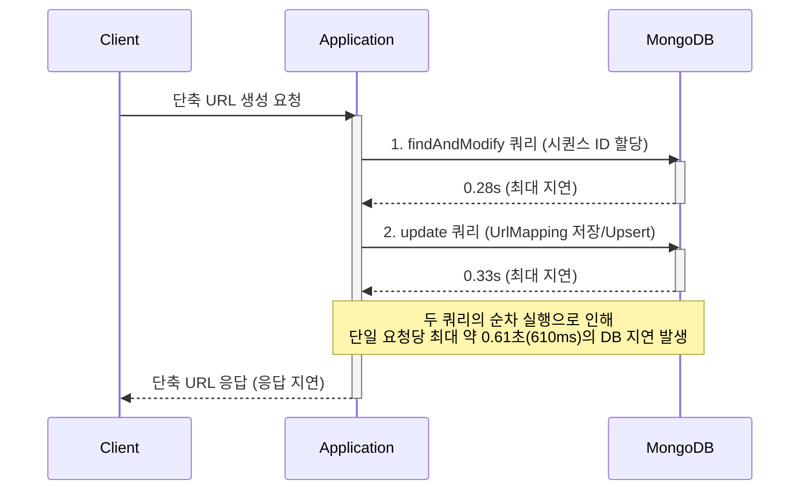
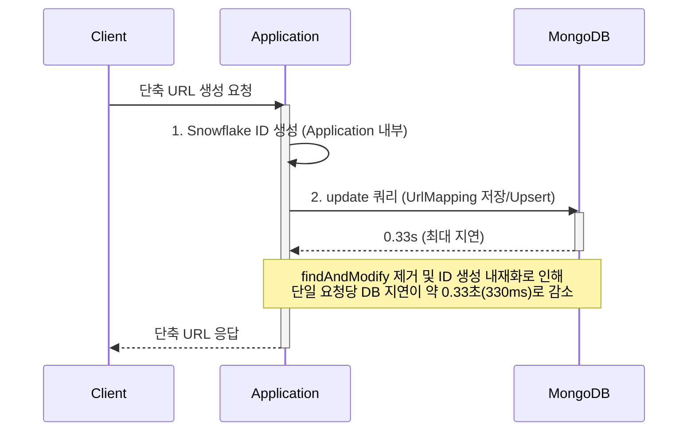

# 처음부터 차근차근
Java 21 버전의 가상 스레드를 사용하면서 이득을 보았다고 생각했습니다. 하지만 검증이 부실했습니다. 가상 스레드는 OS 스레드를 블로킹하지 않고 여러개의 스레드를 사용할 수 있다는 점이 핵심입니다. 하지만 가상 스레등가 아무리 많아도 MongoDB 커넥션 풀이 100개면 어차피 나머지 요청은 풀 앞에서 머무르게 됩니다. 그러므로 병목이 톰캣에서 DB 커넥션 획득에 이동했을 뿐 근본적인 해소가 아닙니다. 이는 가상 스레드의 이득보다는 Java 21 자체의 GC 최적화라던가 다른 이득에서 얻은 개선일 수 있습니다. 또한 기존 구 버전의 OS 스레드가 고갈되어 성능이 저하되는 것을 검증하지 않은 추적부재의 오류이므로 적절하지 않았네요. 따라서 다시 Java 17로 돌아가서 개선을 해보고자 합니다.

## 개선 계획
1. 현재 구성에서 다시 Java 17로 돌아가서 부하를 측정한다. (with. Grafana)
부하 테스트 측정 결과, 전체 처리량이 약 6,000 RPS에서 4,600 RPS로 약 23%가량 하락했습니다. 신규로 도입한 모니터링 시스템(Grafana, Prometheus)의 오버헤드가 일부 영향을 미쳤을 수 있으나, 이를 감안하더라도 애플리케이션 자체의 성능 저하가 발생한 것으로 판단됩니다.
세부 지표를 분석한 결과, MongoDB를 활용한 2-way ID 생성 로직이 주요 병목 지점으로 지목되었습니다. 해당 구간은 초당 약 400건의 요청을 처리하는 과정에서 각 쿼리별로 최대 지연 시간이 findAndModify 0.28초, update 0.33초까지 치솟는 현상이 확인되었습니다. 두 쿼리가 순차적으로 실행될 경우 최악의 상황에서 단일 API 요청에 약 0.6초의 DB 지연이 발생하게 되며, 이것이 전체적인 시스템 성능 하락을 유발한 핵심 원인으로 분석됩니다.

```
k6-1  |   █ TOTAL RESULTS
k6-1  | 
k6-1  |     checks_total.......: 1397418 4647.556881/s
k6-1  |     checks_succeeded...: 100.00% 1397418 out of 1397418
k6-1  |     checks_failed......: 0.00%   0 out of 1397418
k6-1  | 
k6-1  |     ✓ Create status must be 200
k6-1  |     ✓ Redirect status must be 301 or 302
k6-1  | 
k6-1  |     HTTP
k6-1  |     http_req_duration..............: avg=211.58ms min=906.66µs med=189.95ms max=2.06s p(90)=316.7ms p(95)=381.65ms       
k6-1  |       { expected_response:true }...: avg=211.58ms min=906.66µs med=189.95ms max=2.06s p(90)=316.7ms p(95)=381.65ms       
k6-1  |     http_req_failed................: 0.00%   0 out of 1397418
k6-1  |     http_reqs......................: 1397418 4647.556881/s
k6-1  | 
k6-1  |     EXECUTION
k6-1  |     dropped_iterations.............: 172957  575.223373/s
k6-1  |     iteration_duration.............: avg=2.34s    min=198.27ms med=2.27s    max=5.7s  p(90)=2.91s   p(95)=3.22s
k6-1  |     iterations.....................: 127038  422.505171/s
k6-1  |     vus............................: 999     min=708          max=1000
k6-1  | 
k6-1  |     NETWORK
k6-1  |     data_received..................: 279 MB  928 kB/s
k6-1  |     data_sent......................: 130 MB  431 kB/s
k6-1  | 
k6-1  | 
k6-1  | 
k6-1  | 
k6-1  | running (5m00.7s), 0000/1000 VUs, 127038 complete and 0 interrupted iterations
k6-1  | load_test ✓ [ 100% ] 0000/1000 VUs  5m0s  1000.00 iters/s
```



2. 기존 2-way ID 생성방식을 개선해서 비교한다. (snowflake ID 생성방식 튜닝)
[이전 ID 생성방식에 대한 제안](11_ID_generation.md)에서 snowflake ID 생성방식을 튜닝했습니다. 분산환경을 전제로 구상했기 때문에 현재 환경에서 스파이크를 감당하기 어렵습니다. 그래서 워커 비트에서 2bit를 시퀀스 비트로 전환해서 2048개의 피크 요청을 감당하는 처리환경에서 트래픽을 비교해보고자 합니다. 이 방식은 2-way ID 생성방식의 부하를 절반으로 경감하는 방식으로 처리량을 findAndModify 의 처리량을 update로 이전하여 DB 단에서 처리량을 2배로 늘릴 수 있게될 것으로 기대됩니다.

```
k6-1  |   █ TOTAL RESULTS
k6-1  | 
k6-1  |     checks_total.......: 1504404 5003.312718/s
k6-1  |     checks_succeeded...: 100.00% 1504404 out of 1504404
k6-1  |     checks_failed......: 0.00%   0 out of 1504404
k6-1  | 
k6-1  |     ✓ Create status must be 200
k6-1  |     ✓ Redirect status must be 301 or 302
k6-1  | 
k6-1  |     HTTP
k6-1  |     http_req_duration..............: avg=196.4ms min=827.05µs med=173.71ms max=3.95s p(90)=304.1ms p(95)=361.3ms
k6-1  |       { expected_response:true }...: avg=196.4ms min=827.05µs med=173.71ms max=3.95s p(90)=304.1ms p(95)=361.3ms
k6-1  |     http_req_failed................: 0.00%   0 out of 1504404
k6-1  |     http_reqs......................: 1504404 5003.312718/s
k6-1  | 
k6-1  |     EXECUTION
k6-1  |     dropped_iterations.............: 163234  542.879937/s
k6-1  |     iteration_duration.............: avg=2.17s   min=57.65ms  med=2.08s    max=6.42s p(90)=2.88s   p(95)=3.14s
k6-1  |     iterations.....................: 136764  454.846611/s
k6-1  |     vus............................: 356     min=356          max=1000
k6-1  |     vus_max........................: 1000    min=1000         max=1000
k6-1  | 
k6-1  |     NETWORK
k6-1  |     data_received..................: 301 MB  1.0 MB/s
k6-1  |     data_sent......................: 144 MB  478 kB/s
k6-1  | 
k6-1  | 
k6-1  | 
k6-1  | 
k6-1  | running (5m00.7s), 0000/1000 VUs, 136764 complete and 0 interrupted iterations
k6-1  | load_test ✓ [ 100% ] 0000/1000 VUs  5m0s  1000.00 iters/s
```

max의 경우는 일시적인 부하로 인한 영향이라고 해석됩니다. 나머지 지표에 대해서는 전반적으로 개선된 것이 보이네요. 하지만 기대한 만큼의 2배 가량 성능향상이 이루어지진 않았습니다. DB호출이 절반으로 감축되어도 8%밖에 줄어들지 않은것은 다른 문제가 있어보이네요.



4개 코어를 합쳐서 400% 로 CPU 성능이 잡혔을 때, 웹 서버에서 200% 까지만 부하가 발생했습니다. 원인은 k6였고, 부하를 발생시키는 노드와 부하를 처리하는 노드가 CPU를 점유하기 때문에 충분한 퍼포먼스를 발휘할 수 없었네요. 그래서 EC2 환경에서 해당 기능을 다시 구현해보고자 합니다.

우선 처음 시도한 인스턴스의 스펙입니다.

```
Instance type: t3.small
CPU: 2 cores
Memory: 2 GiB
OS: Ubuntu Server 24.04 LTS (HVM), SSD Volume Type
cost: $0.026/hour

```

5분 부하를 가했을 때, 지표입니다.
```
  █ TOTAL RESULTS

    checks_total.......: 1289402 3907.68611/s
    checks_succeeded...: 99.91%  1288300 out of 1289402
    checks_failed......: 0.08%   1102 out of 1289402

    ✗ Create status must be 200
      ↳  99% — ✓ 117216 / ✗ 56
    ✗ Redirect status must be 301 or 302
      ↳  99% — ✓ 1171084 / ✗ 1046

    HTTP
    http_req_duration..............: avg=194.18ms min=0s       med=173.33ms max=5.61s p(90)=292.73ms p(95)=357.24ms
      { expected_response:true }...: avg=194.34ms min=13.31ms  med=173.38ms max=5.61s p(90)=292.81ms p(95)=357.34ms
    http_req_failed................: 0.08%   1102 out of 1289402
    http_reqs......................: 1289402 3907.68611/s

    EXECUTION
    dropped_iterations.............: 184408  558.870376/s
    iteration_duration.............: avg=2.55s    min=716.89ms med=2.08s    max=2m23s p(90)=3s       p(95)=3.51s
    iterations.....................: 117268  355.394621/s
    vus............................: 5       min=5               max=1000
    vus_max........................: 1000    min=1000            max=1000

    NETWORK
    data_received..................: 258 MB  781 kB/s
    data_sent......................: 136 MB  412 kB/s


running (5m30.0s), 0000/1000 VUs, 117268 complete and 4 interrupted iterations
load_test ✓ [ 100% ] 0004/1000 VUs  5m0s  1000.00 iters/s
```

2코어임에도 성능이 뒤쳐지진 않네요. 그리고 메모리도 2GB임에도 처리량은 4,000 RPS 정도가 나옵니다. 이전 환경에서는 java와 k6 의 cpu 점유율이 2.6:1.4 정도의 퍼포먼스였기에 큰 차이는 적절한 성능이라고 생각됩니다.

다음은 스케일업입니다.
```
t3.xlarge
CPU: 4 cores
Memory: 16 GiB
OS: Ubuntu Server 24.04 LTS (HVM), SSD Volume Type
cost: $0.215/hour
```

메모리보다는 CPU가 2배로 증가했기 때문에 목표 RPS를 달성할 수 있을거란 기대감이 있습니다. 하지만 코어에 비해 불필요한 메모리를 8배나 가지기에 불필요한 과금이 발생했습니다.

```
  █ TOTAL RESULTS

    checks_total.......: 1404459 4256.833733/s
    checks_succeeded...: 99.85%  1402439 out of 1404459
    checks_failed......: 0.14%   2020 out of 1404459

    ✗ Create status must be 200
      ↳  99% — ✓ 127693 / ✗ 145
    ✗ Redirect status must be 301 or 302
      ↳  99% — ✓ 1274746 / ✗ 1875

    HTTP
    http_req_duration..............: avg=150.86ms min=0s       med=130.24ms max=6.24s p(90)=257.82ms p(95)=318.24ms
      { expected_response:true }...: avg=151.08ms min=11.21ms  med=130.36ms max=6.24s p(90)=257.95ms p(95)=318.38ms
    http_req_failed................: 0.14%   2020 out of 1404459
    http_reqs......................: 1404459 4256.833733/s

    EXECUTION
    dropped_iterations.............: 172163  521.816063/s
    iteration_duration.............: avg=2.3s     min=337.15ms med=1.67s    max=2m1s  p(90)=2.78s    p(95)=3.36s
    iterations.....................: 127788  387.318013/s
    vus............................: 53      min=53              max=1000
    vus_max........................: 1000    min=1000            max=1000

    NETWORK
    data_received..................: 280 MB  850 kB/s
    data_sent......................: 147 MB  445 kB/s


running (5m29.9s), 0000/1000 VUs, 127788 complete and 50 interrupted iterations
load_test ✓ [ 100% ] 0050/1000 VUs  5m0s  1000.00 iters/s
```

4,000에서 더는 증가하지 않네요 POST단은 최대한 개선했고, GET단은 10배나 되는 트래픽이 발생하기에 스레드 풀을 늘려보겠습니다. 

```
server:
  tomcat:
    threads:
      max: 400            # CPU가 100%여도 컨텍스트 스위칭으로 버티도록 상향
```

기존 지표상으로는 222개입니다. 

```
  █ TOTAL RESULTS

    checks_total.......: 1238026 4059.120548/s
    checks_succeeded...: 99.83%  1235942 out of 1238026
    checks_failed......: 0.16%   2084 out of 1238026

    ✗ Create status must be 200
      ↳  99% — ✓ 112525 / ✗ 251
    ✗ Redirect status must be 301 or 302
      ↳  99% — ✓ 1123417 / ✗ 1833

    HTTP
    http_req_duration..............: avg=170.32ms min=0s       med=146.29ms max=9.01s p(90)=286.35ms p(95)=357.8ms
      { expected_response:true }...: avg=170.6ms  min=12.68ms  med=146.43ms max=9.01s p(90)=286.51ms p(95)=357.96ms
    http_req_failed................: 0.16%   2084 out of 1238026
    http_reqs......................: 1238026 4059.120548/s

    EXECUTION
    dropped_iterations.............: 189861  622.497982/s
    iteration_duration.............: avg=2.64s    min=605.16ms med=1.85s    max=2m30s p(90)=3.07s    p(95)=3.8s
    iterations.....................: 112776  369.759099/s
    vus............................: 391     min=391             max=1000
    vus_max........................: 1000    min=1000            max=1000

    NETWORK
    data_received..................: 247 MB  810 kB/s
    data_sent......................: 129 MB  424 kB/s


running (5m05.0s), 0000/1000 VUs, 112776 complete and 0 interrupted iterations
load_test ✓ [ 100% ] 0000/1000 VUs  5m0s  1000.00 iters/s
```

스레드를 처리해도 결국 부하가 RPS의 포화구간이 발생합니다. 이는 스케일업과 충분한 리소스임에도 불구하고 처리량이 개선되지 않았습니다. 이는 내부 기능에서 문제가 있다고 판단됩니다. 염려되었던 부분은 snowflake ID 생성기 코드입니다. synchronized 로 락을 걸었기 때문에 병목이 발생할 수 있습니다. 또한 이번 5분간의 요청동안 POST 처리에서 타임아웃이 주로 발생했는데, 이런 근거에 따라 개선해보겠습니다.

100개의 스레드가 각각 100개씩, 총 10,000개의 ID를 병렬로 생성하도록 요청하는 방식의 테스트 코드를 구성했습니다.
```
// synchronized 테스트
Starting load test (before/after)...
Generated 10000 IDs in 3739 ms.
Throughput: 2674 IDs/sec
```

```
// atomic 테스트
Starting load test (before/after)...
Generated 10000 IDs in 3425 ms.
Throughput: 2919 IDs/sec
```

2,674 -> 2,919 로 성능상 개선이 이루어졌습니다. 스레드 간 경합으로 인한 컨텍스트 스위칭 오버헤드 여지를 해결할 수 있다는점도 효과적이라고 생각됩니다.

기존 Lock 을 하려는 의도는 시퀀스 값이 겹치는 것을 방지하기 위해서 였습니다. 하지만, 대규모 트래픽에 대해서는 병목이 발생할 수 밖에 없죠. 이를 CAS 기반의 Atomic 방식을 적용해보겠습니다.

```
  █ TOTAL RESULTS

    checks_total.......: 1250590 3790.158081/s
    checks_succeeded...: 99.83%  1248478 out of 1250590
    checks_failed......: 0.16%   2112 out of 1250590

    ✗ Create status must be 200
      ↳  99% — ✓ 113687 / ✗ 210
    ✗ Redirect status must be 301 or 302
      ↳  99% — ✓ 1134791 / ✗ 1902

    HTTP
    http_req_duration..............: avg=171.45ms min=0s       med=149.09ms max=6.29s p(90)=285.44ms p(95)=342.25ms
      { expected_response:true }...: avg=171.74ms min=11.19ms  med=149.25ms max=6.29s p(90)=285.57ms p(95)=342.36ms
    http_req_failed................: 0.16%   2112 out of 1250590
    http_reqs......................: 1250590 3790.158081/s

    EXECUTION
    dropped_iterations.............: 186050  563.860986/s
    iteration_duration.............: avg=2.6s     min=524.51ms med=1.92s    max=2m5s  p(90)=2.98s    p(95)=3.52s
    iterations.....................: 113871  345.108382/s
    vus............................: 26      min=26              max=1000
    vus_max........................: 1000    min=1000            max=1000

    NETWORK
    data_received..................: 250 MB  756 kB/s
    data_sent......................: 131 MB  396 kB/s


running (5m30.0s), 0000/1000 VUs, 113871 complete and 26 interrupted iterations
load_test ✓ [ 100% ] 0026/1000 VUs  5m0s  1000.00 iters/s
```

음 뭔가 성능개선이 없습니다. tomcat 단에서 accept-count가 늘어난다면 달라질까요?

```
server:
  tomcat:
    threads:
      max: 400            # CPU가 100%여도 컨텍스트 스위칭으로 버티도록 상향
      accept-count: 2000
```

```
  █ TOTAL RESULTS

    checks_total.......: 1516964 4597.521875/s
    checks_succeeded...: 99.83%  1514436 out of 1516964
    checks_failed......: 0.16%   2528 out of 1516964

    ✗ Create status must be 200
      ↳  99% — ✓ 137880 / ✗ 347
    ✗ Redirect status must be 301 or 302
      ↳  99% — ✓ 1376556 / ✗ 2181

    HTTP
    http_req_duration..............: avg=135.53ms min=0s      med=119.7ms  max=6.37s p(90)=225.82ms p(95)=276.78ms
      { expected_response:true }...: avg=135.76ms min=11.31ms med=119.82ms max=6.37s p(90)=225.93ms p(95)=276.94ms
    http_req_failed................: 0.16%   2528 out of 1516964
    http_reqs......................: 1516964 4597.521875/s

    EXECUTION
    dropped_iterations.............: 161774  490.294762/s
    iteration_duration.............: avg=2.17s    min=305ms   med=1.53s    max=2m20s p(90)=2.42s    p(95)=2.81s
    iterations.....................: 138215  418.893583/s
    vus............................: 13      min=13              max=1000
    vus_max........................: 1000    min=1000            max=1000

    NETWORK
    data_received..................: 303 MB  918 kB/s
    data_sent......................: 158 MB  480 kB/s


running (5m30.0s), 0000/1000 VUs, 138215 complete and 12 interrupted iterations
load_test ✓ [ 100% ] 0012/1000 VUs  5m0s  1000.00 iters/s
```

4,500 RPS로 생각보다 많이 증가했습니다. p95도 많이 줄어들었죠. 하지만 Request Failed가 여전히 발생하며 지연시간이 많이 튀는 문제가 있습니다. 리소스를 충분히 활용하지 못하고 있습니다.

이번에는 API 별로 RPS를 측정해보았습니다. 초기 요청인 POST 에서 RPS가 300으로 나오면서 병목이 의심됩니다.

놓친 지표가 하나 더 있었습니다. Minor GC인데요. Young 메모리에서 발생하는 STW가 100ms 이상 발생하는 경우가 자주 발생했습니다.

아무리해도 로컬에서 해당 RPS를 충족하기에는 역부족인거 같네요. CPU 경합과 RAM의 한계, WSL 등 많은 요소로 제한이 있습니다. 그래서 다시 EC2로 넘어가겠습니다.

```
t3.xlarge
CPU: 4 cores
Memory: 16 GiB
OS: Ubuntu Server 24.04 LTS (HVM), SSD Volume Type
cost: $0.215/hour
```

```
# Add Docker's official GPG key:
sudo -s
sudo apt update
sudo apt install ca-certificates curl
sudo install -m 0755 -d /etc/apt/keyrings
sudo curl -fsSL https://download.docker.com/linux/ubuntu/gpg -o /etc/apt/keyrings/docker.asc
sudo chmod a+r /etc/apt/keyrings/docker.asc

# Add the repository to Apt sources:
sudo tee /etc/apt/sources.list.d/docker.sources <<EOF
Types: deb
URIs: https://download.docker.com/linux/ubuntu
Suites: $(. /etc/os-release && echo "${UBUNTU_CODENAME:-$VERSION_CODENAME}")
Components: stable
Signed-By: /etc/apt/keyrings/docker.asc
EOF

sudo apt update
sudo apt install -y docker-ce docker-ce-cli containerd.io docker-buildx-plugin docker-compose-plugin
sudo systemctl status docker
sudo systemctl start docker
sudo docker run hello-world
sudo apt install -y git
```

```
FROM gradle:8-jdk17 AS builder
WORKDIR /app

COPY build.gradle settings.gradle ./
RUN gradle dependencies --no-daemon || true

COPY src/ src/
RUN gradle bootJar --no-daemon

FROM eclipse-temurin:17-jre
WORKDIR /app

COPY --from=builder /app/build/libs/*.jar app.jar
EXPOSE 8080

ENTRYPOINT ["java", \
            "-Xms12g", "-Xmx12g", \
            "-jar", "app.jar"]
```

```
  █ TOTAL RESULTS

    checks_total.......: 6543636 10902.609484/s
    checks_succeeded...: 100.00% 6543636 out of 6543636
    checks_failed......: 0.00%   0 out of 6543636

    ✓ Create status must be 200
    ✓ Redirect status must be 301 or 302

    HTTP
    http_req_duration..............: avg=33.76ms  min=8.27ms   med=27.97ms  max=1.39s p(90)=51.6ms   p(95)=65.43ms
      { expected_response:true }...: avg=33.76ms  min=8.27ms   med=27.97ms  max=1.39s p(90)=51.6ms   p(95)=65.43ms
    http_req_failed................: 0.00%   0 out of 6543636
    http_reqs......................: 6543636 10902.609484/s

    EXECUTION
    dropped_iterations.............: 5126    8.54063/s
    iteration_duration.............: avg=379.55ms min=164.73ms med=315.98ms max=3.65s p(90)=603.81ms p(95)=756.26ms
    iterations.....................: 594876  991.146317/s
    vus............................: 288     min=201          max=1000
    vus_max........................: 1000    min=1000         max=1000

    NETWORK
    data_received..................: 1.3 GB  2.2 MB/s
    data_sent......................: 671 MB  1.1 MB/s


running (10m00.2s), 0000/1000 VUs, 594876 complete and 0 interrupted iterations
load_test ✓ [======================================] 0000/1000 VUs  10m0s  1000.00 iters/s
```

10분 수행결과입니다. 목표했던 11,000RPS 를 달성했습니다. 측정 시간을 더 늘렸을 때는 로컬환경에서 k6가 VU를 감당하지 못해 일관성을 얻기 어려웠고, 유효 측정기간의 결과로서 목표를 달성한 것이라 생각됩니다.