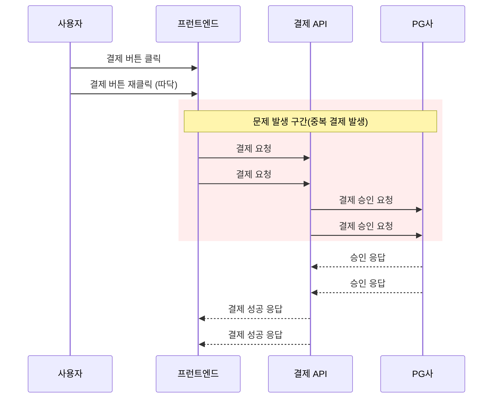
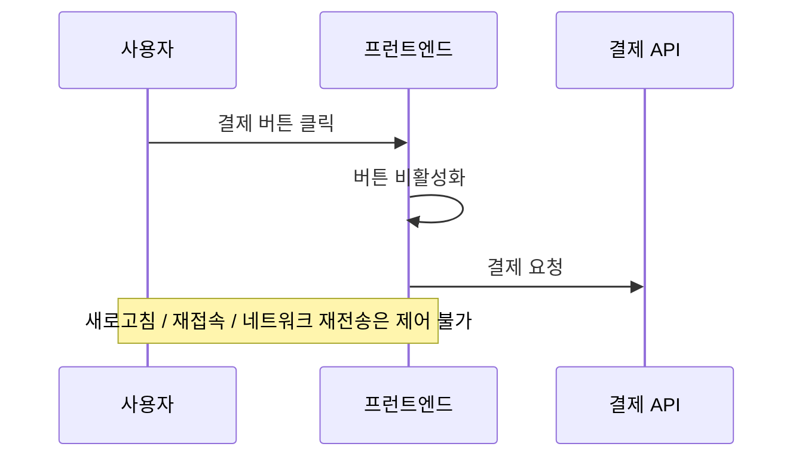
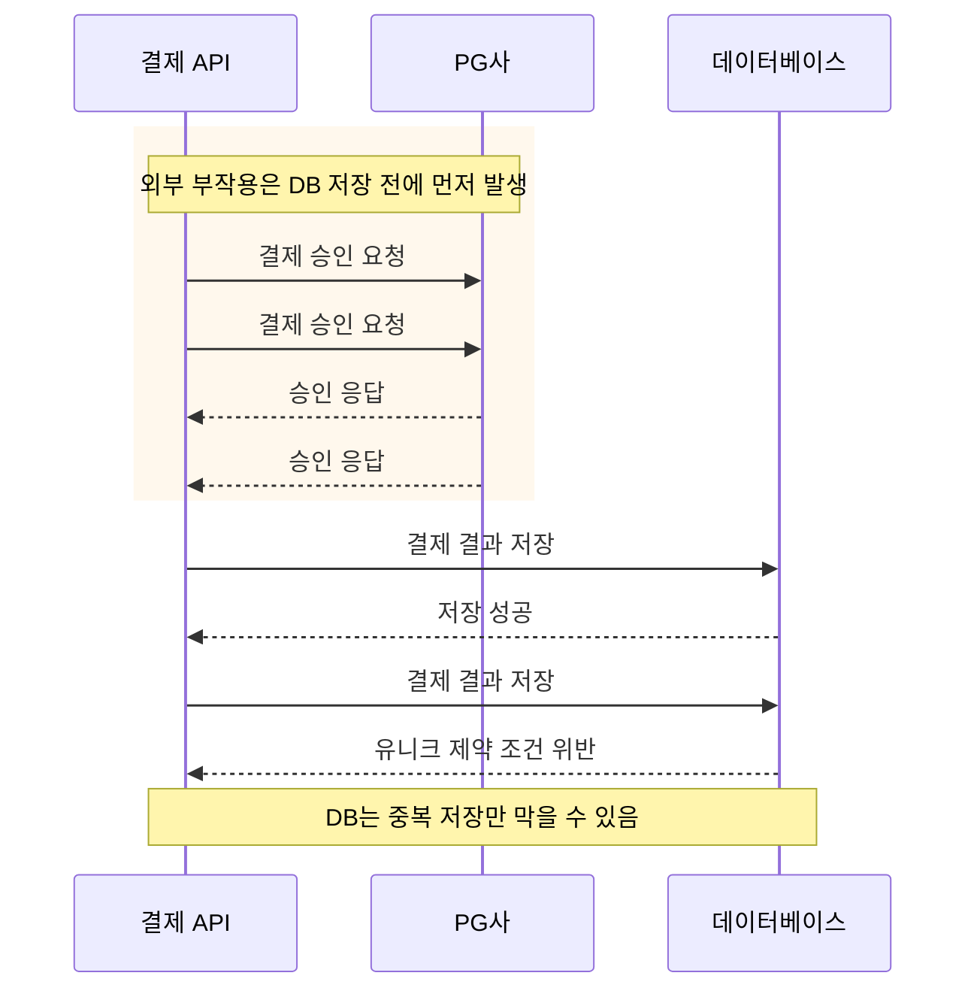
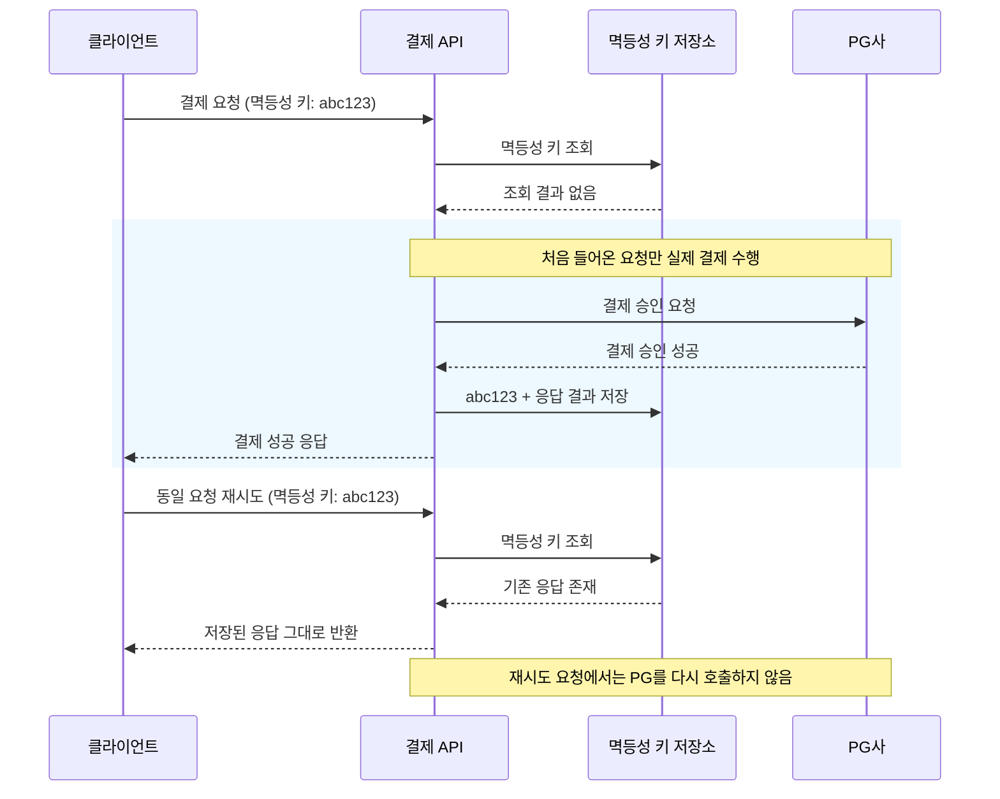

# 멱등성은 어디에서 보장해야 하는가

## 이 글을 쓰는 이유

실제 서비스 환경에서 중복 결제와 같이 치명적인 오류를 방어하는 것이 주요 과제이다. 최근 유튜브 영상에서 ["두 번 결제되는 어처구니 없는 현상을 방지합시다. 멱등성 키를 기억하세요."](https://www.youtube.com/watch?v=lkc2JhJivGo)를 주제로 한 영상을 보게 되었고 비정상적인 요청을 제어하는 멱등성을 보장하는 방법을 알아보고 싶었다. 그래서 실습을 통해 시스템의 각 계층이 중복 요청을 방어하는 과정에서 가지는 한계를 짚어보고자 한다.

---

## 학습 목표

이번 실습에서 학습 목표는 다음과 같다.

- 중복 요청이 발생하고 멱등성이 깨지는 원인
- 프런트엔드 레이어의 대응 방식과 그 한계
- 데이터베이스 레이어의 대응 방식과 그 한계
- API 레이어에서 멱등성을 보장해야 하는 이유
- 멱등성 키의 발급, 검증, 갱신 기준

---

## 핵심 개념

### 1. 중복 요청은 왜 발생하는가

결제 시스템에서 동일한 요청이 서버로 두 번 이상 유입되는 상황은 빈번하게 발생한다. 사용자가 결제 버튼을 연속해서 빠르게 누르는 따닥 현상이나, 네트워크 상태가 불안정하여 재전송이 일어나는 경우가 대표적이다.

이러한 현상을 예외로 간과하게 된다면, 하나의 주문에 결제가 두 번 승인되는 치명적인 오류가 발생할 수 있다. 금전이 오가는 API의 경우 같은 요청이 여러 번 들어와도 시스템 상태는 안전해야하는 방어적 설계를 해야한다.

이 상황에서 사용자는 의도가 한 번이었더라도, 서버 입장에서는 독립된 요청으로 인식할 수 있다. 서버가 이를 식별하지 못하기에 결제가 두 번 발생하기 때문이다. 따라서 중복 요청은 설계 차원에서 반드시 방어해야 한다.

### 2. 프런트엔드 레이어의 대응 방식과 그 한계

중복 요청을 막기 위해 가장 먼저 고려할 수 있는 방법은 프런트엔드에서의 제어이다. 결제 버튼을 누르는 즉시 비활성화하거나 로딩 화면을 띄워 추가적인 클릭을 차단하는 방식이다. 이는 사용자의 반복 조작을 줄이는 데 일차적인 효과가 있다.

그러나 프런트엔드의 제어만으로는 근본적인 차단이 불가능하다. 사용자가 브라우저를 새로고침하거나, 네트워크 환경에 의해 요청이 재전송되는 상황가지는 클라이언트에서 통제할 수 없기 때문이다. 즉, 프런트엔드의 대응은 사용자의 실수를 줄이는 보조 수단일 뿐, 중복 요청의 유입 자체를 완전히 막기에는 한계가 있다.

### 3. 데이터베이스 레이어의 대응 방식과 그 한계

다음으로 데이터베이스의 유니크 제약 조건을 두는 방식을 생각할 수 있다. 동일한 주문 번호나 결제 정보가 중복으로 저장되지 않도록 막아 최후의 데이터 정합성을 지키는 역할이다.

하지만 이 방식에도 한계가 있다. 데이터베이스에 중복 저장되어 차단되었다 해도, 그 이전 단계에서 이미 PG사로 결제 승인 요청이 중복으로 발생한다면 중복 결제 문제가 여전히 발생할 수 있다. 데이터베이스 방식 또한 내부 데이터의 중복 저장을 제어할 뿐, 그 전에 이미 발생해버린 외부 요인은 제어할 수 없다.

### 4. API 레이어에서 멱등성을 보장해야 하는 이유

현재 문제를 가장 근본적으로 해결하는 지점은 외부로 요청을 보내기 직전인 API 레이어이다. 프런트엔드는 재전송을 막지 못하고, 데이터베이스는 이미 일어난 외부 연산을 취소할 수 없다. 반면, API는 요청을 먼저 식별해서 이미 처리된 요청이라면 기존 결과를 반호나하고, 처음 들어온 요청만 실제 로직으로 전달하도록 통제할 수 있다.

API 레이어에서 멱등성을 보장하려면, 무엇을 동일한 요청으로 볼 것인지 기준을 명확히 해야 한다. 이를 위해 클라이언트와 서버는 멱등성 키를 활용한다. 서버는 이 키를 기준으로 요청의 상태와 이전 응답을 관리한다. 최초 요청만 외부 연산을 수행하고, 이후 유입된 동일한 키의 재시도 요청에는 기존 응답을 그대로 반환하는 원리이다.

다라서 멱득성을 설계할 때는 키의 발급, 처리 상태, 갱신 및 만료에 대한 종합적인 구조를 고민해야 한다.

### 5. 멱등성 키의 발급, 검증, 갱신 기준

멱등성 시스템에서 멱등성 키의 생애 주기를 정의해야 한다. 이는 발급, 검증, 갱신 및 만료의 세 단계로 나눌 수 있다.

첫째, 멱등성 키의 발급 주체는 클라이언트가 되어야 한다. 만약 서버가 키를 생성하여 내려준다면, 키를 클라이언트에게 전달하는 과정에서 네트워크 오류가 발생했을 때 클라이언트는 제시할 키를 획득하지 못한다. 따라서 클라이언트가 고유한 식별자를 직접 생성하여 서버로 전달하는 방식이 적절하다.

둘째, 서버의 검증 단계에서는 키의 상태를 세밀하게 판별해야 한다. 서버는 유입된 키를 저장소에서 조회하여 다음 중 하나의 상태로 판별한다.
- 최초 요청: 저장소에 키가 없는 상태로, 정상적인 결제 로직을 수행한다.
- 처리 완료: 이미 성공 또는 실패 응답이 저장된 상태로, 기존 응답을 그대로 반환한다.
- 처리 중: 이전에 들어온 요청이 아직 실행 중인 상태이다. 이때 중복 요청이 들어오면 동시성 문제가 발생할 수 있으므로, 에러를 반환하거나 짧은 시간 대기하도록 제어해야 한다.

셋째, 상태 갱신 및 만료 기준을 설정해야 한다. 최초 요청에 대한 결제 로직이 완료되면, 서버는 그 최종 결과를 멱등성 키와 함께 저장소에 갱신한다. 다만 시스템 자원은 유한하므로 모든 기록을 영구적으로 보관할 수 없다. 따라서 비즈니스 정책에 따라 적절한 만료 시간(TTL, Time To Live)을 설정하여, 일정 기간이 지난 키는 자동으로 삭제되도록 설계해야 저장 공간의 효율성을 유지할 수 있다.

이처럼 멱등성 키는 단순한 문자열을 넘어, 불안정한 네트워크 환경 속에서 클라이언트와 서버 간 상태를 안전하게 동기화하는 메개체 역할을 수행한다.
