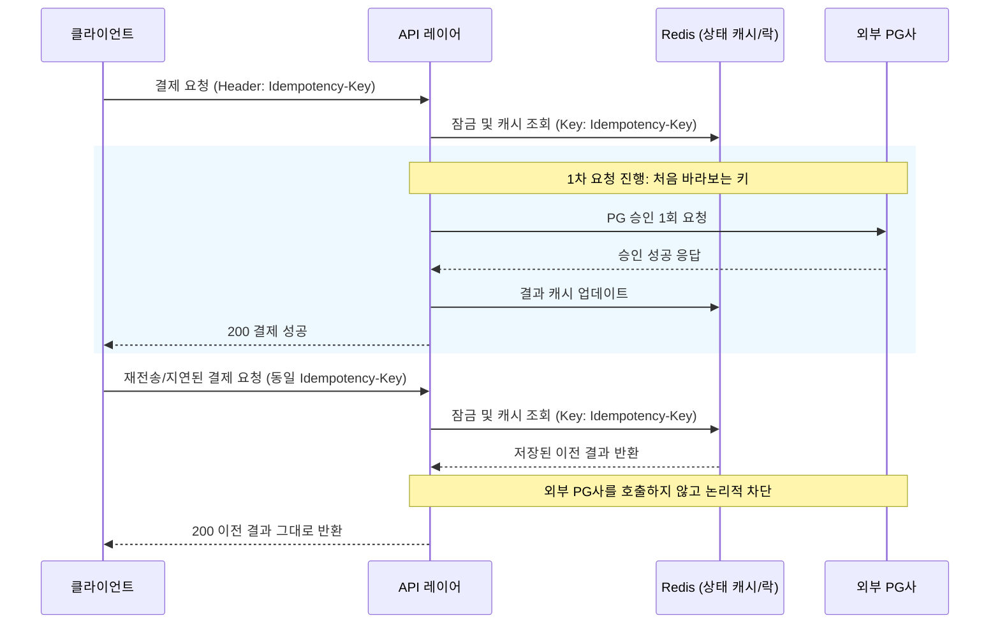

# 멱등성(Idempotency)은 어디에서 보장해야 하는가: 분산 시스템의 중복 결제 방어벽

## 1. 프롤로그: "결제 버튼을 두 번 눌렀을 뿐인데"

온라인 쇼핑몰에서 물건을 구매할 때, 흔히 겪을 수 있는 상황이 있다. 결제하기 버튼을 눌렀는데 화면이 넘어가지 않아 무심코 버튼을 한 번 더 누르는, 이른바 '따닥' 현상이다. 사용자의 단순한 조작 실수처럼 보이지만, 이 찰나의 순간에 서버로 전달된 두 개의 요청은 시스템의 신뢰성을 위협하는 거대한 폭탄이 될 수 있다. 만약 서버가 이 두 요청을 각각 독립적인 결제로 인식한다면, 고객의 계좌에서는 찰나의 순간에 두 번의 돈이 빠져나가게 된다. 

최근 접한 유튜브 영상 ["두 번 결제되는 어처구니 없는 현상을 방지합시다. 멱등성 키를 기억하세요."](https://www.youtube.com/watch?v=lkc2JhJivGo)는 정확히 이 문제의 심각성을 일깨워 주었다. 실제 서비스 환경에서 중복 결제라는 치명적인 오류를 어떻게 방어해야 하는지 더 깊게 파고들고 싶었다는 것이 이 글과 실습의 출발점이다.

이러한 어처구니 없는 사고를 막기 위해 분산 시스템에서는 **멱등성(Idempotency)** 이라는 개념을 도입한다. 수학에서 $f(f(x)) = f(x)$로 정의되는 멱등성은, 컴퓨터 과학에서는 "동일한 요청을 여러 번 보내도 시스템의 상태가 단 한 번 실행된 것과 동일하게 유지되는 성질"을 의미한다. 그렇다면 이 멱등성은 시스템의 어느 지점에서, 어떻게 설계해야 가장 완벽한 방어벽이 될 수 있을까?

## 2. 방어의 최전선: 각 레이어의 시도와 한계

서비스가 제공되기 위해서는 클라이언트, API, DB 등의 계층들을 거쳐서 제공되므로, 중복 결제를 막기 위해 우리는 시스템의 각 계층에서 방어를 시도할 수 있다. 하지만 각 계층이 가진 기능적 근본의 한계로 인해, 완벽한 통제는 쉽지 않다.

### 방법 1: 클라이언트(프런트엔드)에서의 제어
가장 직관적인 방법은 사용자가 실수하지 않도록 UI 컴포넌트 단에서 막는 것이다. 결제 버튼을 누르는 즉시 버튼을 비활성화(Disable)하거나, 전체 화면에 로딩 스피너를 띄워 추가적인 터치를 원천 차단할 수 있다.
* **한계:** 이는 'UX를 통한 완화'일 뿐, '시스템적 보장'이 아니다. 악의적인 사용자가 스크립트로 API를 연사하거나, 모바일 네트워크가 일시적으로 단절되어 브라우저 또는 OS 네트워크 단에서 자동으로 재요청(Retry)이 발생하는 상황까지 클라이언트가 통제할 수는 없다.

### 방법 2: 데이터베이스(DB)의 유니크 제약 조건
프런트엔드를 뚫고 들어온 수많은 요청 파도를 최후단인 데이터베이스(DB)에서 막는 방법도 있다. 주문 번호 컬럼에 유니크(Unique) 제약 조건을 걸어, 두 번째 결제 기록이 `INSERT`될 때 데이터베이스 레벨의 예외(Exception)를 발생시키는 것이다.
* **한계:** 데이터베이스 내부의 데이터 무결성은 완벽히 지킬 수 있지만, **외부 시스템과의 상호작용으로 발생하는 부작용(Side-effect)** 은 걷어 담을 수 없다. DB에 결제 기록을 저장하려 시도하기 직전, 이미 외부 PG(Payment Gateway)사 API를 연달아 두 번 호출하여 승인 요청을 받아왔다면 어떨까? 고객의 카드는 이미 두 번 긁힌 상태다. DB는 내부의 정합성만 통제할 뿐, '이미 벌어진 물리적 결제'를 롤백시키지 못한다.

## 3. 논리의 귀결: API 레이어와 멱등성 키

앞선 논증을 통해 우리는 결론에 도달한다. 프런트엔드는 요청의 유입을 원천 차단할 수 없고, 데이터베이스는 외부 트랜잭션의 부작용을 취소할 수 없다. 따라서 **본질적인 멱등성은 시스템과 외부 세계(PG사)가 만나는 경계선, 외부로 돌이킬 수 없는 API를 호출하기 직전의 지점인 'API 레이어'에서 제어되어야 한다.**

API 레이어에서 이를 관장하기 위해 도입하는 핵심 장치가 바로 **멱등성 키(Idempotency-Key)** 다.

```mermaid
sequenceDiagram
    participant C as 클라이언트
    participant A as API 레이어
    participant R as Redis (상태 캐시/락)
    participant P as 외부 PG사

    C->>A: 결제 요청 (Header: Idempotency-Key)
    A->>R: 잠금 및 캐시 조회 (Key: Idempotency-Key)
    
    rect rgba(230, 245, 255, 0.7)
        Note over A,P: 1차 요청 진행: 처음 바라보는 키
        A->>P: PG 승인 1회 요청
        P-->>A: 승인 성공 응답
        A->>R: 결과 캐시 업데이트
        A-->>C: 200 결제 성공
    end

    C->>A: 재전송/지연된 결제 요청 (동일 Idempotency-Key)
    A->>R: 잠금 및 캐시 조회 (Key: Idempotency-Key)
    R-->>A: 저장된 이전 결과 반환
    Note over A,P: 외부 PG사를 호출하지 않고 논리적 차단
    A-->>C: 200 이전 결과 그대로 반환
```

이 모델에서 클라이언트는 결제 등 중요한 상태 변화를 트리거할 때마다 고유한 `Idempotency-Key`를 발급하여 헤더에 담아 보낸다. 서버(API 레이어)는 이 키를 캐시 저장소(Redis 등)에 기록하고 분산 락(Lock)을 건다. 이후 동일한 키로 요청이 무수히 쏟아지더라도, 서버는 단 한 번만 PG사 요청을 진행하고, 나머지 요청에는 캐싱된 이전 결과를 그대로 돌려준다.

## 4. 깊어지는 설계의 층위: 비즈니스 식별자와 기술적 식별자의 앙상블

성공적인 멱등성 설계를 위해서는 시스템을 관통하는 '식별자'들을 입체적으로 이해하고 층위를 나누어야 한다. 이를 단일하게 취급하면 시스템은 논리적 모순에 빠진다.

1. **비즈니스 식별자 (`cartId`)**: 비즈니스 도메인 관점에서의 결제 대상을 뜻한다. "이 장바구니에 담긴 내역은 원칙적으로 단 한 번 결제되어야 한다"는 도메인 룰을 대변한다.
2. **기술적 식별자 (`Idempotency-Key`)**: 네트워크 인프라 관점에서의 단일 요청, 즉 재시도(Retry)의 묶음을 통제한다.

왜 이 둘을 섞어 쓰면 안 될까? 만약 서버가 비즈니스 식별자(`cartId`)만 가지고 멱등성을 보장하려 했다고 가정해보자. 사용자가 신용카드 번호를 오타내어 1차 결제에 실패했다. 잠각의 짜증을 뒤로하고 제대로 카드를 입력해 2차 결제를 시도한다. 그러나 무심한 서버는 "이 장바구니 번호(`cartId`)로 들어온 요청은 이미 처리했습니다(실패 결과)"라며 새로운 정상적인 시도를 폐기해버릴 것이다.

아키텍처 관점에서 API 레이어는 이 두 식별자를 교차 검증해야만 한다.
- **같은 `Idempotency-Key`를 가지고 들어왔는가?** 
  👉 물리적인 재시도 상황이다. 결제 로직 자체를 태우기 전에, 이전에 기록된 성공/실패 응답을 그대로 반환한다. (기술적 멱등성)
- **다른 `Idempotency-Key`지만 같은 `cartId`에 대한 요청인가?** 
  👉 새로운 시도다. 단, 앞선 시도가 성공했다면 막아야 하고, 실패했다면 결제를 허용해야 한다. (비즈니스 중복 방지)

## 5. 결론: 불확실성의 바다에 닻을 내리는 아키텍처

분산 환경에서 네트워크는 항상 찰나의 지연과 단절 가능성을 내포하며, 사용자의 동작 패턴은 우리의 예측을 뛰어넘는다. "결제 버튼을 두 번 눌렀는데 두 번 결제되는 현상"은, 단순히 프런트 개발자가 디바운스(Debounce) 처리를 깜빡한 단순한 버그에 그치지 않는다. 이는 시스템이 의존하고 있는 네트워크의 비동기성과, 통제 불가능한 외부 API(PG)의 본질을 아키텍처 다이어그램 속에서 얼마나 매끄럽게 통제하고 있는지를 심문하는 지독한 과제에 가깝다.

결제와 같은 치명적 비즈니스 도메인에서 우리는 클라이언트 레벨의 기민한 방어나, 데이터베이스 레벨의 딱딱한 무결성에만 몸을 기댈 수 없다. 외부 세계로 돌이킬 수 없는 부작용(Side Effect)을 쏘아보내기 직전, API 통로의 목덜미를 잡고 멱등성 식별자를 통해 맥락을 정밀하게 통제하는 구조적 결단이 필요하다. 이것이야말로 험난하고 불확실한 네트워크의 파도 속에서도 사용자에게 '안정'이라는 확신을 주는 가장 깊숙하고 단단한 닻이다.
