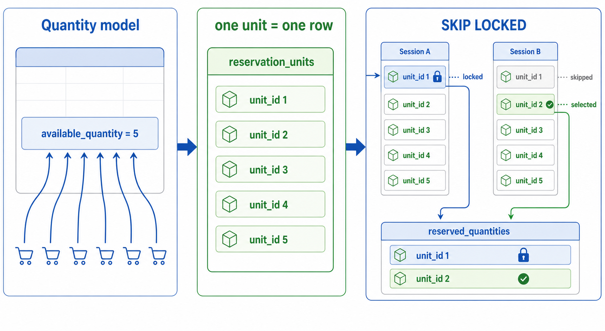
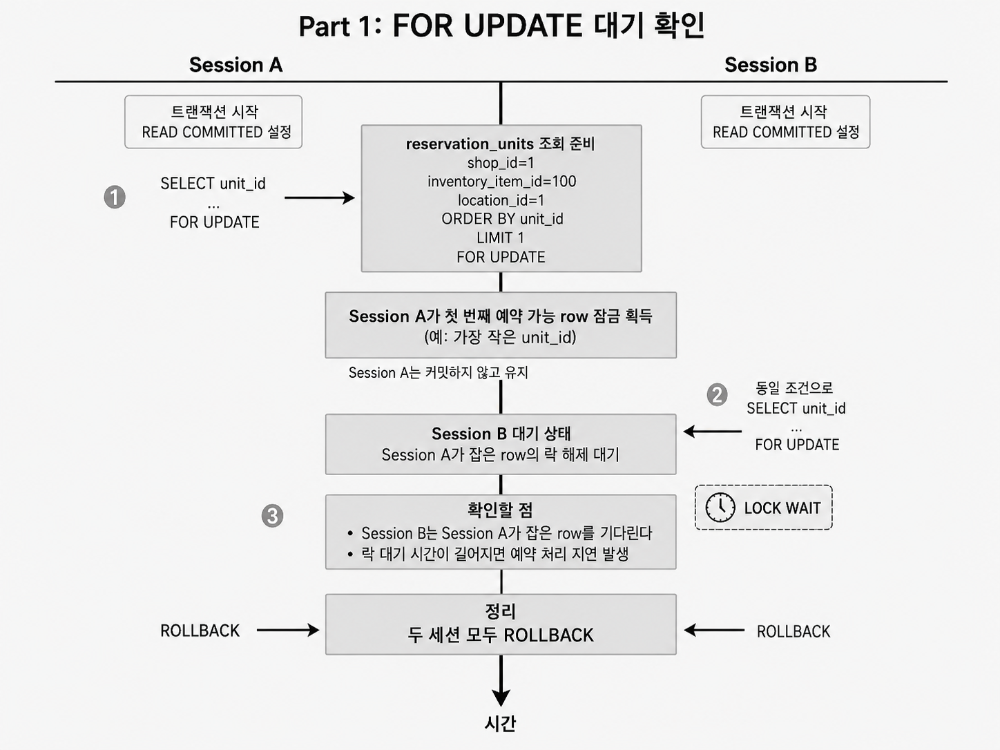
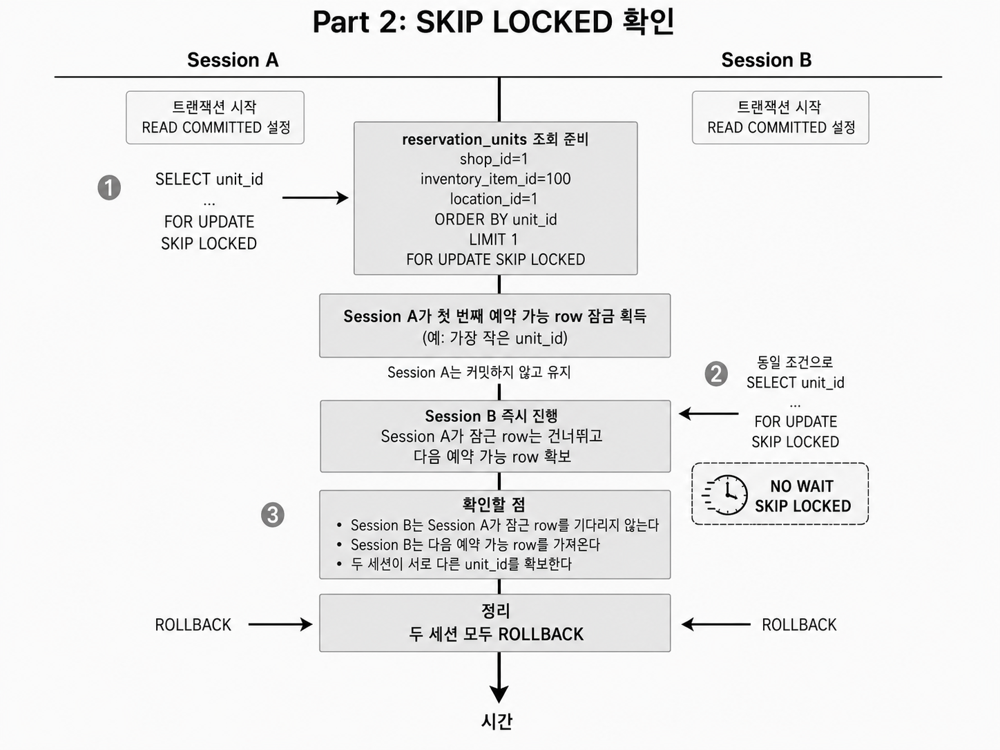
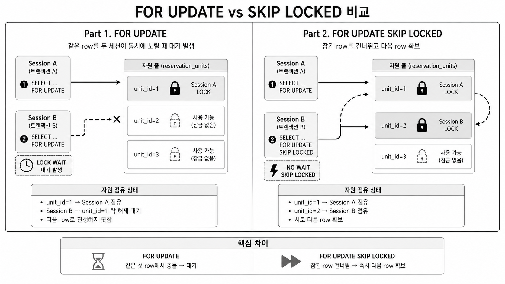

# 실습 3: 재고 단위 행과 SKIP LOCKED

## 목표

재고 1개를 `reservation_units`의 행 1개로 표현하는 구조에서 `FOR UPDATE`와 `FOR UPDATE SKIP LOCKED`의 차이를 확인한다.

이 실습은 잠금 문법 차이를 확인하면서, 동시 예약 요청이 같은 상품의 예약 가능 재고 단위를 찾을 때 경합을 어떻게 처리하는지 살펴본다.

## 배경

이 실습은 Shopify Engineering의 [MySQL 기반 재고 예약 사례](https://shopify.engineering/scaling-inventory-reservations)를 참고한다. Shopify의 기존 예약 시스템은 Redis에서 동작했다. Redis 내부의 동시성 처리에는 문제가 없었지만, 예약 상태와 재고 원장이 분리되어 있어 ACID 보장이 어려웠다.

이를 해결하기 위해 예약 상태와 재고 원장을 같은 MySQL 트랜잭션 안에서 처리하는 방향으로 옮겼다. 그런데 Redis식 수량 카운터를 MySQL의 단일 수량 행 구조로 그대로 가져오면 인기 상품 행에 경합이 발생한다. 같은 상품에 대한 예약 요청이 짧은 시간에 몰리면 많은 트랜잭션이 같은 수량 행을 잠그려고 하기 때문이다.

Shopify는 이 경합을 피하기 위해 예약 가능한 재고 1개를 하나의 행으로 표현하는 구조를 사용했다. 예약 요청은 수량 값을 갱신하는 대신 `reservation_units`에서 필요한 재고 단위 행을 선택한다.

이 구조에서 예약 가능한 재고 단위를 높은 처리량으로 선택할 수 있었던 핵심 이유는 MySQL 8의 `SKIP LOCKED`가 잠긴 행을 기다리지 않고 다른 재고 단위 행을 선택할 수 있게 해주기 때문이다. 재고를 행 단위로 나눈 뒤에도 같은 행이 두 예약에 동시에 배정되면 안 되므로 행 락은 필요하다. `FOR UPDATE SKIP LOCKED`는 이미 잠긴 재고 단위 행을 건너뛰고 아직 잠기지 않은 행을 확보한다.

이 구조에서는 예약 가능한 재고가 다음처럼 표현된다.

- `reservation_units`의 행 하나는 예약 가능한 재고 1개를 의미한다.
- 예약 요청은 수량 컬럼을 차감하는 대신 예약 가능한 재고 단위 행을 확보한다.
- 확보한 재고 단위 행은 예약 가능 행 묶음에서 제거되고 `reserved_quantities`에 기록된다.
- 선택한 행에는 여전히 `FOR UPDATE` 잠금을 건다.
- `SKIP LOCKED`는 이미 잠긴 행을 대기 대상에서 제외하고 다른 예약 가능 행을 찾게 한다.



수량 기반 예약에서 재고 단위 행 기반 예약으로 바뀌면 예약 요청은 같은 수량 값을 갱신하는 대신 예약 가능한 재고 단위 행을 확보한다. `SKIP LOCKED`는 이미 잠긴 행을 건너뛰고 다른 행을 선택하게 해 같은 상품의 동시 예약 요청을 분산한다.

이 구조에서는 여러 요청이 같은 상품을 예약하더라도 서로 다른 `unit_id`를 확보할 수 있다. 예약 가능 행 묶음이 부족해지는 문제는 [실습 4: 예약 가능 Pool 보충 시스템](./04_replenishment_pool.md)에서 다룬다.

이제 확인할 질문은 하나다. 재고 단위 행을 안전하게 가져오려면 행 잠금이 필요한데, 잠긴 행을 만났을 때 뒤 트랜잭션은 기다려야 하는가, 다른 행을 가져갈 수 있는가?

아래 실습은 이 질문을 보기 위해 `FOR UPDATE`와 `FOR UPDATE SKIP LOCKED`를 비교한다. `FOR UPDATE`는 앞선 트랜잭션이 잠근 행 앞에서 대기하는 흐름을 보여준다. `FOR UPDATE SKIP LOCKED`는 그 행을 건너뛰고 다른 예약 가능 행을 확보하는 흐름을 보여준다.


## 준비

MySQL 데이터를 초기화한다.

```powershell
Get-Content .\labs\sql\00_reset_mysql.sql | docker compose exec -T mysql mysql -ustudy -pstudy inventory_study
```

두 개의 터미널을 열고 각각 MySQL에 접속한다.

```powershell
docker compose exec mysql mysql -ustudy -pstudy inventory_study
```

이 문서에서는 두 터미널을 `Session A`, `Session B`로 부른다.

## Part 1: FOR UPDATE 대기 확인

이 파트에서는 재고 단위 행 구조에서도 일반 `FOR UPDATE`만 사용하면 두 세션이 같은 첫 번째 행을 두고 대기할 수 있음을 확인한다.

예약 가능한 다른 행이 있어도, 뒤 트랜잭션은 먼저 잠긴 행이 풀릴 때까지 결과를 얻지 못한다. 이 대기 시간이 길어지면 예약 처리 지연으로 이어진다.



`Session A`에서 트랜잭션을 시작하고 첫 번째 예약 가능 행을 잠근다.

```sql
SET SESSION TRANSACTION ISOLATION LEVEL READ COMMITTED;
START TRANSACTION;

SELECT unit_id
FROM reservation_units
WHERE shop_id = 1
  AND inventory_item_id = 100
  AND location_id = 1
ORDER BY unit_id
LIMIT 1
FOR UPDATE;
```

`Session A`는 커밋하지 않고 유지한다.

`Session B`에서 같은 조건으로 조회한다.

```sql
SET SESSION TRANSACTION ISOLATION LEVEL READ COMMITTED;
START TRANSACTION;

SELECT unit_id
FROM reservation_units
WHERE shop_id = 1
  AND inventory_item_id = 100
  AND location_id = 1
ORDER BY unit_id
LIMIT 1
FOR UPDATE;
```

확인할 점:

- `Session B`는 `Session A`가 잡은 행을 기다린다.
- 다른 예약 가능 행이 있어도 일반 `FOR UPDATE`는 잠긴 첫 행을 건너뛰지 않는다.
- 이 흐름에서는 같은 상품의 예약 요청이 앞선 행 잠금에 묶일 수 있다.

두 세션을 정리한다.

```sql
ROLLBACK;
```

## Part 2: SKIP LOCKED 확인

이 파트에서는 같은 경쟁 상황에서 `FOR UPDATE SKIP LOCKED`가 이미 잠긴 행을 건너뛰고 다른 예약 가능 행을 확보하는지 확인한다.

의미 있는 지점은 재고를 행 단위로 나눈 덕분에, 같은 상품의 다른 재고 단위를 락 대기 없이 배정할 수 있다는 점이다.



다시 `Session A`에서 첫 번째 행을 잠근다.

```sql
SET SESSION TRANSACTION ISOLATION LEVEL READ COMMITTED;
START TRANSACTION;

SELECT unit_id
FROM reservation_units
WHERE shop_id = 1
  AND inventory_item_id = 100
  AND location_id = 1
ORDER BY unit_id
LIMIT 1
FOR UPDATE SKIP LOCKED;
```

`Session A`는 커밋하지 않고 유지한다.

`Session B`에서 같은 조건으로 조회한다.

```sql
SET SESSION TRANSACTION ISOLATION LEVEL READ COMMITTED;
START TRANSACTION;

SELECT unit_id
FROM reservation_units
WHERE shop_id = 1
  AND inventory_item_id = 100
  AND location_id = 1
ORDER BY unit_id
LIMIT 1
FOR UPDATE SKIP LOCKED;
```

확인할 점:

- `Session B`는 `Session A`가 잠근 행을 기다리지 않는다.
- `Session B`는 다음 예약 가능 행을 가져온다.
- 두 세션이 서로 다른 `unit_id`를 확보한다.
- `SKIP LOCKED`도 선택한 행에는 잠금을 건다.

두 세션을 정리한다.

```sql
ROLLBACK;
```

## Part 3: FOR UPDATE와 SKIP LOCKED 차이 정리

이 파트에서는 앞에서 확인한 두 조회 방식의 차이를 재고 단위 행 예약 모델 관점에서 정리한다.

핵심은 같은 상품의 예약 요청이 같은 첫 번째 행에 묶이는지, 이미 잠긴 행을 제외하고 다른 행으로 분산될 수 있는지다.



차이:

- `FOR UPDATE`는 앞선 세션이 잠근 행을 뒤 세션이 기다린다.
- `FOR UPDATE`에서는 뒤 세션이 다음 행으로 진행하지 못해 락 대기 시간이 예약 처리 지연으로 이어질 수 있다.
- `FOR UPDATE SKIP LOCKED`는 이미 잠긴 행을 건너뛰고 다음 예약 가능 행을 찾는다.
- `FOR UPDATE SKIP LOCKED`에서는 두 세션이 서로 다른 `unit_id`를 확보할 수 있다.
- `FOR UPDATE SKIP LOCKED`에서도 선택된 행에는 `FOR UPDATE` 잠금이 걸린다.
- 예약 가능 행이 부족하면 `SKIP LOCKED` 조회 결과가 비어 있을 수 있으므로, 애플리케이션에서는 재시도나 품절 처리를 분기해야 한다.

## 정리 질문

- 수량 기반 예약과 재고 단위 행 예약은 경합 지점이 어떻게 다른가?
- `FOR UPDATE`와 `FOR UPDATE SKIP LOCKED`의 대기 방식은 어떻게 다른가?
- 예약 가능한 행이 부족하면 어떤 결과가 나와야 하는가?
