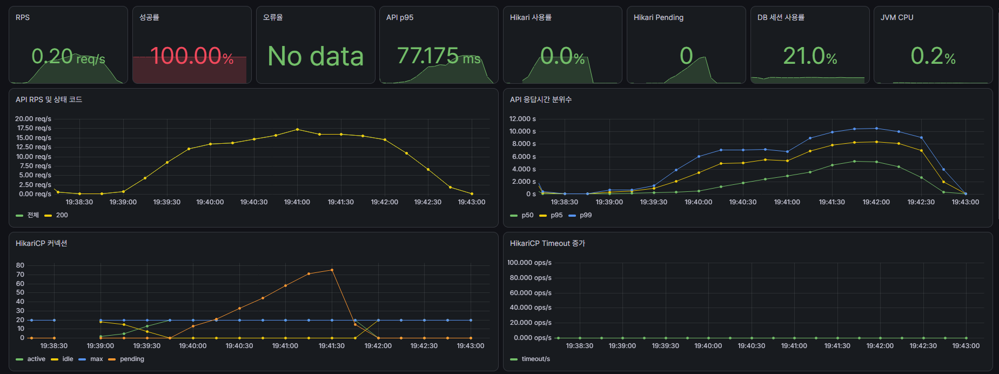
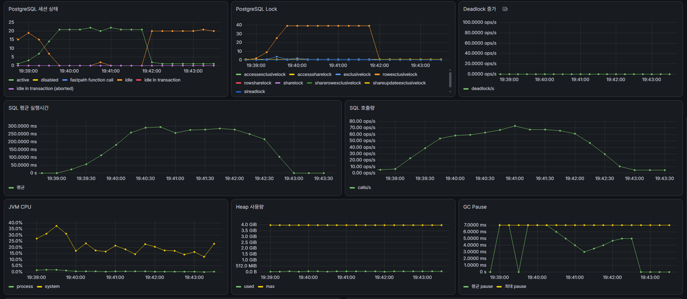
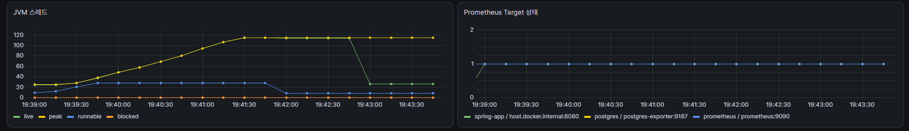

이번 개발과정에서는 RDB 기반의 간단한 재고처리 시스템을 구축하고 병목을 확인한다.
- 재고처리 API 작성
- 병목 지표를 마련하고 부하를 확인

다음으로는 Redis를 도입해 오버헤드가 개선되는 것을 확인한다.
- Redis 전환
- 병목 지표 개선 정도 확인

측정 지표 선정
API
- 부하 처리량과 실패 여부: RPS, 성공률, 오류율
- 응답지연: p50, p95, p99, latency
HikariCP
- 커넥션 풀 포화여부: active, idle, max, pending, timeout
DB
- DB 커넥션 포화여부: 활성 세션 수, 대기 세션 수
- 락 및 SQL 병목 확인: 쿼리 실행시간, lock wait, deadlock
JVM
- 애플리케이션 병목: CPU, heap, GC pause, 스레드 수

테스트 시나리오
단일 상품을 집중적으로 구매하는 시나리오
최대 VU 100명을 목표로 3분간 점진적으로 증가 및 감소 (10, 50, 100, 0)
목표 임계치는 에러 1%미만(모든 요청은 정상적으로 처리되어야 함)
p95 500ms 미만, p99 1s미만

결과
주 병목 포인트인 VU 100 구간에서 평균 RPS 약 17.2 정도로 약 3천회 요청이 처리되었음
모두 성공했으나 평균 지연이 2.62초 p50은 2.44s, p95는 5.45s, p99 6.35s 로 목표치에 비해 현저히 낮은 성능
따라서 임계치 목표 달성 실패

주요 병목
동일행에 대한 락 경합 폭증 -> 평균 SQL 실행시간 증가(약 150ms) -> HikariCP 커넥션 점유 시간 누적 -> HikariCP active 풀 고갈(10개) 및 pending 스레드 80개 이상으로 급증 -> API 응답 대기시간 폭증

결론
동일 행에 대한 동시 쓰기 락 경합으로 동맥경화가 발생함
HikariCP에서 pending, 쓰기 경합 락, SQL 평균 실행 시간이 모두 높은 상태를 보여줌
여기서 HikariCP의 커넥션 풀을 늘린다해도 DB 대기 시간에 요청이 쌓이는 방식으로 오버헤드가 전가됨
이는 HikariCP에 대한 지표는 개선했을지라도 본질적인 응답 시간을 줄이는 목표를 달성하지 못하는 옆그레이드임
