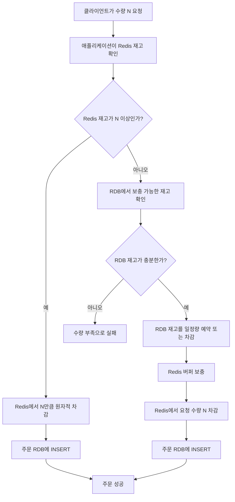

레디스를 몰라서 RDB를 대체하지 못하고 있음
관리 포인트가 늘어나서 실패에 대해 어떻게 처리할지 고민해야함
하지만 현재 학습목표는 컬럼기반 재고수량을 RDB의 skip locked 기능을 활용해서 행기반 재고관리로 전환해서 레디스와 RDB의 일관성 실패정책의 부담을 줄이는데 있다
그래서 레디스의 도입부에서 동기화 전략을 간략하게 구현하고 넘어간다
레디스와 RDB를 동기화하는 패턴에는 몇 가지가 있고 이들을 알아본다
그 후 전략을 채택하고 구현해서 다음 스텝으로 넘어간다

1. Cache-Aside, Lazy Loading
레디스를 먼저 조회하고 없으면 RDB에서 읽어오는 방식
여기서 주체는 애플리케이션
```
조회: Redis → miss → RDB → Redis 저장
쓰기: RDB 갱신 → Redis 삭제
```


2. Read-Through
레디스만 조회하고 미스나면 레디스가 RDB에서 읽어오는 방식
```
애플리케이션 → Redis/캐시 계층 → RDB
```

3. Write-Through
레디스에 쓰고 레디스가 RDB에 즉시 쓰는 방식
```
애플리케이션 → Redis → RDB
```

4. Write Back, Write Behind
캐시에 먼저 쓰고 정의한 기준에 따라 비동기로 DB에 저장하는 방식
```
애플리케이션 → Redis → 큐/배치 → RDB
```


5. Wrtie Around 모든 데이터가 DB에 저장되고 읽은것만 레디스에 저장
RDB만 갱신하고 레디스에서 미스나면 채우기
```
쓰기: 애플리케이션 → RDB
조회: Redis miss → RDB → Redis
```

읽기와 쓰기가 빠르게 데이터를 읽어오거나 쓰는 방식에 대한 패턴들이다
하지만 동기화적인 특징이 강하고 레디스가 다운되면 저장된 재고만큼의 리스크가 있다
그래서 레디스를 버퍼로 RDB를 원장으로 관리하는 방식을 생각했다
휘발되는 만큼의 재고를 일정량으로 제한하는 방식이다



이 구조는 휘발을 고려했지만 복구에 대한 기능은 작성하지 않을것이다
복구를 하기 위해서는 주문에 대한 상태 추적이 필요하기 때문에 구현포인트가 늘어나기 때문이다
이렇게 완충포인트만 만련해서 구현해보도록 하자
