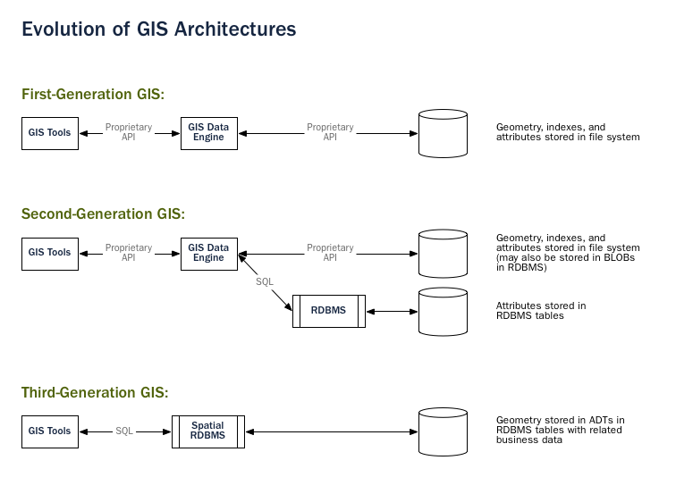
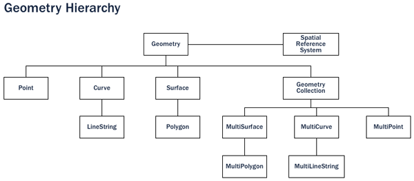
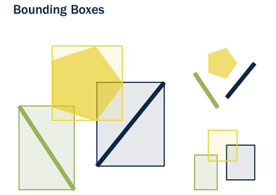

# 2. 소개 (Introduction)

> 공식 원문: [<https://postgis.net/workshops/postgis-intro/introduction.html>](https://postgis.net/workshops/postgis-intro/introduction.html)\
> 공식 소스의 본문·표·SQL·이미지를 현재 페이지 순서대로 반영했습니다.

## 공간 데이터베이스란 무엇입니까?

PostGIS는 공간 데이터베이스입니다. Oracle Spatial 및 SQL Server(2008 이상)도 공간 데이터베이스입니다. 그러나 그것이 무엇을 의미하는가? 일반 데이터베이스를 공간 데이터베이스로 만드는 것은 무엇입니까?

짧은 대답은...

**공간 데이터베이스는 일반 데이터베이스 객체와 마찬가지로 공간 객체를 저장하고 조작합니다.**

다음에서는 공간 데이터베이스의 발전을 간략하게 다룬 다음 *공간* 데이터를 데이터베이스와 연관시키는 세 가지 측면(데이터 유형, 인덱스 및 기능)을 검토합니다.

1.  **공간 데이터 유형**은 점, 선, 다각형과 같은 모양을 나타냅니다.
2.  공간 작업의 효율적인 처리를 위해 다차원 **공간 인덱싱**이 사용됩니다.
3.  `SQL`에 제시된 **공간 함수**는 공간 속성 및 관계를 쿼리하기 위한 것입니다.

결합된 공간 데이터 유형, 인덱스 및 함수는 최적화된 성능 및 분석을 위한 유연한 구조를 제공합니다.

### 처음에는

레거시 1세대 `GIS` 구현에서는 모든 공간 데이터가 플랫 파일에 저장되며 데이터를 해석하고 조작하려면 특수 `GIS` 소프트웨어가 필요합니다. 이러한 1세대 관리 시스템은 필요한 모든 데이터가 사용자의 조직 도메인 내에 있는 사용자의 요구를 충족하도록 설계되었습니다. 이는 공간 데이터를 처리하기 위해 특별히 제작된 독점적이고 독립적인 시스템입니다.

2세대 공간 시스템은 관계형 데이터베이스(일반적으로 "속성" 또는 비공간 부분)에 일부 데이터를 저장하지만 직접 통합을 통해 제공되는 유연성은 여전히 ​​부족합니다.

**진정한 공간 데이터베이스는 공간 피처를 일급 데이터베이스 객체로 다루기 시작하면서 탄생했습니다.**

공간 데이터베이스는 공간 데이터를 관계형 데이터베이스와 완전히 통합합니다. 시스템 방향이 GIS 중심에서 데이터베이스 중심으로 변경됩니다.

> [!NOTE]
> 공간 데이터베이스 관리 시스템은 지리적 세계 이외의 응용 프로그램에도 사용될 수 있습니다. 공간 데이터베이스는 인체 해부학, 대규모 집적 회로, 분자 구조, 전자기장 등과 관련된 데이터를 관리하는 데 사용됩니다.

### 공간 데이터 유형

일반 데이터베이스에는 문자열, 숫자, 날짜가 있습니다. 공간 데이터베이스는 **지리적 특징**을 표현하기 위한 추가적인 (공간) 유형을 추가합니다. 이러한 공간 데이터 유형은 경계 및 차원과 같은 공간 구조를 추상화하고 캡슐화합니다. 여러 측면에서 공간 데이터 유형은 단순히 모양으로 이해될 수 있습니다.

공간 데이터 유형은 유형 계층 구조로 구성됩니다. 각 하위 유형은 상위 유형의 구조(속성)와 동작(메서드 또는 기능)을 상속합니다.

### 공간 인덱스 및 경계 상자

일반 데이터베이스는 **indexes**를 제공하여 데이터 하위 집합에 대한 빠르고 무작위 액세스를 허용합니다. 표준 유형(숫자, 문자열, 날짜)에 대한 인덱싱은 일반적으로 [B-트리](http://en.wikipedia.org/wiki/B-tree) 인덱스를 사용하여 수행됩니다.

B-트리는 데이터를 계층적 트리에 넣기 위해 자연 정렬 순서를 사용하여 데이터를 분할합니다. 숫자, 문자열 및 날짜의 자연적인 정렬 순서는 간단하게 결정됩니다. 즉, 모든 값은 다른 모든 값보다 작거나 크거나 같습니다.

그러나 다각형은 겹칠 수 있고, 서로 포함될 수 있고, 2차원(또는 그 이상) 공간에 배열될 수 있기 때문에 B-트리를 사용하여 다각형을 효율적으로 인덱싱할 수 없습니다. 실제 공간 데이터베이스는 "이 특정 경계 상자 내에 어떤 객체가 있습니까?"라는 질문에 대답하는 "공간 인덱스"를 제공합니다.

**경계 상자**는 주어진 지형지물을 포함할 수 있는 좌표축에 평행한 가장 작은 직사각형입니다.

경계 상자는 "A가 B 안에 있습니까?"라는 질문에 대답하기 때문에 사용됩니다. 다각형의 경우 계산 집약적이지만 직사각형의 경우 매우 빠릅니다. 가장 복잡한 다각형과 라인스트링도 간단한 경계 상자로 표시할 수 있습니다.

인덱스는 빠르게 결과를 찾아야 유용합니다. 공간 인덱스는 B-트리처럼 정확한 결과를 바로 제공하기보다 근삿값을 빠르게 찾습니다. 예를 들어 "이 다각형 안에는 어떤 선이 있습니까?"라는 질문을 "이 다각형의 경계 상자 안에 경계 상자가 들어가는 선은 무엇입니까?"라는 근사 질의로 바꿔 처리합니다.

다양한 데이터베이스에 의해 구현되는 실제 공간 인덱스는 매우 다양합니다. 가장 일반적인 구현은 [R-Tree](http://en.wikipedia.org/wiki/R-tree) 및 [Quadtree](http://en.wikipedia.org/wiki/Quadtree)(PostGIS에서 사용됨)이지만, 다른 공간 데이터베이스에 구현된 [그리드 기반 인덱스](<http://en.wikipedia.org/wiki/Grid_(spatial_index)>) 및 [GeoHash 인덱스](https://en.wikipedia.org/wiki/Geohash)도 있습니다.

### 공간 함수

쿼리 중 데이터 조작을 위해 일반 데이터베이스에서는 문자열 연결, 문자열에 대한 해시 연산 수행, 숫자에 대한 수학 수행, 날짜에서 정보 추출과 같은 **functions**를 제공합니다.

공간 데이터베이스는 기하학적 구성 요소를 분석하고, 공간 관계를 결정하고, 기하학을 조작하기 위한 완전한 기능 세트를 제공합니다. 이러한 공간 기능은 모든 공간 프로젝트의 구성 요소 역할을 합니다.

모든 공간 기능의 대부분은 다음 다섯 가지 범주 중 하나로 그룹화될 수 있습니다.

1.  **Conversion**: 기하학과 외부 데이터 형식 사이를 *변환*하는 기능입니다.
2.  **Management**: 공간 테이블 및 PostGIS 관리에 대한 정보를 *관리*하는 기능입니다.
3.  **Retrieval**: 기하학의 속성과 측정값을 *검색*하는 함수입니다.
4.  **Comparison**: 공간 관계와 관련하여 두 개의 기하학적 구조를 *비교*하는 기능입니다.
5.  **Generation**: 다른 형상으로부터 새로운 형상을 *생성*하는 기능입니다.

가능한 기능 목록은 매우 많지만, 일반적인 기능 세트는 `OGC` `SFSQL`에 의해 정의되고 PostGIS에 의해 (추가 유용한 기능과 함께) 구현됩니다.

## PostGIS란 무엇입니까?

PostGIS는 공간 유형, 공간 인덱스, 공간 함수라는 세 가지 기능에 대한 지원을 추가하여 [PostgreSQL](http://www.postgresql.org/) 데이터베이스 관리 시스템을 공간 데이터베이스로 전환합니다. PostgreSQL을 기반으로 구축되었기 때문에 PostGIS는 중요한 "엔터프라이즈" 기능과 구현을 위한 개방형 표준을 자동으로 상속합니다.

### 그런데 PostgreSQL이 뭔가요?

PostgreSQL은 강력한 관계형 데이터베이스 관리 시스템(RDBMS)입니다. BSD 스타일 라이선스로 배포되는 무료 오픈 소스 소프트웨어입니다. 다른 많은 오픈 소스 프로젝트처럼 단일 회사가 통제하지 않으며, [전 세계 개발자와 기업이 이루는 커뮤니티](https://www.postgresql.org/community/contributors/)가 함께 개발합니다.

PostgreSQL은 처음부터 유형 확장, 즉 런타임에 새로운 데이터 유형, 함수 및 인덱스를 추가하는 기능을 염두에 두고 설계되었습니다. 이로 인해 PostGIS 확장은 별도의 개발 팀에서 개발하면서도 여전히 핵심 PostgreSQL 데이터베이스에 매우 긴밀하게 통합될 수 있습니다.

#### PostgreSQL을 선택하는 이유는 무엇인가요?

오픈 소스 데이터베이스에 익숙한 사람들이 흔히 묻는 질문은 "PostGIS가 MySQL을 기반으로 구축되지 않은 이유는 무엇입니까?"입니다.

PostgreSQL에는 다음이 포함됩니다.

- 기본적으로 입증된 신뢰성 및 트랜잭션 무결성(ACID)
- SQL 표준에 대한 세심한 지원(전체 SQL92)
- Pluggable 타입 확장 및 기능 확장
- 커뮤니티 중심 개발 모델
- 큰 GIS 객체를 지원하기 위한 열 크기("TOAST" 가능 튜플)에 제한이 없습니다.
- R-Tree 인덱스를 허용하는 일반 인덱스 구조(GiST)
- 사용자 정의 기능을 쉽게 추가할 수 있습니다.

결합된 PostgreSQL은 새로운 공간 유형을 추가하기 위한 매우 쉬운 개발 경로를 제공합니다. 독점적인 세계에서는 [Illustra](https://en.wikipedia.org/wiki/Illustra)(현재 Informix Universal Server)만이 이러한 쉬운 확장을 허용했습니다. 이것은 우연이 아닙니다. Illustra는 1980년대의 원래 PostgreSQL 코드 기반을 독점적으로 재작업한 것입니다.

PostgreSQL에 유형을 추가하는 개발 경로는 매우 간단했기 때문에 거기서 시작하는 것이 합리적이었습니다. MySQL이 버전 4.1에서 기본 공간 유형을 출시했을 때 PostGIS 팀은 코드를 살펴보았고 이 연습을 통해 PostgreSQL을 사용하기로 한 원래 결정이 더욱 강화되었습니다.

MySQL에서는 공간 객체를 문자열 자료형 위에 특수한 형태로 덧붙여 구현해야 했기 때문에 관련 코드가 전체 코드베이스에 흩어졌습니다. PostGIS 0.1 개발에는 한 달도 걸리지 않았지만, 같은 방식으로 "MyGIS" 0.1을 만들었다면 훨씬 오래 걸려 세상에 나오지 못했을 수도 있습니다.

### 왜 파일이 ​​안되나요?

[Shapefile](http://en.wikipedia.org/wiki/Shapefile)(및 Esri File Geodatabase 및 [GeoPackage](https://www.geopackage.org/)과 같은 기타 형식)은 GIS 소프트웨어가 처음 작성된 이후 공간 데이터를 저장하고 상호 작용하는 표준 방법이었습니다. 그러나 이러한 "플랫" 파일에는 다음과 같은 단점이 있습니다.

- **파일을 읽고 쓰려면 특수 소프트웨어가 필요합니다.** SQL은 임의 데이터 액세스 및 분석을 위한 추상화입니다. 이러한 추상화가 없으면 모든 액세스 및 분석 코드를 직접 작성해야 합니다.
- **동시 사용자는 손상 및 속도 저하를 일으킬 수 있습니다.** 동일한 파일에 여러 번 쓰기로 인해 데이터가 손상되지 않도록 추가 코드를 작성할 수도 있지만 문제를 해결하고 관련 성능 문제도 해결할 때쯤이면 데이터베이스 시스템의 더 나은 부분을 작성한 것입니다. 왜 표준 데이터베이스를 사용하지 않는 걸까요?
- **복잡한 질문에 대답하려면 복잡한 소프트웨어가 필요합니다.** 데이터베이스의 한 줄의 SQL로 표현 가능한 복잡하고 흥미로운 질문(공간 조인, 집계 등)은 파일에 대해 프로그래밍할 때 대답하려면 수백 줄의 특수 코드가 필요합니다.

대부분의 PostGIS 사용자는 여러 응용 프로그램이 데이터에 액세스할 것으로 예상되는 시스템을 설정하므로 표준 SQL 액세스 방법을 사용하면 배포 및 개발이 단순화됩니다. 일부 사용자는 대규모 데이터 세트로 작업하고 있습니다. 파일의 경우 여러 파일로 분할될 수 있지만 데이터베이스에서는 하나의 큰 테이블로 저장될 수 있습니다.

요약하자면, 여러 사용자에 대한 지원, 복잡한 임시 쿼리 및 대규모 데이터 세트에 대한 성능의 조합은 공간 데이터베이스를 파일 기반 시스템과 차별화하는 요소입니다.

### PostGIS의 간략한 역사

2001년 5월, [Refractions Research](http://www.refractions.net/)에서 PostGIS의 첫 번째 버전을 출시했습니다. PostGIS 0.1은 공간 객체와 인덱스, 몇 가지 함수를 제공했습니다. 저장과 검색에는 적합했지만 분석 기능은 아직 부족했습니다.

기능의 수가 증가함에 따라 조직화 원칙의 필요성이 분명해졌습니다. Open Geospatial Consortium의 "SQL용 단순 기능"(`SFSQL`) 사양은 이러한 구조에 함수 이름 지정 및 요구 사항에 대한 지침을 제공했습니다.

간단한 분석 및 공간 조인을 위한 PostGIS 지원을 통해 [Mapserver](http://mapserver.org/)는 데이터베이스의 데이터 시각화를 제공하는 최초의 외부 애플리케이션이 되었습니다.

이후 몇 년 동안 PostGIS 기능의 수가 증가했지만 그 기능은 여전히 ​​제한적이었습니다. 가장 흥미로운 함수 중 다수(예: ST_Intersects(), ST_Buffer(), ST_Union())는 코딩하기가 매우 어려웠습니다. 처음부터 약속된 수년간의 작업을 작성했습니다.

다행스럽게도 두 번째 프로젝트인 "Geometry Engine, Open Source" 또는 [GEOS](http://trac.osgeo.org/geos)가 나왔습니다. GEOS 라이브러리는 `SFSQL` 사양을 구현하는 데 필요한 알고리즘을 제공합니다. GEOS에 연결함으로써 PostGIS는 버전 0.8에서 `SFSQL`를 완벽하게 지원했습니다.

PostGIS 데이터의 규모가 커지면서 지오메트리 저장 형식이 비효율적이라는 또 다른 문제가 드러났습니다. 점이나 짧은 선 같은 작은 객체에서는 메타데이터 오버헤드가 최대 300%에 달했습니다. 성능을 높이려면 저장 형식을 경량화해야 했습니다. 메타데이터 헤더와 필수 차원을 줄여 오버헤드를 크게 낮췄고, PostGIS 1.0부터 이보다 빠르고 가벼운 형식이 기본값이 되었습니다.

PostGIS의 최신 릴리스에는 PostgreSQL 핵심 시스템의 새로운 기능에 대한 지원뿐만 아니라 기능 및 성능 개선이 계속해서 추가되고 있습니다.

### PostGIS는 누가 사용하나요?

#### 프랑스 국립지리연구소

IGN은 프랑스의 국가 지도 제작 기관으로 PostGIS를 사용하여 해당 국가의 고해상도 지형 지도인 "BDUni"를 저장합니다. BDUni는 1억 개가 넘는 기능을 보유하고 있으며 매일 관찰 내용을 확인하고 데이터베이스에 새로운 매핑을 추가하는 100명 이상의 현장 직원이 유지 관리합니다. IGN 설치에서는 데이터베이스 트랜잭션 시스템을 사용하여 업데이트 프로세스 중 일관성을 보장하고 [웜 대기 시스템](https://www.postgresql.org/docs/devel/warm-standby.html)을 사용하여 시스템 오류 발생 시 가동 시간을 유지합니다.

#### 레드핀

[RedFin](https://www.redfin.com)은 부동산 탐색 및 가치 추정을 위한 웹 기반 서비스를 제공하는 부동산 중개업체입니다. 해당 시스템은 원래 MySQL을 기반으로 구축되었지만 PostgreSQL 및 PostGIS로 전환하면 [성능 및 안정성 면에서 큰 이점](https://www.redfin.com/news/elephant_versus_dolphin_which_is_faster_which_is_smarter/)이 제공된다는 사실을 알게 되었습니다.

### PostGIS를 지원하는 애플리케이션은 무엇입니까?

PostGIS는 널리 사용되는 공간 데이터베이스가 되었으며 이를 사용하여 데이터 저장 및 검색을 지원하는 타사 프로그램의 수도 증가했습니다. [PostGIS를 지원하는 프로그램](http://trac.osgeo.org/postgis/wiki/UsersWikiToolsSupportPostgis)에는 서버와 데스크톱 시스템 모두에 오픈 소스와 독점 소프트웨어가 모두 포함되어 있습니다.

다음 표에는 PostGIS를 활용하는 일부 소프트웨어 목록이 나와 있습니다.

<table>
<colgroup>
<col style="width: 51%" />
<col style="width: 48%" />
</colgroup>
<thead>
<tr>
<th>Open/Free</th>
<th>폐쇄/독점/유료 서비스</th>
</tr>
</thead>
<tbody>
<tr>
<td>
* 로드/추출 중

<blockquote>
<ul>
<li>Shp2Pgsql</li>
<li>ogr2ogr</li>
<li>Dxf2PostGIS</li>
<li>GeoKettle</li>
</ul>
</blockquote>
<ul>
<li>웹 기반
<ul>
<li>Mapserver</li>
<li>GeoServer /geoNode</li>
<li>pg_tileserv</li>
<li>pg_featureserv</li>
<li>도</li>
<li>Carto</li>
<li>QGIS 서버</li>
<li>MapGuide 오픈 소스(FDO 사용)</li>
</ul></li>
<li>데스크탑
<ul>
<li>QGIS</li>
<li>OpenJUMP</li>
<li>GRASS</li>
<li>pgAdmin</li>
<li>DBeaver</li>
<li>GvSIG</li>
<li>SAGA</li>
<li>uDig</li>
</ul></li>
</ul></td>
<td>
* 로드/추출 중

<blockquote>
<ul>
<li>Safe FME 데스크탑 번역기/변환기</li>
<li>Dbt</li>
</ul>
</blockquote>
<ul>
<li>웹 기반
<ul>
<li>Cadcorp GeognoSIS</li>
<li>ESRI ArcGIS 서버/온라인</li>
</ul></li>
<li>서비스/DbaaS
<ul>
PostgreSQL</li>용 <li>Aiven
<li>Amazon RDS/PostgreSQL</li>용 오로라
<li>Carto</li>
<li>크런치 브릿지</li>
<li>PostgreSQL</li>용 Microsoft Azure
<li>PostgreSQL용 Google Cloud SQL</li>
</ul></li>
<li>데스크탑
<ul>
<li>Cadcorp SIS</li>
<li>ESRI 데스크탑/Pro</li>
<li>GeoConcept</li>
<li>글로벌 매퍼</li>
<li>매니폴드</li>
<li>MapInfo</li>
<li>마이크로이미지 TNTmips GIS</li>
</ul></li>
</ul></td>
</tr>
</tbody>
</table>

---

[← 이전](01_welcome.md) · [목차](00_index.md) · [다음 →](03_installation.md)
