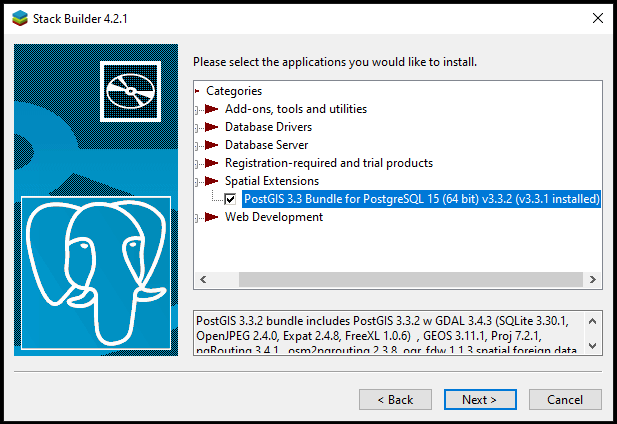
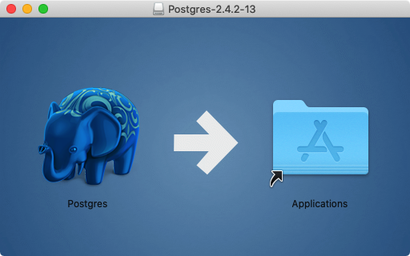
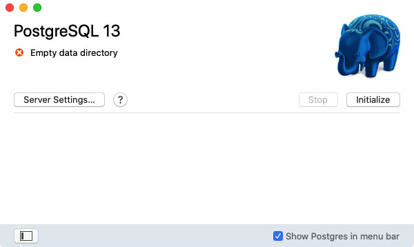
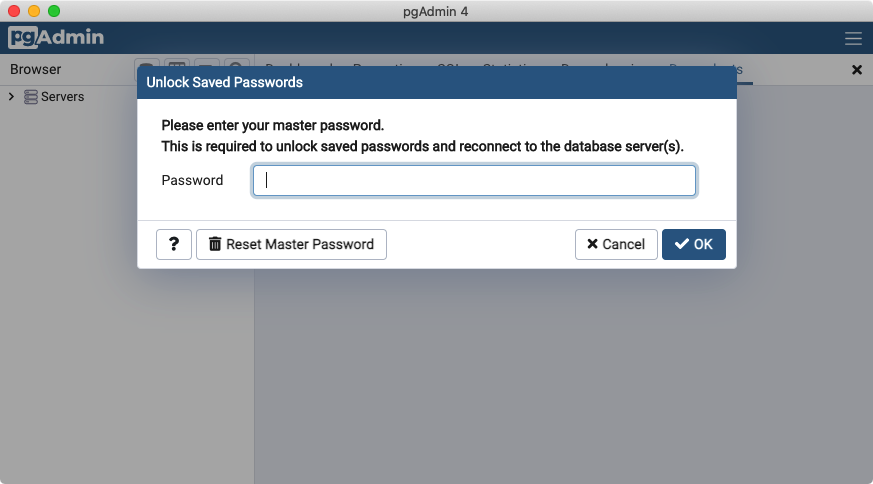

# 3. 설치 (Installation)

> 공식 원문: [<https://postgis.net/workshops/postgis-intro/installation.html>](https://postgis.net/workshops/postgis-intro/installation.html)\
> 공식 소스의 본문·표·SQL·이미지를 현재 페이지 순서대로 반영했습니다.

PostgreSQL/PostGIS 데이터베이스를 탐색하고 SQL로 공간 쿼리를 작성하려면 로컬 컴퓨터에 설치하거나 클라우드 원격 환경을 준비해야 합니다.

- **PostgreSQL & PostGIS 설치**: Windows 및 macOS용 PostgreSQL 배포판에는 PostGIS 확장이 포함되어 있거나 패키지 관리 도구(StackBuilder 등)를 통해 손쉽게 추가할 수 있습니다.
- **[pgAdmin](https://www.pgadmin.org/) 설치**: pgAdmin은 PostgreSQL/PostGIS 데이터베이스를 시각적으로 관리하고 SQL 쿼리를 실행하며, 공간 지오메트리를 지도 형태로 즉시 미리볼 수 있는 뷰어를 제공하는 오픈 소스 GUI 관리 도구입니다.

운영체제별 최신 설치 파일 및 안내는 [PostgreSQL 공식 다운로드 페이지](https://www.postgresql.org/download/)를 참고하세요.

## Microsoft Windows에 설치하기

Windows 환경에서의 설치 절차:

1. [Windows용 PostgreSQL 다운로드 페이지](https://www.enterprisedb.com/downloads/postgres-postgresql-downloads)로 이동합니다.
2. 최신 안정 버전의 PostgreSQL 설치 프로그램(Installer)을 다운로드하여 실행합니다.
3. 마법사 안내에 따라 설치를 진행합니다(기본 포트 `5432`, `postgres` 관리자 비밀번호 설정).
4. 설치가 완료된 후 함께 실행되는 **StackBuilder** 프로그램을 시작합니다.
5. 카테고리 중 **Spatial Extensions** 항목을 펼치고 최신 버전의 **PostGIS .. Bundle**을 선택합니다.

   

6. 기본 설정값을 유지하면서 PostGIS 확장 번들 설치를 완료합니다.

## Apple macOS에 설치하기

macOS 환경에서의 설치 절차:

1. [Postgres.app 공식 사이트](https://postgresapp.com/)로 이동하여 최신 버전을 다운로드합니다.
2. 다운로드한 `.dmg` 디스크 이미지를 열고 **Postgres** 아이콘을 **Applications**(응용 프로그램) 폴더로 드래그합니다.

   

3. **Applications** 폴더에서 **Postgres**를 더블 클릭하여 서버를 실행합니다.
4. **Initialize** 버튼을 클릭하여 새 데이터베이스 클러스터를 초기화합니다.

   

5. 터미널(Terminal)을 열고 편리한 명령줄 도구 사용을 위해 `PATH` 환경 변수를 설정합니다.

   ```sh
   sudo mkdir -p /etc/paths.d
   echo /Applications/Postgres.app/Contents/Versions/latest/bin | sudo tee /etc/paths.d/postgresapp
   ```

## Windows 및 macOS용 pgAdmin 설치

pgAdmin은 <https://www.pgadmin.org/download/>에서 플랫폼별 설치 파일을 제공합니다.

1. 사용 중인 운영체제에 맞는 최신 버전을 다운로드하여 설치합니다.
2. 설치 완료 후 **pgAdmin**을 실행합니다.




---

[← 이전](02_introduction.md) · [목차](00_index.md) · [다음 →](04_creating_db.md)
