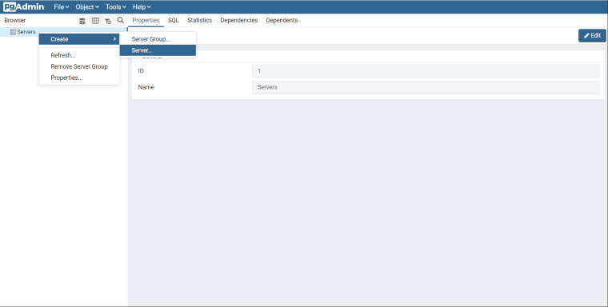
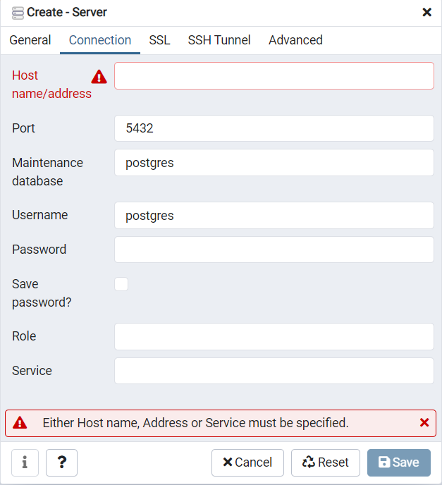
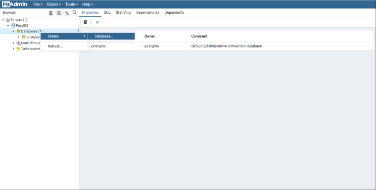
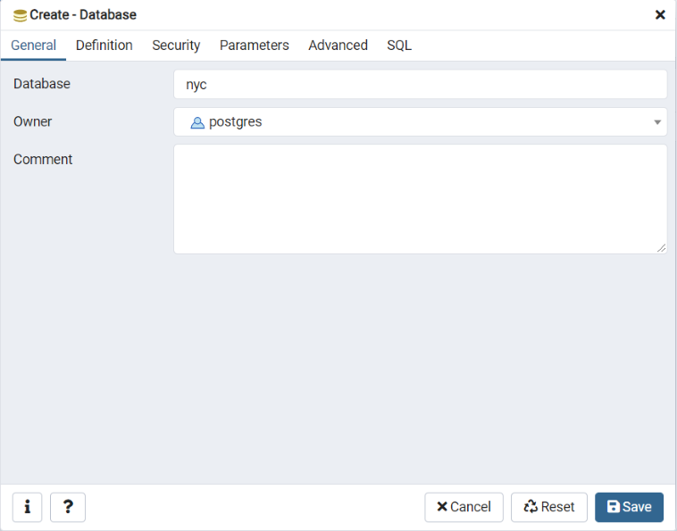
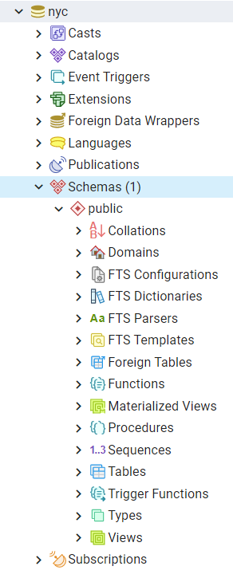

# 4. 공간 데이터베이스 생성 (Creating a Spatial Database)

> 공식 원문: [<https://postgis.net/workshops/postgis-intro/creating_db.html>](https://postgis.net/workshops/postgis-intro/creating_db.html)\
> 공식 소스의 본문·표·SQL·이미지를 현재 페이지 순서대로 반영했습니다.

## pgAdmin 소개 및 접속

PostgreSQL은 다양한 관리 클라이언트를 지원합니다. 가장 대표적인 기본 도구는 대화형 터미널 명령줄 도구인 [psql](http://www.postgresql.org/docs/current/static/app-psql.html)입니다. 또 다른 인기 있는 도구는 오픈 소스 그래픽 인터페이스(GUI) 클라이언트인 [pgAdmin](http://www.pgadmin.org/)입니다.

pgAdmin에서 실행하는 모든 작업은 `psql`을 통해서도 동일하게 수행할 수 있습니다. 특히 pgAdmin에는 PostGIS 공간 쿼리 결과를 지도 위에서 바로 시각화할 수 있는 **지오메트리 뷰어(Geometry Viewer)**가 내장되어 있어 공간 데이터 학습에 매우 유용합니다.

1. **pgAdmin**을 실행합니다.

   

2. pgAdmin을 처음 실행한 경우 왼쪽 브라우저 트리 패널의 `Servers` 항목을 마우스 오른쪽 버튼으로 클릭하고 **Register > Server...**를 선택합니다.

   - **General** 탭: `Name`에 **PostGIS** (또는 원하는 이름)를 입력합니다.
   - **Connection** 탭:
     - `Host name/address`: 로컬 환경인 경우 `localhost`를 입력합니다. (클라우드 DB 사용 시 해당 엔드포인트 입력)
     - `Port`: 기본 포트인 `5432`를 입력합니다.
     - `Maintenance database`: 기본값인 `postgres`로 둡니다.
     - `Username`: 기본 관리자 계정인 `postgres`를 입력합니다.
     - `Password`: 설치 시 설정했던 비밀번호를 입력합니다.

   

## 공간 데이터베이스 생성하기

1. `Servers > PostGIS > Databases` 항목을 열어 기존 데이터베이스 목록을 확인합니다. 기본 생성되어 있는 `postgres` 데이터베이스는 시스템 관리용이므로, 실습을 위한 전용 데이터베이스를 생성하겠습니다.
2. `Databases`를 마우스 오른쪽 버튼으로 클릭하고 **Create > Database...**를 선택합니다.

   

3. 아래와 같이 설정하고 **Save**를 클릭합니다.

   | 항목 | 값 |
   | :--- | :--- |
   | **Database** | `nyc` |
   | **Owner** | `postgres` |

   

4. 생성된 `nyc` 데이터베이스 항목을 펼쳐 `Schemas > public` 구조를 확인합니다.

   

5. 상단 툴바의 **Query Tool** 아이콘을 클릭하거나 메뉴에서 *Tools > Query Tool*을 실행합니다.

   

6. 쿼리 편집기 창에 다음 SQL 명령을 입력하여 PostGIS 공간 확장을 활성화합니다.

   ```sql
   CREATE EXTENSION postgis;
   ```

7. 툴바의 **Execute(▶)** 버튼을 클릭하거나 **F5** 키를 눌러 쿼리를 실행합니다.
8. 설치된 PostGIS의 전체 버전과 빌드 구성을 확인합니다.

   ```sql
   SELECT postgis_full_version();
   ```

성공적으로 PostGIS 공간 데이터베이스 구축이 완료되었습니다!

## 함수 목록 (Function List)

- [PostGIS_Full_Version](http://postgis.net/docs/PostGIS_Full_Version.html): 설치된 PostGIS의 전체 버전, GEOS, PROJ, GDAL 등 연동 라이브러리 빌드 구성 정보를 반환합니다.


---

[← 이전](03_installation.md) · [목차](00_index.md) · [다음 →](05_loading_data.md)