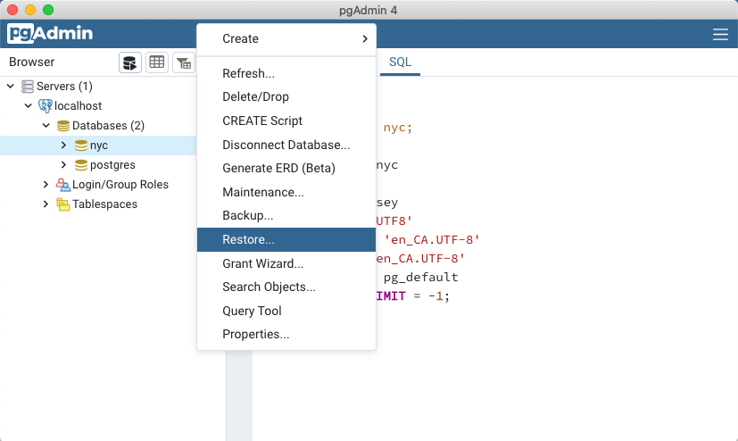
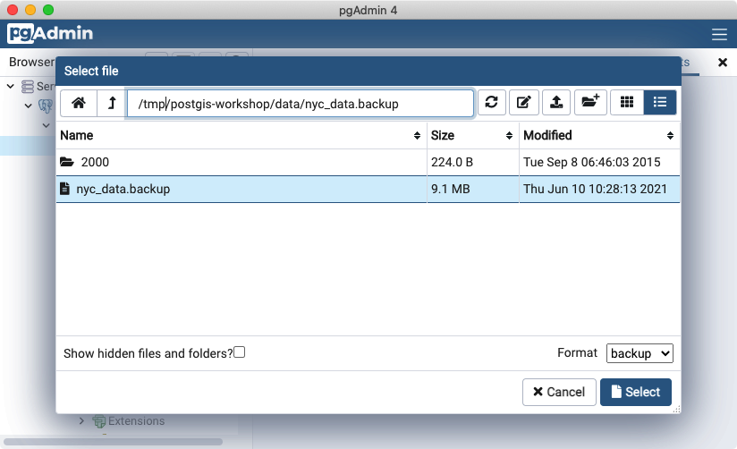
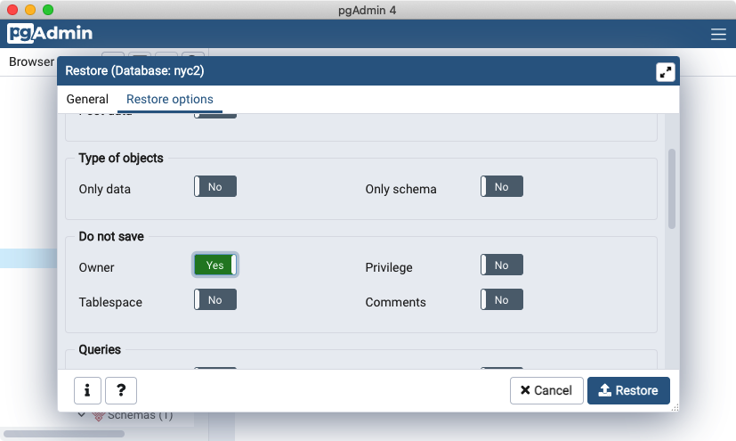
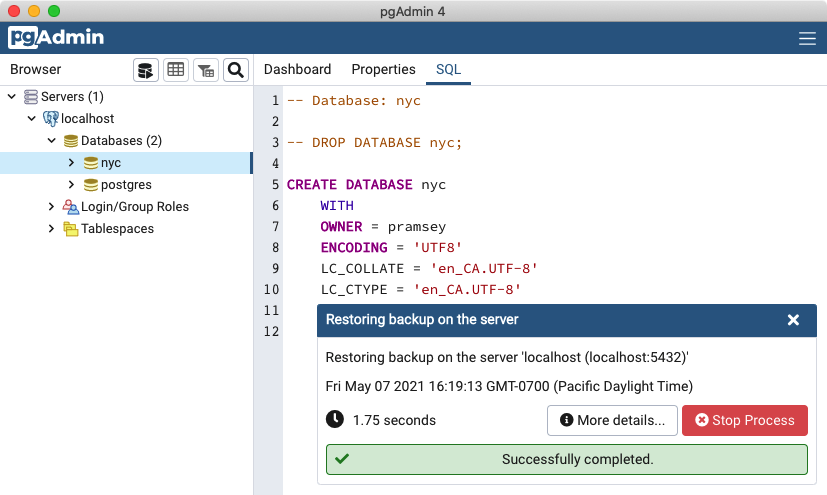
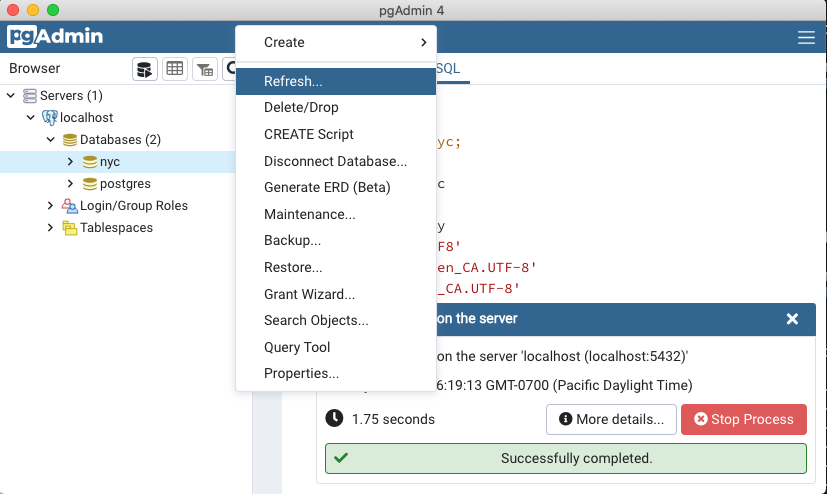
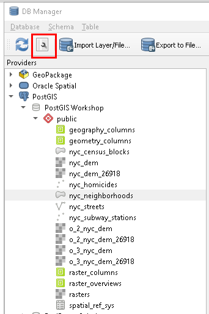

# 5. 공간 데이터 로딩 (Loading spatial data)

> 공식 원문: [<https://postgis.net/workshops/postgis-intro/loading_data.html>](https://postgis.net/workshops/postgis-intro/loading_data.html)\
> 공식 소스의 본문·표·SQL·이미지를 현재 페이지 순서대로 반영했습니다.

다양한 라이브러리와 애플리케이션에서 지원되는 PostGIS는 데이터 로드를 위한 다양한 옵션을 제공합니다.

먼저 데이터베이스 백업 파일에서 작업 데이터를 로드한 다음 일반적인 도구를 사용하여 다양한 GIS 데이터 형식을 로드하는 몇 가지 표준 방법을 검토합니다.

## 백업 파일 로딩

1.  PgAdmin 브라우저에서 **nyc** 데이터베이스 아이콘을 **마우스 오른쪽 버튼으로 클릭**한 다음 **복원...** 옵션을 선택합니다.



2.  워크숍 데이터 데이터 디렉터리(워크숍 [데이터 번들](https://s3.amazonaws.com/s3.cleverelephant.ca/postgis-workshop-2020.zip)에서 사용 가능)의 위치를 ​​찾아 `nyc_data.backup` 파일을 선택합니다.



3.  **복원 옵션** 탭을 클릭하고 **저장하지 않음** 섹션까지 아래로 스크롤한 다음 **Owner**를 **Yes**로 전환합니다.



4.  **Restore** 버튼을 클릭합니다. 데이터베이스 복원은 오류 없이 완료될 때까지 실행되어야 합니다.



5.  로드가 완료되면 **nyc** 데이터베이스를 마우스 오른쪽 버튼으로 클릭하고 **Refresh** 옵션을 선택하여 데이터베이스에 존재하는 테이블에 대한 클라이언트 정보를 업데이트합니다.



> [!NOTE]
> 방금 다룬 PostgreSQL db 백업 파일을 사용하는 대신 기본 공간 형식에서 데이터를 로드하는 연습을 하고 싶다면 다음 몇 섹션에서 다양한 명령줄 도구와 QGIS DbManager를 사용하여 로드하는 방법을 안내할 것입니다. pgAdmin을 사용하여 이미 데이터를 로드한 경우 이 섹션을 건너뛸 수 있습니다.

## ogr2ogr로 로딩하기

`ogr2ogr`는 공통 파일 형식과 공통 공간 데이터베이스를 포함하여 GIS 데이터 형식 간에 데이터를 변환하기 위한 명령줄 유틸리티입니다.

**Windows**:

- ogr2ogr 빌드는 [GIS 내부](https://www.gisinternals.com/release.php)에서 다운로드할 수 있습니다.
- ogr2ogr은 [QGIS 설치](https://qgis.org/en/site/forusers/download.html)의 일부로 포함되어 있으며 OSGeo4W 쉘을 통해 액세스할 수 있습니다.
- ogr2ogr 빌드는 [MS4W](https://ms4w.com/download.html)에서 다운로드할 수 있습니다.

**MacOS**:

- [Postgres.app](https://postgresapp.com/)을 설치한 경우 `/Applications/Postgres.app/Contents/Versions/*/bin` 디렉터리에 `ogr2ogr`가 있습니다.
- 마지막으로 [HomeBrew](https://brew.sh/)를 설치한 경우 **gdal** 패키지를 설치하여 `ogr2ogr`에 액세스할 수 있습니다.

**Linux**:

- 패키지에서 QGIS를 설치한 경우 `ogr2ogr`가 이미 **gdal** 또는 *libgdal*\* 패키지의 일부로 PATH에 설치되어 있어야 합니다.

Postgis 워크샵 데이터 디렉터리에는 2010년 인구 조사 데이터에 의해 폐기된 2000년 인구 조사의 모양 파일이 포함된 `2000/` 하위 디렉터리가 포함되어 있습니다. 백업 파일을 사용하여 이미 로드한 데이터와의 이름 충돌을 피하기 위해 해당 파일을 사용하여 데이터 로드를 연습할 수 있습니다. 다음 지침을 수행할 때 셸이 있는 `2000/` 하위 디렉터리에 있어야 합니다.

    export PGPASSWORD=mydatabasepassword

연결 문자열에 비밀번호를 전달하는 대신 환경에 입력하므로 명령이 실행되는 동안 프로세스 목록에 표시되지 않습니다.

Windows에서는 `export` 대신 `set`를 사용해야 합니다.

:

    ogr2ogr \
      -nln nyc_census_blocks_2000 \
      -nlt PROMOTE_TO_MULTI \
      -lco GEOMETRY_NAME=geom \
      -lco FID=gid \
      -lco PRECISION=NO \
      Pg:"dbname=nyc host=localhost user=pramsey port=5432" \
      nyc_census_blocks_2000.shp

시각적으로 더 명확하게 하기 위해 이러한 줄은 `\`로 표시되지만 셸에서는 한 줄로 작성해야 합니다.

`ogr2ogr`에는 **huge** 수의 옵션이 있으며 여기서는 그 중 소수만 사용합니다. 다음은 명령에 대한 한 줄씩 설명입니다.

    ogr2ogr \

실행 파일 이름! 설정에 따라 실행 파일 위치가 <span class="title-ref">PATH</span>에 있는지 확인하거나 실행 파일의 전체 경로를 사용해야 할 수도 있습니다.

    -nln nyc_census_blocks_2000 \

**nln** 옵션은 "새 레이어 이름"을 의미하며 대상 데이터베이스에 생성될 테이블 이름을 설정합니다.

    -nlt PROMOTE_TO_MULTI \

**nlt** 옵션은 "새 레이어 유형"을 나타냅니다. 특히 모양 파일 입력의 경우 새 레이어 유형은 "다중 부분 기하학"인 경우가 많으므로 기하학 유형에 "다각형" 대신 "다중 다각형"을 사용하도록 시스템에 미리 지시해야 합니다.

    -lco GEOMETRY_NAME=geom \
    -lco FID=gid \
    -lco PRECISION=NO \

**lco** 옵션은 "레이어 생성 옵션"을 나타냅니다. 드라이버마다 생성 옵션이 다르며 여기서는 [PostgreSQL 드라이버](https://gdal.org/drivers/vector/pg.html)에 대해 세 가지 옵션을 사용하고 있습니다.

- **GEOMETRY_NAME**는 기하학 열의 열 이름을 설정합니다. 우리는 테이블이 워크샵의 표준 열 이름과 일치하도록 기본값보다 "geom"을 선호합니다.
- **FID**는 기본 키 열 이름을 설정합니다. 이번에도 우리는 워크숍에서 사용되는 표준인 "gid"를 선호합니다.
- **PRECISION**는 데이터베이스에서 숫자 필드가 표시되는 방식을 제어합니다. 모양 파일을 로드할 때 기본값은 데이터베이스 "숫자" 유형을 사용하는 것입니다. 이 유형은 더 정확하지만 때로는 "정수" 및 "배정밀도"와 같은 단순한 숫자 유형보다 작업하기가 더 어렵습니다. "숫자" 유형을 끄려면 "NO"를 사용합니다.

<!-- -->

    Pg:"dbname=nyc host=localhost user=pramsey port=5432" \

`ogr2ogr`의 인수 순서는 대략적으로 실행 파일, 옵션, **destination** 위치, **소스 위치**입니다. 이것이 PostgreSQL 데이터베이스의 연결 문자열인 대상입니다. "Pg:" 부분은 드라이버 이름이고, [연결 문자열](https://www.postgresql.org/docs/current/libpq-connect.html#LIBPQ-CONNSTRING)은 따옴표 안에 포함됩니다(공백이 포함되어 있을 수 있기 때문).

    nyc_census_blocks_2000.shp

이 경우 소스 데이터 세트는 우리가 읽고 있는 모양 파일입니다. 여기에 연결 문자열을 넣은 다음 레이어 이름 목록을 따라가면 한 번의 호출로 여러 레이어를 읽을 수 있지만 이 경우 로드할 모양 파일은 하나만 있습니다.

## 셰이프파일? 그게 뭐야?

당신은 스스로에게 "이 셰이프파일은 무엇인가?"라고 물을 수도 있습니다. "shapefile"은 일반적으로 `.shp`, `.shx`, `.dbf` 및 공통 접두사 이름(예: nyc_census_blocks)에 기타 확장자가 있는 파일 모음을 나타냅니다. 실제 쉐이프파일은 특히 `.shp` 확장자를 가진 파일과 관련됩니다. 그러나 `.shp` 파일만으로는 필수 지원 파일 없이 배포하기에 불완전합니다.

필수 파일:

- `.shp`—모양 형식; 피쳐 지오메트리 자체
- `.shx`—모양 인덱스 형식; 피쳐 지오메트리의 위치 인덱스
- `.dbf`—속성 형식; dBase III의 각 모양에 대한 열 속성

선택적 파일은 다음과 같습니다.

- `.prj`—프로젝션 형식; 좌표계 및 투영 정보, 잘 알려진 텍스트 형식을 사용하여 투영을 설명하는 일반 텍스트 파일

`shp2pgsql` 유틸리티는 모양 데이터를 이진 데이터에서 데이터베이스에서 실행되어 데이터를 로드하는 일련의 SQL 명령으로 변환하여 PostGIS에서 사용할 수 있도록 만듭니다.

## shp2pgsql로 로딩하기

`shp2pgsql`는 Shape 파일을 SQL로 변환합니다. 이는 PostGIS 코드 베이스의 일부이며 PostGIS 패키지와 함께 제공되는 변환 유틸리티입니다. 컴퓨터에 PostgreSQL을 로컬로 설치한 경우 `shp2pgsql`도 함께 설치되어 있으며 설치의 실행 가능 디렉터리에서 사용할 수 있습니다.

`ogr2ogr`와 달리 `shp2pgsql`는 대상 데이터베이스에 직접 연결하지 않고 입력 모양 파일에 해당하는 SQL을 내보냅니다. "파이프"를 사용하거나 SQL을 파일에 저장한 다음 로드하여 SQL을 데이터베이스에 전달하는 것은 사용자의 몫입니다.

다음은 이전과 동일한 데이터를 로드하는 호출 예시입니다.

    export PGPASSWORD=mydatabasepassword

    shp2pgsql \
      -D \
      -I \
      -s 26918 \
      nyc_census_blocks_2000.shp \
      nyc_census_blocks_2000 \
      | psql dbname=nyc user=postgres host=localhost

다음은 명령에 대한 한 줄씩 설명입니다.

    shp2pgsql \

실행 가능한 프로그램! 소스 데이터 파일을 읽고, 파일로 보내거나 `psql`로 파이프하여 데이터베이스에 직접 로드할 수 있는 SQL을 내보냅니다.

    -D \

**D** 플래그는 기본 "삽입 형식"보다 로드 속도가 훨씬 빠른 "덤프 형식"을 생성하도록 프로그램에 지시합니다.

    -I \

**I** 플래그는 로드가 완료된 후 테이블에 공간 인덱스를 생성하도록 프로그램에 지시합니다.

    -s 26918 \

**s** 플래그는 프로그램에 데이터의 "SRID(공간 참조 식별자)"가 무엇인지 알려줍니다. 이 워크숍의 소스 데이터는 모두 "UTM 18"로 되어 있으며, SRID는 **26918**입니다(아래 참조).

    nyc_census_blocks_2000.shp \

읽을 소스 모양 파일입니다.

    nyc_census_blocks_2000 \

대상 테이블을 생성할 때 사용할 테이블 이름입니다.

    | psql dbname=nyc user=postgres host=localhost

유틸리티 프로그램이 SQL 스트림을 생성 중입니다. "\|" 연산자는 해당 스트림을 가져와 `psql` 데이터베이스 터미널 프로그램에 대한 입력으로 사용합니다. `psql`에 대한 인수는 대상 데이터베이스에 대한 연결 문자열일 뿐입니다.

## SRID 26918? 그게 뭐야?

대부분의 가져오기 프로세스는 설명이 필요하지 않지만 숙련된 GIS 전문가라도 **SRID**를 사용할 수 있습니다.

"SRID"는 "공간 참조 ID"를 나타냅니다. 이는 데이터의 지리 좌표계 및 투영의 모든 매개변수를 정의합니다. SRID는 지도 투영(매우 복잡할 수 있음)에 대한 모든 정보를 단일 숫자로 압축하므로 편리합니다.

온라인 데이터베이스에서 검색하여 워크샵 지도 투영의 정의를 볼 수 있습니다.

- <https://epsg.io/26918>

또는 `spatial_ref_sys` 테이블에 대한 쿼리를 사용하여 PostGIS 내에서 직접 사용할 수 있습니다.

```sql
SELECT srtext FROM spatial_ref_sys WHERE srid = 26918;
```

> [!NOTE]
> PostGIS `spatial_ref_sys` 테이블은 데이터베이스에 알려진 모든 공간 참조 시스템을 정의하는 `OGC` 표준 테이블입니다. PostGIS와 함께 제공되는 데이터에는 3000개 이상의 알려진 공간 참조 시스템과 이들 사이의 변환/재투영에 필요한 세부 정보가 나열되어 있습니다.

두 경우 모두 **26918** 공간 참조 시스템의 텍스트 표현을 볼 수 있습니다(명확성을 위해 여기에 잘 인쇄되어 있음).

    PROJCS["NAD83 / UTM zone 18N",
      GEOGCS["NAD83",
        DATUM["North_American_Datum_1983",
          SPHEROID["GRS 1980",6378137,298.257222101,AUTHORITY["EPSG","7019"]],
          AUTHORITY["EPSG","6269"]],
        PRIMEM["Greenwich",0,AUTHORITY["EPSG","8901"]],
        UNIT["degree",0.01745329251994328,AUTHORITY["EPSG","9122"]],
        AUTHORITY["EPSG","4269"]],
      UNIT["metre",1,AUTHORITY["EPSG","9001"]],
      PROJECTION["Transverse_Mercator"],
      PARAMETER["latitude_of_origin",0],
      PARAMETER["central_meridian",-75],
      PARAMETER["scale_factor",0.9996],
      PARAMETER["false_easting",500000],
      PARAMETER["false_northing",0],
      AUTHORITY["EPSG","26918"],
      AXIS["Easting",EAST],
      AXIS["Northing",NORTH]]

데이터 디렉터리에서 `nyc_neighborhoods.prj` 파일을 열면 동일한 프로젝션 정의가 표시됩니다.

뉴욕시와 같은 지역 기관으로부터 받은 데이터는 일반적으로 "주 평면" 또는 "UTM"으로 표시된 지역 투영에 있습니다. 우리의 예측은 "UTM(Universal Transverse Mercator) North 18 구역" 또는 EPSG:26918입니다.

## 시도해 볼 사항: QGIS를 사용하여 데이터 보기

[QGIS](http://qgis.org)는 데이터를 빠르게 볼 수 있는 데스크톱 GIS 뷰어/편집기입니다. 플랫 쉐이프파일과 PostGIS 데이터베이스를 포함한 다양한 데이터 형식을 볼 수 있습니다. 그래픽 인터페이스를 통해 데이터를 쉽게 탐색할 수 있을 뿐만 아니라 간단한 테스트와 빠른 스타일링이 가능합니다.

이 소프트웨어를 사용하여 PostGIS 데이터베이스를 연결해 보십시오. 애플리케이션은 <https://qgis.org>에서 다운로드할 수 있습니다.

먼저 `Layer->Add Layer->PostGIS Layers->New` 메뉴를 사용하여 PostGIS 데이터베이스에 대한 연결을 생성한 다음 프롬프트를 채우고 싶을 것입니다. 연결이 완료되면 연결을 클릭하고 표시할 테이블을 선택하여 레이어를 추가할 수 있습니다.

## QGIS DbManager를 사용하여 데이터 로드

QGIS에는 PostGIS 지원 데이터베이스를 포함하여 다양한 종류의 데이터베이스에 연결할 수 있게 해주는 [DbManager](https://docs.qgis.org/3.28/en/docs/user_manual/plugins/core_plugins/plugins_db_manager.html#dbmanager)라는 도구가 함께 제공됩니다. PostGIS 데이터베이스 연결을 구성한 후 `Database->DbManager`로 이동하여 아래와 같이 데이터베이스를 확장합니다.

> 

여기에서 `Import Layer/File` 메뉴 옵션을 사용하여 다양한 공간 형식을 로드할 수 있습니다. 다양한 공간 형식의 데이터를 로드하고 다양한 형식으로 데이터를 내보낼 수 있을 뿐만 아니라 강조 표시된 렌치 아이콘을 사용하여 캔버스에 임시 쿼리를 추가하거나 데이터베이스에서 뷰를 정의할 수도 있습니다.


---

[← 이전](04_creating_db.md) · [목차](00_index.md) · [다음 →](06_about_data.md)