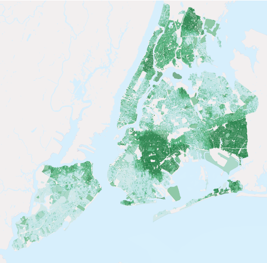
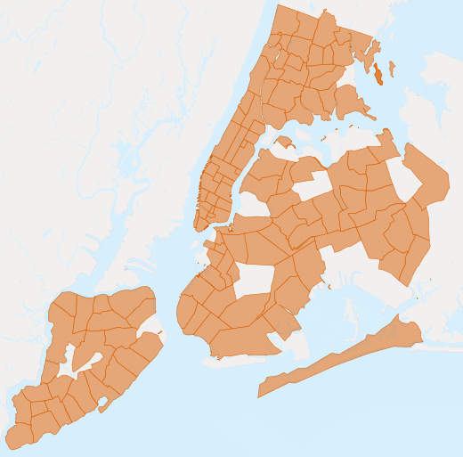
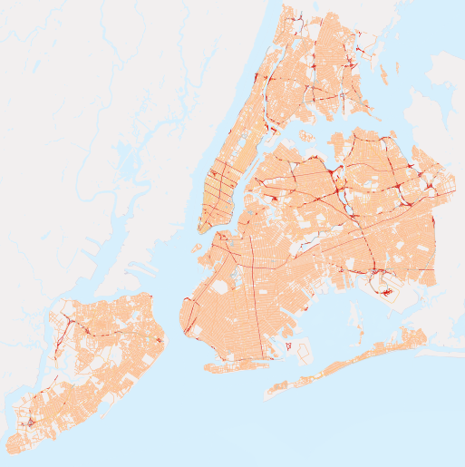
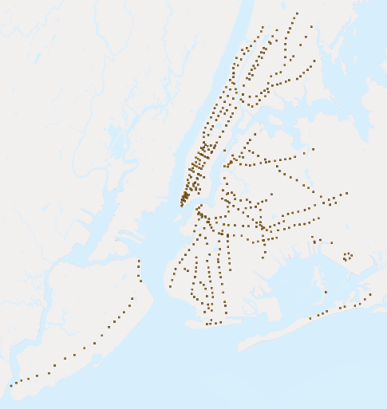

# 6. 실습 데이터 소개 (About our data)

> 공식 원문: [<https://postgis.net/workshops/postgis-intro/about_data.html>](https://postgis.net/workshops/postgis-intro/about_data.html)\
> 공식 소스의 본문·표·SQL·이미지를 현재 페이지 순서대로 반영했습니다.

이 워크숍의 데이터는 뉴욕시 셰이프파일 4개와 사회인구학적 변수로 구성된 속성 테이블 1개입니다. 셰이프파일은 이미 PostGIS 테이블로 불러왔으며, 사회인구학적 데이터는 뒤에서 추가합니다.

다음은 각 데이터세트의 레코드 수와 테이블 속성을 설명합니다. 이러한 속성 값과 관계는 향후 분석의 기본입니다.

pgAdmin에서 테이블의 특성을 탐색하려면 강조 표시된 테이블을 마우스 오른쪽 버튼으로 클릭하고 **Properties**를 선택합니다. **Columns** 탭 내에서 테이블 속성 목록을 포함하여 테이블 속성 요약을 찾을 수 있습니다.

## nyc_census_blocks

인구 조사 블록은 인구 조사 데이터가 보고되는 가장 작은 지역입니다. 모든 상위 인구 조사 지역(블록 그룹, 지역, 대도시 지역, 카운티 등)은 인구 조사 블록의 통합으로 구축될 수 있습니다. 우리는 블록 컬렉션에 일부 인구 통계 데이터를 첨부했습니다.

레코드 수: 38794

|  |  |
|----|----|
| **blkid** | 모든 인구 조사 **block**를 고유하게 식별하는 15자리 코드입니다. 예: 360050001009000 |
| **popn_total** | 인구 조사 블록의 총 인원 수 |
| **popn_white** | 해당 블록에서 자신을 "백인"으로 식별하는 사람의 수 |
| **popn_black** | 해당 블록에서 자신을 "흑인"으로 식별하는 사람의 수 |
| **popn_nativ** | 해당 블록에서 "미국 원주민"이라고 스스로 식별하는 사람의 수 |
| **popn_asian** | 해당 블록에서 스스로를 "아시아인"으로 식별하는 사람의 수 |
| **popn_other** | 블록의 다른 카테고리로 스스로 식별되는 사람의 수 |
| **boroname** | 뉴욕 자치구의 이름입니다. 맨해튼, 브롱크스, 브루클린, 스태튼 아일랜드, 퀸즈 |
| **geom** | 블록의 다각형 경계 |

*총 인구 대비 흑인 인구 비율*

> [!NOTE]
> 인구 조사 데이터를 GIS로 가져오려면 실제 데이터(텍스트)와 경계 파일(공간)이라는 두 가지 정보를 결합해야 합니다. 인구조사국의 [American FactFinder](http://factfinder.census.gov)에서 데이터 및 경계를 다운로드하는 것을 포함하여 데이터를 얻는 방법에는 여러 가지가 있습니다.

## nyc_neighborhoods

뉴욕은 지역 이름과 범위에 대한 풍부한 역사를 가지고 있습니다. 이웃은 정부가 정한 선을 따르지 않는 사회적 구성물입니다. 예를 들어, Carroll Gardens, Red Hook 및 Cobble Hill의 브루클린 지역은 한때 "사우스 브루클린"으로 통칭되었습니다. 이제 어떤 부동산 중개인과 대화하느냐에 따라 이전에 Red-Hook로 알려졌던 동네의 동일한 4개 블록이 Columbia Heights, Carroll Gardens West 또는 Red Hook으로 불릴 수 있습니다!

레코드 수: 129

|  |  |
|----|----|
| **name** | 동네 이름 |
| **boroname** | 뉴욕 자치구의 이름입니다. 맨해튼, 브롱크스, 브루클린, 스태튼 아일랜드, 퀸즈 |
| **geom** | 동네의 다각형 경계 |

*뉴욕시의 이웃 지역*

## nyc_streets

거리 중심선은 도시의 교통 네트워크를 형성합니다. 이러한 거리에는 뒷골목, 간선 도로, 고속도로 및 작은 거리와 같은 도로를 구별하기 위해 유형이 표시되어 있습니다. 살기에 바람직한 지역은 고속도로 옆이 아닌 주택가 거리에 있을 수 있습니다.

레코드 수: 19091

|            |                                             |
|------------|---------------------------------------------|
| **name**   | 거리 이름                                   |
| **oneway** | 길은 일방통행인가요? "예" = 예, "" = 아니오 |
| **type**   | 도로 유형(1차, 2차, 주거용, 고속도로)       |
| **geom**   | 거리의 선형 중심선                          |

*뉴욕시의 도로망. 주요 도로는 빨간색으로 표시된다.*

## nyc_subway_stations

지하철 역은 사람들이 살고 있는 상위 세계와 지하의 보이지 않는 지하철 네트워크를 연결합니다. 대중 교통 시스템의 입구로서 역 위치는 다양한 사람들이 지하철 시스템에 얼마나 쉽게 진입할 수 있는지 결정하는 데 도움이 됩니다.

레코드 수: 491

|  |  |
|----|----|
| **name** | 역명 |
| **borough** | 뉴욕 자치구의 이름입니다. 맨해튼, 브롱크스, 브루클린, 스태튼 아일랜드, 퀸즈 |
| **routes** | 이 역을 통과하는 지하철 노선 |
| **transfers** | 이 역에서 환승할 수 있는 노선 |
| **express** | 급행 열차가 정차하는 역, "급행" = 예, "" = 아니오 |
| **geom** | 역의 지점 위치 |

*뉴욕시 지하철역의 포인트 위치*

## nyc_census_sociodata

인구 조사 과정에서 수집된 풍부한 사회 경제적 데이터 모음이 있지만 인구 조사 지역의 더 넓은 지리 수준에서만 수집됩니다. 인구 조사 블록은 결합되어 인구 조사 지역(및 블록 그룹)을 형성합니다. 우리는 뉴욕시에 관한 더 흥미로운 질문에 답하기 위해 인구 조사 지역 수준에서 사회 경제적 정보를 수집했습니다.

> [!NOTE]
> `nyc_census_sociodata`는 데이터 테이블입니다. 공간 분석을 수행하기 전에 이를 인구 조사 지역에 연결해야 합니다.
>
> 이 항목은 공간 경계가 없는 속성 테이블이며, 공식 원문에도 별도 이미지가 제공되지 않습니다.

|  |  |
|----|----|
| **tractid** | 모든 인구조사 **tract**를 고유하게 식별하는 11자리 코드입니다. ("36005000100") |
| **transit_total** | 지역 근로자 수 |
| **transit_private** | 자가용/오토바이를 이용하는 지역 근로자 수 |
| **transit_public** | 대중교통을 이용하는 지역 근로자 수 |
| **transit_walk** | 걷는 지역의 근로자 수 |
| **transit_other** | 걷기/자전거 타기 등 다른 형태를 사용하는 지역 내 근로자 수 |
| **transit_none** | 재택근무를 하는 지역 근로자 수 |
| **transit_time_mins** | 해당 지역의 모든 작업자가 이동하는 데 소요한 총 시간(분) |
| **family_count** | 전도지의 가족 수 |
| **family_income_median** | 지역 중위 가구 소득(달러) |
| **family_income_mean** | 해당 지역의 평균 가족 소득(달러) |
| **family_income_aggregate** | 해당 지역에 있는 모든 가족의 총 소득(달러) |
| **edu_total** | 학력 보유자 수 |
| **edu_no_highschool_dipl** | 고등학교 졸업장이 없는 사람 수 |
| **edu_highschool_dipl** | 고등학교 졸업자 및 추가 교육을 받지 않은 사람의 수 |
| **edu_college_dipl** | 대학 졸업장을 보유하고 추가 교육을 받지 않은 사람의 수 |
| **edu_graduate_dipl** | 대학원 졸업자 수 |

---

[← 이전](05_loading_data.md) · [목차](00_index.md) · [다음 →](07_simple_sql.md)
