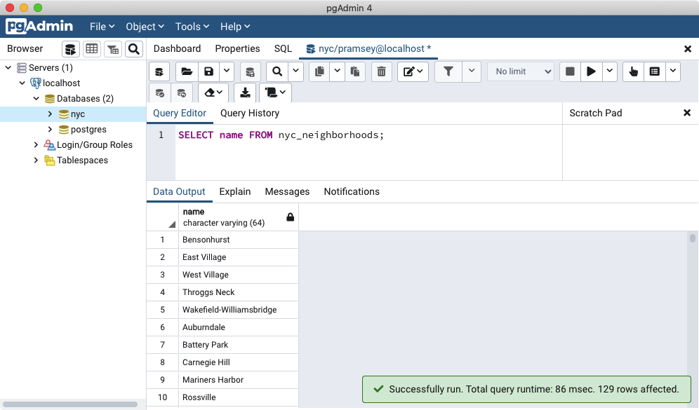

# 7. 단순 SQL (Simple SQL)

> 공식 원문: [<https://postgis.net/workshops/postgis-intro/simple_sql.html>](https://postgis.net/workshops/postgis-intro/simple_sql.html)\
> 공식 소스의 본문·표·SQL·이미지를 현재 페이지 순서대로 반영했습니다.

`SQL` 또는 "구조적 쿼리 언어"는 관계형 데이터베이스에 대해 질문하고 데이터를 업데이트하는 수단입니다. 첫 번째 데이터베이스를 만들 때 이미 SQL을 보았습니다. 상기하다:

```sql
SELECT postgis_full_version();
```

하지만 그것은 데이터베이스에 관한 질문이었습니다. 이제 데이터베이스에 데이터를 로드했으므로 SQL을 사용하여 데이터에 대해 질문해 보겠습니다. 예를 들어,

> "뉴욕 시의 모든 동네 이름은 무엇입니까?"

"쿼리 도구" 버튼을 클릭하여 pgAdmin에서 SQL 쿼리 창을 엽니다.


그런 다음 쿼리 창에 다음 쿼리를 입력합니다.

```sql
SELECT name FROM nyc_neighborhoods;
```

**Execute Query** 버튼(녹색 삼각형)을 클릭합니다.


쿼리는 몇(밀리)초 동안 실행되고 129개의 결과를 반환합니다.



그런데 여기서 정확히 무슨 일이 일어났나요? 이해를 돕기 위해 SQL의 네 가지 "동사"부터 시작하겠습니다.

- `SELECT`, 쿼리에 대한 응답으로 행을 반환합니다.
- `INSERT`, 테이블에 새 행 추가
- `UPDATE`, 테이블의 기존 행을 변경합니다.
- `DELETE`, 테이블에서 행을 제거합니다.

우리는 공간 함수를 사용하여 테이블에 질문하기 위해 거의 독점적으로 `SELECT`로 작업할 것입니다.

## SELECT 쿼리

선택 쿼리의 형식은 일반적으로 다음과 같습니다.

    SELECT some_columns FROM some_data_source WHERE some_condition;

> [!NOTE]
> 모든 `SELECT` 매개변수의 개요는 [PostgresSQL 문서](http://www.postgresql.org/docs/current/interactive/sql-select.html)를 참조하세요.

`some_columns`는 열 이름이거나 열 값의 함수입니다. `some_data_source`는 단일 테이블이거나 키 또는 조건에 대해 두 테이블을 조인하여 생성된 복합 테이블입니다. `some_condition`는 반환할 행 수를 제한하는 필터입니다.

> "브루클린에 있는 모든 동네의 이름은 무엇입니까?"

필터를 손에 들고 `nyc_neighborhoods` 테이블로 돌아갑니다. 테이블에는 뉴욕의 모든 동네가 포함되어 있지만 우리는 브루클린의 동네만 원합니다.

```sql
SELECT name
  FROM nyc_neighborhoods
  WHERE boroname = 'Brooklyn';
```

쿼리는 훨씬 더 짧은(밀리)초 동안 실행되고 23개의 결과를 반환합니다.

때로는 쿼리 결과에 함수를 적용해야 할 때도 있습니다. 예를 들어,

> "브루클린의 모든 동네 이름은 몇 글자인가요?"

다행히 PostgreSQL에는 `char_length(string)`라는 문자열 길이 함수가 있습니다.

```sql
SELECT char_length(name)
  FROM nyc_neighborhoods
  WHERE boroname = 'Brooklyn';
```

종종 우리는 개별 행보다 모든 행에 적용되는 통계에 관심이 덜합니다. 따라서 동네 이름의 길이를 아는 것은 이름의 평균 길이를 아는 것보다 덜 흥미롭습니다. 여러 행을 가져와 단일 결과를 반환하는 함수를 "집계" 함수라고 합니다.

PostgreSQL에는 평균값을 위한 범용 `avg()`와 표준편차를 위한 `stddev()`를 포함한 일련의 내장 집계 함수가 있습니다.

> "브루클린 전체 동네 이름의 평균 글자 수와 글자 수의 표준편차는 얼마인가요?"

```sql
SELECT avg(char_length(name)), stddev(char_length(name))
  FROM nyc_neighborhoods
  WHERE boroname = 'Brooklyn';
```

    avg         |       stddev
    ---------------------+--------------------
    11.7391304347826087 | 3.9105613559407395

마지막 예의 집계 함수는 결과 집합의 모든 행에 적용되었습니다. 전체 결과 집합 내에서 더 작은 그룹에 대해 요약을 수행하려면 어떻게 해야 합니까? 이를 위해 `GROUP BY` 절을 추가합니다. 집계 함수에는 하나 이상의 열로 결과 집합을 그룹화하기 위해 추가된 `GROUP BY` 문이 필요한 경우가 많습니다.

> "자치구에서 보고한 뉴욕시 전체 동네 이름의 평균 문자 수는 얼마입니까?"

```sql
SELECT boroname, avg(char_length(name)), stddev(char_length(name))
  FROM nyc_neighborhoods
  GROUP BY boroname;
```

어떤 통계가 어느 자치구에 적용되는지 확인할 수 있도록 출력 결과에 `boroname` 열을 포함합니다. 집계 쿼리에서는 (a) 그룹화 절의 멤버이거나 (b) 집계 함수인 열만 출력할 수 있습니다.

    boroname    |         avg         |       stddev
    ---------------+---------------------+--------------------
    Brooklyn      | 11.7391304347826087 | 3.9105613559407395
    Manhattan     | 11.8214285714285714 | 4.3123729948325257
    The Bronx     | 12.0416666666666667 | 3.6651017740975152
    Queens        | 11.6666666666666667 | 5.0057438272815975
    Staten Island | 12.2916666666666667 | 5.2043390480959474

## 기능 목록

[avg(expression)](http://www.postgresql.org/docs/current/static/functions-aggregate.html#FUNCTIONS-AGGREGATE-TABLE): 숫자 열의 평균 값을 반환하는 PostgreSQL 집계 함수입니다.

[char_length(string)](http://www.postgresql.org/docs/current/static/functions-string.html): 문자열의 문자 수를 반환하는 PostgreSQL 문자열 함수입니다.

[stddev(expression)](http://www.postgresql.org/docs/current/static/functions-aggregate.html#FUNCTIONS-AGGREGATE-STATISTICS-TABLE): 입력 값의 표준 편차를 반환하는 PostgreSQL 집계 함수입니다.


---

[← 이전](06_about_data.md) · [목차](00_index.md) · [다음 →](08_simple_sql_exercises.md)