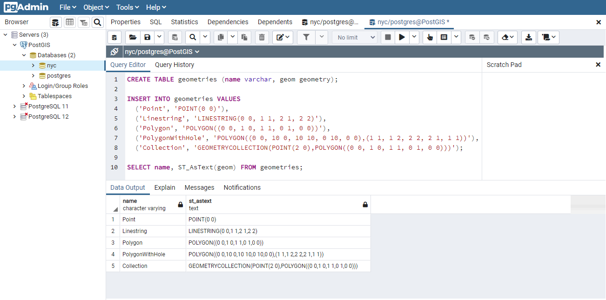
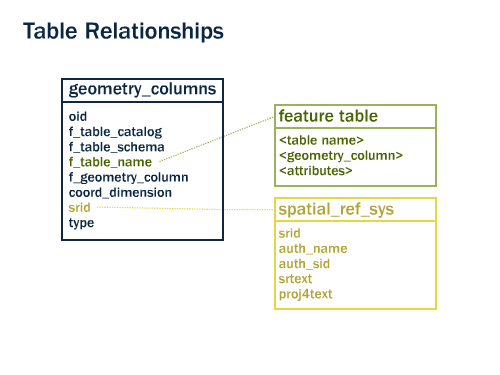
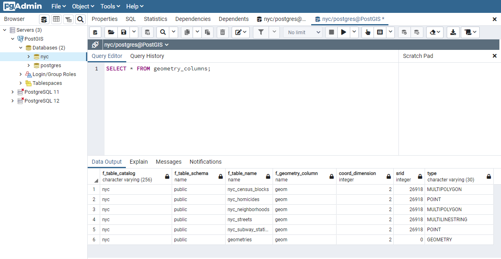
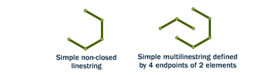
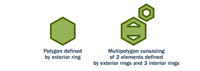
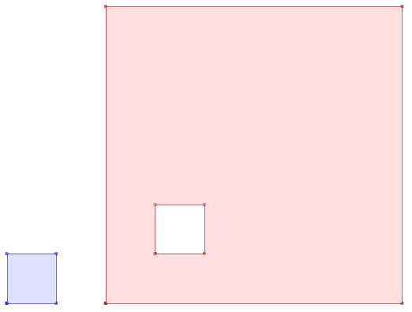
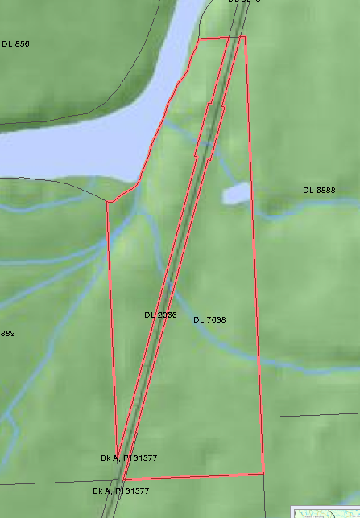
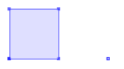

# 9. 지오메트리 (Geometries)

> 공식 원문: [<https://postgis.net/workshops/postgis-intro/geometries.html>](https://postgis.net/workshops/postgis-intro/geometries.html)\
> 공식 소스의 본문·표·SQL·이미지를 현재 페이지 순서대로 반영했습니다.

## 지오메트리 기초 실습

앞서 [5장. 공간 데이터 불러오기](05_loading_data.md)에서는 이미 준비된 데이터 세트를 불러왔습니다. 이번에는 지오메트리 객체가 데이터베이스 내부에서 어떻게 표현되고 작동하는지 직접 테이블을 만들며 살펴보겠습니다.

pgAdmin에서 **nyc** 데이터베이스의 쿼리 도구를 열고 다음 SQL을 실행합니다.

```sql
CREATE TABLE geometries (name varchar, geom geometry);

INSERT INTO geometries VALUES
  ('Point', 'POINT(0 0)'),
  ('Linestring', 'LINESTRING(0 0, 1 1, 2 1, 2 2)'),
  ('Polygon', 'POLYGON((0 0, 1 0, 1 1, 0 1, 0 0))'),
  ('PolygonWithHole', 'POLYGON((0 0, 10 0, 10 10, 0 10, 0 0),(1 1, 1 2, 2 2, 2 1, 1 1))'),
  ('Collection', 'GEOMETRYCOLLECTION(POINT(2 0),POLYGON((0 0, 1 0, 1 1, 0 1, 0 0)))');

SELECT name, ST_AsText(geom) FROM geometries;
```



위 예제는 `geometries`라는 테이블을 생성하고 포인트(Point), 라인스트링(LineString), 폴리곤(Polygon), 구멍(Hole)이 있는 폴리곤, 지오메트리 컬렉션(GeometryCollection) 등 5가지 기본 공간 객체를 삽입한 뒤, 텍스트 형태(WKT)로 조회한 결과입니다.

---

## 메타데이터 테이블 (Metadata Tables)

OGC의 `SFSQL`(Simple Features for SQL) 규격에 따라, PostGIS는 데이터베이스 내의 공간 컬럼과 좌표계를 체계적으로 추적하고 관리하기 위한 두 개의 핵심 메타데이터 테이블(뷰)을 제공합니다.

1. `spatial_ref_sys`: 데이터베이스가 지원하는 모든 공간 참조 체계(SRS/좌표계)의 정의가 등록된 테이블입니다.
2. `geometry_columns`: 데이터베이스 내의 모든 지오메트리 컬럼과 해당 컬럼의 타입, 차원, SRID 메타데이터를 일목요연하게 보여주는 표준 뷰(View)입니다.



`geometry_columns` 뷰를 조회해 보겠습니다.

```sql
SELECT * FROM geometry_columns;
```



### geometry_columns의 주요 컬럼
- `f_table_schema`, `f_table_name`: 공간 컬럼을 보유한 테이블의 스키마와 테이블명입니다.
- `f_geometry_column`: 해당 테이블에서 지오메트리를 저장하는 컬럼의 이름입니다.
- `coord_dimension`: 지오메트리의 좌표 차원 수(2차원, 3차원, 4차원)입니다.
- `srid`: 해당 컬럼에 적용된 공간 참조 식별자(SRID)로, `spatial_ref_sys` 테이블의 `srid`를 참조합니다.
- `type`: 지오메트리의 공간 타입(Point, LineString, Polygon, MultiPoint 등)입니다.

GIS 클라이언트(QGIS 등)나 공간 라이브러리는 테이블 전체를 일일이 스캔하지 않고도 `geometry_columns` 메타데이터를 조회하여 어떤 좌표계와 지오메트리 타입이 들어있는지 즉시 파악하고 최적의 렌더링 및 분석을 수행할 수 있습니다.

> [!NOTE]
> 만약 특정 테이블의 지오메트리 컬럼에 SRID가 지정되어 있지 않다면 다음과 같이 `ALTER TABLE` 문과 `ST_SetSRID` 함수로 SRID를 명시적으로 설정할 수 있습니다.
>
> ```sql
> ALTER TABLE nyc_neighborhoods
>   ALTER COLUMN geom
>   TYPE Geometry(MultiPolygon, 26918)
>   USING ST_SetSRID(geom, 26918);
> ```

---

## 지오메트리 메타데이터 함수

지오메트리 객체의 타입, 차원, SRID 정보는 내장 함수를 통해 언제든지 조회할 수 있습니다.

- `ST_GeometryType(geometry)`: 지오메트리의 OGC 타입 명칭(예: `ST_Point`, `ST_Polygon`)을 반환합니다.
- `ST_NDims(geometry)`: 좌표의 차원 수(2, 3, 4)를 반환합니다.
- `ST_SRID(geometry)`: 지오메트리에 설정된 SRID 정수 번호를 반환합니다.

```sql
SELECT name, ST_GeometryType(geom), ST_NDims(geom), ST_SRID(geom)
  FROM geometries;
```

```text
      name       |    st_geometrytype    | st_ndims | st_srid
-----------------+-----------------------+----------+---------
 Point           | ST_Point              |        2 |       0
 Polygon         | ST_Polygon            |        2 |       0
 PolygonWithHole | ST_Polygon            |        2 |       0
 Collection      | ST_GeometryCollection |        2 |       0
 Linestring      | ST_LineString         |        2 |       0
```

---

## 주요 지오메트리 타입 (Geometry Types)

### 1. 포인트 (Point)


**포인트(Point)**는 공간상의 단일 위치(X, Y 좌표)를 나타냅니다. 도시 축척에서 지하철역, 건물 위치, 버스 정류장 등 크기나 형태보다는 위치 자체가 중요한 객체를 표현할 때 사용됩니다.

```sql
SELECT ST_AsText(geom)
  FROM geometries
  WHERE name = 'Point';
```

```text
POINT(0 0)
```

#### 포인트 관련 주요 함수
- `ST_X(geometry)`: 포인트의 X 좌표(경도 또는 동향 좌표)를 반환합니다.
- `ST_Y(geometry)`: 포인트의 Y 좌표(위도 또는 북향 좌표)를 반환합니다.

```sql
SELECT ST_X(geom), ST_Y(geom)
  FROM geometries
  WHERE name = 'Point';
```

---

### 2. 라인스트링 (LineString)



**라인스트링(LineString)**은 2개 이상의 연속된 점(정점, Vertices)으로 이루어진 선형 경로입니다. 도로망, 하천, 철도 등을 표현할 때 주로 사용됩니다.
시작점과 끝점이 같은 라인스트링을 **닫힌 선(Closed)**이라고 하며, 자기 자신과 교차하지 않는 선을 **단순 선(Simple)**이라고 합니다.

```sql
SELECT ST_AsText(geom)
  FROM geometries
  WHERE name = 'Linestring';
```

```text
LINESTRING(0 0, 1 1, 2 1, 2 2)
```

#### 라인스트링 관련 주요 함수
- `ST_Length(geometry)`: 선의 2차원 길이를 반환합니다.
- `ST_StartPoint(geometry)`: 선의 시작점을 포인트(Point)로 반환합니다.
- `ST_EndPoint(geometry)`: 선의 끝점을 포인트(Point)로 반환합니다.
- `ST_NPoints(geometry)`: 선을 구성하는 정점(Point)의 총 개수를 반환합니다.

```sql
SELECT ST_Length(geom)
  FROM geometries
  WHERE name = 'Linestring';
```

```text
3.41421356237309
```

---

### 3. 폴리곤 (Polygon / 다각형)



**폴리곤(Polygon)**은 2차원 면적(영역)을 표현합니다. 폴리곤의 외곽 경계선은 닫혀 있고 단순한 형태의 링(Exterior Ring)으로 정의되며, 내부에 도넛 형태의 구멍(Interior Ring / Hole)을 가질 수 있습니다. 행정구역 경계, 공원, 건물 외곽선, 호수 등을 모델링할 때 사용됩니다.

```sql
SELECT name, ST_AsText(geom)
  FROM geometries
  WHERE name LIKE 'Polygon%';
```

```text
      name       |                                 st_astext
-----------------+---------------------------------------------------------------------------
 Polygon         | POLYGON((0 0, 1 0, 1 1, 0 1, 0 0))
 PolygonWithHole | POLYGON((0 0, 10 0, 10 10, 0 10, 0 0),(1 1, 1 2, 2 2, 2 1, 1 1))
```



#### 폴리곤 관련 주요 함수
- `ST_Area(geometry)`: 폴리곤의 면적을 계산합니다.
- `ST_NRings(geometry)`: 폴리곤을 구성하는 링(외곽 링 + 내부 구멍 링)의 총 개수를 반환합니다.
- `ST_ExteriorRing(geometry)`: 외곽 경계 링을 라인스트링으로 반환합니다.
- `ST_InteriorRingN(geometry, n)`: n번째 내부 구멍 링을 라인스트링으로 반환합니다.
- `ST_Perimeter(geometry)`: 외곽 및 내부 모든 링의 둘레 길이 합계를 반환합니다.

```sql
SELECT name, ST_Area(geom)
  FROM geometries
  WHERE name LIKE 'Polygon%';
```

```text
      name       | st_area
-----------------+---------
 Polygon         |       1
 PolygonWithHole |      99
```

> [!NOTE]
> 구멍이 있는 폴리곤의 면적(99)은 외곽 링 면적(10×10 = 100)에서 내부 구멍 링 면적(1×1 = 1)을 뺀 결과입니다.

---

### 4. 멀티 지오메트리 및 컬렉션 (Collections)

단일 지오메트리 여러 개를 하나의 데이터베이스 레코드로 묶어 다루는 4가지 컬렉션 타입이 있습니다.

- **MultiPoint**: 여러 개의 점으로 이루어진 포인트 집합
- **MultiLineString**: 여러 개의 선으로 이루어진 선 집합
- **MultiPolygon**: 여러 개의 면으로 이루어진 다각형 집합 (예: 여러 섬으로 구성된 하와이주 영토, 도로로 양분된 토지 필지)
- **GeometryCollection**: 점, 선, 면 등 서로 다른 지오메트리 타입을 혼합하여 담을 수 있는 이종 컬렉션



```sql
SELECT name, ST_AsText(geom)
  FROM geometries
  WHERE name = 'Collection';
```

```text
GEOMETRYCOLLECTION(POINT(2 0),POLYGON((0 0, 1 0, 1 1, 0 1, 0 0)))
```



#### 컬렉션 관련 주요 함수
- `ST_NumGeometries(geometry)`: 컬렉션 내의 구성 지오메트리 개수를 반환합니다.
- `ST_GeometryN(geometry, n)`: 컬렉션 내의 n번째 지오메트리를 추출하여 반환합니다 (1-based index).
- `ST_Area(geometry)`: 컬렉션 내 모든 폴리곤 요소의 면적 합계를 반환합니다.
- `ST_Length(geometry)`: 컬렉션 내 모든 라인스트링 요소의 길이 합계를 반환합니다.

---

## 지오메트리 입출력 포맷 (I/O Formats)

PostGIS는 내부적으로 고성능 디스크 저장을 위해 최적화된 경량 바이너리 포맷을 사용합니다. 외부 응용 프로그램과의 상호 작용을 위해 다양한 표준 텍스트 및 바이너리 포맷으로 지오메트리를 출력하거나 파싱하여 생성할 수 있습니다.

- **WKT (Well-Known Text)**
  - `ST_GeomFromText(text, srid)` ➔ `geometry`
  - `ST_AsText(geometry)` ➔ `text`
  - `ST_AsEWKT(geometry)` ➔ `text` (SRID 및 3D/4D Z, M 좌표 포함)
- **WKB (Well-Known Binary)**
  - `ST_GeomFromWKB(bytea)` ➔ `geometry`
  - `ST_AsBinary(geometry)` ➔ `bytea`
  - `ST_AsEWKB(geometry)` ➔ `bytea`
- **GML (Geography Markup Language)**
  - `ST_GeomFromGML(text)` ➔ `geometry`
  - `ST_AsGML(geometry)` ➔ `text`
- **KML (Keyhole Markup Language)**
  - `ST_GeomFromKML(text)` ➔ `geometry`
  - `ST_AsKML(geometry)` ➔ `text`
- **GeoJSON**
  - `ST_GeomFromGeoJSON(text)` ➔ `geometry`
  - `ST_AsGeoJSON(geometry)` ➔ `text`
- **SVG (Scalable Vector Graphics)**
  - `ST_AsSVG(geometry)` ➔ `text`

### 지오메트리 생성자 (Constructors) 활용 예시

```sql
-- SRID를 파라미터로 지정하여 WKT에서 지오메트리 생성
SELECT ST_GeomFromText('POINT(2 2)', 4326);

-- WKT 변환 후 ST_SetSRID로 SRID 부여
SELECT ST_SetSRID(ST_GeomFromText('POINT(2 2)'), 4326);

-- 전용 생성 함수 ST_MakePoint 사용
SELECT ST_SetSRID(ST_MakePoint(2, 2), 4326);

-- PostgreSQL 타입 캐스팅(::geometry) 사용
SELECT ST_SetSRID('POINT(2 2)'::geometry, 4326);

-- PostGIS 확장 EWKT 문법을 활용한 캐스팅
SELECT 'SRID=4326;POINT(2 2)'::geometry;
```

---

## 함수 목록 (Function List)

- [ST_Area](http://postgis.net/docs/ST_Area.html): 폴리곤 또는 멀티폴리곤 지오메트리의 2차원 면적을 반환합니다 (지오메트리는 좌표계 투영 단위, 지오그래피는 제곱미터 단위).
- [ST_AsBinary](http://postgis.net/docs/ST_AsBinary.html): 지오메트리를 OGC 표준 WKB(Well-Known Binary) 바이너리로 반환합니다.
- [ST_AsEWKB](http://postgis.net/docs/ST_AsEWKB.html): SRID와 좌표 차원 정보가 포함된 PostGIS 확장 EWKB 바이너리로 반환합니다.
- [ST_AsEWKT](http://postgis.net/docs/ST_AsEWKT.html): SRID와 좌표 차원 정보가 포함된 PostGIS 확장 EWKT 텍스트로 반환합니다.
- [ST_AsGeoJSON](http://postgis.net/docs/ST_AsGeoJSON.html): 지오메트리를 표준 GeoJSON 문자열로 반환합니다.
- [ST_AsGML](http://postgis.net/docs/ST_AsGML.html): 지오메트리를 GML(Geography Markup Language) XML 문자열로 반환합니다.
- [ST_AsKML](http://postgis.net/docs/ST_AsKML.html): 지오메트리를 KML(Keyhole Markup Language) XML 문자열로 반환합니다.
- [ST_AsSVG](http://postgis.net/docs/ST_AsSVG.html): 지오메트리를 SVG 패스(Path Data) 문자열로 반환합니다.
- [ST_AsText](http://postgis.net/docs/ST_AsText.html): 지오메트리를 OGC 표준 WKT(Well-Known Text) 문자열로 반환합니다.
- [ST_EndPoint](http://postgis.net/docs/ST_EndPoint.html): 라인스트링의 마지막 끝점을 포인트(Point)로 반환합니다.
- [ST_ExteriorRing](http://postgis.net/docs/ST_ExteriorRing.html): 폴리곤의 외곽 경계 링을 라인스트링으로 반환합니다.
- [ST_GeometryN](http://postgis.net/docs/ST_GeometryN.html): 멀티 지오메트리 또는 컬렉션에서 1부터 시작하는 n번째 지오메트리를 반환합니다.
- [ST_GeometryType](http://postgis.net/docs/ST_GeometryType.html): 지오메트리의 OGC 타입 명칭(`ST_Point`, `ST_LineString` 등)을 반환합니다.
- [ST_GeomFromGML](http://postgis.net/docs/ST_GeomFromGML.html): GML 문자열을 파싱하여 PostGIS 지오메트리 객체를 생성합니다.
- [ST_GeomFromKML](http://postgis.net/docs/ST_GeomFromKML.html): KML 문자열을 파싱하여 PostGIS 지오메트리 객체를 생성합니다.
- [ST_GeomFromText](http://postgis.net/docs/ST_GeomFromText.html): WKT 문자열과 선택적 SRID로부터 지오메트리 객체를 생성합니다.
- [ST_GeomFromWKB](http://postgis.net/docs/ST_GeomFromWKB.html): WKB 바이너리와 선택적 SRID로부터 지오메트리 객체를 생성합니다.
- [ST_InteriorRingN](http://postgis.net/docs/ST_InteriorRingN.html): 폴리곤의 n번째 내부 구멍 링을 라인스트링으로 반환합니다.
- [ST_Length](http://postgis.net/docs/ST_Length.html): 라인스트링 또는 멀티라인스트링의 2차원 길이를 반환합니다.
- [ST_NDims](http://postgis.net/docs/ST_NDims.html): 지오메트리의 좌표 차원 수(2, 3, 4)를 반환합니다.
- [ST_NPoints](http://postgis.net/docs/ST_NPoints.html): 지오메트리를 구성하는 총 정점(포인트) 개수를 반환합니다.
- [ST_NRings](http://postgis.net/docs/ST_NRings.html): 폴리곤을 구성하는 총 링의 개수를 반환합니다.
- [ST_NumGeometries](http://postgis.net/docs/ST_NumGeometries.html): 컬렉션 또는 멀티 지오메트리 내 구성 요소의 개수를 반환합니다.
- [ST_Perimeter](http://postgis.net/docs/ST_Perimeter.html): 폴리곤 또는 멀티폴리곤 외곽 및 내부 경계선의 총 둘레 길이를 반환합니다.
- [ST_SRID](http://postgis.net/docs/ST_SRID.html): 지오메트리에 설정된 공간 참조 식별자(SRID) 정수 번호를 반환합니다.
- [ST_StartPoint](http://postgis.net/docs/ST_StartPoint.html): 라인스트링의 첫 번째 시작점을 포인트(Point)로 반환합니다.
- [ST_X](http://postgis.net/docs/ST_X.html): 포인트 지오메트리의 X 좌표를 반환합니다.
- [ST_Y](http://postgis.net/docs/ST_Y.html): 포인트 지오메트리의 Y 좌표를 반환합니다.


---

[← 이전](08_simple_sql_exercises.md) · [목차](00_index.md) · [다음 →](10_geometries_exercises.md)
