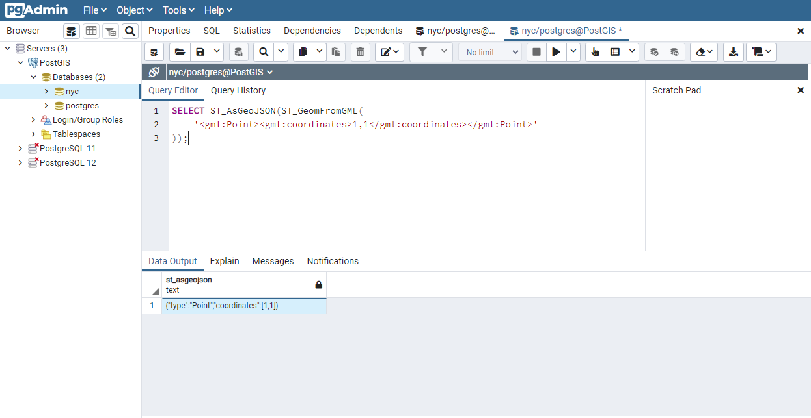

# 9. 지오메트리 (Geometries)

> 공식 원문: [<https://postgis.net/workshops/postgis-intro/geometries.html>](https://postgis.net/workshops/postgis-intro/geometries.html)\
> 공식 소스의 본문·표·SQL·이미지를 현재 페이지 순서대로 반영했습니다.

## 소개

이전 `section <loading_data>`에서는 다양한 데이터를 로드했습니다. 데이터를 가지고 놀기 전에 몇 가지 간단한 예를 살펴보겠습니다. pgAdmin에서 다시 한 번 **nyc** 데이터베이스를 선택하고 SQL 쿼리 도구를 엽니다. 이 예제 SQL 코드를 pgAdmin SQL 편집기 창에 붙여넣은 다음(기본적으로 있을 수 있는 텍스트 제거) 실행합니다.

```sql
CREATE TABLE geometries (name varchar, geom geometry);

INSERT INTO geometries VALUES
  ('Point', 'POINT(0 0)'),
  ('Linestring', 'LINESTRING(0 0, 1 1, 2 1, 2 2)'),
  ('Polygon', 'POLYGON((0 0, 1 0, 1 1, 0 1, 0 0))'),
  ('PolygonWithHole', 'POLYGON((0 0, 10 0, 10 10, 0 10, 0 0),(1 1, 1 2, 2 2, 2 1, 1 1))'),
  ('Collection', 'GEOMETRYCOLLECTION(POINT(2 0),POLYGON((0 0, 1 0, 1 1, 0 1, 0 0)))');

SELECT name, ST_AsText(geom) FROM geometries;
```


위의 예에서는 테이블(**geometries**)을 생성한 다음 점, 선, 다각형, 구멍이 있는 다각형 및 컬렉션의 5개 도형을 삽입합니다. 마지막으로 삽입된 행이 선택되어 출력 창에 표시됩니다.

## 메타데이터 테이블

SQL용 단순 기능(`SFSQL`) 사양에 따라 PostGIS는 주어진 데이터베이스에서 사용할 수 있는 도형 유형을 추적하고 보고하기 위한 두 개의 테이블을 제공합니다.

- 첫 번째 테이블 `spatial_ref_sys`는 데이터베이스에 알려진 모든 공간 참조 시스템을 정의하며 나중에 자세히 설명합니다.
- 두 번째 테이블(실제로는 뷰)인 `geometry_columns`는 모든 "특징"(기하학적 속성이 있는 개체로 정의됨) 목록과 해당 기능에 대한 기본 세부 정보를 제공합니다.


데이터베이스의 `geometry_columns` 테이블을 살펴보겠습니다. 이전과 같이 쿼리 도구에 다음 명령을 붙여넣습니다.

```sql
SELECT * FROM geometry_columns;
```


- `f_table_catalog`, `f_table_schema` 및 `f_table_name`는 주어진 형상을 포함하는 기능 테이블의 정규화된 이름을 제공합니다. PostgreSQL은 카탈로그를 사용하지 않기 때문에 `f_table_catalog`는 비어 있는 경향이 있습니다.
- `f_geometry_column`는 열을 포함하는 도형이 있는 열의 이름입니다. 여러 도형 열이 있는 기능 테이블의 경우 각각에 대해 하나의 레코드가 있습니다.
- `coord_dimension` 및 `srid`는 기하학의 차원(2차원, 3차원 또는 4차원)과 각각 `spatial_ref_sys` 테이블을 참조하는 공간 참조 시스템 식별자를 정의합니다.
- `type` 열은 아래 설명된 대로 기하학 유형을 정의합니다. 지금까지 Point 및 Linestring 유형을 살펴보았습니다.

이 테이블을 쿼리함으로써 GIS 클라이언트와 라이브러리는 데이터를 검색할 때 무엇을 기대하는지 결정할 수 있으며 각 지오메트리를 검사할 필요 없이 필요한 투영, 처리 또는 렌더링을 수행할 수 있습니다.

> [!NOTE]
> `nyc` 테이블 중 일부 또는 전체에 26918의 `srid`가 없습니까? 테이블을 업데이트하면 쉽게 해결할 수 있습니다.
>
> ``` sql
> ALTER TABLE nyc_neighborhoods
>   ALTER COLUMN geom
>   TYPE Geometry(MultiPolygon, 26918)
>   USING ST_SetSRID(geom, 26918);
> ```

## 실제 객체 표현

PostGIS 개발을 위한 최초의 지침 표준인 SQL용 단순 기능(`SFSQL`) 사양은 실제 객체가 표현되는 방식을 정의합니다. 연속적인 모양을 취하고 이를 고정된 해상도로 디지털화함으로써 우리는 물체를 무난하게 표현할 수 있습니다. SFSQL은 2차원 표현만 처리했습니다. PostGIS는 이를 3차원 및 4차원 표현을 포함하도록 확장했습니다. 최근에는 SQL-Multimedia Part 3(`SQL/MM`) 사양이 공식적으로 자체 표현을 정의했습니다.

예제 테이블에는 다양한 지오메트리 유형이 혼합되어 있습니다. 기하학 메타데이터를 읽는 함수를 사용하여 각 객체에 대한 일반 정보를 수집할 수 있습니다.

- `ST_GeometryType(geometry)`는 형상 유형을 반환합니다.
- `ST_NDims(geometry)`는 형상의 차원 수를 반환합니다.
- `ST_SRID(geometry)`는 기하학의 공간 참조 식별자 번호를 반환합니다.

```sql
SELECT name, ST_GeometryType(geom), ST_NDims(geom), ST_SRID(geom)
  FROM geometries;
```

    name       |    st_geometrytype    | st_ndims | st_srid
    -----------------+-----------------------+----------+---------
    Point           | ST_Point              |        2 |       0
    Polygon         | ST_Polygon            |        2 |       0
    PolygonWithHole | ST_Polygon            |        2 |       0
    Collection      | ST_GeometryCollection |        2 |       0
    Linestring      | ST_LineString         |        2 |       0

### 포인트


공간 **point**는 지구상의 단일 위치를 나타냅니다. 이 점은 단일 좌표(2차원, 3차원 또는 4차원 포함)로 표시됩니다. 점은 모양이나 크기와 같은 정확한 세부 사항이 대상 축척에서 중요하지 않은 경우 개체를 나타내는 데 사용됩니다. 예를 들어, 세계 지도의 도시는 점으로 설명될 수 있는 반면, 단일 주의 지도는 도시를 다각형으로 나타낼 수 있습니다.

```sql
SELECT ST_AsText(geom)
  FROM geometries
  WHERE name = 'Point';
```

    POINT(0 0)

점 작업을 위한 특정 공간 기능 중 일부는 다음과 같습니다.

- `ST_X(geometry)`는 X 좌표를 반환합니다.
- `ST_Y(geometry)`는 Y 세로좌표를 반환합니다.

따라서 다음과 같은 지점에서 좌표를 읽을 수 있습니다.

```sql
SELECT ST_X(geom), ST_Y(geom)
  FROM geometries
  WHERE name = 'Point';
```

뉴욕 지하철 역(`nyc_subway_stations`) 테이블은 포인트로 표현된 데이터 세트입니다. 다음 SQL 쿼리는 한 점(`ST_AsText` 열)과 연관된 지오메트리를 반환합니다.

```sql
SELECT name, ST_AsText(geom)
  FROM nyc_subway_stations
  LIMIT 1;
```

### 라인스트링


**linestring**는 위치 간 경로입니다. 이는 두 개 이상의 점으로 이루어진 순서화된 계열의 형태를 취합니다. 도로와 강은 일반적으로 선스트링으로 표시됩니다. 라인스트링이 동일한 지점에서 시작하고 끝나는 경우 **closed**라고 합니다. 자체적으로 교차하거나 접촉하지 않으면 **simple**라고 합니다(닫혀 있는 경우 끝점 제외). 선스트링은 **closed** 및 **simple**일 수 있습니다.

뉴욕의 거리 네트워크(`nyc_streets`)는 워크숍 초기에 로드되었습니다. 이 데이터세트에는 이름, 유형 등의 세부정보가 포함되어 있습니다. 실제 세계의 단일 도로는 여러 개의 라인스트링으로 구성될 수 있으며, 각 라인스트링은 서로 다른 속성을 지닌 도로 세그먼트를 나타냅니다.

다음 SQL 쿼리는 하나의 라인스트링(`ST_AsText` 열)과 연관된 형상을 반환합니다.

```sql
SELECT ST_AsText(geom)
  FROM geometries
  WHERE name = 'Linestring';
```

    LINESTRING(0 0, 1 1, 2 1, 2 2)

라인스트링 작업을 위한 특정 공간 함수 중 일부는 다음과 같습니다.

- `ST_Length(geometry)`는 선스트링의 길이를 반환합니다.
- `ST_StartPoint(geometry)`는 첫 번째 좌표를 점으로 반환합니다.
- `ST_EndPoint(geometry)`는 마지막 좌표를 점으로 반환합니다.
- `ST_NPoints(geometry)`는 라인스트링의 좌표 수를 반환합니다.

따라서 라인스트링의 길이는 다음과 같습니다.

```sql
SELECT ST_Length(geom)
  FROM geometries
  WHERE name = 'Linestring';
```

    3.41421356237309

### 다각형


다각형은 영역을 표현한 것입니다. 다각형의 외부 경계는 링으로 표시됩니다. 이 링은 위에 정의된 대로 닫혀 있으면서도 단순한 선스트링입니다. 다각형 내의 구멍도 링으로 표시됩니다.

다각형은 크기와 모양이 중요한 객체를 나타내는 데 사용됩니다. 도시 경계, 공원, 건물 발자국 또는 수역은 해당 지역을 볼 수 있을 만큼 축척이 충분히 높은 경우 일반적으로 모두 다각형으로 표시됩니다. 도로와 강은 때때로 다각형으로 표현될 수 있습니다.

다음 SQL 쿼리는 하나의 다각형(`ST_AsText` 열)과 연관된 지오메트리를 반환합니다.

```sql
SELECT ST_AsText(geom)
  FROM geometries
  WHERE name LIKE 'Polygon%';
```

> [!NOTE]
> `WHERE` 절에서 `=` 기호를 사용하는 대신 `LIKE` 연산자를 사용하여 문자열 일치 작업을 수행합니다. **패턴 일치를 위한 "glob"으로 \`\`\*\`\` 기호를 사용할 수 있지만 SQL에서는 시스템에 글로빙을 수행하도록 지시하기 위해 `LIKE` 연산자와 함께 \`\`%\`\` 기호가 사용됩니다**.

    POLYGON((0 0, 1 0, 1 1, 0 1, 0 0))
    POLYGON((0 0, 10 0, 10 10, 0 10, 0 0),(1 1, 1 2, 2 2, 2 1, 1 1))

첫 번째 다각형에는 링이 하나만 있습니다. 두 번째에는 내부 "구멍"이 있습니다. 대부분의 그래픽 시스템에는 "다각형"이라는 개념이 포함되어 있지만 GIS 시스템은 다각형에 명시적으로 구멍이 있을 수 있다는 점에서 상대적으로 독특합니다.


다각형 작업을 위한 특정 공간 기능 중 일부는 다음과 같습니다.

- `ST_Area(geometry)`는 다각형의 면적을 반환합니다.
- `ST_NRings(geometry)`는 링 수를 반환합니다(보통 1개, 구멍이 있는 경우 그 이상).
- `ST_ExteriorRing(geometry)`는 외부 링을 선스트링으로 반환합니다.
- `ST_InteriorRingN(geometry,n)`는 지정된 내부 링을 라인스트링으로 반환합니다.
- `ST_Perimeter(geometry)`는 모든 링의 길이를 반환합니다.

면적 함수를 사용하여 다각형의 면적을 계산할 수 있습니다.

```sql
SELECT name, ST_Area(geom)
  FROM geometries
  WHERE name LIKE 'Polygon%';
```

    Polygon            1
    PolygonWithHole    99

구멍이 있는 다각형의 면적은 외부 껍질의 면적(10x10 정사각형)에서 구멍의 면적(1x1 정사각형)을 뺀 면적입니다.

### 컬렉션

여러 개의 단순 도형을 세트로 그룹화하는 네 가지 컬렉션 유형이 있습니다.

- **MultiPoint**, 포인트 모음
- **MultiLineString**, 라인스트링 모음
- **MultiPolygon**, 폴리곤 모음
- **GeometryCollection**, 모든 지오메트리의 이종 컬렉션(다른 컬렉션 포함)

컬렉션은 일반 그래픽 소프트웨어보다 GIS 소프트웨어에 더 많이 나타나는 또 다른 개념입니다. 실제 객체를 공간 객체로 직접 모델링하는 데 유용합니다. 예를 들어, 통행권으로 분할된 부지를 모델링하는 방법은 무엇입니까? **MultiPolygon**로서 통행권의 양쪽에 부품이 있습니다.


예제 컬렉션에는 다각형과 점이 포함되어 있습니다.

```sql
SELECT name, ST_AsText(geom)
  FROM geometries
  WHERE name = 'Collection';
```

    GEOMETRYCOLLECTION(POINT(2 0),POLYGON((0 0, 1 0, 1 1, 0 1, 0 0)))


컬렉션 작업을 위한 특정 공간 기능 중 일부는 다음과 같습니다.

- `ST_NumGeometries(geometry)`는 컬렉션의 부품 수를 반환합니다.
- `ST_GeometryN(geometry,n)`는 지정된 부분을 반환합니다.
- `ST_Area(geometry)`는 모든 다각형 부분의 총 면적을 반환합니다.
- `ST_Length(geometry)`는 모든 선형 부품의 총 길이를 반환합니다.

## 기하학 입력 및 출력

데이터베이스 내에서 도형은 PostGIS 프로그램에서만 사용되는 형식으로 디스크에 저장됩니다. 외부 프로그램이 유용한 형상을 삽입하고 검색하려면 해당 형상을 다른 응용 프로그램이 이해할 수 있는 형식으로 변환해야 합니다. 다행히 PostGIS는 다양한 형식의 형상 방출 및 소비를 지원합니다.

- 잘 알려진 텍스트(`WKT`)
  - `ST_GeomFromText(text, srid)`는 `geometry`를 반환합니다.
  - `ST_AsText(geometry)`는 `text`를 반환합니다.
  - `ST_AsEWKT(geometry)`는 `text`를 반환합니다.
- 잘 알려진 바이너리(`WKB`)
  - `ST_GeomFromWKB(bytea)`는 `geometry`를 반환합니다.
  - `ST_AsBinary(geometry)`는 `bytea`를 반환합니다.
  - `ST_AsEWKB(geometry)`는 `bytea`를 반환합니다.
- 지리적 마크업 언어(`GML`)
  - `ST_GeomFromGML(text)`는 `geometry`를 반환합니다.
  - `ST_AsGML(geometry)`는 `text`를 반환합니다.
- 키홀 마크업 언어(`KML`)
  - `ST_GeomFromKML(text)`는 `geometry`를 반환합니다.
  - `ST_AsKML(geometry)`는 `text`를 반환합니다.
- `GeoJSON`
  - `ST_AsGeoJSON(geometry)`는 `text`를 반환합니다.
- 확장 가능한 벡터 그래픽(`SVG`)
  - `ST_AsSVG(geometry)`는 `text`를 반환합니다.

생성자의 가장 일반적인 용도는 기하학의 텍스트 표현을 내부 표현으로 바꾸는 것입니다.

```sql
SELECT ST_GeomFromText('POINT(583571 4506714)',26918);
```

기하학 표현이 포함된 텍스트 매개변수 외에도 기하학의 `SRID`를 제공하는 숫자 매개변수도 있습니다.

다음 SQL 쿼리는 `WKB` 표현의 예를 보여줍니다(인쇄를 위해 이진 출력을 ASCII 형식으로 변환하려면 `encode()`에 대한 호출이 필요함).

```sql
SELECT encode(
  ST_AsBinary(ST_GeometryFromText('LINESTRING(0 0,1 0)')),
  'hex');
```

    01020000000200000000000000000000000000000000000000000000000000f03f0000000000000000

이 워크숍의 목적을 위해 우리는 계속해서 WKT를 사용하여 우리가 보고 있는 형상을 읽고 이해할 수 있도록 할 것입니다. 그러나 GIS 애플리케이션에서 데이터 보기, 웹 서비스로 데이터 전송, 원격으로 데이터 처리 등 대부분의 실제 프로세스에서는 WKB가 선택되는 형식입니다.

WKT 및 WKB는 `SFSQL` 사양에 정의되었으므로 3차원 또는 4차원 형상을 처리하지 않습니다. 이러한 경우 PostGIS는 EWKT(Extended Well Known Text) 및 EWKB(Extended Well Known Binary) 형식을 정의했습니다. 이는 차원이 추가된 WKT 및 WKB와 동일한 형식화 기능을 제공합니다.

다음은 WKT의 3D 유도선 예입니다.

```sql
SELECT ST_AsText(ST_GeometryFromText('LINESTRING(0 0 0,1 0 0,1 1 2)'));
```

    LINESTRING Z (0 0 0,1 0 0,1 1 2)

텍스트 표현이 변경된다는 점에 유의하세요! 이는 PostGIS의 텍스트 입력 루틴이 소비하는 것에 있어서 자유롭기 때문입니다. 소모할 것이다

- 16진수로 인코딩된 EWKB,
- 잘 알려진 텍스트를 확장하고
- ISO 표준 잘 알려진 텍스트.

출력 측에서 `ST_AsText` 함수는 보수적이며 ISO 표준 잘 알려진 텍스트만 내보냅니다.

`ST_GeometryFromText` 함수 외에도 잘 알려진 텍스트나 유사한 형식의 입력에서 도형을 생성하는 다른 방법이 많이 있습니다.

```sql
-- Using ST_GeomFromText with the SRID parameter
SELECT ST_GeomFromText('POINT(2 2)',4326);

-- Using ST_GeomFromText without the SRID parameter
SELECT ST_SetSRID(ST_GeomFromText('POINT(2 2)'),4326);

-- Using a ST_Make* function
SELECT ST_SetSRID(ST_MakePoint(2, 2), 4326);

-- Using PostgreSQL casting syntax and ISO WKT
SELECT ST_SetSRID('POINT(2 2)'::geometry, 4326);

-- Using PostgreSQL casting syntax and extended WKT
SELECT 'SRID=4326;POINT(2 2)'::geometry;
```

PostGIS에는 다양한 형식(WKT, WKB, GML, KML, JSON, SVG)에 대한 이미터 외에도 네 가지(WKT, WKB, GML, KML)에 대한 소비자도 있습니다. 대부분의 애플리케이션은 WKT 또는 WKB 기하학 생성 기능을 사용하지만 다른 애플리케이션도 작동합니다. 다음은 GML을 사용하고 JSON을 출력하는 예입니다.

```sql
SELECT ST_AsGeoJSON(ST_GeomFromGML('<gml:Point><gml:coordinates>1,1</gml:coordinates></gml:Point>'));
```



## 텍스트에서 캐스팅

지금까지 본 `WKT` 문자열은 '텍스트' 유형이었으며 `ST_GeomFromText()`와 같은 PostGIS 함수를 사용하여 이를 '기하학' 유형으로 변환했습니다.

PostgreSQL에는 데이터를 한 유형에서 다른 유형으로 변환할 수 있는 짧은 형식 구문인 <span class="title-ref">oldata::newtype</span>가 포함되어 있습니다. 예를 들어, 이 SQL은 double을 텍스트 문자열로 변환합니다.

```sql
SELECT 0.9::text;
```

덜 사소하게도 이 SQL은 `WKT` 문자열을 기하학으로 변환합니다.

```sql
SELECT 'POINT(0 0)'::geometry;
```

캐스팅을 사용하여 형상을 생성할 때 주의할 점은 SRID를 지정하지 않으면 알 수 없는 SRID가 있는 형상을 얻게 된다는 것입니다. 앞에 SRID 블록이 포함된 "확장된" 잘 알려진 텍스트 형식을 사용하여 SRID를 지정할 수 있습니다.

```sql
SELECT 'SRID=4326;POINT(0 0)'::geometry;
```

`WKT`뿐만 아니라 <span class="title-ref">geometry</span> 및 <span class="title-ref">geography</span> 열로 작업할 때 캐스팅 표기법을 사용하는 것이 매우 일반적입니다(`geography` 참조).

## 기능 목록

[ST_Area](http://postgis.net/docs/ST_Area.html): 다각형 또는 다중 다각형인 경우 표면의 면적을 반환합니다. "기하학" 유형의 경우 영역은 SRID 단위입니다. "지리"의 경우 면적은 평방미터 단위입니다.

[ST_AsText](http://postgis.net/docs/ST_AsText.html): SRID 메타데이터 없이 도형/지리의 WKT(Well-Known Text) 표현을 반환합니다.

[ST_AsBinary](http://postgis.net/docs/ST_AsBinary.html): SRID 메타데이터 없이 기하학/지리의 WKB(Well-Known Binary) 표현을 반환합니다.

[ST_EndPoint](http://postgis.net/docs/ST_EndPoint.html): LINESTRING 도형의 마지막 점을 POINT로 반환합니다.

[ST_AsEWKB](http://postgis.net/docs/ST_AsEWKB.html): SRID 메타데이터가 포함된 형상의 WKB(Well-Known Binary) 표현을 반환합니다.

[ST_AsEWKT](http://postgis.net/docs/ST_AsEWKT.html): SRID 메타데이터가 포함된 도형의 WKT(Well-Known Text) 표현을 반환합니다.

[ST_AsGeoJSON](http://postgis.net/docs/ST_AsGeoJSON.html): 기하학을 GeoJSON 요소로 반환합니다.

[ST_AsGML](http://postgis.net/docs/ST_AsGML.html): 도형을 GML 버전 2 또는 3 요소로 반환합니다.

[ST_AsKML](http://postgis.net/docs/ST_AsKML.html): 도형을 KML 요소로 반환합니다. 여러 변형. 기본 버전=2, 기본 정밀도=15.

[ST_AsSVG](http://postgis.net/docs/ST_AsSVG.html): 기하학 또는 지리 객체가 제공된 SVG 경로 데이터의 기하학을 반환합니다.

[ST_ExteriorRing](http://postgis.net/docs/ST_ExteriorRing.html): POLYGON 기하학의 외부 링을 나타내는 행 문자열을 반환합니다. 도형이 다각형이 아닌 경우 NULL을 반환합니다. MULTIPOLYGON에서는 작동하지 않습니다.

[ST_GeometryN](http://postgis.net/docs/ST_GeometryN.html): 도형이 GEOMETRYCOLLECTION, MULTIPOINT, MULTILINESTRING, MULTICURVE 또는 MULTIPOLYGON인 경우 1 기반 N번째 도형을 반환합니다. 그렇지 않으면 NULL을 반환합니다.

[ST_GeomFromGML](http://postgis.net/docs/ST_GeomFromGML.html): 기하학의 GML 표현을 입력으로 취하고 PostGIS 기하학 객체를 출력합니다.

[ST_GeomFromKML](http://postgis.net/docs/ST_GeomFromKML.html): 기하학의 KML 표현을 입력으로 취하고 PostGIS 기하학 객체를 출력합니다.

[ST_GeomFromText](http://postgis.net/docs/ST_GeomFromText.html): WKT(Well-Known Text 표현)에서 지정된 ST_Geometry 값을 반환합니다.

[ST_GeomFromWKB](http://postgis.net/docs/ST_GeomFromWKB.html): Well-Known Binary 기하학 표현(WKB) 및 선택적 SRID로부터 기하학 인스턴스를 생성합니다.

[ST_GeometryType](http://postgis.net/docs/ST_GeometryType.html): ST_Geometry 값의 도형 유형을 반환합니다.

[ST_InteriorRingN](http://postgis.net/docs/ST_InteriorRingN.html): 다각형 기하학의 N번째 내부 라인스트링 링을 반환합니다. 도형이 다각형이 아니거나 주어진 N이 범위를 벗어나면 NULL을 반환합니다.

[ST_Length](http://postgis.net/docs/ST_Length.html): 선스트링 또는 다중 선스트링인 경우 형상의 2D 길이를 반환합니다. 기하학은 공간 참조 단위이고 지리는 미터 단위입니다(기본 회전 타원체).

[ST_NDims](http://postgis.net/docs/ST_NDims.html): 기하학의 좌표 치수를 작은 정수로 반환합니다. 값은 2,3 또는 4입니다.

[ST_NPoints](http://postgis.net/docs/ST_NPoints.html): 도형의 포인트(정점) 수를 반환합니다.

[ST_NRings](http://postgis.net/docs/ST_NRings.html): 도형이 다각형 또는 다중 다각형인 경우 링 수를 반환합니다.

[ST_NumGeometries](http://postgis.net/docs/ST_NumGeometries.html): 기하학이 GEOMETRYCOLLECTION(또는 MULTI\*)인 경우 기하학의 수를 반환하고, 그렇지 않으면 NULL을 반환합니다.

[ST_Perimeter](http://postgis.net/docs/ST_Perimeter.html): ST_Surface 또는 ST_MultiSurface 값 경계의 길이 측정값을 반환합니다. (다각형, 다중 다각형)

[ST_SRID](http://postgis.net/docs/ST_SRID.html): Spatial_ref_sys 테이블에 정의된 대로 ST_Geometry에 대한 공간 참조 식별자를 반환합니다.

[ST_StartPoint](http://postgis.net/docs/ST_StartPoint.html): LINESTRING 도형의 첫 번째 점을 POINT로 반환합니다.

[ST_X](http://postgis.net/docs/ST_X.html): 점의 X 좌표를 반환하거나, 사용할 수 없는 경우 NULL을 반환합니다. 입력은 포인트여야 합니다.

[ST_Y](http://postgis.net/docs/ST_Y.html): 점의 Y 좌표를 반환하거나, 사용할 수 없는 경우 NULL을 반환합니다. 입력은 포인트여야 합니다.

------------------------------------------------------------------------

<details markdown="1">
<summary><strong>기존 로컬 문서 보존본</strong> — 로컬 실습 확장·요약 내용</summary>

# 9. 지오메트리 (Geometries)

PostGIS의 핵심은 기하학적 형태(점, 선, 면)를 데이터베이스 컬럼에 저장하고 연산하는 것입니다.

---

## 1. 공간 데이터의 텍스트 표현 (WKT)

OGC는 지오메트리를 사람이 읽을 수 있는 텍스트로 표현하는 **WKT (Well-Known Text)** 표준을 정의했습니다.

- **POINT**: `POINT(0 0)`
- **LINESTRING**: `LINESTRING(0 0, 1 1, 2 1, 2 2)`
- **POLYGON**: `POLYGON((0 0, 0 4, 4 4, 4 0, 0 0), (1 1, 1 2, 2 2, 2 1, 1 1))` *(구멍이 있는 도넛 형태 포함 가능)*
- **MULTIPOINT**: `MULTIPOINT((0 0), (1 2))`
- **MULTILINESTRING**: `MULTILINESTRING((0 0, 1 1), (2 2, 3 3))`
- **MULTIPOLYGON**: `MULTIPOLYGON(((0 0, 4 0, 4 4, 0 4, 0 0)), ((10 10, 14 10, 14 14, 10 14, 10 10)))`
- **GEOMETRYCOLLECTION**: `GEOMETRYCOLLECTION(POINT(2 0), POLYGON((0 0, 1 0, 1 1, 0 1, 0 0)))`


---

## 2. 지오메트리 생성 함수

WKT 문자열을 PostGIS의 내부 바이너리 지오메트리 객체로 변환할 때 `ST_GeomFromText` 함수를 사용합니다.

```sql
-- SRID(좌표계)가 없는 단순 포인트
SELECT ST_GeomFromText('POINT(2 5)');

-- SRID 4326(WGS84 위경도) 좌표를 갖는 포인트
SELECT ST_SetSRID(ST_MakePoint(-73.985130, 40.748817), 4326);

-- WKT와 SRID를 함께 지정
SELECT ST_GeomFromText('LINESTRING(0 0, 1 1, 2 4)', 26918);
```

---

## 3. 지오메트리 출력 함수

내부 지오메트리 바이너리를 읽기 쉬운 텍스트나 포맷으로 변환합니다:

- `ST_AsText(geom)`: WKT 문자열로 반환
- `ST_AsGeoJSON(geom)`: GeoJSON 포맷으로 반환
- `ST_AsKML(geom)`: Google Earth KML 포맷으로 반환
- `ST_AsSVG(geom)`: 웹용 SVG path 데이터로 반환

```sql
SELECT name, ST_AsText(geom)
FROM nyc_subway_stations
LIMIT 1;
```

결과:
```text
POINT(583571.495740449 4509376.62688086)
```

---

## 4. 지오메트리 속성 조회 함수

- `ST_GeometryType(geom)`: 지오메트리 타입 반환 (`ST_Point`, `ST_MultiPolygon` 등)
- `ST_NDims(geom)`: 차원 수 반환 (2차원, 3차원 등)
- `ST_SRID(geom)`: 좌표계 ID(SRID) 반환
- `ST_X(geom)`, `ST_Y(geom)`: 포인트의 X(경도/동서), Y(위도/남북) 좌표 추출
- `ST_Length(geom)`: 선의 길이 계산
- `ST_Area(geom)`: 폴리곤의 면적 계산
- `ST_NPoints(geom)`: 지오메트리를 구성하는 정점(Vertex)의 개수

```sql
-- 자치구별 면적 계산 (단위: 제곱미터 -> 제곱킬로미터 변환)
SELECT
  boroname,
  SUM(ST_Area(geom)) / 1000000.0 AS area_sq_km
FROM nyc_census_blocks
GROUP BY boroname
ORDER BY area_sq_km DESC;
```

---

| [⬅️ 8. 단순 SQL 실습 (Simple SQL Exercises)](08_simple_sql_exercises.md) | [🏠 워크숍 목차](README.md) | [10. 지오메트리 실습 (Geometry Exercises) ➡️](10_geometries_exercises.md) |
| :--- | :---: | ---: |

</details>

---

[← 이전](08_simple_sql_exercises.md) · [목차](00_index.md) · [다음 →](10_geometries_exercises.md)