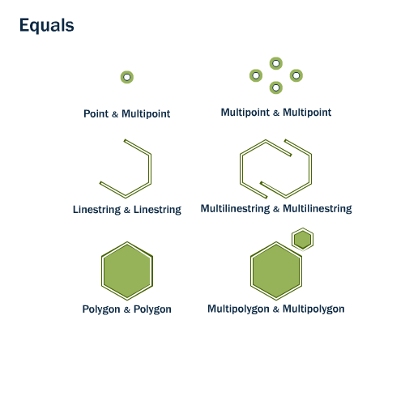
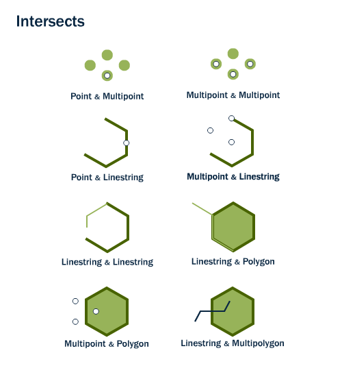
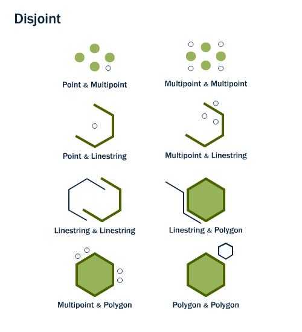
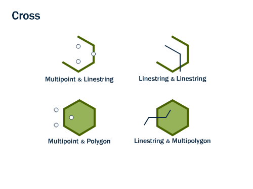
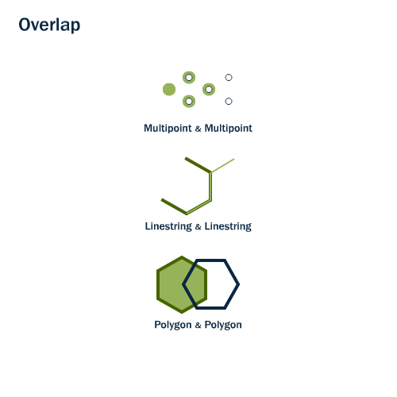
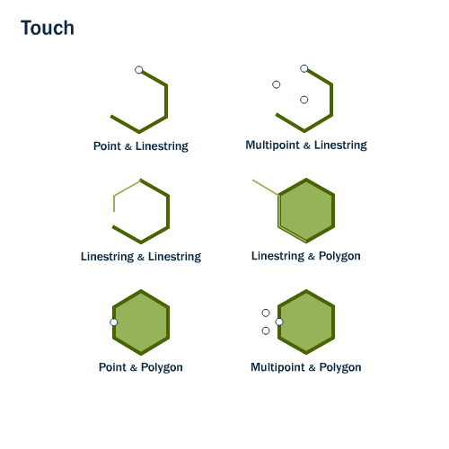
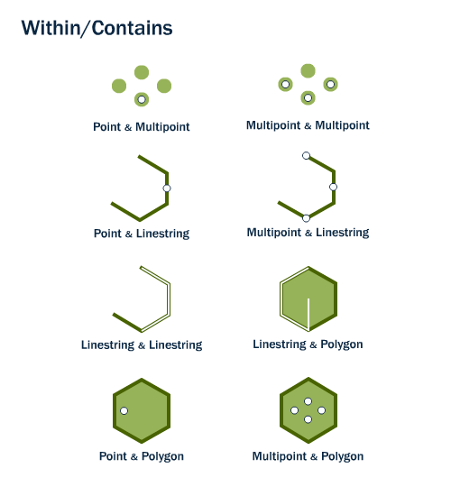
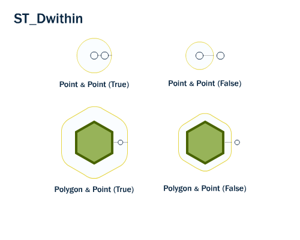
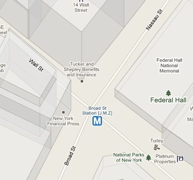

# 11. 공간 관계 (Spatial Relationships)

> 공식 원문: [<https://postgis.net/workshops/postgis-intro/spatial_relationships.html>](https://postgis.net/workshops/postgis-intro/spatial_relationships.html)\
> 공식 소스의 본문·표·SQL·이미지를 현재 페이지 순서대로 반영했습니다.

지금까지 우리는 기하학을 측정(`ST_Area`, `ST_Length`), 직렬화(`ST_GeomFromText`) 또는 역직렬화(`ST_AsGML`)하는 공간 함수만 사용했습니다. 이러한 기능의 공통점은 한 번에 하나의 형상에만 작동한다는 것입니다.

공간 데이터베이스는 기하학을 저장할 뿐만 아니라 *기하학 간의 관계*를 비교할 수 있는 기능도 갖추고 있기 때문에 강력합니다.

"공원에서 가장 가까운 자전거 거치대는 어디인가요?"와 같은 질문입니다. 또는 "지하철 노선과 거리의 교차로는 어디에 있습니까?" 자전거 거치대, 거리, 지하철 노선을 나타내는 형상을 비교해야만 답을 얻을 수 있습니다.

OGC 표준은 형상을 비교하기 위해 다음과 같은 방법 세트를 정의합니다.

## ST_Equals

`ST_Equals(geometry A, geometry B)`는 두 기하학의 공간 동일성을 테스트합니다.

<figure class="align-center">

</figure>

ST_Equals는 동일한 유형의 두 기하학이 동일한 x, y 좌표 값을 갖는 경우, 즉 두 번째 모양이 첫 번째 모양과 동일한 경우(동일한) TRUE를 리턴합니다.

먼저 `nyc_subway_stations` 테이블에서 점 표현을 검색해 보겠습니다. 'Broad St'에 대한 항목만 사용하겠습니다.

```sql
SELECT name, geom
FROM nyc_subway_stations
WHERE name = 'Broad St';
```

    name   |                      geom
    ----------+---------------------------------------------------
    Broad St | 0101000020266900000EEBD4CF27CF2141BC17D69516315141

그런 다음 형상 표현을 다시 `ST_Equals` 테스트에 연결합니다.

```sql
SELECT name
FROM nyc_subway_stations
WHERE ST_Equals(
  geom,
  '0101000020266900000EEBD4CF27CF2141BC17D69516315141');
```

    Broad St

> [!NOTE]
> 점의 표현은 사람이 읽을 수 있는 수준은 아니지만(`0101000020266900000EEBD4CF27CF2141BC17D69516315141`) 좌표 값을 정확하게 표현했습니다. 동등성 테스트를 위해서는 정확한 좌표를 사용하는 것이 필요합니다.

## ST_Intersects, ST_Disjoint, ST_Crosses 및 ST_Overlaps

`ST_Intersects`, `ST_Crosses` 및 `ST_Overlaps`는 형상의 내부가 교차하는지 여부를 테스트합니다.

<figure class="align-center">

</figure>

`ST_Intersects(geometry A, geometry B)`는 두 모양에 공통 공간이 있는 경우, 즉 경계나 내부가 교차하는 경우 t(TRUE)를 반환합니다.

<figure class="align-center">

</figure>

ST_Intersects의 반대는 `ST_Disjoint(geometry A , geometry B)`입니다. 두 개의 기하학이 분리되어 있으면 교차하지 않으며 그 반대도 마찬가지입니다. 실제로 교차 테스트는 공간적으로 인덱싱될 수 있지만 분리 테스트는 그렇지 않기 때문에 "해리"를 테스트하는 것보다 "교차하지 않음"을 테스트하는 것이 더 효율적인 경우가 많습니다.

<figure class="align-center">

</figure>

다중점/다각형, 다중점/선스트링, 선스트링/선스트링, 선스트링/다각형 및 선스트링/다중다각형 비교의 경우, 교차로 인해 치수가 두 소스 도형의 최대 치수보다 1 작은 도형이 생성되고 교차 세트가 두 소스 도형의 내부에 있는 경우 `ST_Crosses(geometry A, geometry B)`는 t(TRUE)를 반환합니다.

<figure class="align-center">

</figure>

`ST_Overlaps(geometry A, geometry B)`는 동일한 치수의 두 Geometry를 비교하고 교차 세트로 인해 둘 다와 다르지만 동일한 치수의 Geometry가 생성되는 경우 TRUE를 리턴합니다.

Broad Street 지하철 역을 선택하고 `ST_Intersects` 함수를 사용하여 주변 지역을 결정해 보겠습니다.

```sql
SELECT name, ST_AsText(geom)
FROM nyc_subway_stations
WHERE name = 'Broad St';
```

    POINT(583571 4506714)

```sql
SELECT name, boroname
FROM nyc_neighborhoods
WHERE ST_Intersects(geom, ST_GeomFromText('POINT(583571 4506714)',26918));
```

    name        | boroname
    --------------------+-----------
    Financial District | Manhattan

## ST_터치

`ST_Touches`는 두 개의 형상이 경계에서 접촉하지만 내부에서는 교차하지 않는지 테스트합니다.

<figure class="align-center">

</figure>

`ST_Touches(geometry A, geometry B)`는 기하학의 경계 중 하나가 교차하거나 기하학의 내부 중 하나만 다른 경계와 교차하는 경우 TRUE를 리턴합니다.

## ST_Within 및 ST_Contains

`ST_Within` 및 `ST_Contains`는 한 형상이 다른 형상 내에 완전히 있는지 여부를 테스트합니다.

<figure class="align-center">

</figure>

`ST_Within(geometry A , geometry B)`는 첫 번째 기하학이 완전히 두 번째 기하학 내에 있는 경우 TRUE를 리턴합니다. ST_Within은 ST_Contains의 정반대 결과를 테스트합니다.

`ST_Contains(geometry A, geometry B)`는 두 번째 기하학이 첫 번째 기하학에 완전히 포함된 경우 TRUE를 반환합니다.

## ST_Distance 및 ST_DWithin

매우 일반적인 GIS 질문은 "이 다른 항목의 거리 X 내에 있는 모든 항목을 찾는 것"입니다.

`ST_Distance(geometry A, geometry B)`는 두 기하학 사이의 *최단* 거리를 계산하고 이를 부동 소수점으로 반환합니다. 이는 실제로 객체 사이의 거리를 다시 보고하는 데 유용합니다.

```sql
SELECT ST_Distance(
  ST_GeometryFromText('POINT(0 5)'),
  ST_GeometryFromText('LINESTRING(-2 2, 2 2)'));
```

    3

두 객체가 서로의 거리 내에 있는지 테스트하기 위해 `ST_DWithin` 함수는 인덱스 가속 참/거짓 테스트를 제공합니다. 이는 "도로의 500미터 완충 내에 나무가 몇 그루나 있습니까?"와 같은 질문에 유용합니다. 실제 버퍼를 계산할 필요는 없으며 거리 관계만 테스트하면 됩니다.

<figure class="align-center">

</figure>

Broad Street 지하철 역을 다시 이용하면 지하철 정류장 근처(10미터 이내)의 거리를 찾을 수 있습니다.

```sql
SELECT name
FROM nyc_streets
WHERE ST_DWithin(
        geom,
        ST_GeomFromText('POINT(583571 4506714)',26918),
        10
      );
```

    name
    --------------
    Wall St
    Broad St
    Nassau St

그리고 그 답을 지도로 확인할 수 있습니다. Broad St 역은 실제로 Wall, Broad 및 Nassau Streets의 교차점에 있습니다.



## 기능 목록

[ST_Contains(기하학 A, 기하학 B)](http://postgis.net/docs/ST_Contains.html): B의 포인트가 A의 외부에 있지 않고 B 내부의 최소 하나의 포인트가 A의 내부에 있는 경우에만 true를 반환합니다.

[ST_Crosses(기하학 A, 기하학 B)](http://postgis.net/docs/ST_Crosses.html): 제공된 기하학에 공통된 내부 점이 전부는 아니지만 일부가 있는 경우 TRUE를 반환합니다.

[ST_Disjoint(기하학 A , 기하학 B)](http://postgis.net/docs/ST_Disjoint.html): 기하학이 "공간적으로 교차"하지 않는 경우, 즉 공간을 함께 공유하지 않는 경우 TRUE를 반환합니다.

[ST_Distance(기하학 A, 기하학 B)](http://postgis.net/docs/ST_Distance.html): 두 기하학 사이의 2차원 직교 최소 거리(공간 참조 기준)를 투영 단위로 반환합니다.

[ST_DWithin(기하학 A, 기하학 B, 반경)](http://postgis.net/docs/ST_DWithin.html): 기하학이 서로 지정된 거리(반경) 내에 있는 경우 true를 반환합니다.

[ST_Equals(기하학 A, 기하학 B)](http://postgis.net/docs/ST_Equals.html): 주어진 기하학이 동일한 기하학을 나타내는 경우 true를 반환합니다. 방향성은 무시됩니다.

[ST_Intersects(기하학 A, 기하학 B)](http://postgis.net/docs/ST_Intersects.html): 기하학/지리학이 "공간적으로 교차"하는 경우(공간의 모든 부분 공유) TRUE를 반환하고 그렇지 않은 경우(분리됨) FALSE를 반환합니다.

[ST_Overlaps(기하학 A, 기하학 B)](http://postgis.net/docs/ST_Overlaps.html): 기하학이 공간을 공유하고 동일한 차원이지만 서로 완전히 포함되지 않은 경우 TRUE를 반환합니다.

[ST_Touches(기하학 A, 기하학 B)](http://postgis.net/docs/ST_Touches.html): 기하학에 공통 점이 하나 이상 있지만 내부가 교차하지 않는 경우 TRUE를 반환합니다.

[ST_Within(기하학 A , 기하학 B)](http://postgis.net/docs/ST_Within.html): 기하학 A가 완전히 기하학 B 내부에 있는 경우 true를 반환합니다.


---

[← 이전](10_geometries_exercises.md) · [목차](00_index.md) · [다음 →](12_spatial_relationships_exercises.md)