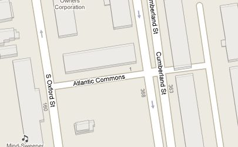

# 12. 공간 관계 연습 (Spatial Relationships Exercises)

> 공식 원문: [<https://postgis.net/workshops/postgis-intro/spatial_relationships_exercises.html>](https://postgis.net/workshops/postgis-intro/spatial_relationships_exercises.html)\
> 공식 소스의 본문·표·SQL·이미지를 현재 페이지 순서대로 반영했습니다.

다음은 지난 섹션에서 본 기능을 상기시켜주는 것입니다. 운동에 유용할 것 같아요!

- 레코드 집합에 대한 합계를 반환하는 `sum(expression)` 집계
- 레코드 집합의 크기를 반환하는 `count(expression)` 집계
- `ST_Contains(geometry A, geometry B)`는 기하학 A에 기하학 B가 포함된 경우 true를 반환합니다.
- `ST_Crosses(geometry A, geometry B)`는 형상 A가 형상 B를 교차하는 경우 true를 반환합니다.
- `ST_Disjoint(geometry A , geometry B)`는 도형이 "공간적으로 교차"하지 않는 경우 true를 반환합니다.
- `ST_Distance(geometry A, geometry B)`는 형상 A와 형상 B 사이의 최소 거리를 반환합니다.
- `ST_DWithin(geometry A, geometry B, radius)`는 형상 A가 형상 B로부터 반경 거리 이하인 경우 true를 반환합니다.
- `ST_Equals(geometry A, geometry B)`는 기하학 A가 기하학 B와 동일한 경우 true를 반환합니다.
- `ST_Intersects(geometry A, geometry B)`는 기하학 A가 기하학 B와 교차하는 경우 true를 반환합니다.
- `ST_Overlaps(geometry A, geometry B)`는 기하학 A와 기하학 B가 공간을 공유하지만 서로 완전히 포함되지 않은 경우 true를 반환합니다.
- `ST_Touches(geometry A, geometry B)`는 기하학 A의 경계가 기하학 B에 닿으면 true를 반환합니다.
- `ST_Within(geometry A, geometry B)`는 기하학 A가 기하학 B 내에 있는 경우 true를 반환합니다.

또한 사용 가능한 테이블을 기억하십시오.

- `nyc_census_blocks`
  - blkid, popn_total, 보로나메, geom
- `nyc_streets`
  - 이름, 유형, 지리
- `nyc_subway_stations`
  - 이름, 기하학
- `nyc_neighborhoods`
  - 이름, 보로나메, 검

## 연습

- **'Atlantic Commons'라는 거리의 기하학 값은 무엇입니까?**

  ```sql
  SELECT ST_AsText(geom)
    FROM nyc_streets
    WHERE name = 'Atlantic Commons';
  ```

      MULTILINESTRING((586781.701577724 4504202.15314339,586863.51964484 4504215.9881701))

- **애틀랜틱 커먼즈는 어떤 지역과 자치구에 있나요?**

  ```sql
  SELECT n.name, n.boroname
  FROM nyc_neighborhoods AS n
  JOIN nyc_streets AS s
    ON ST_Intersects(n.geom, s.geom)
  WHERE s.name = 'Atlantic Commons';
  ```

      name    | boroname
      ------------+----------
      Fort Green | Brooklyn

  > [!NOTE]
  > "야, 왜 'MULTILINESTRING'에서 'LINESTRING'으로 바꾸셨나요?" 공간적으로는 동일한 모양을 설명하므로 단일 항목 다중 형상에서 단일 항목으로 전환하면 몇 번의 키 입력이 절약됩니다.
  >
  > 더 중요한 것은 읽기 쉽게 좌표를 반올림했는데 실제로 결과가 변경되었습니다. 좌표가 더 이상 정확히 동일하지 않기 때문에 ST_Touches() 조건자를 사용하여 Atlantic Commons에 합류하는 도로를 찾을 수 없었습니다.

- **Atlantic Commons는 어떤 거리와 합류하나요?**

  ```sql
  SELECT s.name
  FROM nyc_streets AS s
  JOIN nyc_streets AS ac
    ON ST_DWithin(s.geom, ac.geom, 0.1)
  WHERE ac.name = 'Atlantic Commons'
    AND s.gid <> ac.gid;
  ```

      name
      ------------------
      S Oxford St
      Cumberland St

  

- **대략 얼마나 많은 사람들이 대서양 공유지(50미터 이내)에 살고 있습니까?**

  ```sql
  SELECT Sum(popn_total)
    FROM nyc_census_blocks
    WHERE ST_DWithin(
     geom,
     ST_GeomFromText('LINESTRING(586782 4504202,586864 4504216)', 26918),
     50
    );
  ```

      1438

------------------------------------------------------------------------

<details markdown="1">
<summary><strong>기존 로컬 문서 보존본</strong> — 로컬 실습 확장·요약 내용</summary>

```sql
SELECT DISTINCT str.name
FROM nyc_streets str, nyc_subway_stations sub
WHERE sub.name = 'Broad St'
  AND ST_DWithin(str.geom, sub.geom, 100)
ORDER BY str.name;
```

</details>

---

[← 이전](11_spatial_relationships.md) · [목차](00_index.md) · [다음 →](13_joins.md)