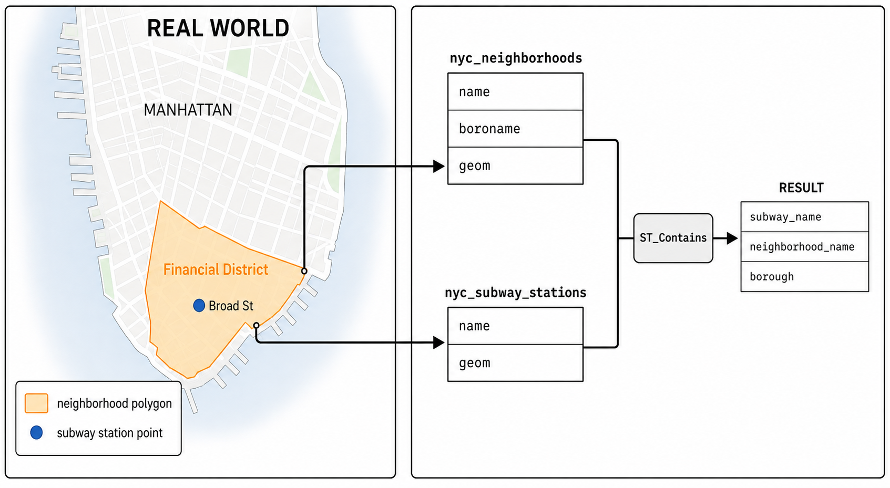
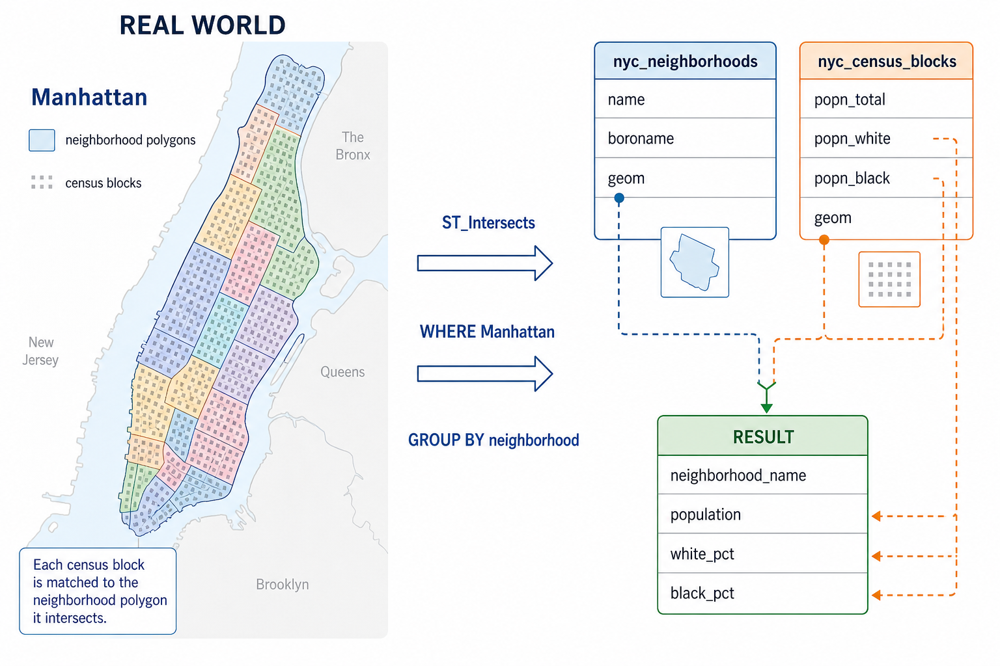
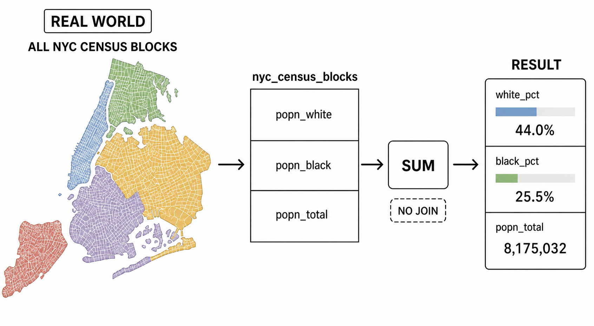
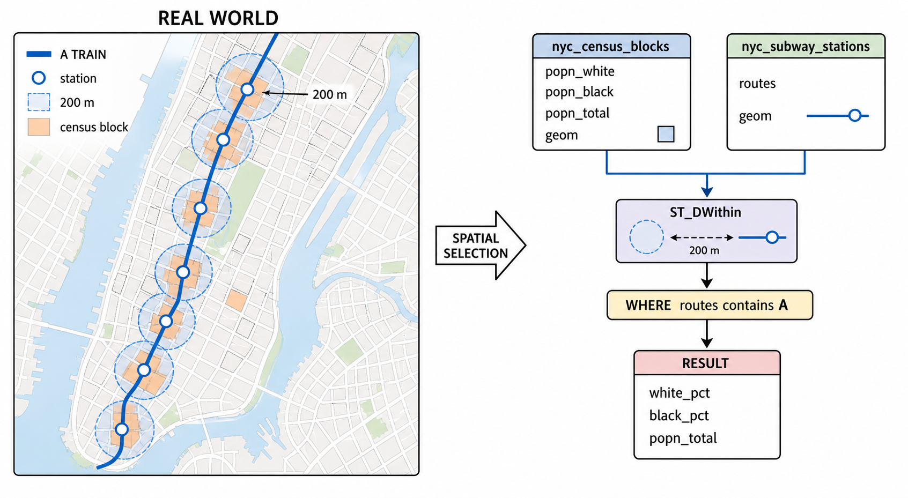
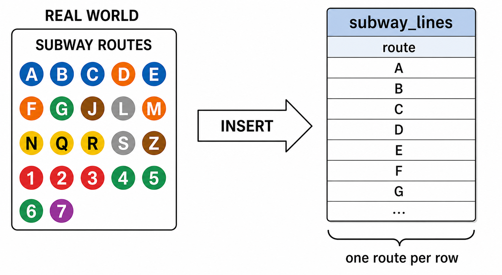
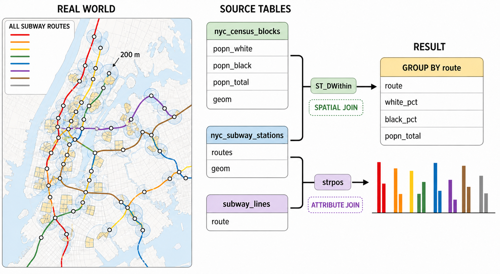

# 13. 공간 조인 (Spatial Joins)

> 공식 원문: [<https://postgis.net/workshops/postgis-intro/joins.html>](https://postgis.net/workshops/postgis-intro/joins.html)\
> 공식 소스의 본문·표·SQL·이미지를 현재 페이지 순서대로 반영했습니다.

**공간 조인(Spatial Join)**은 공간 데이터베이스의 핵심 기능 중 하나입니다. 기존 RDBMS의 외래 키(Foreign Key)나 식별자(ID) 대신 **공간적 관계(포함, 교차, 반경 등)**를 조인 키(Join Key)로 사용하여 서로 다른 테이블의 레코드를 결합합니다. 실무에서 다루는 대부분의 GIS 공간 분석은 공간 조인 쿼리로 구현됩니다.

앞 장에서는 먼저 'Broad St' 지하철역의 좌표를 조회한 뒤, 그 좌표를 다시 `ST_Intersects` 조건에 넣어 동네를 찾는 2단계 과정을 거쳤습니다.

공간 조인을 사용하면 이 과정을 단 하나의 SQL 쿼리로 우아하게 해결할 수 있습니다.



*그림 13-1. 현실 공간의 근린지역 폴리곤과 지하철역 포인트가 각각 `geom` 컬럼으로 저장되고, `ST_Contains`로 연결되는 과정입니다. 지도는 쿼리의 공간 개념을 설명하기 위한 개념도이며 실제 축척·경계를 나타내지 않습니다.*

```sql
SELECT
  subways.name AS subway_name,
  neighborhoods.name AS neighborhood_name,
  neighborhoods.boroname AS borough
FROM nyc_neighborhoods AS neighborhoods
JOIN nyc_subway_stations AS subways
  ON ST_Contains(neighborhoods.geom, subways.geom)
WHERE subways.name = 'Broad St';
```

```text
 subway_name | neighborhood_name  |  borough
-------------+--------------------+-----------
 Broad St    | Financial District | Manhattan
```

두 지오메트리 간의 공간 술어(참/거짓)를 판별하는 모든 함수(`ST_Intersects`, `ST_Contains`, `ST_Touches`, `ST_DWithin` 등)를 `ON` 절의 조인 조건으로 활용할 수 있습니다.

---

## 공간 조인 및 집계 요약 (Join and Summarize)

`JOIN`과 `GROUP BY`의 조합은 공간 데이터베이스에서 가장 강력한 통계 분석 기법입니다.

> **분석 질문**: "맨해튼(Manhattan) 내 각 근린지역(Neighborhood)별 총 인구수와 백인/흑인 인구 비율(%)은 어떻게 됩니까?"

인구 통계가 담긴 `nyc_census_blocks` 테이블과 동네 경계가 담긴 `nyc_neighborhoods` 테이블을 `ST_Intersects` 공간 조인으로 결합하고, 동네별로 집계(`GROUP BY`)합니다.



*그림 13-2. 맨해튼의 각 인구조사 블록을 교차하는 근린지역에 배정한 뒤, 근린지역별 인구와 인종 비율을 집계합니다. 지도는 학습용 개념도이며 실제 축척·경계를 나타내지 않습니다.*

```sql
SELECT
  neighborhoods.name AS neighborhood_name,
  sum(census.popn_total) AS population,
  100.0 * sum(census.popn_white) / sum(census.popn_total) AS white_pct,
  100.0 * sum(census.popn_black) / sum(census.popn_total) AS black_pct
FROM nyc_neighborhoods AS neighborhoods
JOIN nyc_census_blocks AS census
  ON ST_Intersects(neighborhoods.geom, census.geom)
WHERE neighborhoods.boroname = 'Manhattan'
GROUP BY neighborhoods.name
ORDER BY white_pct DESC;
```

```text
  neighborhood_name  | population | white_pct | black_pct
---------------------+------------+-----------+-----------
 Carnegie Hill       |      18763 |      90.1 |       1.4
 North Sutton Area   |      22460 |      87.6 |       1.6
 West Village        |      26718 |      87.6 |       2.2
 Upper East Side     |     203741 |      85.0 |       2.7
 Soho                |      15436 |      84.6 |       2.2
 Greenwich Village   |      57224 |      82.0 |       2.4
 Central Park        |      46600 |      79.5 |       8.0
 Tribeca             |      20908 |      79.1 |       3.5
 Gramercy            |     104876 |      75.5 |       4.7
 Murray Hill         |      29655 |      75.0 |       2.5
 Chelsea             |      61340 |      74.8 |       6.4
 Upper West Side     |     214761 |      74.6 |       9.2
 Midtown             |      76840 |      72.6 |       5.2
 Battery Park        |      17153 |      71.8 |       3.4
 Financial District  |      34807 |      69.9 |       3.8
 Clinton             |      32201 |      65.3 |       7.9
 East Village        |      82266 |      63.3 |       8.8
 Garment District    |      10539 |      55.2 |       7.1
 Morningside Heights |      42844 |      52.7 |      19.4
 Little Italy        |      12568 |      49.0 |       1.8
 Yorkville           |      58450 |      35.6 |      29.7
 Inwood              |      50047 |      35.2 |      16.8
 Washington Heights  |     169013 |      34.9 |      16.8
 Lower East Side     |      96156 |      33.5 |       9.1
 East Harlem         |      60576 |      26.4 |      40.4
 Hamilton Heights    |      67432 |      23.9 |      35.8
 Chinatown           |      16209 |      15.2 |       3.8
 Harlem              |     134955 |      15.1 |      67.1
```

### 쿼리의 내부 실행 메커니즘
1. `JOIN` 절은 공간 조건(`ST_Intersects`)을 만족하는 근린지역과 인구조사 블록의 행들을 매칭합니다.
2. `WHERE` 절은 대상 지역을 맨해튼으로 한정합니다.
3. `GROUP BY` 절은 동일한 근린지역(`neighborhoods.name`)별로 행들을 그룹화하고 `sum()` 집계 함수로 인구수를 합산합니다.
4. `ORDER BY` 절을 통해 백인 비율 내림차순으로 최종 정렬합니다.

---

## 거리 기반 공간 조인 (Distance Joins)

반경 거리 조건을 조인 키로 활용하면 "특정 시설로부터 일정 반경 이내의 통계 요약"을 쉽게 구할 수 있습니다.

> **분석 질문**: "뉴욕 지하철 A 노선(A-Train) 역사 반경 200m 이내에 거주하는 인구의 인종 구성은 뉴욕시 전체 평균과 어떻게 다를까요?"

먼저 뉴욕시 전체 인구 구성을 조회합니다.



*그림 13-3. 뉴욕시 전체 인구조사 블록을 대상으로 `popn_white`, `popn_black`, `popn_total`을 합산합니다. 이 기준 쿼리는 다른 테이블과 조인하지 않습니다. 지도는 학습용 개념도이며 실제 축척·경계를 나타내지 않습니다.*

```sql
SELECT
  100.0 * sum(popn_white) / sum(popn_total) AS white_pct,
  100.0 * sum(popn_black) / sum(popn_total) AS black_pct,
  sum(popn_total) AS popn_total
FROM nyc_census_blocks;
```

```text
    white_pct     |    black_pct     | popn_total
------------------+------------------+------------
 44.0039500762811 | 25.5465789002416 |    8175032
```

A 노선이 정차하는 역을 필터링하여 반경 200m 이내 인구조사 블록을 `ST_DWithin` 공간 조인으로 연결합니다.



*그림 13-4. A 노선 역 포인트의 200m 반경과 인구조사 블록을 `ST_DWithin`으로 연결합니다. 주황색 블록이 역세권 집계 대상이 되는 공간적 의미를 보여 줍니다. 지도는 학습용 개념도이며 실제 노선·축척을 나타내지 않습니다.*

```sql
SELECT
  100.0 * sum(popn_white) / sum(popn_total) AS white_pct,
  100.0 * sum(popn_black) / sum(popn_total) AS black_pct,
  sum(popn_total) AS popn_total
FROM nyc_census_blocks AS census
JOIN nyc_subway_stations AS subways
  ON ST_DWithin(census.geom, subways.geom, 200)
WHERE strpos(subways.routes, 'A') > 0;
```

```text
    white_pct     |    black_pct     | popn_total
------------------+------------------+------------
 45.5901255900202 | 22.0936235670937 |     189824
```

결과를 보면 A 노선 역세권 인구의 인종 구성은 뉴욕시 전체 평균(백인 44%, 흑인 25.5%)과 매우 유사함을 알 수 있습니다.

---

## 다중 테이블 고급 조인 (Multiple Joins)

모든 지하철 노선별 역세권 인종 분포를 한 번에 비교 분석하려면 어떻게 해야 할까요?

각 노선(A, B, C, 1, 2, 3...) 목록을 담은 테이블을 생성하고, 공간 조인과 속성 조인을 함께 결합합니다.



*그림 13-5. 현실의 지하철 노선 식별자를 `subway_lines.route`에 한 노선당 한 행으로 저장하여 조인용 기준 테이블을 만듭니다.*

```sql
CREATE TABLE subway_lines ( route char(1) );
INSERT INTO subway_lines (route) VALUES
  ('A'),('B'),('C'),('D'),('E'),('F'),('G'),
  ('J'),('L'),('M'),('N'),('Q'),('R'),('S'),
  ('Z'),('1'),('2'),('3'),('4'),('5'),('6'),
  ('7');
```



*그림 13-6. 인구조사 블록과 역을 `ST_DWithin`으로 공간 조인하고, 역의 `routes`와 노선 기준 테이블의 `route`를 `strpos`로 속성 조인한 뒤 노선별로 집계합니다. 지도는 학습용 개념도이며 실제 노선·축척을 나타내지 않습니다.*

```sql
SELECT
  lines.route,
  100.0 * sum(popn_white) / sum(popn_total) AS white_pct,
  100.0 * sum(popn_black) / sum(popn_total) AS black_pct,
  sum(popn_total) AS popn_total
FROM nyc_census_blocks AS census
JOIN nyc_subway_stations AS subways
  ON ST_DWithin(census.geom, subways.geom, 200)
JOIN subway_lines AS lines
  ON strpos(subways.routes, lines.route) > 0
GROUP BY lines.route
ORDER BY black_pct DESC;
```

```text
 route | white_pct | black_pct | popn_total
-------+-----------+-----------+------------
 S     |      39.8 |      46.5 |      33301
 3     |      42.7 |      42.1 |     223047
 5     |      33.8 |      41.4 |     218919
 2     |      39.3 |      38.4 |     291661
 C     |      46.9 |      30.6 |     224411
 4     |      37.6 |      27.4 |     174998
 B     |      40.0 |      26.9 |     256583
 A     |      45.6 |      22.1 |     189824
 J     |      37.6 |      21.6 |     132861
 Q     |      56.9 |      20.6 |     127112
 Z     |      38.4 |      20.2 |      87131
 D     |      39.5 |      19.4 |     234931
 L     |      57.6 |      16.8 |     110118
 G     |      49.6 |      16.1 |     135012
 6     |      52.3 |      15.7 |     260240
 1     |      59.1 |      11.3 |     327742
 F     |      60.9 |       7.5 |     229439
 M     |      56.5 |       6.4 |     174196
 E     |      66.8 |       4.7 |      90958
 R     |      58.5 |       4.0 |     196999
 N     |      59.7 |       3.5 |     147792
 7     |      35.7 |       3.5 |     102401
```

이처럼 공간 조인과 SQL 집계 기능을 결합하면 복잡한 도시 공간 지리학적 패턴을 단 몇 줄의 쿼리로 명쾌하게 도출할 수 있습니다.

---

## 함수 목록 (Function List)

- [ST_Contains(geometry A, geometry B)](http://postgis.net/docs/ST_Contains.html): 지오메트리 A가 지오메트리 B를 완전히 포함할 때 `TRUE`를 반환합니다.
- [ST_DWithin(geometry A, geometry B, radius)](http://postgis.net/docs/ST_DWithin.html): 두 지오메트리 간의 최단 거리가 지정된 반경 이내일 때 공간 인덱스를 활용하여 빠르게 `TRUE`를 반환합니다.
- [ST_Intersects(geometry A, geometry B)](http://postgis.net/docs/ST_Intersects.html): 두 지오메트리가 공간의 일부를 조금이라도 공유하면 `TRUE`를 반환합니다.
- [round(v numeric, s integer)](http://www.postgresql.org/docs/current/interactive/functions-math.html): 수치 값 `v`를 소수점 `s`자리로 반올림합니다.
- [strpos(string, substring)](http://www.postgresql.org/docs/current/static/functions-string.html): 문자열에서 특정 부분 문자열의 시작 위치(1-based)를 정수로 반환합니다 (없으면 0).
- [sum(expression)](http://www.postgresql.org/docs/current/static/functions-aggregate.html#FUNCTIONS-AGGREGATE-TABLE): 그룹 내 표현식 값의 총합계를 계산하는 집계 함수입니다.


---

[← 이전](12_spatial_relationships_exercises.md) · [목차](00_index.md) · [다음 →](14_joins_exercises.md)
