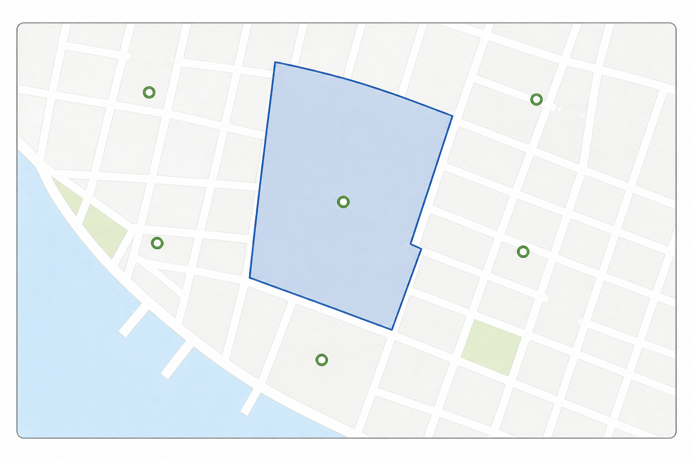
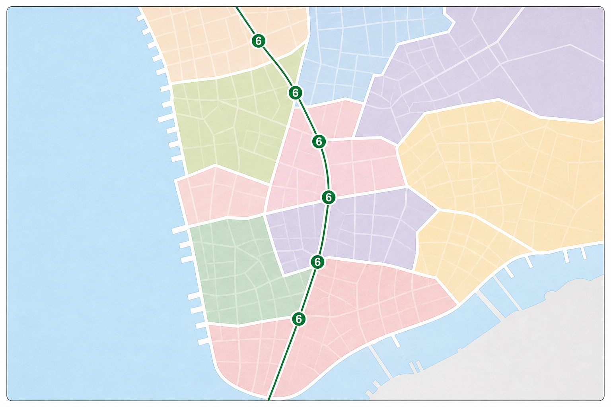
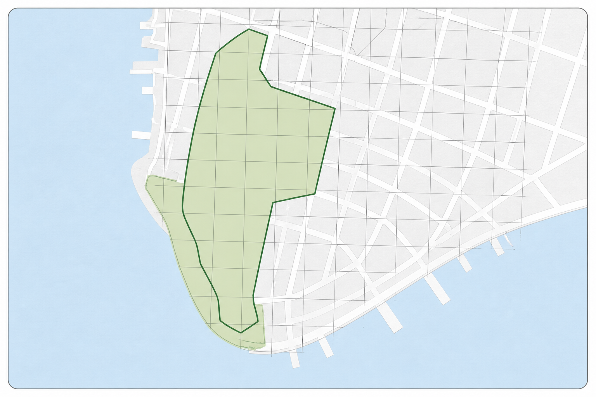
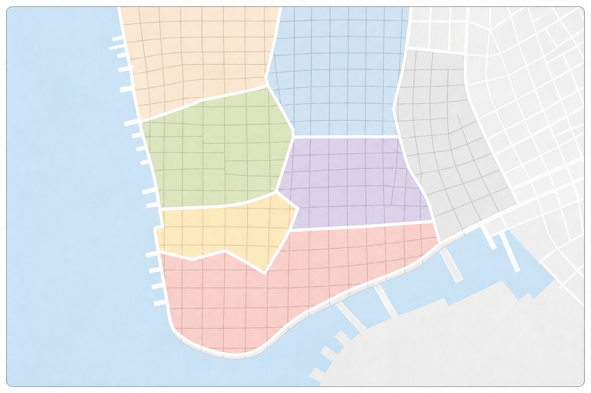

# 14. 공간 조인 실습 (Spatial Joins Exercises)

> 공식 원문: [<https://postgis.net/workshops/postgis-intro/joins_exercises.html>](https://postgis.net/workshops/postgis-intro/joins_exercises.html)\
> 공식 소스의 본문·표·SQL·이미지를 현재 페이지 순서대로 반영했습니다.

앞서 학습한 공간 조인 기법과 집계 함수를 활용하여 다음 실습 문제를 직접 해결해 보세요.

### 실습 참조 함수 요약
- `sum(expression)`: 값 집합의 총합계
- `count(expression)`: 레코드 개수
- `ST_Area(geometry)`: 폴리곤의 면적 계산
- `ST_Contains(geometry A, geometry B)`: A가 B를 완전히 포함하는지 검사
- `ST_Distance(geometry A, geometry B)`: 두 지오메트리 간 최단 거리 계산
- `ST_DWithin(geometry A, geometry B, radius)`: 두 지오메트리가 지정된 반경 이내에 있는지 고속 검사
- `ST_Intersects(geometry A, geometry B)`: 두 지오메트리가 공간을 공유(교차/접촉/포함)하는지 검사
- `ST_Length(linestring)`: 선의 길이 계산
- `ST_Touches(geometry A, geometry B)`: 두 지오메트리의 경계가 맞닿아 있는지 검사

### 실습 대상 테이블
- `nyc_census_blocks`: `blkid`, `popn_total`, `boroname`, `geom`
- `nyc_streets`: `name`, `type`, `geom`
- `nyc_subway_stations`: `name`, `routes`, `geom`
- `nyc_neighborhoods`: `name`, `boroname`, `geom`

---

## 연습 문제 및 정답

### 1. 'Little Italy' 근린지역에는 어떤 지하철역이 있으며, 어느 지하철 노선이 지나갑니까?



*그림 14-1. 강조된 근린지역과 지하철역 포인트의 포함 관계를 확인합니다. 역 이름과 노선 정보는 표시하지 않았습니다.*

```sql
SELECT s.name AS station_name, s.routes
FROM nyc_subway_stations AS s
JOIN nyc_neighborhoods AS n
  ON ST_Contains(n.geom, s.geom)
WHERE n.name = 'Little Italy';
```

```text
station_name | routes
-------------+--------
Spring St    | 6
```

---

### 2. 6번 지하철 노선(6-Train)이 경유하는 모든 근린지역과 자치구는 어디입니까?

*(힌트: `nyc_subway_stations` 테이블의 `routes` 컬럼에는 `B,D,6,V`, `4,5,6`과 같은 문자열이 저장되어 있습니다.)*



*그림 14-2. 6번 노선의 역 포인트와 근린지역 경계가 만나는 상황만 표시했습니다. 근린지역과 자치구 이름은 표시하지 않았습니다.*

```sql
SELECT DISTINCT n.name AS neighborhood, n.boroname AS borough
FROM nyc_subway_stations AS s
JOIN nyc_neighborhoods AS n
  ON ST_Contains(n.geom, s.geom)
WHERE strpos(s.routes, '6') > 0;
```

```text
    neighborhood    |  borough
--------------------+-----------
 Chinatown          | Manhattan
 East Harlem        | Manhattan
 Financial District | Manhattan
 Gramercy           | Manhattan
 Greenwich Village  | Manhattan
 Hunts Point        | The Bronx
 Little Italy       | Manhattan
 Midtown            | Manhattan
 Mott Haven         | The Bronx
 Murray Hill        | Manhattan
 Parkchester        | The Bronx
 Soundview          | The Bronx
 South Bronx        | The Bronx
 Upper East Side    | Manhattan
 Yorkville          | Manhattan
```

> [!NOTE]
> `DISTINCT` 키워드를 사용하여 하나의 동네 안에 지하철역이 여러 개 있더라도 중복 없이 동네 목록을 깔끔하게 추출했습니다.

---

### 3. 9/11 테러 직후 'Battery Park' 근린지역이 며칠간 통제되었을 때, 대피해야 했던 해당 지역 거주 인구는 총 몇 명입니까?



*그림 14-3. 통제 대상 영역과 인구조사 블록의 교차 관계만 표시했습니다. 인구 값과 집계 결과는 표시하지 않았습니다.*

```sql
SELECT sum(c.popn_total) AS evacuated_population
FROM nyc_neighborhoods AS n
JOIN nyc_census_blocks AS c
  ON ST_Intersects(n.geom, c.geom)
WHERE n.name = 'Battery Park';
```

```text
17153
```

---

### 4. 뉴욕시에서 인구 밀도($\text{명}/\text{km}^2$)가 가장 높은 근린지역 상위 2곳은 어디입니까?

*(힌트: $1\text{km}^2 = 1,000,000\text{m}^2$입니다.)*



*그림 14-4. 인구 밀도를 계산할 근린지역과 인구조사 블록의 공간 단위만 표시했습니다. 색상은 밀도나 순위를 뜻하지 않습니다.*

```sql
SELECT
  n.name AS neighborhood,
  sum(c.popn_total) / (ST_Area(n.geom) / 1000000.0) AS popn_per_sqkm
FROM nyc_census_blocks AS c
JOIN nyc_neighborhoods AS n
  ON ST_Intersects(c.geom, n.geom)
GROUP BY n.name, n.geom
ORDER BY popn_per_sqkm DESC
LIMIT 2;
```

```text
   neighborhood    |  popn_per_sqkm
-------------------+------------------
 North Sutton Area | 68435.13283772678
 East Village      | 50404.48341332535
```


---

[← 이전](13_joins.md) · [목차](00_index.md) · [다음 →](15_indexing.md)
