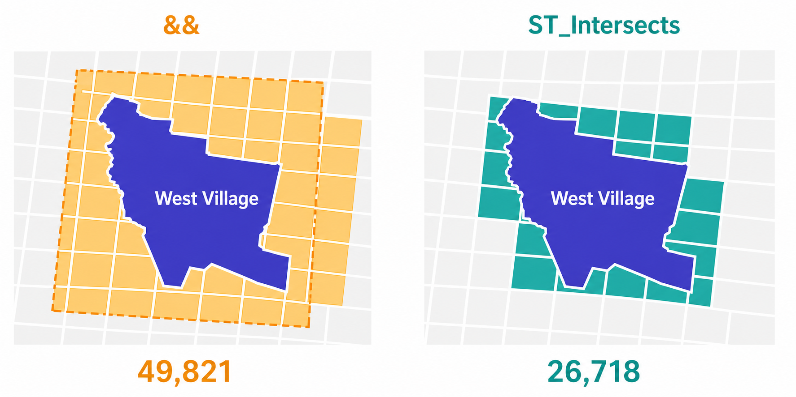
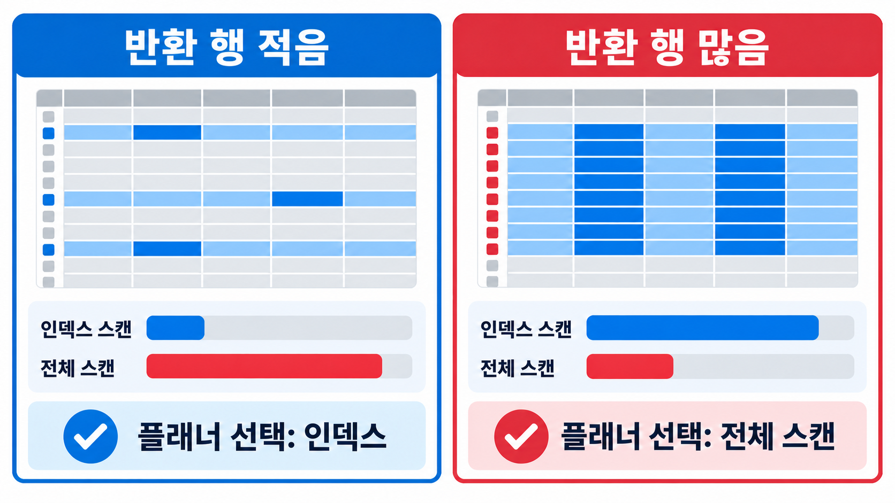

# 15. 공간 인덱싱 (Spatial Indexing)

> 공식 원문: [<https://postgis.net/workshops/postgis-intro/indexing.html>](https://postgis.net/workshops/postgis-intro/indexing.html)\
> 공식 소스의 본문·표·SQL·이미지를 현재 페이지 순서대로 반영했습니다.

**공간 인덱스(Spatial Index)**는 공간 데이터 타입, 공간 함수와 함께 공간 데이터베이스를 지탱하는 3대 핵심 기둥 중 하나입니다. 대용량 공간 데이터 세트를 실무에서 원활하게 운용할 수 있는 이유는 바로 공간 인덱스가 있기 때문입니다.

인덱스가 없다면 특정 공간 피처를 찾을 때마다 데이터베이스 내의 모든 레코드를 일일이 대조하는 **순차 스캔(Sequential Scan / Full Table Scan)**이 발생합니다. 예를 들어 각각 10,000개의 레코드를 가진 두 테이블을 인덱스 없이 공간 조인하면 $10,000 \times 10,000 = 100,000,000$번(1억 번)의 정밀 기하 비교 연산이 필요합니다. 하지만 공간 인덱스를 활용하면 바운딩 박스 검색 트리로 후보군을 좁혀 비교 횟수를 수만 번 수준으로 극적으로 줄일 수 있습니다.

---

## 인덱스 성능 체감 실습

로딩된 데이터 세트에는 이미 GiST 공간 인덱스가 생성되어 있습니다. 인덱스의 성능 차이를 체감하기 위해 먼저 인덱스를 삭제해 보겠습니다.

```sql
DROP INDEX nyc_census_blocks_geom_idx;
```

> [!NOTE]
> `DROP INDEX` 문은 기존 인덱스를 삭제합니다. 자세한 내용은 PostgreSQL [공식 문서](http://www.postgresql.org/docs/current/interactive/sql-dropindex.html)를 참고하세요.

pgAdmin 쿼리 도구 창 우측 하단의 실행 시간(Timing)을 확인하면서 다음 공간 조인 쿼리를 실행합니다.

```sql
SELECT count(blocks.blkid)
FROM nyc_census_blocks AS blocks
JOIN nyc_subway_stations AS subways
  ON ST_Contains(blocks.geom, subways.geom)
WHERE subways.name LIKE 'B%';
```

```text
count
-----
46
```

`nyc_census_blocks` 테이블은 수천 건 수준의 비교적 작은 데이터셋임에도 불구하고 인덱스가 없을 때는 약 **300ms** 이상의 시간이 소요됩니다.

이제 GiST 공간 인덱스를 다시 생성하고 동일한 쿼리를 실행해 봅니다.

```sql
CREATE INDEX nyc_census_blocks_geom_idx
  ON nyc_census_blocks
  USING GIST (geom);
```

> [!NOTE]
> `USING GIST` 절은 PostgreSQL에게 **일반화된 검색 트리(GiST, Generalized Search Tree)** 구조를 사용하여 공간 인덱스를 구축하도록 지시합니다. 만약 `USING GIST` 절을 누락하고 기본 B-트리로 공간 인덱스를 생성하려 하면 `ERROR: index row requires ... maximum size is 8191` 오류가 발생합니다.

인덱스를 생성한 후 쿼리를 다시 실행하면 실행 시간이 **50ms** 이하로 대폭 단축됩니다. 데이터 테이블의 크기가 수십만~수백만 건으로 커질수록 공간 인덱스 유무에 따른 성능 차이는 수천 배에 달하게 됩니다.

---

## 공간 인덱스의 2단계 필터링 원리 (Two-Pass System)

표준 데이터베이스 인덱스(B-Tree)는 1차원 정렬 순서를 기반으로 계층 트리를 만듭니다. 반면 2차원 공간 객체는 복잡한 형태를 가지므로 지오메트리 자체를 직접 트리에 넣는 대신 각 객체의 **경계 상자(Bounding Box, 바운딩 박스)**를 인덱싱합니다.


*그림 15-1. 실제 지오메트리에서는 노란색 별과 빨간색 선만 교차합니다. 바운딩 박스로 먼저 검사하면 빨간색 선과 파란색 선이 모두 후보가 되며, 이후 정밀 판정에서 파란색 선이 제외됩니다.*

위 그림에서 노란색 별과 실제로 교차하는 선은 빨간색 선 **1개**뿐입니다. 그러나 노란색 별의 경계 상자(노란색 박스)와 교차하는 경계 상자는 빨간색과 파란색 박스 **2개**입니다.

공간 데이터베이스는 다음과 같은 **2단계 평가 시스템(Two-Pass System)**으로 쿼리를 최적화합니다.

1. **1단계 (인덱스 필터 - 대략적 근사)**: 초고속 공간 인덱스(R-Tree)를 사용하여 질의 영역의 경계 상자와 겹치는 경계 상자를 가진 후보 객체들을 신속하게 추려냅니다.
2. **2단계 (정밀 연산 - 정확한 검증)**: 1단계 인덱스 필터를 통과한 후보군 객체들에 대해서만 복잡한 정밀 공간 기하 연산(`ST_Intersects`, `ST_Contains` 등)을 수행합니다.

이러한 2단계 접근법 덕분에 수백만 건의 대규모 데이터에서도 CPU 연산량을 획기적으로 줄일 수 있습니다.

PostGIS는 [R-Tree](http://postgis.net/docs/support/rtree.pdf) 구조를 PostgreSQL의 GiST 프레임워크 위에 구현하여 데이터의 밀도 변화와 다양한 크기의 공간 객체를 자동으로 균형 있게 분할 관리합니다.


*그림 15-2. R-tree는 개별 객체의 바운딩 박스(d~j)를 더 큰 영역 A·B·C로 계층화합니다. 검색 영역과 겹치는 상위 영역만 따라 내려가므로 모든 객체를 하나씩 비교하지 않아도 됩니다.*

---

## 공간 인덱스가 자동 적용되는 주요 함수

다음 공간 함수들은 쿼리 실행 시 내부적으로 `&&` 바운딩 박스 연산자를 포함하고 있어 **공간 인덱스를 자동으로 활용(Index-accelerated)**합니다.

- [ST_Intersects](http://postgis.net/docs/ST_Intersects.html)
- [ST_Contains](http://postgis.net/docs/ST_Contains.html)
- [ST_Within](http://postgis.net/docs/ST_Within.html)
- [ST_DWithin](http://postgis.net/docs/ST_DWithin.html)
- [ST_ContainsProperly](http://postgis.net/docs/ST_ContainsProperly.html)
- [ST_CoveredBy](http://postgis.net/docs/ST_CoveredBy.html)
- [ST_Covers](http://postgis.net/docs/ST_Covers.html)
- [ST_Overlaps](http://postgis.net/docs/ST_Overlaps.html)
- [ST_Crosses](http://postgis.net/docs/ST_Crosses.html)
- [ST_DFullyWithin](http://postgis.net/docs/ST_DFullyWithin.html)
- [ST_3DIntersects](http://postgis.net/docs/ST_3DIntersects.html)
- [ST_3DDWithin](http://postgis.net/docs/ST_3DDWithin.html)
- [ST_3DDFullyWithin](http://postgis.net/docs/ST_3DDFullyWithin.html)
- [ST_LineCrossingDirection](http://postgis.net/docs/ST_LineCrossingDirection.html)
- [ST_OrderingEquals](http://postgis.net/docs/ST_OrderingEquals.html)
- [ST_Equals](http://postgis.net/docs/ST_Equals.html)

---

## 인덱스 전용 연산자 (&& Operator)

정밀한 지오메트리 계산 없이 경계 상자(Bounding Box)가 겹치는지만 빠르게 검사하고 싶다면 **`&&` 연산자**를 사용합니다.

- `geom_a && geom_b`: A의 경계 상자와 B의 경계 상자가 서로 겹치거나 맞닿으면 `TRUE`를 반환합니다.

### 인덱스 전용 쿼리 vs 정밀 공간 쿼리 비교

'West Village' 근린지역에 대한 인덱스 전용(`&&`) 인구 집계:

```sql
SELECT sum(popn_total)
FROM nyc_neighborhoods AS neighborhoods
JOIN nyc_census_blocks AS blocks
  ON neighborhoods.geom && blocks.geom
WHERE neighborhoods.name = 'West Village';
```

```text
49821
```

정밀 공간 함수(`ST_Intersects`)를 사용한 인구 집계:

```sql
SELECT sum(popn_total)
FROM nyc_neighborhoods AS neighborhoods
JOIN nyc_census_blocks AS blocks
  ON ST_Intersects(neighborhoods.geom, blocks.geom)
WHERE neighborhoods.name = 'West Village';
```

```text
26718
```



*그림 15-3. 왼쪽 `&&`는 West Village의 바운딩 박스와 겹치는 주황색 블록을 모두 합산하여 49,821을 반환합니다. 오른쪽 `ST_Intersects`는 실제 근린지역 도형과 교차하는 청록색 블록만 합산하여 26,718을 반환합니다. 도형과 블록은 차이를 설명하기 위한 개념도입니다.*

첫 번째 쿼리는 경계 상자만 겹치는 외곽 블록까지 모두 포함했기 때문에 인구가 과다 집계되었습니다. 반면 두 번째 쿼리는 실제 다각형 경계와 교차하는 블록만 정확히 집계했습니다.

---

## 통계 수집 및 쿼리 플래너 최적화 (ANALYZE)

PostgreSQL의 비용 기반 쿼리 플래너(Cost-based Query Planner)는 쿼리 실행 시 인덱스를 사용할지, 전체 스캔을 할지 지능적으로 결정합니다. 반환할 레코드 수가 테이블 전체의 상당수를 차지하는 경우, 인덱스를 경유하는 것보다 전체 테이블을 순차적으로 읽는 것이 더 빠를 수 있습니다.



*그림 15-4. 예상 반환 행이 적으면 필요한 행만 찾는 인덱스 스캔의 비용이 전체 스캔보다 낮으므로 플래너가 인덱스를 선택합니다. 반대로 테이블의 상당 부분을 반환하면 인덱스와 테이블을 반복해서 접근하는 비용이 커지므로, 순차적으로 읽는 전체 스캔의 예상 비용이 더 낮아질 수 있습니다. 막대 길이는 플래너가 비교하는 상대적인 예상 비용을 나타냅니다.*

쿼리 플래너가 올바른 실행 계획을 세우려면 테이블 컬럼의 데이터 분포 통계가 최신 상태로 유지되어야 합니다. 대량의 데이터를 새로 로딩하거나 삭제/수정한 후에는 반드시 **`ANALYZE` 명령**을 실행해 주어야 합니다.

```sql
ANALYZE nyc_census_blocks;
```

---

## 테이블 정리 및 공간 회수 (VACUUM)

PostgreSQL에서 데이터의 `UPDATE`나 `DELETE`가 빈번하게 발생하면 기존 데이터 페이지에 사용되지 않는 빈 공간(Dead Tuples)이 남게 됩니다. **`VACUUM` 명령**은 이러한 사용되지 않는 빈 공간을 회수하여 재사용할 수 있도록 정리해 줍니다.

PostgreSQL은 백그라운드에서 주기적으로 `autovacuum` 데몬을 실행하지만, 대규모 데이터 임포트나 일괄 수정 작업을 마친 직후에는 수동으로 `VACUUM ANALYZE`를 실행하는 것이 권장됩니다.

```sql
VACUUM ANALYZE nyc_census_blocks;
```

---

## 함수 목록 (Function List)

- [geometry_a && geometry_b](http://postgis.net/docs/geometry_overlaps.html): 지오메트리 A의 경계 상자가 지오메트리 B의 경계 상자와 겹치면 `TRUE`를 반환합니다 (인덱스 전용 연산자).
- [geometry_a = geometry_b](http://postgis.net/docs/ST_Geometry_EQ.html): 두 지오메트리의 형상과 정점이 완전히 동일한지 비교합니다 (PostGIS 2.4+).
- [geometry_a ~= geometry_b](http://postgis.net/docs/ST_Geometry_Same.html): 두 지오메트리의 경계 상자(Bounding Box)가 정확히 일치하면 `TRUE`를 반환합니다.
- [ST_Intersects(geometry_a, geometry_b)](http://postgis.net/docs/ST_Intersects.html): 두 지오메트리가 공간을 공유하면 공간 인덱스를 활용하여 빠르게 `TRUE`를 반환합니다.


---

[← 이전](14_joins_exercises.md) · [목차](00_index.md) · [다음 →](16_projection.md)
