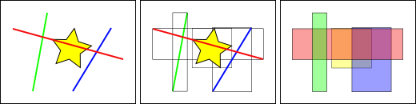

# 15. 공간 인덱싱 (Spatial Indexing)

> 공식 원문: [<https://postgis.net/workshops/postgis-intro/indexing.html>](https://postgis.net/workshops/postgis-intro/indexing.html)\
> 공식 소스의 본문·표·SQL·이미지를 현재 페이지 순서대로 반영했습니다.

공간 인덱스는 공간 데이터베이스의 세 가지 주요 기능 중 하나입니다. 인덱스를 사용하면 대규모 데이터 세트에 공간 데이터베이스를 사용할 수 있습니다. 색인을 작성하지 않으면 기능을 검색할 때 데이터베이스의 모든 레코드에 대한 "순차 스캔"이 필요합니다. 인덱싱은 특정 레코드를 찾기 위해 빠르게 탐색할 수 있는 검색 트리로 데이터를 구성하여 검색 속도를 높입니다.

공간 인덱스는 PostGIS의 가장 큰 자산 중 하나입니다. 이전 예에서 공간 조인을 작성하려면 전체 테이블을 서로 비교해야 합니다. 이는 매우 비용이 많이 들 수 있습니다. 인덱스 없이 각각 10,000개의 레코드로 구성된 두 테이블을 결합하려면 100,000,000번의 비교가 필요합니다. 인덱스를 사용하면 비용이 20,000번의 비교만큼 낮아질 수 있습니다.

데이터 로드 파일에는 이미 모든 테이블에 대한 공간 인덱스가 포함되어 있으므로 인덱스의 효율성을 입증하기 위해 먼저 이를 제거해야 합니다.

공간 인덱스를 사용하지 않고 `nyc_census_blocks`를 조회해 보겠습니다.

첫 번째 단계는 인덱스를 **remove**하는 것입니다.

```sql
DROP INDEX nyc_census_blocks_geom_idx;
```

> [!NOTE]
> `DROP INDEX` 문은 데이터베이스 시스템에서 기존 인덱스를 삭제합니다. 자세한 내용은 PostgreSQL [문서](http://www.postgresql.org/docs/current/interactive/sql-dropindex.html)를 참조하세요.

이제 pgAdmin 쿼리 창의 오른쪽 하단에 있는 "Timing" 미터를 확인하고 다음을 실행하세요. 우리의 쿼리는 "B"로 시작하는 지하철 정류장이 포함된 블록을 식별하기 위해 모든 단일 인구 조사 블록을 검색합니다.

```sql
SELECT count(blocks.blkid)
 FROM nyc_census_blocks blocks
 JOIN nyc_subway_stations subways
 ON ST_Contains(blocks.geom, subways.geom)
 WHERE subways.name LIKE 'B%';
```

    count
    ---------------
    46

`nyc_census_blocks` 테이블은 매우 작기 때문에(레코드가 수천 개에 불과) 인덱스가 없어도 테스트 컴퓨터에서 쿼리에 **300ms**만 걸립니다.

이제 공간 인덱스를 다시 추가하고 쿼리를 다시 실행하세요.

```sql
CREATE INDEX nyc_census_blocks_geom_idx
  ON nyc_census_blocks
  USING GIST (geom);
```

> [!NOTE]
> `USING GIST` 절은 PostgreSQL에 인덱스를 구축할 때 일반 인덱스 구조(GIST)를 사용하도록 지시합니다. 인덱스를 생성할 때 `ERROR: index row requires 11340 bytes, maximum size is 8191`와 같은 오류가 표시되면 `USING GIST` 절 추가를 무시했을 가능성이 높습니다.

내 테스트 컴퓨터에서는 시간이 **50ms**로 떨어졌습니다. 테이블이 클수록 인덱싱된 쿼리의 상대적 속도 향상 효과도 커집니다.

## 공간 인덱스 작동 방식

표준 데이터베이스 인덱스는 인덱싱되는 열의 값을 기반으로 계층 트리를 만듭니다. 공간 색인은 약간 다릅니다. 즉, 기하학적 특징 자체를 색인화할 수 없으며 대신 지형지물의 경계 상자를 색인화합니다.



위 그림에서 노란색 별과 교차하는 선의 개수는 **one**, 빨간색 선입니다. 그러나 노란색 상자와 교차하는 기능의 경계 상자는 빨간색과 파란색 상자인 **two**입니다.

데이터베이스가 "노란색 별과 교차하는 선"에 대한 질문에 효율적으로 대답하는 방법은 먼저 색인(매우 빠른)을 사용하여 "노란색 상자와 교차하는 상자"에 대한 질문에 대답한 다음 "노란색 별과 교차하는 선"에 대한 정확한 계산을 수행하는 것입니다 **첫 번째 테스트에서 반환된 기능에 대해서만**.

큰 테이블의 경우 대략적인 인덱스를 먼저 평가한 다음 정확한 테스트를 수행하는 이 "2단계" 시스템은 쿼리에 응답하는 데 필요한 계산량을 근본적으로 줄일 수 있습니다.

PostGIS와 Oracle Spatial은 모두 동일한 "R-Tree"[^1] 공간 인덱스 구조를 공유합니다. R-Tree는 데이터를 직사각형, 하위 직사각형, 하위 하위 직사각형 등으로 나눕니다. 이는 가변 데이터 밀도, 다양한 객체 중첩 양 및 객체 크기를 자동으로 처리하는 자체 조정 인덱스 구조입니다.


## 공간적으로 인덱스된 함수

공간 인덱스가 있는 경우 함수의 하위 집합만 자동으로 공간 인덱스를 사용합니다.

- [ST_교차](http://postgis.net/docs/ST_Intersects.html)
- [ST_포함](http://postgis.net/docs/ST_Contains.html)
- [ST_내부](http://postgis.net/docs/ST_Within.html)
- [ST_D내부](http://postgis.net/docs/ST_DWithin.html)
- [ST_ContainsProperly](http://postgis.net/docs/ST_ContainsProperly.html)
- [ST_CoveredBy](http://postgis.net/docs/ST_CoveredBy.html)
- [ST_커버](http://postgis.net/docs/ST_Covers.html)
- [ST_오버랩](http://postgis.net/docs/ST_Overlaps.html)
- [ST_크로스](http://postgis.net/docs/ST_Crosses.html)
- [ST_DFullyWithin](http://postgis.net/docs/ST_DFullyWithin.html)
- [ST_3D교차](http://postgis.net/docs/ST_3DIntersects.html)
- [ST_3DD내](http://postgis.net/docs/ST_3DDWithin.html)
- [ST_3DDFullyWithin](http://postgis.net/docs/ST_3DDFullyWithin.html)
- [ST_LineCrossingDirection](http://postgis.net/docs/ST_LineCrossingDirection.html)
- [ST_OrderingEquals](http://postgis.net/docs/ST_OrderingEquals.html)
- [ST_Equals](http://postgis.net/docs/ST_Equals.html)

처음 4개는 쿼리에서 가장 일반적으로 사용되는 것이며, [ST_DWithin](http://postgis.net/docs/ST_DWithin.html)은 "거리 내" 또는 "반경 내" 스타일 쿼리를 수행하는 동시에 인덱스에서 성능 향상을 얻는 데 매우 중요합니다.

이 목록에 없는 다른 함수(가장 일반적으로 [ST_Relate](http://postgis.net/docs/ST_Relate.html))에 인덱스 가속을 추가하려면 아래 설명된 대로 인덱스 전용 절을 추가하세요.

## 인덱스 전용 쿼리

PostGIS에서 일반적으로 사용되는 대부분의 기능(`ST_Contains`, `ST_Intersects`, `ST_DWithin` 등)에는 인덱스 필터가 자동으로 포함됩니다. 그러나 일부 기능(예: `ST_Relate`)에는 인덱스 필터가 포함되어 있지 않습니다.

필터링 없이 인덱스를 사용하여 경계 상자 검색을 수행하려면 `&&` 연산자를 사용하세요. 기하학의 경우 `&&` 연산자는 숫자의 경우 `=` 연산자가 "값이 동일함"을 의미하는 것과 같은 방식으로 "경계 상자가 겹치거나 닿음"을 의미합니다.

'West Village' 인구에 대한 인덱스 전용 쿼리를 보다 정확한 쿼리와 비교해 보겠습니다. `&&`를 사용하면 인덱스 전용 쿼리는 다음과 같습니다.

```sql
SELECT Sum(popn_total)
FROM nyc_neighborhoods neighborhoods
JOIN nyc_census_blocks blocks
ON neighborhoods.geom && blocks.geom
WHERE neighborhoods.name = 'West Village';
```

    49821

이제 더 정확한 `ST_Intersects` 함수를 사용하여 동일한 쿼리를 수행해 보겠습니다.

```sql
SELECT Sum(popn_total)
FROM nyc_neighborhoods neighborhoods
JOIN nyc_census_blocks blocks
ON ST_Intersects(neighborhoods.geom, blocks.geom)
WHERE neighborhoods.name = 'West Village';
```

    26718

훨씬 낮은 대답입니다! 첫 번째 쿼리는 경계 상자가 이웃의 경계 상자와 교차하는 모든 블록을 요약했습니다. 두 번째 쿼리는 이웃 자체와 교차하는 블록만 요약했습니다.

## 분석 중

PostgreSQL 쿼리 플래너는 쿼리를 평가하기 위해 인덱스를 사용할지 여부를 지능적으로 선택합니다. 반직관적으로, 인덱스 검색을 수행하는 것이 항상 더 빠른 것은 아닙니다. 검색이 테이블의 모든 레코드를 반환하는 경우 각 레코드를 얻기 위해 인덱스 트리를 순회하는 것은 처음부터 전체 테이블을 순차적으로 읽는 것보다 실제로 더 느립니다.

쿼리 사각형의 크기를 아는 것만으로는 쿼리가 많은 수의 레코드를 반환하는지 아니면 적은 수의 레코드를 반환하는지 파악하는 데 충분하지 않습니다. 아래의 빨간색 사각형은 작지만 파란색 사각형보다 더 많은 레코드를 반환합니다.


어떤 상황(테이블의 작은 부분을 읽는 것과 테이블의 큰 부분을 읽는 것)을 파악하기 위해 PostgreSQL은 인덱싱된 각 테이블 열의 데이터 분포에 대한 통계를 유지합니다. 기본적으로 PostgreSQL은 정기적으로 통계를 수집합니다. 그러나 짧은 시간 내에 테이블의 내용을 크게 변경하면 통계가 최신 상태로 유지되지 않습니다.

통계가 테이블 내용과 일치하는지 확인하려면 테이블에서 대량 데이터를 로드하고 삭제한 후 `ANALYZE` 명령을 실행하는 것이 좋습니다. 이렇게 하면 통계 시스템이 인덱싱된 모든 열에 대한 데이터를 수집하게 됩니다.

`ANALYZE` 명령은 PostgreSQL에 테이블을 탐색하고 쿼리 계획 추정에 사용되는 내부 통계를 업데이트하도록 요청합니다(쿼리 계획 분석은 나중에 설명합니다).

```sql
ANALYZE nyc_census_blocks;
```

## 진공청소기

인덱스를 생성하는 것만으로는 PostgreSQL이 인덱스를 효과적으로 사용할 수 없다는 점을 강조할 가치가 있습니다. 테이블에 대해 많은 수의 UPDATE, INSERT 또는 DELETE가 실행될 때마다 VACUUMing을 수행해야 합니다. `VACUUM` 명령은 PostgreSQL에 레코드 업데이트 또는 삭제로 인해 남겨진 테이블 페이지의 사용되지 않은 공간을 회수하도록 요청합니다.

Vacuum은 PostgreSQL이 기본적으로 "autovacuum" 기능을 제공하는 데이터베이스의 효율적인 실행을 위해 매우 중요합니다.

Autovacuum은 활동 수준에 따라 결정된 적절한 간격으로 테이블을 진공화(공간 복구)하고 분석(통계 업데이트)합니다. 이는 트랜잭션이 많은 데이터베이스에 필수적이지만 인덱스를 추가하거나 데이터를 대량 로드한 후 autovacuum 실행을 기다리는 것은 바람직하지 않습니다. 대규모 일괄 업데이트가 수행될 때마다 `VACUUM`를 수동으로 실행해야 합니다.

필요에 따라 데이터베이스를 비우고 분석하는 작업을 별도로 수행할 수 있습니다. `VACUUM` 명령을 실행하면 데이터베이스 통계가 업데이트되지 않습니다. 마찬가지로 `ANALYZE` 명령을 실행해도 사용되지 않은 테이블 행은 복구되지 않습니다. 두 명령 모두 전체 데이터베이스, 단일 테이블 또는 단일 열에 대해 실행할 수 있습니다.

```sql
VACUUM ANALYZE nyc_census_blocks;
```

## 기능 목록

[geometry_a && 기하학_b](http://postgis.net/docs/geometry_overlaps.html): A의 경계 상자가 B의 경계 상자와 겹치는 경우 TRUE를 반환합니다.

[geometry_a = 기하학_b](http://postgis.net/docs/ST_Geometry_EQ.html): A의 경계 상자가 B의 경계 상자와 동일한 경우 PostGIS 2.4가 true를 반환하기 전입니다. 2.4부터 A의 형상이 B와 동일한 경우에만 TRUE를 반환합니다.

[geometry_a ~= 기하학_b](http://postgis.net/docs/ST_Geometry_Same.html): A의 경계 상자가 B의 경계 상자와 같으면 TRUE를 반환합니다.

[ST_Intersects(geometry_a, 기하학_b)](http://postgis.net/docs/ST_Intersects.html): 기하학/지리학이 "공간적으로 교차"하는 경우(공간의 모든 부분 공유) TRUE를 반환하고 그렇지 않은 경우(분리됨) FALSE를 반환합니다.

**Footnotes**

------------------------------------------------------------------------

[^1]: <http://postgis.net/docs/support/rtree.pdf>


---

[← 이전](14_joins_exercises.md) · [목차](00_index.md) · [다음 →](16_projection.md)
