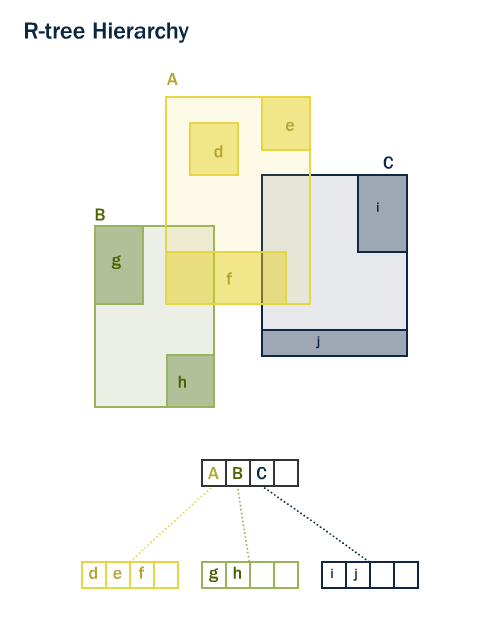
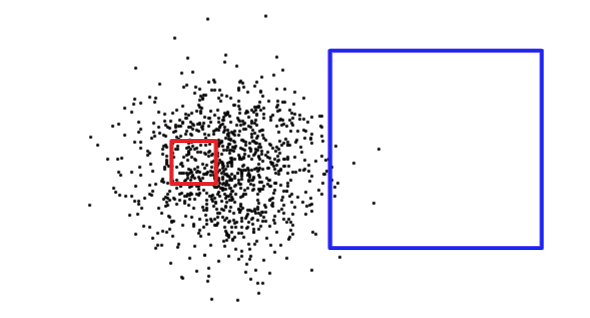

# 15. 공간 인덱싱 (Spatial Indexing)

일반적인 데이터베이스 인덱스(B-Tree)는 1차원 데이터의 대소 비교(정렬)를 기반으로 동작하므로 2차원 공간 데이터에는 적합하지 않습니다.

PostGIS는 **GiST (Generalized Search Tree)**를 기반으로 한 **R-Tree 계층형 공간 인덱스**를 사용하여 수백만 개의 공간 객체도 밀리초(ms) 단위로 빠르게 검색합니다.



---

## 1. 공간 인덱스의 작동 원리: Bounding Box (MBR)

공간 인덱스는 복잡한 지오메트리 원본 대신 각 객체를 감싸는 최소 경계 사각형(**MBR** 또는 **Bounding Box**)을 트리 형태로 계층화하여 저장합니다.

공간 검색은 2단계(Two-Pass)로 진행됩니다:
1. **1단계 (인덱스 필터링 - Fast)**: 바운딩 박스끼리 겹치는 후보군을 인덱스에서 초고속으로 선별
2. **2단계 (정밀 연산 - Exact)**: 선별된 후보군에 대해서만 실제 복잡한 지오메트리 연산(`ST_Intersects` 등) 수행



---

## 2. 공간 인덱스 생성 문법

```sql
-- nyc_census_blocks 테이블의 geom 컬럼에 GiST 인덱스 생성
CREATE INDEX nyc_census_blocks_geom_idx
ON nyc_census_blocks
USING GIST (geom);
```

---

## 3. 공간 바운딩 박스 연산자 (`&&`)

`&&` 연산자는 두 객체의 바운딩 박스가 겹치는지(`Intersects Box`)만 검사합니다.
- `ST_Intersects`, `ST_Contains`, `ST_DWithin` 등의 함수는 내부적으로 자동으로 이 `&&` 인덱스 연산자를 포함하고 있으므로 별도로 작성하지 않아도 인덱스를 자동으로 활용합니다.

```sql
-- 특정 바운딩 박스와 겹치는 블록 조회
SELECT count(*)
FROM nyc_census_blocks
WHERE geom && ST_MakeEnvelope(583000, 4504000, 584000, 4505000, 26918);
```

---

## 4. 인덱스 통계 갱신 (VACUUM ANALYZE)

대량의 데이터를 삽입하거나 수정한 후에는 PostgreSQL 쿼리 플래너가 공간 인덱스를 최적의 효율로 활용할 수 있도록 통계를 갱신해야 합니다:

```sql
VACUUM ANALYZE nyc_census_blocks;
```

---

| [⬅️ 14. 공간 조인 실습 (Spatial Joins Exercises)](14_joins_exercises.md) | [🏠 워크숍 목차](README.md) | [16. 데이터 투영 (Projecting Data) ➡️](16_projection.md) |
| :--- | :---: | ---: |
