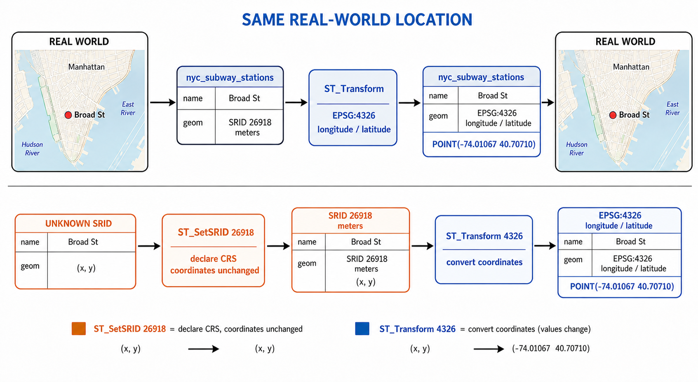

# 16. 데이터 투영 (Projecting Data)

> 공식 원문: [<https://postgis.net/workshops/postgis-intro/projection.html>](https://postgis.net/workshops/postgis-intro/projection.html)\
> 공식 소스의 본문·표·SQL·이미지를 현재 페이지 순서대로 반영했습니다.

지구는 둥근 회전타원체(Spheroid/Geoid) 형태이므로, 왜곡 없이 2차원 평면 지도나 모니터 화면에 그대로 옮길 수 없습니다. 이 때문에 용도와 지역에 따라 다양한 **지도 투영법(Map Projections)**이 개발되었습니다.

- **등적 투영(Equal-Area)**: 면적의 비율을 정확히 보존합니다 (면적 비교 및 통계 분석에 적합).
- **정각 투영(Conformal)**: 각도와 형태를 국소적으로 보존합니다 (메르카토르 투영, 항해 및 네비게이션에 적합).
- **등거리 투영(Equidistant)**: 특정 기준점으로부터의 거리를 정확히 보존합니다.

모든 투영법은 구면 좌표(경도/위도)를 평면 직교 좌표(X, Y)로 변환하며, 최적의 투영법은 데이터의 지리적 범위와 분석 목적에 따라 결정됩니다.

PostGIS에서는 다음과 같은 주요 함수로 좌표계를 관리하고 변환합니다.

- `ST_Transform(geometry, target_srid)`: 지오메트리의 좌표를 다른 공간 참조 체계(SRID)로 재투영 변환합니다.
- `ST_SRID(geometry)`: 지오메트리에 설정된 SRID 번호를 반환합니다.
- `ST_SetSRID(geometry, srid)`: 지오메트리의 좌표값은 그대로 둔 채 메타데이터인 SRID 번호만 변경합니다.

---

## spatial_ref_sys 테이블의 좌표계 정의 구조

지오메트리의 SRID를 확인해 보겠습니다.

```sql
SELECT ST_SRID(geom) FROM nyc_streets LIMIT 1;
```

```text
26918
```

`spatial_ref_sys` 테이블에서 SRID `26918`의 상세 정의를 조회해 봅니다.

```sql
SELECT * FROM spatial_ref_sys WHERE srid = 26918;
```

PostGIS의 재투영 엔진(PROJ 라이브러리 연동)은 다음 우선순위로 투영 정의를 해석합니다.

1. **`auth_name` / `auth_srid`**: PROJ 내부 카탈로그에서 공식 기관명(EPSG 등)과 식별 코드를 찾아 투영 파라미터를 구성합니다.
2. **`srtext`**: 표준 OGC WKT 형식의 좌표계 정의 문자열을 파싱합니다.
3. **`proj4text`**: 레거시 PROJ.4 파라미터 문자열을 파싱합니다.

> [!TIP]
> 커스텀 사용자 정의 좌표계를 등록할 때는 `srtext` 컬럼을 충실히 작성해야 합니다. GeoServer, QGIS, FME 등 외부 오픈 소스 및 상용 GIS 도구들이 대부분 `srtext`의 WKT 정의를 읽어 좌표계를 인식하기 때문입니다.

---

## 서로 다른 SRID 간의 비교 오류

모든 공간 연산(`ST_Intersects`, `ST_Equals`, `ST_Distance` 등)을 수행하려면 비교 대상이 되는 두 지오메트리가 반드시 **동일한 SRID**를 가져야 합니다.

SRID가 서로 다른 지오메트리를 비교하면 데이터베이스 오류가 발생합니다.

```sql
SELECT ST_Equals(
  ST_GeomFromText('POINT(0 0)', 4326),
  ST_GeomFromText('POINT(0 0)', 26918)
);
```

```text
ERROR: ST_Equals: Operation on mixed SRID geometries (Point, 4326) != (Point, 26918)
```

> [!IMPORTANT]
> 쿼리 실행 시마다 `ST_Transform`으로 즉석 변환하는 것은 지양해야 합니다. 공간 인덱스는 테이블에 저장된 원래 SRID를 기준으로 구축되므로, `WHERE` 절에서 컬럼을 `ST_Transform`으로 감싸면 공간 인덱스를 활용할 수 없어 성능이 급격히 저하됩니다. 데이터베이스 내의 공간 테이블들은 가급적 **통일된 단일 SRID**로 저장하고, 외부 시스템과 연동할 때만 변환하는 것이 최선입니다.

---

## 좌표계 변환 실습 (ST_Transform)

SRID `26918` (NAD83 / UTM zone 18N, 미터 단위 투영 좌표계)로 저장된 'Broad St' 지하철역의 위치를 전 세계 표준 경위도 좌표계인 **EPSG:4326 (WGS84)**으로 변환해 보겠습니다.



*그림 16-1. `ST_Transform`은 같은 현실 위치를 다른 좌표계의 좌표값으로 변환합니다. 반면 `ST_SetSRID`는 기존 `(x, y)` 값의 좌표계를 선언할 뿐 값을 변환하지 않으므로, 원래 좌표계를 정확히 알고 있을 때만 사용해야 합니다. 지도는 위치 관계를 설명하는 개념도입니다.*

```sql
SELECT ST_AsText(ST_Transform(geom, 4326))
FROM nyc_subway_stations
WHERE name = 'Broad St';
```

```text
POINT(-74.01067146887341 40.70710481558761)
```

출력 결과를 보면 서경 $74.01^\circ$, 북위 $40.707^\circ$라는 직관적인 위경도 좌표로 변환된 것을 확인할 수 있습니다.

### SRID가 없는 지오메트리에 SRID 부여 후 변환

SRID가 0(Unknown)으로 생성된 지오메트리는 먼저 `ST_SetSRID`로 원래 좌표계를 선언해 준 다음 `ST_Transform`을 호출해야 합니다.

```sql
SELECT ST_AsText(
  ST_Transform(
    ST_SetSRID(geom, 26918),
    4326
  )
)
FROM geometries;
```

---

## 함수 목록 (Function List)

- [ST_AsText(geometry)](http://postgis.net/docs/ST_AsText.html): 지오메트리를 사람이 읽을 수 있는 WKT(Well-Known Text) 문자열로 반환합니다.
- [ST_SetSRID(geometry, srid)](http://postgis.net/docs/ST_SetSRID.html): 지오메트리의 좌표값은 변경하지 않고 메타데이터인 SRID 정수값만 설정합니다.
- [ST_SRID(geometry)](http://postgis.net/docs/ST_SRID.html): 지오메트리의 공간 참조 식별자(SRID) 번호를 반환합니다.
- [ST_Transform(geometry, target_srid)](http://postgis.net/docs/ST_Transform.html): 지오메트리의 좌표를 대상 SRID의 공간 참조 체계로 변환(재투영)한 새 지오메트리를 반환합니다.


---

[← 이전](15_indexing.md) · [목차](00_index.md) · [다음 →](17_projection_exercises.md)
