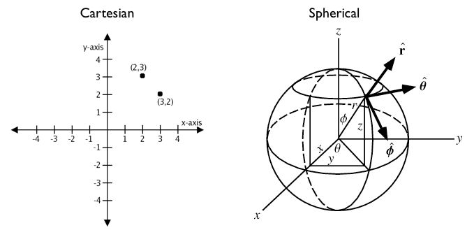

# 18. 지오그래피 (Geography)

PostGIS는 두 가지 주요 공간 데이터 타입을 지원합니다:
1. **`GEOMETRY`**: 유클리드 2차원 평면 공간 모델 (단위: 투영계 단위, 주로 미터 또는 도)
2. **`GEOGRAPHY`**: 지구 타원체(구면/Spheroid) 곡면 공간 모델 (단위: 항상 **미터(Meter)**, 입력 좌표: 경위도 EPSG:4326)



---

## 1. 왜 GEOGRAPHY 타입이 필요한가?

평면 지오메트리(Geometry)에서 경위도(EPSG:4326) 데이터를 그대로 두고 거리를 계산하면 다음과 같은 심각한 문제가 발생합니다:
- `ST_Distance(geom1, geom2)`의 결과 단위가 "각도(Degree)"로 계산됨
- 극지방으로 갈수록 경도 1도의 실제 물리적 거리가 급격히 줄어드는 왜곡을 반영하지 못함

`GEOGRAPHY` 타입을 사용하면 구면 대권 거리(Great-circle / Geodesic)를 자동으로 계산하여 항상 **정확한 실제 미터(Meter) 단위 거리**를 반환합니다.

---

## 2. Geography 타입 사용법

컬럼 생성 또는 캐스팅(`::geography`)을 통해 사용합니다:

```sql
-- 로스앤젤레스와 뉴욕 사이의 비행 거리(미터 -> km) 계산 (구면 연산)
SELECT ST_Distance(
  'SRID=4326;POINT(-118.4079 33.9425)'::geography, -- LAX
  'SRID=4326;POINT(-73.7789 40.6397)'::geography    -- JFK
) / 1000.0 AS distance_km;
```

결과:
```text
3975.05 km (지구 곡면을 반영한 정확한 대권 거리)
```

---

## 3. GEOMETRY vs GEOGRAPHY 선택 가이드

| 특성 | GEOMETRY | GEOGRAPHY |
| :--- | :--- | :--- |
| **공간 모델** | 평면 직각좌표 (Euclidean) | 타원체 구면 곡면 (Spherical) |
| **적합한 데이터 범위** | 도시, 주, 단일 국가 등 로컬 영역 | 전 세계, 대륙 간 글로벌 영역 |
| **연산 속도** | 매우 빠름 (평면 수학) | 상대적으로 느림 (복잡한 구면 삼각법) |
| **지원 함수** | PostGIS의 모든 500+ 함수 지원 | 핵심 함수 지원 (`ST_Distance`, `ST_DWithin`, `ST_Intersects` 등) |

---

| [⬅️ 17. 투영 실습 (Projection Exercises)](17_projection_exercises.md) | [🏠 워크숍 목차](README.md) | [19. 지오그래피 실습 (Geography Exercises) ➡️](19_geography_exercises.md) |
| :--- | :---: | ---: |
