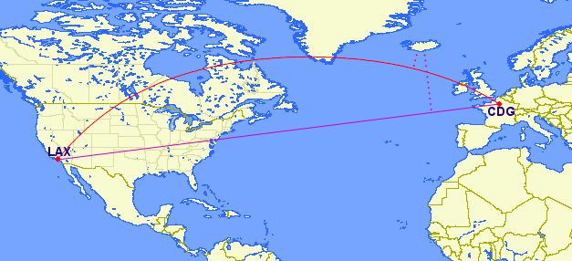
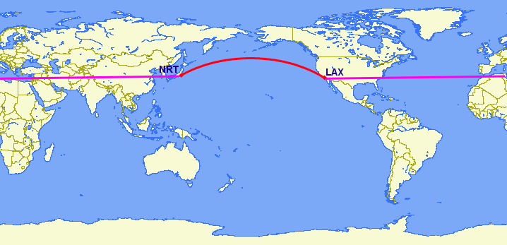

# 18. 지오그래피 (Geography)

> 공식 원문: [<https://postgis.net/workshops/postgis-intro/geography.html>](https://postgis.net/workshops/postgis-intro/geography.html)\
> 공식 소스의 본문·표·SQL·이미지를 현재 페이지 순서대로 반영했습니다.

좌표가 "지리" 또는 "위도/경도"인 데이터를 갖는 것은 매우 일반적입니다.

Mercator, UTM 또는 Stateplane의 좌표와 달리 지리적 좌표는 **직교 좌표가 아닙니다**. 지리적 좌표는 평면에 표시된 원점으로부터의 선형 거리를 나타내지 않습니다. 오히려 이러한 **구형 좌표**는 지구본의 각도 좌표를 나타냅니다. 구면 좌표에서 점은 기준 자오선(경도)으로부터의 회전 각도와 적도(위도)로부터의 각도로 지정됩니다.


지리적 좌표를 대략적인 데카르트 좌표로 처리하고 계속해서 공간 계산을 수행할 수 있습니다. 그러나 거리, 길이 및 면적의 측정값은 **nonsensical**입니다. 구형 좌표는 **angular** 거리를 측정하므로 단위는 "도"입니다. 또한 교차 및 포함과 같은 인덱스 및 참/거짓 테스트의 대략적인 결과가 크게 잘못될 수 있습니다. 극지방이나 국제 날짜 변경선과 같은 문제 영역에 접근할수록 지점 사이의 거리가 더 커집니다.

예를 들어 로스앤젤레스와 파리의 좌표는 다음과 같습니다.

- 로스앤젤레스: `POINT(-118.4079 33.9434)`
- 파리: `POINT(2.3490 48.8533)`

다음은 표준 PostGIS Cartesian `ST_Distance(geometry, geometry)`를 사용하여 로스앤젤레스와 파리 사이의 거리를 계산합니다. 4326의 SRID는 지리 공간 참조 시스템을 선언합니다.

```sql
SELECT ST_Distance(
  'SRID=4326;POINT(-118.4079 33.9434)'::geometry, -- Los Angeles (LAX)
  'SRID=4326;POINT(2.5559 49.0083)'::geometry     -- Paris (CDG)
  );
```

    121.898285970107

아하! 122! 그런데 그게 무슨 뜻이에요?

공간 참조(4326)의 단위는 도입니다. 그래서 우리의 대답은 122도입니다. 그런데 (다시) 그게 무슨 뜻이에요?

구에서 1도 제곱의 크기는 매우 가변적이며 적도에서 멀어질수록 작아집니다. 극을 향해 갈수록 지구의 자오선(수직선)이 서로 가까워진다고 생각해 보세요. 따라서 122도의 거리는 아무 *의미*도 아닙니다. 말도 안되는 숫자입니다.

의미 있는 거리를 계산하려면 지리적 좌표를 대략적인 데카르트 좌표가 아닌 실제 구면 좌표로 처리해야 합니다. 우리는 대권의 일부인 구 위의 실제 경로로서 점 사이의 거리를 측정해야 합니다.

PostGIS는 `geography` 유형을 통해 이 기능을 제공합니다.

> [!NOTE]
> 공간 데이터베이스마다 "지리적 처리"에 대한 접근 방식이 다릅니다.
>
> - Oracle은 SRID가 지리적인 경우 지리적 계산을 투명하게 수행하여 차이점을 무시하려고 시도합니다.
> - SQL Server는 데카르트 데이터용 "STGeometry"와 지리용 "STGeography"라는 두 가지 공간 유형을 사용합니다.
> - Informix Spatial은 Informix에 대한 순수한 데카르트 확장인 반면, Informix Geodetic은 순수한 지리적 확장입니다.
> - SQL Server와 마찬가지로 PostGIS는 "기하학"과 "지리"라는 두 가지 유형을 사용합니다.

`geometry` 유형 대신 `geography`를 사용하여 로스앤젤레스와 파리 사이의 거리를 다시 측정해 보겠습니다.

```sql
SELECT ST_Distance(
  'SRID=4326;POINT(-118.4079 33.9434)'::geography, -- Los Angeles (LAX)
  'SRID=4326;POINT(2.5559 49.0083)'::geography     -- Paris (CDG)
  );
```

    9124665.27317673

큰 숫자! `geography` 계산의 모든 반환 값은 **meters**에 있으므로 답은 9125km입니다.

이전 버전의 PostGIS는 `ST_Distance_Spheroid(point, point, measurement)` 함수를 사용하여 구에 대한 매우 기본적인 계산을 지원했습니다. 그러나 `ST_Distance_Spheroid`는 실질적으로 제한적입니다. 이 기능은 점에서만 작동하며 극점 또는 국제 날짜 변경선에 대한 인덱싱을 지원하지 않습니다.

"로스앤젤레스에서 파리로 가는 비행기가 아이슬란드에 얼마나 가까이 갈 수 있을까요?"와 같은 질문을 던지면 비점 기하학을 지원해야 할 필요성이 매우 분명해집니다.



데카르트 평면(보라색 선)에서 지리 좌표를 사용하면 실제로 *매우* 잘못된 답이 나옵니다! 대권 루트(빨간색 선)를 사용하면 정답이 됩니다. LAX-CDG 비행을 연속선으로 변환하고 `geography`를 사용하여 아이슬란드 지점까지의 거리를 계산하면 미터 단위의 정답(재현율)을 얻을 수 있습니다.

```sql
SELECT ST_Distance(
  ST_GeographyFromText('LINESTRING(-118.4079 33.9434, 2.5559 49.0083)'), -- LAX-CDG
  ST_GeographyFromText('POINT(-22.6056 63.9850)')                        -- Iceland (KEF)
);
```

    502454.906643729

따라서 LAX-CDG 노선에서 아이슬란드에 가장 가까운 접근 경로(국제공항에서 측정 시)는 상대적으로 작은 502km입니다.

지리적 좌표를 처리하는 데카르트식 접근 방식은 국제 날짜 변경선을 가로지르는 지형지물에 대해 완전히 무너집니다. 로스앤젤레스에서 도쿄까지의 최단 대권 경로는 태평양을 횡단합니다. 가장 짧은 데카르트 경로는 대서양과 인도양을 횡단합니다.



```sql
SELECT ST_Distance(
  ST_GeometryFromText('Point(-118.4079 33.9434)'),  -- LAX
  ST_GeometryFromText('Point(139.733 35.567)'))     -- NRT (Tokyo/Narita)
    AS geometry_distance,
ST_Distance(
  ST_GeographyFromText('Point(-118.4079 33.9434)'), -- LAX
  ST_GeographyFromText('Point(139.733 35.567)'))    -- NRT (Tokyo/Narita)
    AS geography_distance;
```

    geometry_distance | geography_distance
    -------------------+--------------------
     258.146005837336 |   8833954.76996256

## 지리 활용

기하학 데이터를 지리 테이블에 로드하려면 먼저 기하학을 EPSG:4326(경도/위도)으로 투영한 다음 지리로 변경해야 합니다. `ST_Transform(geometry,srid)` 함수는 좌표를 지리로 변환하고 `Geography(geometry)` 함수 또는 `::geography` 접미사를 지리로 "캐스트"합니다.

```sql
CREATE TABLE nyc_subway_stations_geog AS
SELECT
  ST_Transform(geom,4326)::geography AS geog,
  name,
  routes
FROM nyc_subway_stations;
```

지리 테이블에 공간 인덱스를 작성하는 것은 기하학의 경우와 완전히 동일합니다.

```sql
CREATE INDEX nyc_subway_stations_geog_gix
ON nyc_subway_stations_geog USING GIST (geog);
```

차이점은 내부에 있습니다. 지리 색인은 극 또는 국제 날짜 변경선을 포함하는 쿼리를 올바르게 처리하지만 기하학 색인은 그렇지 않습니다.

다음은 엠파이어 스테이트 빌딩에서 500미터 이내에 있는 모든 지하철역을 찾는 쿼리입니다.

```sql
WITH empire_state_building AS (
  SELECT 'POINT(-73.98501 40.74812)'::geography AS geog
)
SELECT name,
  ST_Distance(esb.geog, ss.geog) AS distance,
  degrees(ST_Azimuth(esb.geog, ss.geog)) AS direction
FROM nyc_subway_stations_geog ss,
     empire_state_building esb
WHERE ST_DWithin(ss.geog, esb.geog, 500);
```

지리 유형에는 소수의 기본 함수만 있습니다.

- `ST_AsText(geography)`는 `text`를 반환합니다.
- `ST_GeographyFromText(text)`는 `geography`를 반환합니다.
- `ST_AsBinary(geography)`는 `bytea`를 반환합니다.
- `ST_GeogFromWKB(bytea)`는 `geography`를 반환합니다.
- `ST_AsSVG(geography)`는 `text`를 반환합니다.
- `ST_AsGML(geography)`는 `text`를 반환합니다.
- `ST_AsKML(geography)`는 `text`를 반환합니다.
- `ST_AsGeoJson(geography)`는 `text`를 반환합니다.
- `ST_Distance(geography, geography)`는 `double`를 반환합니다.
- `ST_DWithin(geography, geography, float8)`는 `boolean`를 반환합니다.
- `ST_Area(geography)`는 `double`를 반환합니다.
- `ST_Length(geography)`는 `double`를 반환합니다.
- `ST_Covers(geography, geography)`는 `boolean`를 반환합니다.
- `ST_CoveredBy(geography, geography)`는 `boolean`를 반환합니다.
- `ST_Intersects(geography, geography)`는 `boolean`를 반환합니다.
- `ST_Buffer(geography, float8)`는 `geography`[^1]을 반환합니다.
- `ST_Intersection(geography, geography)`는 `geography`[^2]를 반환합니다.

## 지리 테이블 만들기

지리 열이 포함된 새 테이블을 생성하는 SQL은 형상 테이블을 생성하는 SQL과 매우 유사합니다. 그러나 지리에는 테이블 생성 시 객체 유형을 직접 지정하는 기능이 포함되어 있습니다. 예를 들어:

```sql
CREATE TABLE airports (
    code VARCHAR(3),
    geog GEOGRAPHY(Point)
  );

INSERT INTO airports
  VALUES ('LAX', 'POINT(-118.4079 33.9434)');
INSERT INTO airports
  VALUES ('CDG', 'POINT(2.5559 49.0083)');
INSERT INTO airports
  VALUES ('KEF', 'POINT(-22.6056 63.9850)');
```

테이블 정의에서 `GEOGRAPHY(Point)`는 공항 데이터 유형을 포인트로 지정합니다. 새 지리 필드는 `geometry_columns` 보기에 등록되지 않습니다. 대신 `geography_columns`라는 뷰에 등록됩니다.

```sql
SELECT * FROM geography_columns;
```

    f_table_name    | f_geography_column | srid |   type
    --------------------------+--------------------+------+----------
    nyc_subway_stations_geog | geog               |    0 | Geometry
    airports                 | geog               | 4326 | Point

> [!NOTE]
> 위 출력에서는 일부 열이 생략되었습니다.

## 기하학으로 캐스팅

지리 유형에 대한 기본 기능은 많은 사용 사례를 처리할 수 있지만, 기하학 유형에서만 지원되는 다른 기능에 액세스해야 하는 경우가 있습니다. 다행히 개체를 지리에서 기하학으로 앞뒤로 변환할 수 있습니다.

캐스팅을 위한 PostgreSQL 구문 규칙은 캐스팅하려는 값의 끝에 `::typename`를 추가하는 것입니다. 따라서 `2::text`는 숫자 2를 텍스트 문자열 '2'로 변환합니다. 그리고 `'POINT(0 0)'::geometry`는 점의 텍스트 표현을 기하학 점으로 변환합니다.

`ST_X(point)` 기능은 기하학 유형만 지원합니다. 우리 지역에서 X 좌표를 어떻게 읽을 수 있나요?

```sql
SELECT code, ST_X(geog::geometry) AS longitude FROM airports;
```

    code | longitude
    ------+-----------
    LAX  | -118.4079
    CDG  |    2.5559
    KEF  |  -21.8628

지리 값에 `::geometry`를 추가하여 개체를 SRID가 4326인 기하학으로 변환합니다. 여기에서 원하는 만큼 많은 기하학 함수를 사용할 수 있습니다. 하지만 기억하세요. 이제 우리의 객체는 기하학이므로 좌표는 구형 좌표가 아닌 데카르트 좌표로 해석됩니다.

## 지리학을 사용하지 않는 이유

지리학은 보편적으로 허용되는 좌표입니다. 모든 사람이 위도/경도의 의미를 이해하지만 UTM 좌표의 의미를 이해하는 사람은 거의 없습니다. 왜 항상 지리를 사용하지 않습니까?

- 첫째, 앞서 언급한 것처럼 지리 유형을 직접 지원하는 사용 가능한 기능이 (현재) 훨씬 적습니다. 지역 유형 제한을 해결하는 데 많은 시간을 소비할 수 있습니다.
- 둘째, 구에 대한 계산은 데카르트 계산보다 계산 비용이 훨씬 더 많이 듭니다. 예를 들어, 거리에 대한 데카르트 공식(피타고라스)에는 sqrt()에 대한 한 번의 호출이 포함됩니다. 거리에 대한 구형 공식(Haversine)에는 2개의 sqrt() 호출, 1개의 arctan() 호출, 4개의 sin() 호출 및 2개의 cos() 호출이 포함됩니다. 삼각함수는 매우 비용이 많이 들고 구형 계산에는 많은 함수가 포함됩니다.

결론은?

**데이터가 지리적으로 컴팩트한 경우**(주, 카운티 또는 시 내에 포함됨) 데이터에 적합한 **데카르트 투영이 있는 도형 유형을 사용**하세요. 가능한 참조 시스템을 선택하려면 <http://epsg.io> 사이트를 참조하고 지역 이름을 입력하세요.

**지리적으로 분산된**(전 세계 대부분을 포괄하는) 데이터세트로 거리를 측정해야 하는 경우 **지리 유형을 사용하세요.** `geography`에서 작업하면 애플리케이션 복잡성이 줄어 성능 문제가 상쇄됩니다. 그리고 `geometry`로 캐스팅하면 대부분의 기능 제한을 상쇄할 수 있습니다.

## 기능 목록

[ST_Distance(geometry, 기하학)](http://postgis.net/docs/ST_Distance.html): 기하학 유형의 경우 두 기하학 사이의 2차원 데카르트 최소 거리(공간 참조 기준)를 투영 단위로 반환합니다. 지리 유형의 경우 기본적으로 두 지리 간의 구형 최소 거리(미터)를 반환합니다.

[ST_GeographyFromText(text)](http://postgis.net/docs/ST_GeographyFromText.html): Well-Known Text 표현 또는 확장(WKT)에서 지정된 지리 값을 반환합니다.

[ST_Transform(geometry, srid)](http://postgis.net/docs/ST_Transform.html): 정수 매개변수가 참조하는 SRID로 좌표가 변환된 새 기하학을 반환합니다.

[ST_X(점)](http://postgis.net/docs/ST_X.html): 점의 X 좌표를 반환하거나, 사용할 수 없는 경우 NULL을 반환합니다. 입력은 포인트여야 합니다.

[ST_Azimuth(geography_A, geography_B)](http://postgis.net/docs/ST_Azimuth.html): A에서 B까지의 방향을 라디안 단위로 반환합니다.

[ST_DWithin(geography_A, geography_B, R)](http://postgis.net/docs/ST_DWithin.html): A가 B의 R 미터 내에 있는 경우 true를 반환합니다.

**Footnotes**

------------------------------------------------------------------------

[^1]: 버퍼 및 교차 기능은 실제로 형상에 대한 캐스트 위에 있는 래퍼이며 기본적으로 구형 좌표에서 수행되지 않습니다. 결과적으로 평면 표현으로 완전히 변환할 수 없는 범위가 매우 큰 객체에 대해서는 올바른 결과를 반환하지 못할 수 있습니다.

    예를 들어 `ST_Buffer(geography,distance)` 함수는 지리 개체를 "최상의" 투영으로 변환하고 버퍼링한 다음 다시 지리로 변환합니다. "최상의" 투영이 없는 경우(객체가 너무 큰 경우) 작업이 실패하거나 잘못된 형식의 버퍼를 반환할 수 있습니다.

[^2]: 버퍼 및 교차 기능은 실제로 형상에 대한 캐스트 위에 있는 래퍼이며 기본적으로 구형 좌표에서 수행되지 않습니다. 결과적으로 평면 표현으로 완전히 변환할 수 없는 범위가 매우 큰 객체에 대해서는 올바른 결과를 반환하지 못할 수 있습니다.

    예를 들어 `ST_Buffer(geography,distance)` 함수는 지리 개체를 "최상의" 투영으로 변환하고 버퍼링한 다음 다시 지리로 변환합니다. "최상의" 투영이 없는 경우(객체가 너무 큰 경우) 작업이 실패하거나 잘못된 형식의 버퍼를 반환할 수 있습니다.


---

[← 이전](17_projection_exercises.md) · [목차](00_index.md) · [다음 →](19_geography_exercises.md)