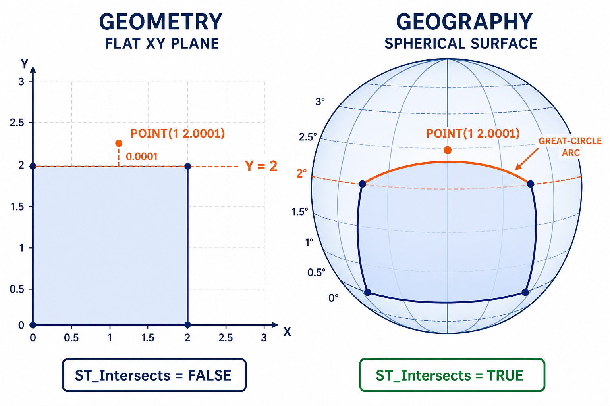

# 19. 지오그래피 실습 (Geography Exercises)

> 공식 원문: [<https://postgis.net/workshops/postgis-intro/geography_exercises.html>](https://postgis.net/workshops/postgis-intro/geography_exercises.html)\
> 공식 소스의 본문·표·SQL·이미지를 현재 페이지 순서대로 반영했습니다.

앞서 학습한 지오그래피 함수들을 활용하여 다음 실습 문제를 직접 해결해 보세요.

### 실습 참조 함수 요약
- `sum(expression)`: 값 집합의 총합계
- `ST_GeographyFromText(text)`: WKT 문자열로부터 지오그래피 객체 생성
- `ST_Distance(geography, geography)`: 타원체 상의 최단 거리 계산 (미터 단위)
- `ST_Length(geography)`: 타원체 상의 선형 경로 길이 계산 (미터 단위)
- `ST_Intersects(geography, geography)`: 타원체 상에서 두 객체가 공간을 공유하는지 검사

---

## 연습 문제 및 정답

### 1. 뉴욕과 시애틀 사이의 거리는 얼마이며, 반환된 값의 단위는 무엇입니까?

> [!NOTE]
> - 뉴욕(NYC): `POINT(-74.0064 40.7142)`
> - 시애틀(Seattle): `POINT(-122.3331 47.6097)`

```sql
SELECT ST_Distance(
  'POINT(-74.0064 40.7142)'::geography,
  'POINT(-122.3331 47.6097)'::geography
) AS distance_meters;
```

```text
distance_meters
----------------
3875538.57141352
```

- **계산 결과**: 약 **3,875.54km** ($3,875,538.57\text{m}$)
- **단위**: **미터(Meter)**

---

### 2. WGS84 회전타원체 상에서 측정한 뉴욕시 전체 도로의 총 연장은 얼마입니까?

```sql
SELECT sum(
  ST_Length(
    Geography(ST_Transform(geom, 4326))
  )
) AS total_length_meters
FROM nyc_streets;
```

```text
total_length_meters
-------------------
10421999.666
```

> [!NOTE]
> 타원체 상에서 계산된 총 연장은 약 **10,422.00km**입니다. 앞서 17장에서 평면 State Plane 투영(SRID 2831)으로 계산한 값(10,421.99km)과 거의 정확하게 일치($0.0001\%$ 미만 오차)함을 확인할 수 있습니다.

---

### 3. 점 `POINT(1 2.0001)`은 사각형 `POLYGON((0 0, 0 2, 2 2, 2 0, 0 0))`과 교차합니까? `geography`와 `geometry`에서 결과가 서로 다르게 나오는 이유는 무엇입니까?



*그림 19-1. `geometry`의 윗변은 $Y=2$인 직선이므로 점이 바깥에 있지만, `geography`의 같은 두 끝점을 잇는 경계는 북쪽으로 휘는 대권 호이므로 점이 폴리곤 내부에 놓입니다.*

```sql
-- 지오그래피 (구면 대권 경로)
SELECT ST_Intersects(
  'POINT(1 2.0001)'::geography,
  'POLYGON((0 0, 0 2, 2 2, 2 0, 0 0))'::geography
) AS geog_intersects;

-- 지오메트리 (평면 직선)
SELECT ST_Intersects(
  'POINT(1 2.0001)'::geometry,
  'POLYGON((0 0, 0 2, 2 2, 2 0, 0 0))'::geometry
) AS geom_intersects;
```

```text
 geog_intersects | geom_intersects
-----------------+-----------------
 true            | false
```

### 결과가 다른 이유
- **평면 지오메트리(`geometry`)**: $(0, 2)$와 $(2, 2)$를 잇는 상단 변이 완벽한 2차원 수평 직선($Y = 2$)을 이룹니다. 질의 점 $(1, 2.0001)$은 $Y = 2$ 선보다 위에 있으므로 폴리곤 외부에 위치하여 `false`를 반환합니다.
- **구면 지오그래피(`geography`)**: $(0, 2)$와 $(2, 2)$를 잇는 최단 경로는 평면 직선이 아니라 둥근 지구 곡면을 따라 북쪽으로 솟아오르는 **대권 항로(Great-Circle Arc)** 곡선이 됩니다. 이 대권 곡선의 중앙부 정점은 $Y = 2.0001$보다 높은 위치를 지나가므로, 질의 점 $(1, 2.0001)$이 폴리곤 내부로 포함되어 `true`를 반환합니다.


---

[← 이전](18_geography.md) · [목차](00_index.md) · [다음 →](20_geometry_returning.md)
