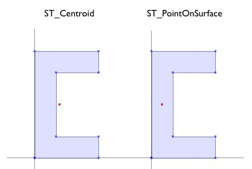
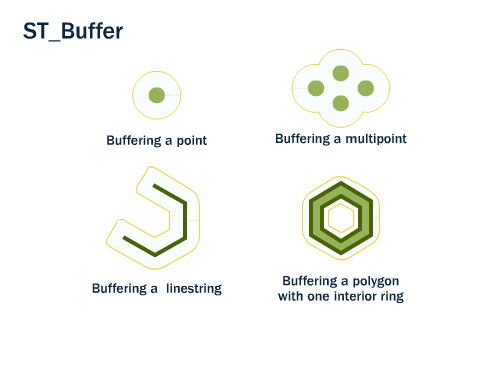
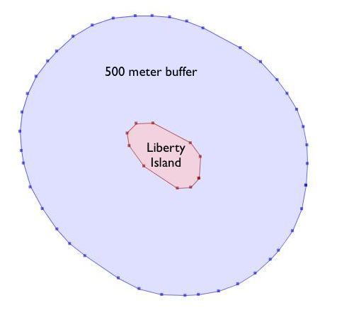
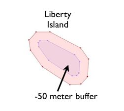
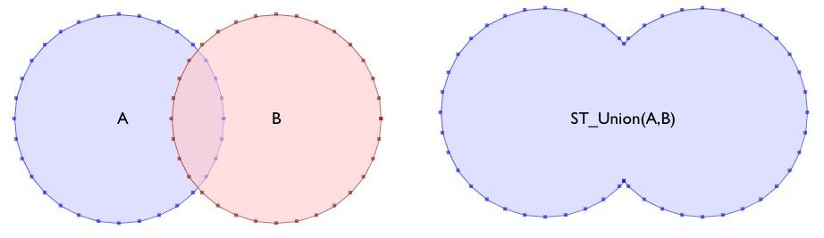
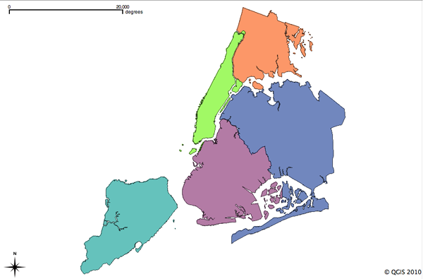

# 20. 지오메트리 생성 함수 (Geometry Constructing Functions)

> 공식 원문: [<https://postgis.net/workshops/postgis-intro/geometry_returning.html>](https://postgis.net/workshops/postgis-intro/geometry_returning.html)\
> 공식 소스의 본문·표·SQL·이미지를 현재 페이지 순서대로 반영했습니다.

지금까지 본 모든 함수는 기하학을 "있는 그대로" 사용하고 다음을 반환합니다.

- 객체 분석(`ST_Length(geometry)`, `ST_Area(geometry)`),
- 객체 직렬화(`ST_AsText(geometry)`, `ST_AsGML(geometry)`),
- 물체의 일부(`ST_RingN(geometry,n)`) 또는
- 참/거짓 테스트(`ST_Contains(geometry,geometry)`, `ST_Intersects(geometry,geometry)`).

"기하학 구성 함수"는 기하학을 입력으로 사용하고 새로운 모양을 출력합니다.

## ST_Centroid / ST_PointOnSurface

공간 쿼리를 작성할 때 일반적으로 필요한 것은 폴리곤 피처를 피처의 점 표현으로 바꾸는 것입니다. 두 개의 폴리곤 레이어에서 `ST_Intersects(geometry,geometry)`를 사용하면 종종 이중 계산이 발생하기 때문에 공간 조인(`polypolyjoins`에서 설명한 대로)에 유용합니다. 경계의 폴리곤은 양쪽의 개체와 교차합니다. 이를 점으로 교체하면 양쪽이 아닌 한쪽 또는 다른쪽에 위치하게 됩니다.

- `ST_Centroid(geometry)`는 대략 입력 인수의 질량 중심에 있는 점을 반환합니다. 이 간단한 계산은 매우 빠르지만 때로는 바람직하지 않습니다. 왜냐하면 반환된 점이 반드시 지형지물 자체에 있는 것은 아니기 때문입니다. 입력 피처에 볼록성이 있는 경우(문자 'C'를 상상해 보세요) 반환된 중심은 피처 내부에 있지 않을 수 있습니다.
- `ST_PointOnSurface(geometry)`는 입력 인수 내부에 있음이 보장되는 지점을 반환합니다. 이는 공간 조인을 위한 "프록시 포인트"를 계산하는 데 더 유용합니다.



```sql
-- Compare the location of centroid and point-on-surface for a concave geometry

SELECT ST_Intersects(geom, ST_Centroid(geom)) AS centroid_inside,
       ST_Intersects(geom, ST_PointOnSurface(geom)) AS pos_inside
FROM (VALUES
    ('POLYGON ((30 0, 30 10, 10 10, 10 40, 30 40, 30 50, 0 50, 0 0, 0 0, 30 0))'::geometry)
  ) AS t(geom);
```

    centroid_inside | pos_inside
    -----------------+------------
    f               | t

## ST_버퍼

버퍼링 작업은 GIS 워크플로에서 일반적이며 PostGIS에서도 사용할 수 있습니다. `ST_Buffer(geometry,distance)`는 버퍼 거리와 도형 유형을 가져와 입력 도형에서 버퍼 거리만큼 떨어진 경계가 있는 다각형을 출력합니다.



예를 들어, 미국 공원관리청이 리버티 섬 주변에 해양 교통 구역을 시행하려는 경우 섬 주변에 500미터 길이의 완충 다각형을 구축할 수 있습니다. Liberty Island는 `nyc_census_blocks` 테이블의 단일 인구 조사 블록이므로 쉽게 추출하고 버퍼링할 수 있습니다.

```sql
-- Make a new table with a Liberty Island 500m buffer zone
CREATE TABLE liberty_island_zone AS
SELECT ST_Buffer(geom,500)::geometry(Polygon,26918) AS geom
FROM nyc_census_blocks
WHERE blkid = '360610001001001';
```



`ST_Buffer` 함수는 음수 거리도 허용하고 다각형 입력 내에 내접 다각형을 만듭니다. 선과 점의 경우 빈 반환을 받게 됩니다.



## ST_Intersection

또 다른 고전적인 GIS 작업인 "오버레이"는 중첩된 두 다각형의 교차점을 계산하여 새로운 범위를 생성합니다. 결과에는 결과의 다각형을 병합하여 부모 중 하나의 다각형을 만들 수 있는 속성이 있습니다.

`ST_Intersection(geometry A, geometry B)` 함수는 두 인수가 공통적으로 갖는 공간 영역(또는 선 또는 점)을 반환합니다. 인수가 서로소인 경우 함수는 빈 기하학을 반환합니다.

```sql
-- What is the area these two circles have in common?
-- Using ST_Buffer to make the circles!

SELECT ST_AsText(ST_Intersection(
  ST_Buffer('POINT(0 0)', 2),
  ST_Buffer('POINT(3 0)', 2)
));
```


## ST_Union

이전 예에서는 형상을 교차하여 두 입력의 선이 있는 새 형상을 만들었습니다. `ST_Union` 함수는 그 반대를 수행합니다. 입력을 받고 공통 라인을 제거합니다. `ST_Union` 함수에는 두 가지 형식이 있습니다.

- `ST_Union(geometry, geometry)`: 두 개의 기하학을 취하고 병합된 합집합을 반환하는 두 개의 인수 버전입니다. 예를 들어, 이전 섹션의 두 개의 원 예는 교차점을 합집합으로 바꾸면 다음과 같습니다.

  ```sql
  -- What is the total area these two circles cover?
  -- Using ST_Buffer to make the circles!

  SELECT ST_AsText(ST_Union(
    ST_Buffer('POINT(0 0)', 2),
    ST_Buffer('POINT(3 0)', 2)
  ));
  ```



- `ST_Union([geometry])`: 일련의 형상을 취하고 전체 그룹에 대해 병합된 형상을 반환하는 집계 버전입니다. 집계 ST_Union을 `GROUP BY` SQL 문과 함께 사용하여 기본 기하학의 신중하게 병합된 하위 집합을 생성할 수 있습니다. 그것은 매우 강력합니다.

`ST_Union` 집계의 예로 `nyc_census_blocks` 테이블을 고려해보세요. 인구 조사 지역은 작은 지역에서 더 큰 지역을 구성할 수 있도록 세심하게 구성되었습니다. 따라서 각 구역을 형성하는 블록을 병합하여 인구 조사 구역 지도를 만들 수 있습니다(나중에 `creatingtractstable`에서 수행한 것처럼). 또는 각 카운티에 속하는 블록을 병합하여 카운티 지도를 만들 수 있습니다.

병합을 수행하려면 고유 키 `blkid`가 실제로 더 높은 수준의 지역에 대한 정보를 포함한다는 점에 유의하세요. 이전에 사용한 리버티 아일랜드의 키 부분은 다음과 같습니다.

    360610001001001 = 36 061 000100 1 001

    36     = State of New York
    061    = New York County (Manhattan)
    000100 = Census Tract
    1      = Census Block Group
    001    = Census Block

따라서 `blkid`의 처음 5자리가 동일한 모든 도형을 병합하여 카운티 지도를 만들 수 있습니다. 인내심을 가지십시오. 이는 계산 비용이 많이 들고 1~2분 정도 걸릴 수 있습니다.

```sql
-- Create a nyc_census_counties table by merging census blocks
CREATE TABLE nyc_census_counties AS
SELECT
  ST_Union(geom)::Geometry(MultiPolygon,26918) AS geom,
  SubStr(blkid,1,5) AS countyid
FROM nyc_census_blocks
GROUP BY countyid;
```



영역 테스트를 통해 우리의 결합 작업이 기하학적 구조를 잃지 않았음을 확인할 수 있습니다. 먼저, 각 개별 인구 조사 블록의 면적을 계산하고 인구 조사 카운티 ID별로 그룹화한 해당 면적을 합산합니다.

```sql
SELECT SubStr(blkid,1,5) AS countyid, Sum(ST_Area(geom)) AS area
FROM nyc_census_blocks
GROUP BY countyid
ORDER BY countyid;
```

    countyid |       area
    ----------+------------------
    36005    | 110196022.906506
    36047    | 181927497.678368
    36061    | 59091860.6261323
    36081    | 283194473.613692
    36085    | 150758328.111199

그런 다음 카운티 테이블에서 새로운 카운티 다각형 각각의 면적을 계산합니다.

```sql
SELECT countyid, ST_Area(geom) AS area
FROM nyc_census_counties
ORDER BY countyid;
```

    countyid |       area
    ----------+------------------
    36005    | 110196022.906507
    36047    | 181927497.678367
    36061    | 59091860.6261324
    36081    | 283194473.593646
    36085    | 150758328.111199

같은 대답입니다! 우리는 인구 조사 블록 데이터로부터 NYC 카운티 테이블을 성공적으로 구축했습니다.

## 기능 목록

[ST_Centroid(geometry)](http://postgis.net/docs/ST_Centroid.html): 입력 기하학의 질량 중심을 나타내는 점 기하학을 반환합니다.

[ST_PointOnSurface(geometry)](http://postgis.net/docs/ST_PointOnSurface.html): 입력 기하학의 내부에 있음이 보장되는 점 기하학을 반환합니다.

[ST_Buffer(geometry, distance)](http://postgis.net/docs/ST_Buffer.html): 기하학의 경우: 이 기하학으로부터의 거리가 거리보다 작거나 같은 모든 점을 나타내는 기하학을 반환합니다. 계산은 이 기하학의 공간 참조 시스템에 있습니다. 지리의 경우: 평면 변환 래퍼를 사용합니다.

[ST_Intersection(기하학 A, 기하학 B)](http://postgis.net/docs/ST_Intersection.html): geomA와 geomB의 공유 부분을 나타내는 기하학을 반환합니다. 지리 구현은 교차점을 수행하기 위해 기하학으로 변환한 다음 다시 WGS84로 변환합니다.

[ST_Union()](http://postgis.net/docs/ST_Union.html): 도형의 점 집합 합집합을 나타내는 도형을 반환합니다.

[ST_AsText(text)](http://postgis.net/docs/ST_AsText.html): SRID 메타데이터 없이 기하학/지리의 WKT(Well-Known Text) 표현을 반환합니다.

[substring(string \[from int\] \[for int\])](http://www.postgresql.org/docs/current/static/functions-string.html): PostgreSQL 문자열 함수는 SQL 정규식과 일치하는 하위 문자열을 추출합니다.

[sum(expression)](http://www.postgresql.org/docs/current/static/functions-aggregate.html#FUNCTIONS-AGGREGATE-TABLE): 레코드 집합의 레코드 합계를 반환하는 PostgreSQL 집계 함수입니다.


---

[← 이전](19_geography_exercises.md) · [목차](00_index.md) · [다음 →](21_geometry_returning_exercises.md)