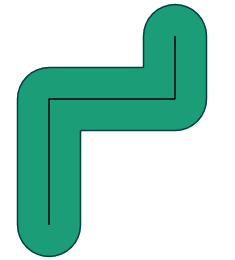

# 20. 지오메트리 생성 함수 (Geometry Constructing Functions)

지오메트리 생성 함수는 기존 지오메트리 객체들을 입력받아 변형하거나 새로운 지오메트리 객체(버퍼, 중심점, 교집합, 합집합 등)를 생성하여 반환합니다.

---

## 1. `ST_Centroid` (무게중심점)
폴리곤이나 다각형 객체의 기하학적 중심점(Centroid)을 계산하여 Point로 반환합니다.

```sql
-- 각 이웃 지역의 중심점 좌표 구하기
SELECT name, ST_AsText(ST_Centroid(geom)) AS centroid
FROM nyc_neighborhoods
LIMIT 3;
```

---

## 2. `ST_Buffer` (완충 구역/버퍼 생성)
주어진 지오메트리 주위로 지정된 거리 반경만큼 확장된 폴리곤 영역을 생성합니다.

```sql
-- 'Broadway' 도로 주변 50미터 버퍼 폴리곤 생성
SELECT ST_Buffer(geom, 50) AS buffer_geom
FROM nyc_streets
WHERE name = 'Broadway'
LIMIT 1;
```



---

## 3. `ST_Intersection` (공간 교집합 생성)
두 지오메트리가 겹치는 공통 영역만 잘라내어 새로운 지오메트리로 반환합니다.

```sql
-- 두 이웃 지역이 겹치는 경계 교집합 생성
SELECT ST_Intersection(a.geom, b.geom)
FROM nyc_neighborhoods a, nyc_neighborhoods b
WHERE a.name = 'SoHo' AND b.name = 'Greenwich Village';
```

---

## 4. `ST_Union` (공간 합집합/병합)
여러 개의 지오메트리를 하나로 합쳐서 경계를 녹여낸(Dissolve) 단일 지오메트리를 생성합니다.

```sql
-- 자치구별로 속한 모든 블록들을 하나로 합쳐 자치구 단일 경계 폴리곤 생성
SELECT boroname, ST_Union(geom) AS boro_geom
FROM nyc_census_blocks
GROUP BY boroname;
```

---

| [⬅️ 19. 지오그래피 실습 (Geography Exercises)](19_geography_exercises.md) | [🏠 워크숍 목차](README.md) | [21. 지오메트리 생성 실습 (Geometry Constructing Exercises) ➡️](21_geometry_returning_exercises.md) |
| :--- | :---: | ---: |
