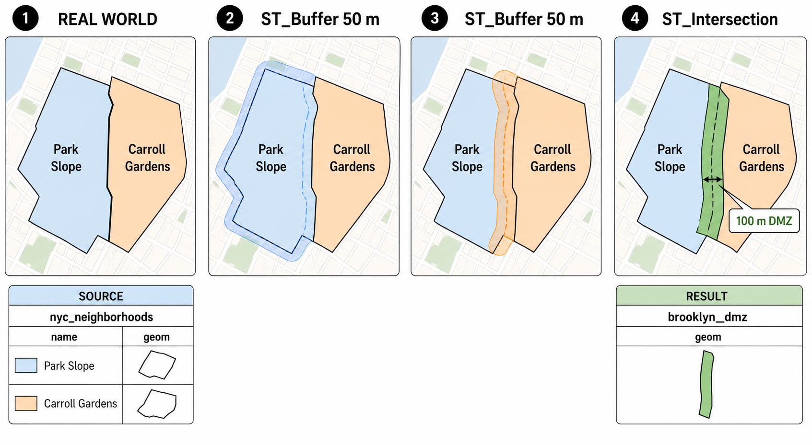

# 21. 지오메트리 생성 실습 (Geometry Constructing Exercises)

> 공식 원문: [<https://postgis.net/workshops/postgis-intro/geometry_returning_exercises.html>](https://postgis.net/workshops/postgis-intro/geometry_returning_exercises.html)\
> 공식 소스의 본문·표·SQL·이미지를 현재 페이지 순서대로 반영했습니다.

앞서 학습한 지오메트리 생성 및 가공 함수들을 활용하여 다음 실습 문제를 직접 해결해 보세요.

### 실습 참조 함수 요약
- `ST_Centroid(geometry)`: 지오메트리의 무게중심 점 반환
- `ST_Buffer(geometry, radius)`: 지오메트리 주변 완충 구역 생성
- `ST_Intersection(geometry A, geometry B)`: 두 지오메트리의 공통 교집합 영역 반환
- `ST_Union(geometry set)`: 그룹 내 모든 지오메트리를 하나로 병합
- `ST_GeometryType(geometry)`: 지오메트리의 OGC 타입 명칭 반환
- `ST_NumGeometries(geometry)`: 멀티/컬렉션 내 구성 지오메트리 개수 반환
- `ST_Contains(geometry A, geometry B)`: A가 B를 완전히 포함하는지 검사

---

## 연습 문제 및 정답

### 1. 자신의 무게중심(Centroid)을 내부에 포함하지 않는 오목한 인구조사 블록은 총 몇 개입니까?

```sql
SELECT count(*)
FROM nyc_census_blocks
WHERE NOT ST_Contains(geom, ST_Centroid(geom));
```

```text
481
```

> [!NOTE]
> 'U'자, 'L'자, 도넛 형태 등의 오목한(Concave) 블록 481개는 무게중심이 블록 외부에 떨어집니다. 이러한 블록의 대표 위치를 잡을 때는 반드시 `ST_PointOnSurface`를 사용해야 합니다.

---

### 2. 뉴욕시의 모든 인구조사 블록을 하나로 병합(`ST_Union`)하면 어떤 지오메트리 타입이 되며, 분리된 폴리곤 조각(Parts)은 몇 개입니까?

```sql
-- 모든 블록을 하나로 병합한 임시 테이블 생성
CREATE TABLE nyc_census_blocks_merge AS
SELECT ST_Union(geom) AS geom
FROM nyc_census_blocks;

-- 지오메트리 타입 확인
SELECT ST_GeometryType(geom)
FROM nyc_census_blocks_merge;
```

```text
ST_MultiPolygon
```

```sql
-- 구성 폴리곤 조각 개수 확인
SELECT ST_NumGeometries(geom)
FROM nyc_census_blocks_merge;
```

```text
63
```

- **지오메트리 타입**: `ST_MultiPolygon`
- **폴리곤 개수**: **63개** (뉴욕시 본토와 맨해튼, 스태튼아일랜드, 롱아일랜드 및 자메이카 만의 여러 섬들로 나뉨)

---

### 3. 원점 `POINT(0 0)` 주위에 반지름 1인 원형 버퍼를 생성했을 때 계산되는 면적은 얼마이며, 이론적 원의 넓이($\pi \approx 3.14159$)와 차이가 나는 이유는 무엇입니까?

```sql
SELECT ST_Area(ST_Buffer('POINT(0 0)'::geometry, 1));
```

```text
3.121445152258052
```

> [!NOTE]
> 컴퓨터 공간 기하 알고리즘은 곡선을 유한한 개수의 직선 선분(기본 8분면당 8개 세그먼트)으로 근사화(Linear Approximation)하여 다각형을 만듭니다. 따라서 다각형으로 표현된 원은 실제 수학적 원보다 정점 사이의 호 부분이 깎여 나가므로 $\pi$보다 약간 작은 값이 계산됩니다. `ST_Buffer`의 세 번째 파라미터(예: `quad_segs=32`)로 분할 수를 늘리면 $\pi$에 더 가까워집니다.

---

### 4. 브루클린의 'Park Slope'와 'Carroll Gardens' 근린지역 경계에 폭 100m의 완충 지대(DMZ: 각 동네 경계에서 50m씩 버퍼링한 후 교집합)를 만들 때, 이 DMZ의 총 면적은 얼마입니까?



*그림 21-1. 두 근린지역 폴리곤을 각각 50m 확장하면 공유 경계를 중심으로 완충 영역이 겹칩니다. `ST_Intersection`은 두 버퍼의 공통 부분만 남겨 폭 100m의 `brooklyn_dmz.geom`을 생성합니다. 지도와 폭은 처리 원리를 설명하는 개념도입니다.*

```sql
CREATE TABLE brooklyn_dmz AS
SELECT
  ST_Intersection(
    ST_Buffer(ps.geom, 50),
    ST_Buffer(cg.geom, 50)
  ) AS geom
FROM nyc_neighborhoods ps, nyc_neighborhoods cg
WHERE ps.name = 'Park Slope'
  AND cg.name = 'Carroll Gardens';

SELECT ST_Area(geom) FROM brooklyn_dmz;
```

```text
180990.964207547
```

- **계산된 DMZ 면적**: 약 **$180,991\text{m}^2$** (약 18.1헥타르)


---

[← 이전](20_geometry_returning.md) · [목차](00_index.md) · [다음 →](22_joins_advanced.md)
