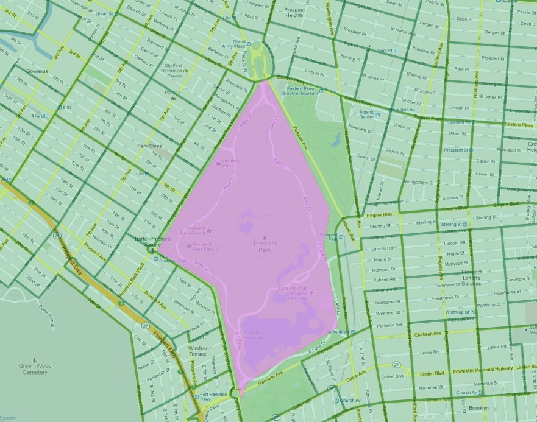

# 22. 고급 공간 조인 (More Spatial Joins)

기본 공간 조인을 넘어, 겹치는 비율에 따른 가중 집계 및 비공간 데이터와의 복합 조인 기법을 학습합니다.

---

## 1. 면적 비례 가중 인구 계산 (Proportional Overlay)

어떤 행정 구역(예: 지하철역 주변 500m 반경)이 인구조사 블록들과 부분적으로만 겹칠 때, 겹치는 면적 비율만큼만 인구를 비례 배분하여 합산하는 고난도 GIS 공간 분석 기법입니다.



```sql
-- 'Times Sq - 42 St' 역 주변 500미터 반경 내의 실제 비례 추정 인구수 계산
WITH subway_buffer AS (
  SELECT ST_Buffer(geom, 500) AS geom
  FROM nyc_subway_stations
  WHERE name = 'Times Sq - 42 St'
)
SELECT
  ROUND(SUM(c.popn_total * (ST_Area(ST_Intersection(c.geom, b.geom)) / ST_Area(c.geom)))) AS estimated_pop
FROM nyc_census_blocks c
JOIN subway_buffer b
  ON ST_Intersects(c.geom, b.geom);
```

---

## 2. LEFT JOIN을 활용한 고립 객체 탐색

지하철역이 하나도 없는 이웃 지역 찾기:

```sql
SELECT n.name, n.boroname
FROM nyc_neighborhoods n
LEFT JOIN nyc_subway_stations s
  ON ST_Contains(n.geom, s.geom)
WHERE s.name IS NULL;
```

---

| [⬅️ 21. 지오메트리 생성 실습 (Geometry Constructing Exercises)](21_geometry_returning_exercises.md) | [🏠 워크숍 목차](README.md) | [23. 유효성 (Validity) ➡️](23_validity.md) |
| :--- | :---: | ---: |
