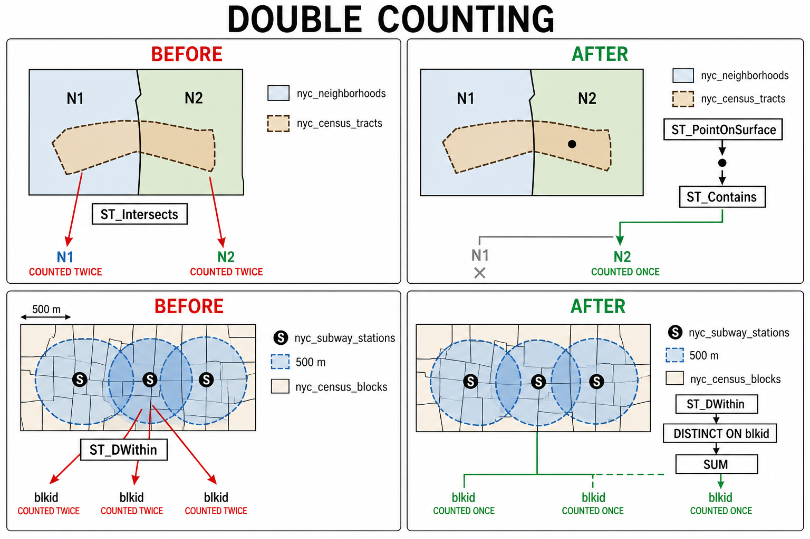

# 22. 고급 공간 조인 (More Spatial Joins)

> 공식 원문: [<https://postgis.net/workshops/postgis-intro/joins_advanced.html>](https://postgis.net/workshops/postgis-intro/joins_advanced.html)\
> 공식 소스의 본문·표·SQL·이미지를 현재 페이지 순서대로 반영했습니다.

앞서 학습한 `ST_PointOnSurface`와 `ST_Union` 함수를 결합하여 실무에서 자주 마주치는 복잡한 공간 데이터 가공 및 폴리곤 간 중복 집계 방지 기법을 살펴보겠습니다.

---

## 1. 인구조사구(Census Tract) 공간 테이블 생성

실습 데이터 디렉터리의 `nyc_census_sociodata.sql` 파일에는 가구 소득, 학력, 출퇴근 방식 등 뉴욕시의 상세 사회경제학 통계가 포함되어 있습니다. 하지만 이 데이터는 **인구조사구(Census Tract)** 단위로 집계된 비공간 속성 테이블입니다.

따라서 공간 분석을 수행하려면 인구조사 블록(`nyc_census_blocks`)을 병합하여 인구조사구 공간 테이블을 직접 생성한 뒤 속성 데이터를 결합해야 합니다.

### 단계 1: nyc_census_sociodata.sql 테이블 로딩
1. pgAdmin에서 쿼리 도구를 엽니다.
2. *Open File* 메뉴로 `nyc_census_sociodata.sql` 파일을 불러와 실행합니다.
3. 데이터베이스 테이블 목록을 새로고침하여 `nyc_census_sociodata` 테이블이 생성되었는지 확인합니다.

### 단계 2: 블록을 합쳐 조사구 지오메트리 테이블 생성
`blkid` 15자리 코드 중 앞 11자리가 인구조사구 식별자(`tractid`)에 해당합니다.

```text
360610001001001 = 36 061 000100 1 001

36     = 뉴욕주 (State of New York)
061    = 맨해튼 카운티 (New York County)
000100 = 인구조사구 (Census Tract)
1      = 블록 그룹 (Census Block Group)
001    = 인구조사 블록 (Census Block)
```

```sql
-- 블록들을 병합하여 인구조사구 지오메트리 테이블 생성
CREATE TABLE nyc_census_tract_geoms AS
SELECT
  ST_Union(geom) AS geom,
  substr(blkid, 1, 11) AS tractid
FROM nyc_census_blocks
GROUP BY tractid;

-- tractid 컬럼에 인덱스 생성
CREATE INDEX nyc_census_tract_geoms_tractid_idx
  ON nyc_census_tract_geoms (tractid);
```

### 단계 3: 공간 지오메트리와 인구사회 속성 결합
조사구 지오메트리 테이블과 속성 테이블을 `tractid`로 조인하여 최종 `nyc_census_tracts` 테이블을 만듭니다.

```sql
CREATE TABLE nyc_census_tracts AS
SELECT
  g.geom,
  a.*
FROM nyc_census_tract_geoms AS g
JOIN nyc_census_sociodata AS a
  ON g.tractid = a.tractid;

-- 지오메트리 컬럼에 GiST 공간 인덱스 생성
CREATE INDEX nyc_census_tract_gidx
  ON nyc_census_tracts USING GIST (geom);
```

---

## 2. 폴리곤-폴리곤 조인 시 중복 집계 문제 (Double-Counting)

> **분석 질문**: "대학원 학위(석사/박사) 소지자 비율이 가장 높은 상위 10개 근린지역은 어디일까요?"



*그림 22-1. 위쪽은 하나의 인구조사구가 여러 근린지역과 교차할 때 생기는 중복을 `ST_PointOnSurface`와 `ST_Contains`로 해결하는 과정입니다. 아래쪽은 하나의 인구조사 블록이 여러 역의 500m 반경에 들어갈 때 `DISTINCT ON (blkid)`로 블록을 한 번만 남기는 과정입니다. 공간 모양과 반경은 개념도이며 실제 축척을 나타내지 않습니다.*

먼저 단순 `ST_Intersects` 공간 조인으로 쿼리를 작성해 봅니다.

```sql
SELECT
  100.0 * sum(t.edu_graduate_dipl) / sum(t.edu_total) AS graduate_pct,
  n.name, n.boroname
FROM nyc_neighborhoods AS n
JOIN nyc_census_tracts AS t
  ON ST_Intersects(n.geom, t.geom)
WHERE t.edu_total > 0
GROUP BY n.name, n.boroname
ORDER BY graduate_pct DESC
LIMIT 10;
```

```text
 graduate_pct |       name        | boroname
--------------+-------------------+-----------
         47.6 | Carnegie Hill     | Manhattan
         42.2 | Upper West Side   | Manhattan
         41.1 | Battery Park      | Manhattan
         39.6 | Flatbush          | Brooklyn
         39.3 | Tribeca           | Manhattan
         39.2 | North Sutton Area | Manhattan
         38.7 | Greenwich Village | Manhattan
         38.6 | Upper East Side   | Manhattan
         37.9 | Murray Hill       | Manhattan
         37.4 | Central Park      | Manhattan
```

뉴욕 지리에 익숙한 사람이라면 브루클린의 전통적인 서민 주거지인 **Flatbush**가 상위 4위(39.6%)에 오른 점에 의문을 품을 수 있습니다.

### 원인 분석: 경계선 중복 집계


위 그림처럼 하나의 인구조사구가 두 개 이상의 동네 경계선에 걸쳐 있는 경우, `ST_Intersects`를 사용하면 해당 조사구의 통계가 **두 동네 모두에 중복 합산**됩니다.


실제 데이터에서 Flatbush 폴리곤은 거주 인구가 0명인 프로스펙트 공원(Prospect Park) 영역을 포함하고 있는데, 인접한 부촌인 Park Slope의 고학력 인구조사구 경계와 살짝 교차하면서 해당 인구가 Flatbush로 중복 합산되어 점수가 비정상적으로 왜곡된 것입니다.

---

## 3. 대표점(ST_PointOnSurface)을 활용한 중복 집계 해결

이러한 이중 집계(Double-Counting)를 방지하는 가장 확실하고 직관적인 방법은 각 인구조사구를 **하나의 내부 대표점(`ST_PointOnSurface`)**으로 변환하여 조인하는 것입니다. 대표점은 반드시 단 하나의 동네 폴리곤에만 포함(`ST_Contains`)되므로 중복이 완벽히 제거됩니다.

```sql
SELECT
  100.0 * sum(t.edu_graduate_dipl) / sum(t.edu_total) AS graduate_pct,
  n.name, n.boroname
FROM nyc_neighborhoods AS n
JOIN nyc_census_tracts AS t
  ON ST_Contains(n.geom, ST_PointOnSurface(t.geom))
WHERE t.edu_total > 0
GROUP BY n.name, n.boroname
ORDER BY graduate_pct DESC
LIMIT 10;
```

```text
 graduate_pct |        name         | boroname
--------------+---------------------+-----------
         48.0 | Carnegie Hill       | Manhattan
         44.2 | Morningside Heights | Manhattan
         42.1 | Greenwich Village   | Manhattan
         42.0 | Upper West Side     | Manhattan
         41.4 | Tribeca             | Manhattan
         40.7 | Battery Park        | Manhattan
         39.5 | Upper East Side     | Manhattan
         39.3 | North Sutton Area   | Manhattan
         37.4 | Cobble Hill         | Brooklyn
         37.4 | Murray Hill         | Manhattan
```

중복 집계를 제거하자 비정상적으로 높았던 Flatbush가 정상적으로 제외되고, 컬럼비아 대학교가 위치한 Morningside Heights 등이 상위권으로 정확히 재배열되었습니다.

---

## 4. 대규모 반경 거리 조인에서의 중복 제거

> **분석 질문**: "뉴욕시 지하철역 반경 500m(도보 약 5~7분) 이내 역세권에 거주하는 총 인구수는 몇 명일까요?"

단순히 `ST_DWithin`으로 조인하여 합산하면 다음과 같은 문제가 발생합니다.

```sql
-- 잘못된 단순 조인 (인구 중복 합산 발생)
SELECT sum(popn_total)
FROM nyc_census_blocks AS census
JOIN nyc_subway_stations AS subway
  ON ST_DWithin(census.geom, subway.geom, 500);
```

```text
10855873
```

뉴욕시 전체 인구(약 817만 명)보다 많은 **1,085만 명**이 나옵니다. 하나의 인구조사 블록이 인접한 여러 지하철역 반경에 동시에 포함되어 중복 계산되었기 때문입니다.


### 해결책: CTE와 DISTINCT ON 활용
집계하기 전에 고유한 인구조사 블록(`blkid`)만 선별합니다.

```sql
WITH distinct_blocks AS (
  SELECT DISTINCT ON (blkid) popn_total
  FROM nyc_census_blocks AS census
  JOIN nyc_subway_stations AS subway
    ON ST_DWithin(census.geom, subway.geom, 500)
)
SELECT sum(popn_total) AS subway_accessible_population
FROM distinct_blocks;
```

```text
5005743
```

정확한 집계 결과, 뉴욕시 전체 인구의 약 $61\%$에 해당하는 **5,005,743명**이 지하철역 도보 500m 이내 역세권에 거주하고 있음을 알 수 있습니다.


---

[← 이전](21_geometry_returning_exercises.md) · [목차](00_index.md) · [다음 →](23_validity.md)
