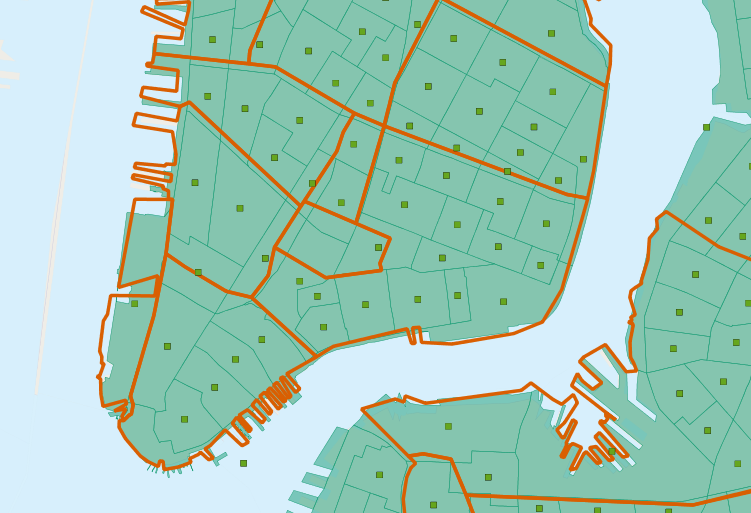
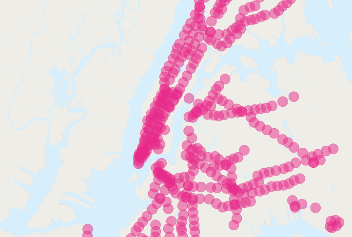

# 22. 고급 공간 조인 (More Spatial Joins)

> 공식 원문: [<https://postgis.net/workshops/postgis-intro/joins_advanced.html>](https://postgis.net/workshops/postgis-intro/joins_advanced.html)\
> 공식 소스의 본문·표·SQL·이미지를 현재 페이지 순서대로 반영했습니다.

마지막 섹션에서는 `ST_PointOnSurface(geometry)` 및 `ST_Union([geometry])` 함수와 몇 가지 간단한 예를 살펴보았습니다. 이 섹션에서는 좀 더 정교한 작업을 수행하겠습니다.

## 인구 조사 표 만들기

작업장 `\data\` 디렉토리에는 속성 데이터가 포함되어 있지만 형상이 없는 `nyc_census_sociodata.sql` 파일이 있습니다. 이 표에는 출퇴근 시간, 소득, 교육 수준 등 뉴욕에 대한 흥미로운 사회경제적 데이터가 포함되어 있습니다. 문제가 하나 있습니다. 데이터는 "인구 조사 지역"으로 요약되어 있으며 인구 조사 지역 공간 데이터가 없습니다!

이 섹션에서는

- `nyc_census_sociodata.sql` 테이블 로드
- 인구 조사 지역에 대한 공간 테이블 만들기
- 속성 데이터를 공간 데이터에 결합합니다.
- 새로운 데이터를 사용하여 몇 가지 분석을 수행합니다.

### nyc_census_sociodata.sql 로드 중

1.  PgAdmin에서 SQL 쿼리 창을 엽니다.
2.  메뉴에서 **파일-\>열기**를 선택하고 `nyc_census_sociodata.sql` 파일을 찾습니다.
3.  "쿼리 실행" 버튼을 누르세요.
4.  PgAdmin에서 "새로 고침" 버튼을 누르면 이제 테이블 목록이 `nyc_census_sociodata` 테이블에 포함되어야 합니다.

### 인구 조사 표 만들기

이전 섹션에서 본 것처럼 `blkid` 키의 하위 문자열을 요약하여 인구 조사 블록에서 더 높은 수준의 도형을 구축할 수 있습니다. 인구 조사 지역을 얻으려면 `blkid`의 처음 11자에 대한 그룹화를 요약해야 합니다.

    360610001001001 = 36 061 000100 1 001

    36     = State of New York
    061    = New York County (Manhattan)
    000100 = Census Tract
    1      = Census Block Group
    001    = Census Block

`ST_Union` 집계를 사용하여 새 테이블을 만듭니다.

```sql
-- Make the tracts table
CREATE TABLE nyc_census_tract_geoms AS
SELECT
  ST_Union(geom) AS geom,
  SubStr(blkid,1,11) AS tractid
FROM nyc_census_blocks
GROUP BY tractid;

-- Index the tractid
CREATE INDEX nyc_census_tract_geoms_tractid_idx
  ON nyc_census_tract_geoms (tractid);
```

### 공간 데이터에 속성 결합

표준 속성 조인을 사용하여 관 기하학 테이블을 관 속성 테이블에 결합합니다.

```sql
-- Make the tracts table
CREATE TABLE nyc_census_tracts AS
SELECT
  g.geom,
  a.*
FROM nyc_census_tract_geoms g
JOIN nyc_census_sociodata a
ON g.tractid = a.tractid;

-- Index the geometries
CREATE INDEX nyc_census_tract_gidx
  ON nyc_census_tracts USING GIST (geom);
```

### 흥미로운 질문에 답변하기

흥미로운 질문에 답해보세요! "대학원 학위를 가진 사람들의 비율에 따라 뉴욕의 상위 10개 지역을 나열하십시오."

```sql
SELECT
  100.0 * Sum(t.edu_graduate_dipl) / Sum(t.edu_total) AS graduate_pct,
  n.name, n.boroname
FROM nyc_neighborhoods n
JOIN nyc_census_tracts t
ON ST_Intersects(n.geom, t.geom)
WHERE t.edu_total > 0
GROUP BY n.name, n.boroname
ORDER BY graduate_pct DESC
LIMIT 10;
```

관심 있는 통계를 요약한 다음 마지막에 함께 나눕니다. 0으로 나누는 오류를 피하기 위해 인구수가 0인 전도지를 가져오지 않습니다.

    graduate_pct |       name        | boroname
    --------------+-------------------+-----------
            47.6 | Carnegie Hill     | Manhattan
            42.2 | Upper West Side   | Manhattan
            41.1 | Battery Park      | Manhattan
            39.6 | Flatbush          | Brooklyn
            39.3 | Tribeca           | Manhattan
            39.2 | North Sutton Area | Manhattan
            38.7 | Greenwich Village | Manhattan
            38.6 | Upper East Side   | Manhattan
            37.9 | Murray Hill       | Manhattan
            37.4 | Central Park      | Manhattan

> [!NOTE]
> 뉴욕 지리학자들은 과잉 교육을 받은 지역 목록에 "Flatbush"가 있는지 궁금해할 것입니다. 대답은 다음 섹션에서 논의됩니다.

## 다각형/다각형 조인

흥미로운 쿼리(`interestingquestion`)에서 `ST_Intersects(geometry_a, geometry_b)` 함수를 사용하여 각 지역 요약에 포함할 인구 조사 지역 다각형을 결정했습니다. 다음 질문으로 이어집니다. 한 지역이 두 동네 사이의 경계에 있으면 어떻게 될까요? 이는 둘 다 교차하므로 **both**에 대한 요약 통계에 포함됩니다.



이러한 종류의 이중 계산을 방지하려면 다음 두 가지 방법이 있습니다.

- 간단한 방법은 각 트랙이 **one** 요약 영역에만 포함되도록 하는 것입니다(`ST_PointOnSurface(geometry)` 사용).
- 복잡한 방법은 국경에서 교차로를 분할하는 것입니다(`ST_Intersection(geometry,geometry)` 사용).

다음은 대학원 교육 쿼리에서 이중 계산을 방지하기 위해 간단한 방법을 사용하는 예입니다.

```sql
SELECT
  100.0 * Sum(t.edu_graduate_dipl) / Sum(t.edu_total) AS graduate_pct,
  n.name, n.boroname
FROM nyc_neighborhoods n
JOIN nyc_census_tracts t
ON ST_Contains(n.geom, ST_PointOnSurface(t.geom))
WHERE t.edu_total > 0
GROUP BY n.name, n.boroname
ORDER BY graduate_pct DESC
LIMIT 10;
```

모든 인구 조사 구역에서 `ST_PointOnSurface` 함수를 실행해야 하므로 이제 쿼리를 실행하는 데 시간이 더 오래 걸립니다.

    graduate_pct |        name         | boroname
    --------------+---------------------+-----------
            48.0 | Carnegie Hill       | Manhattan
            44.2 | Morningside Heights | Manhattan
            42.1 | Greenwich Village   | Manhattan
            42.0 | Upper West Side     | Manhattan
            41.4 | Tribeca             | Manhattan
            40.7 | Battery Park        | Manhattan
            39.5 | Upper East Side     | Manhattan
            39.3 | North Sutton Area   | Manhattan
            37.4 | Cobble Hill         | Brooklyn
            37.4 | Murray Hill         | Manhattan

이중 계산을 피하면 결과가 달라집니다!

### 플랫부시는 어떻습니까?

특히 Flatbush 지역은 목록에서 제외되었습니다. 그 이유는 우리 테이블에 있는 플랫부시(Flatbush) 동네 지도를 좀 더 자세히 보면 알 수 있습니다.


데이터 소스에서 정의한 대로 Flatbush는 단지 Prospect Park 지역을 포함하므로 실제로는 전통적인 의미의 동네가 아닙니다. 해당 지역의 인구 조사 지역에는 당연히 주민이 0명으로 기록되어 있습니다. 그러나 동네 경계는 공원 북쪽(고급화된 Park Slope 동네)과 접해 있는 값비싼 인구 조사 지역 중 하나를 긁어냅니다. 다각형/다각형 테스트를 사용할 때 이 단일 영역이 비어 있는 Flatbush에 추가되어 해당 쿼리에 대해 매우 높은 점수를 얻었습니다.

## 큰 반경 거리 조인

재미있는 질문은 "지하철역 근처(500m 이내) 사람들의 통근시간은 지하철역에서 멀리 떨어진 사람들의 통근시간과 어떻게 다른가?"이다.

그러나 이 질문은 이중 계산의 몇 가지 문제에 직면합니다. 많은 사람들이 여러 지하철역에서 500m 이내에 있을 것입니다. 뉴욕의 인구를 비교해보세요:

```sql
SELECT Sum(popn_total)
FROM nyc_census_blocks;
```

    8175032

뉴욕 지하철 역에서 500미터 이내에 있는 사람들의 인구를 보면 다음과 같습니다.

```sql
SELECT Sum(popn_total)
FROM nyc_census_blocks census
JOIN nyc_subway_stations subway
ON ST_DWithin(census.geom, subway.geom, 500);
```

    10855873

사람보다 지하철 근처에 사람이 더 많아요! 분명히 우리의 간단한 SQL은 큰 이중 계산 오류를 범하고 있습니다. 버퍼링된 지하철 사진을 보면 문제를 알 수 있습니다.



해결책은 쿼리의 요약 부분에 전달하기 전에 고유한 인구 조사 블록만 있는지 확인하는 것입니다. 쿼리를 고유한 블록을 찾는 하위 쿼리로 나누고, 답변을 반환하는 요약 쿼리로 래핑하면 됩니다.

```sql
WITH distinct_blocks AS (
  SELECT DISTINCT ON (blkid) popn_total
  FROM nyc_census_blocks census
  JOIN nyc_subway_stations subway
  ON ST_DWithin(census.geom, subway.geom, 500)
)
SELECT Sum(popn_total)
FROM distinct_blocks;
```

    5005743

그게 더 낫습니다! 따라서 뉴욕 인구의 절반 이상이 지하철에서 500m(도보로 약 5~7분) 이내에 있습니다.


---

[← 이전](21_geometry_returning_exercises.md) · [목차](00_index.md) · [다음 →](23_validity.md)