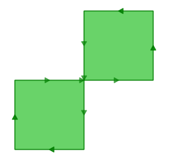
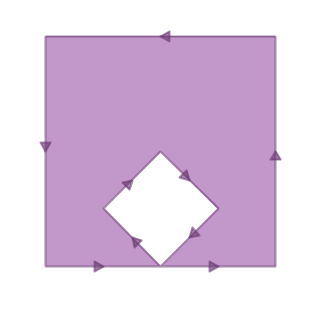

# 23. 유효성 (Validity)

> 공식 원문: [<https://postgis.net/workshops/postgis-intro/validity.html>](https://postgis.net/workshops/postgis-intro/validity.html)\
> 공식 소스의 본문·표·SQL·이미지를 현재 페이지 순서대로 반영했습니다.

"내 쿼리에서 'TopologyException' 오류가 발생하는 이유는 무엇입니까?"라는 질문에 대한 대답의 90%는 "하나 이상의 입력이 잘못되었습니다"입니다. 그렇다면 질문이 생깁니다. 유효하지 않다는 것은 무엇을 의미하며 왜 관심을 가져야 합니까?

## 타당성이란 무엇입니까?

경계 영역을 정의하고 많은 구조가 필요한 다각형의 경우 유효성이 가장 중요합니다. 선은 매우 단순하며 유효하지 않을 수 없으며 점도 유효하지 않습니다.

다각형 타당성의 규칙 중 일부는 명백해 보이지만 다른 일부는 자의적이라고 느껴집니다(사실 임의적입니다).

- 다각형 링은 닫혀 있어야 합니다.
- 구멍을 정의하는 링은 외부 경계를 정의하는 링 내부에 있어야 합니다.
- 링은 자체 교차할 수 없습니다(스스로 접촉하거나 교차할 수 없음).
- 링은 한 지점을 제외하고 다른 링과 접촉할 수 없습니다.
- 다중 다각형의 요소는 서로 닿을 수 없습니다.

마지막 세 가지 규칙은 임의의 범주에 속합니다. 동일하게 자체 일관성이 있는 다각형을 정의하는 다른 방법이 있지만 위의 규칙은 PostGIS가 준수하는 `OGC` `SFSQL` 표준에서 사용되는 규칙입니다.

규칙이 중요한 이유는 기하학 계산 알고리즘이 입력의 일관된 구조에 의존하기 때문입니다. 구조적 가정이 없는 알고리즘을 구축하는 것은 가능하지만 이러한 루틴은 매우 느린 경향이 있습니다. 구조가 없는 루틴의 첫 번째 단계는 *입력을 분석하고 그 안에 구조를 구축*하는 것이기 때문입니다.

구조가 중요한 이유에 대한 예는 다음과 같습니다. 이 다각형은 유효하지 않습니다:

    POLYGON((0 0, 0 1, 2 1, 2 2, 1 2, 1 0, 0 0));

이 다이어그램에서 무효성을 좀 더 명확하게 확인할 수 있습니다.



외부 링은 실제로 중앙에 자체 교차점이 있는 8자 모양입니다. 그래픽 루틴이 다각형 채우기를 성공적으로 렌더링하여 시각적으로 "영역"으로 표시됩니다. 즉, 1단위 정사각형 두 개이므로 총 면적은 2단위 면적입니다.

데이터베이스가 다각형의 영역을 어떻게 생각하는지 살펴보겠습니다.

```sql
SELECT ST_Area(ST_GeometryFromText(
         'POLYGON((0 0, 0 1, 1 1, 2 1, 2 2, 1 2, 1 1, 1 0, 0 0))'
       ));
```

    st_area
    ---------
          0

여기서 무슨 일이 일어나고 있는 걸까요? 면적을 계산하는 알고리즘은 링이 자체 교차하지 않는다고 가정합니다. 잘 작동하는 링은 항상 경계선의 한쪽에 경계가 있는 영역(내부)을 갖습니다(어느 쪽인지는 중요하지 않으며 단지 *한쪽*에만 있음). 그러나 우리의 (잘못된 행동) 8자 모양에서 경계 영역은 한 엽의 경우 선 오른쪽에 있고 다른 엽의 경우 왼쪽에 있습니다. 이로 인해 각 로브에 대해 계산된 영역이 상쇄되어(하나는 1로, 다른 하나는 -1로 나타남) 결과적으로 "0 영역"이 됩니다.

## 유효성 감지

이전 예에서는 **knew**가 유효하지 않은 하나의 다각형이 있었습니다. 수백만 개의 도형이 있는 테이블에서 무효성을 어떻게 감지합니까? `ST_IsValid(geometry)` 기능으로. 8자 모양에 대해 사용하면 빠른 답을 얻을 수 있습니다.

```sql
SELECT ST_IsValid(ST_GeometryFromText(
         'POLYGON((0 0, 0 1, 1 1, 2 1, 2 2, 1 2, 1 1, 1 0, 0 0))'
       ));
```

    f

이제 우리는 해당 기능이 유효하지 않다는 것을 알고 있지만 그 이유는 알 수 없습니다. `ST_IsValidReason(geometry)` 함수를 사용하여 무효화의 원인을 찾을 수 있습니다.

```sql
SELECT ST_IsValidReason(ST_GeometryFromText(
         'POLYGON((0 0, 0 1, 1 1, 2 1, 2 2, 1 2, 1 1, 1 0, 0 0))'
       ));
```

    Self-intersection[1 1]

이유(자기교차점) 외에도 무효 위치(좌표(1 1))도 반환됩니다.

`ST_IsValid(geometry)` 함수를 사용하여 테이블을 테스트할 수도 있습니다.

```sql
-- Find all the invalid polygons and what their problem is
SELECT name, boroname, ST_IsValidReason(geom)
FROM nyc_neighborhoods
WHERE NOT ST_IsValid(geom);
```

    name           |   boroname    |          st_isvalidreason
    -------------------------+---------------+-----------------------------------------
    Howard Beach            | Queens        | Self-intersection[597264.08 4499924.54]
    Corona                  | Queens        | Self-intersection[595483.05 4513817.95]
    Steinway                | Queens        | Self-intersection[593545.57 4514735.20]
    Red Hook                | Brooklyn      | Self-intersection[584306.82 4502360.51]

## 무효화 복구

무효성을 복구하려면 다각형을 가장 단순한 구조(고리)로 제거하고, 고리가 타당성 규칙을 따르도록 한 다음, 고리 둘러싸기 규칙을 따르는 새로운 다각형을 구축하는 작업이 포함됩니다. 결과는 직관적인 경우가 많지만 입력이 매우 잘못 동작하는 경우 유효한 출력이 사용자의 직관과 일치하지 않을 수 있습니다. 최신 버전의 PostGIS에는 지오메트리 복구를 위한 다양한 알고리즘이 포함되어 있습니다. [매뉴얼 페이지](http://postgis.net/docs/ST_MakeValid.html)를 주의 깊게 읽고 가장 마음에 드는 알고리즘을 선택하세요.

예를 들어, 여기에 고전적인 무효성인 "바나나 다각형"이 있습니다. 이는 영역을 둘러싸지만 몸을 구부려 자체적으로 접촉하여 실제로는 구멍이 아닌 "구멍"을 남기는 단일 고리입니다.

    POLYGON((0 0, 2 0, 1 1, 2 2, 3 1, 2 0, 4 0, 4 4, 0 4, 0 0))



다각형에서 [ST_MakeValid](http://postgis.net/docs/ST_MakeValid.html)를 실행하면 한 지점에 닿는 외부 링과 내부 링으로 구성된 유효한 `OGC` 다각형이 반환됩니다.

```sql
SELECT ST_AsText(
         ST_MakeValid(
           ST_GeometryFromText('POLYGON((0 0, 2 0, 1 1, 2 2, 3 1, 2 0, 4 0, 4 4, 0 4, 0 0))')
         )
       );
```

    POLYGON((0 0,0 4,4 4,4 0,2 0,0 0),(2 0,3 1,2 2,1 1,2 0))

> [!NOTE]
> "바나나 폴리곤"(또는 "역 쉘")은 유효한 기하학을 위한 `OGC` 토폴로지 모델과 ESRI에서 내부적으로 사용하는 모델이 다른 경우입니다. ESRI 모델은 접촉하는 고리를 유효하지 않은 것으로 간주하고 이러한 종류의 모양에 바나나 형태를 선호합니다. OGC 모델은 그 반대입니다. 둘 다 "올바른" 것은 아니며 단지 동일한 상황을 모델링하는 다른 방법일 뿐입니다.

## 일괄 유효성 복구

다음은 수정된 버전을 테이블에 추가하는 동안 검토를 위해 유효하지 않은 형상에 플래그를 지정하는 SQL의 예입니다.

```sql
-- Column for old invalid form
ALTER TABLE nyc_neighborhoods
  ADD COLUMN geom_invalid geometry
  DEFAULT NULL;

-- Fix invalid and save the original
UPDATE nyc_neighborhoods
  SET geom = ST_MakeValid(geom),
      geom_invalid = geom
  WHERE NOT ST_IsValid(geom);

-- Review the invalid cases
SELECT geom, ST_IsValidReason(geom_invalid)
  FROM nyc_neighborhoods
  WHERE geom_invalid IS NOT NULL;
```

유효하지 않은 형상을 시각적으로 복구하기 위한 좋은 도구는 OpenJump(<http://openjump.org>)입니다. 여기에는 **도구-\>QA-\>선택한 레이어 유효성 검사** 아래에 유효성 검사 루틴이 포함되어 있습니다.

## 기능 목록

[ST_IsValid(기하학 A)](http://postgis.net/docs/ST_IsValid.html): 기하학이 유효한지 여부를 나타내는 부울을 반환합니다.

[ST_IsValidReason(기하학 A)](http://postgis.net/docs/ST_IsValidReason.html): 무효 이유 및 무효 좌표가 포함된 텍스트 문자열을 반환합니다.

[ST_MakeValid(기하학 A)](http://postgis.net/docs/ST_MakeValid.html): 유효성 규칙을 따르도록 재구성된 기하학을 반환합니다.

------------------------------------------------------------------------

<details markdown="1">
<summary><strong>기존 로컬 문서 보존본</strong> — 로컬 실습 확장·요약 내용</summary>

# 23. 유효성 (Validity)

GIS에서 폴리곤(Polygon)은 특정한 수학적 규칙을 만족해야 올바른 기하 객체로 인정받습니다. 이를 **지오메트리 유효성(Geometry Validity)**이라고 합니다.

---

## 1. 폴리곤 유효성 규칙 (OGC 사양)

유효한(Valid) 폴리곤의 기본 요건:
1. 폴리곤의 링(외곽선)은 반드시 닫혀 있어야 합니다 (시작점 = 끝점).
2. 폴리곤의 경계선은 스스로 교차(Self-intersection)하지 않아야 합니다 (나비 넥타이 형태 불가).
3. 내부 홀(Hole)은 외부 링 내부에 완전히 위치해야 하며 서로 교차하지 않아야 합니다.


---

## 2. 유효성 검사 및 복구 함수

- `ST_IsValid(geom)`: 유효하면 `true`, 무효하면 `false` 반환
- `ST_IsValidReason(geom)`: 유효하지 않은 구체적인 이유와 발생 좌표를 문자열로 반환
- `ST_MakeValid(geom)`: 깨진 폴리곤을 OGC 규칙에 맞는 유효한 MultiPolygon 등으로 자동 수정

```sql
-- 무효한 폴리곤 검사
SELECT ST_IsValidReason('POLYGON((0 0, 0 2, 2 0, 2 2, 0 0))'::geometry);
```

결과:
```text
Self-intersection [1 1]
```

### 깨진 지오메트리 자동 복구:
```sql
SELECT ST_AsText(ST_MakeValid('POLYGON((0 0, 0 2, 2 0, 2 2, 0 0))'::geometry));
```

결과:
```text
MULTIPOLYGON(((0 0, 0 2, 1 1, 0 0)), ((1 1, 2 2, 2 0, 1 1)))
```

---

| [⬅️ 22. 고급 공간 조인 (More Spatial Joins)](22_joins_advanced.md) | [🏠 워크숍 목차](README.md) | [24. 동등성 (Equality) ➡️](24_equality.md) |
| :--- | :---: | ---: |

</details>

---

[← 이전](22_joins_advanced.md) · [목차](00_index.md) · [다음 →](24_equality.md)