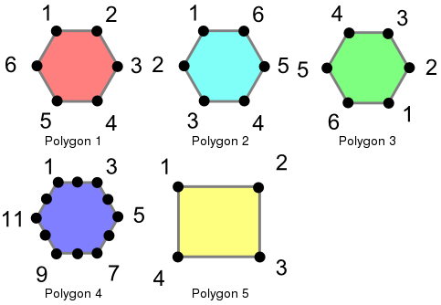
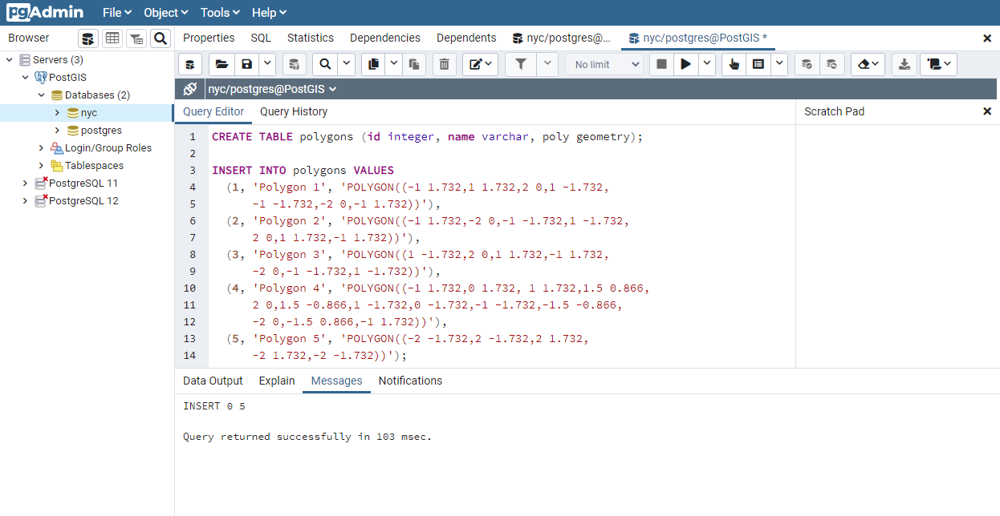
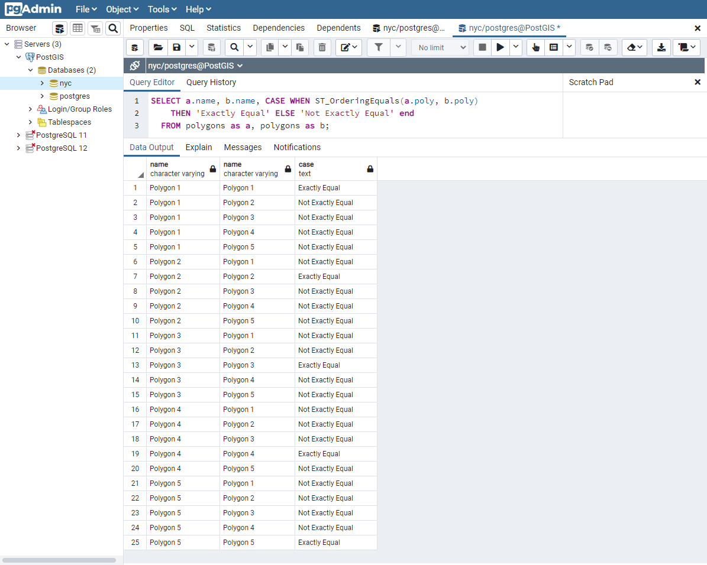
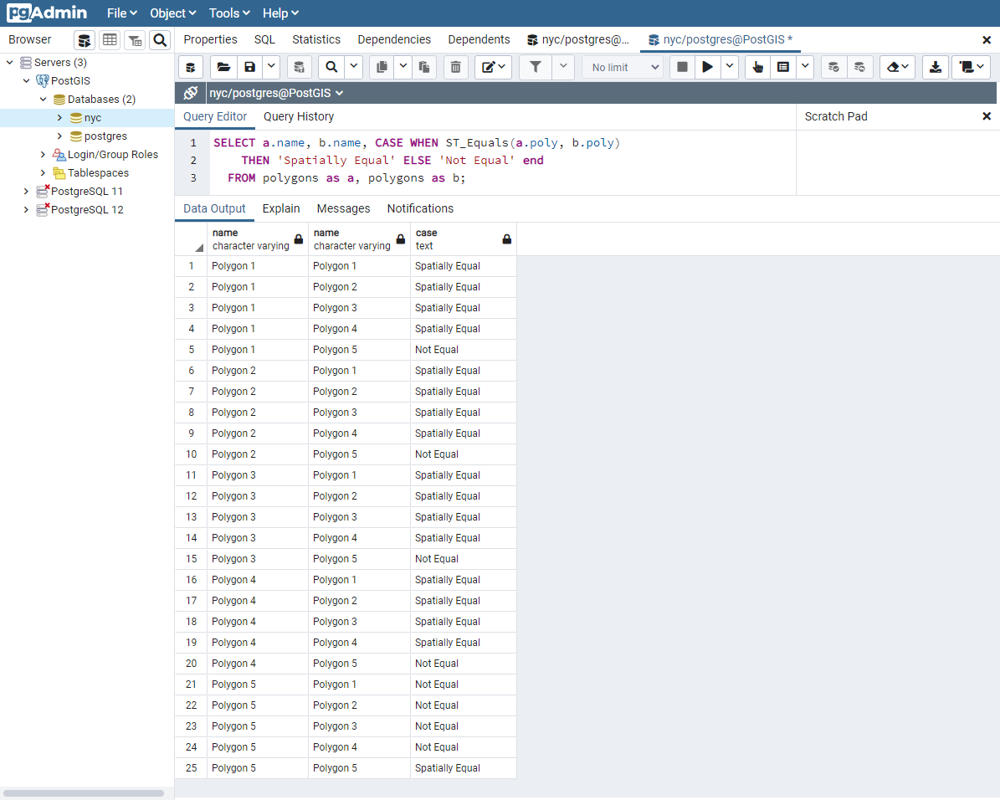
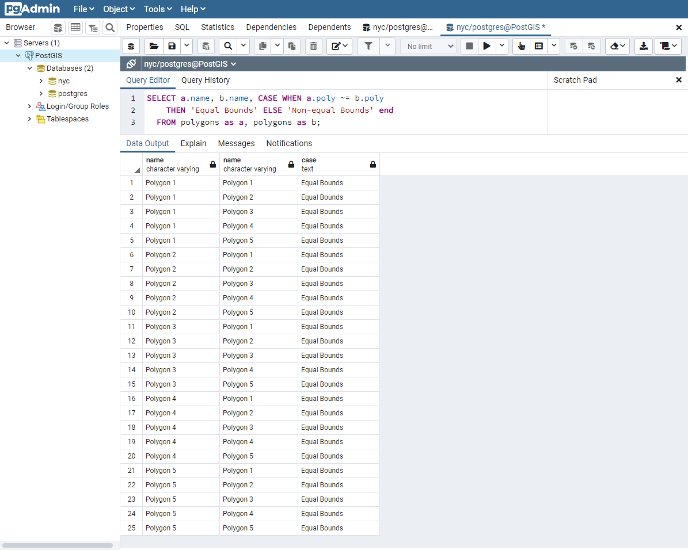

# 24. 동등성 (Equality)

> 공식 원문: [<https://postgis.net/workshops/postgis-intro/equality.html>](https://postgis.net/workshops/postgis-intro/equality.html)\
> 공식 소스의 본문·표·SQL·이미지를 현재 페이지 순서대로 반영했습니다.

## 평등

기하학을 다룰 때 동등성을 결정하는 것은 까다로울 수 있습니다. PostGIS는 서로 다른 수준의 동등성을 결정하는 데 사용할 수 있는 세 가지 기능을 지원합니다. 하지만 명확성을 위해 아래 정의를 사용하겠습니다. 이러한 기능을 설명하기 위해 다음 다각형을 사용합니다.



이러한 다각형은 다음 명령을 사용하여 로드됩니다.

```sql
CREATE TABLE polygons (id integer, name varchar, poly geometry);

INSERT INTO polygons VALUES
  (1, 'Polygon 1', 'POLYGON((-1 1.732,1 1.732,2 0,1 -1.732,
      -1 -1.732,-2 0,-1 1.732))'),
  (2, 'Polygon 2', 'POLYGON((-1 1.732,-2 0,-1 -1.732,1 -1.732,
      2 0,1 1.732,-1 1.732))'),
  (3, 'Polygon 3', 'POLYGON((1 -1.732,2 0,1 1.732,-1 1.732,
      -2 0,-1 -1.732,1 -1.732))'),
  (4, 'Polygon 4', 'POLYGON((-1 1.732,0 1.732, 1 1.732,1.5 0.866,
      2 0,1.5 -0.866,1 -1.732,0 -1.732,-1 -1.732,-1.5 -0.866,
      -2 0,-1.5 0.866,-1 1.732))'),
  (5, 'Polygon 5', 'POLYGON((-2 -1.732,2 -1.732,2 1.732,
      -2 1.732,-2 -1.732))');
```



### 정확히 같음

정확한 동일성은 두 개의 형상을 정점별로 순서대로 비교하여 위치가 동일한지 확인하여 결정됩니다. 다음 예는 이 방법의 효율성이 어떻게 제한될 수 있는지 보여줍니다.

```sql
SELECT a.name, b.name,
  CASE WHEN ST_OrderingEquals(a.poly, b.poly)
       THEN 'Exactly Equal'
       ELSE 'Not Exactly Equal' END
  FROM polygons AS a, polygons AS b;
```



이 예에서 다각형은 겉보기에 동일해 보이는 다른 다각형(다각형 1~3의 경우)이 아니라 그 자체와만 동일합니다. 다각형 1, 2, 3의 경우 정점은 동일한 위치에 있지만 서로 다른 순서로 정의됩니다. 다각형 4는 육각형 가장자리에 동일 선상에 있는(따라서 중복된) 꼭지점을 갖고 있어 다각형 1과 동일하지 않습니다.

### 공간적으로 같음

위에서 본 것처럼 완전 동일성은 기하학의 공간적 특성을 고려하지 않습니다. 기하학의 공간적 동등성을 테스트하는 데 사용할 수 있는 `ST_Equals`라는 이름의 함수가 있습니다.

```sql
SELECT a.name, b.name,
  CASE WHEN ST_Equals(a.poly, b.poly)
       THEN 'Spatially Equal'
       ELSE 'Not Equal' END
  FROM polygons AS a, polygons AS b;
```



이러한 결과는 평등에 대한 우리의 직관적인 이해와 더 일치합니다. 다각형 1부터 4까지는 동일한 영역을 포함하므로 동일한 것으로 간주됩니다. 여기에서는 다각형의 방향, 다각형을 정의하기 위한 시작점, 사용된 점 수가 중요하지 않습니다. 중요한 것은 다각형이 동일한 공간을 포함한다는 것입니다.

### 동일한 경계

정확한 동등성을 위해서는 최악의 경우 기하학의 모든 꼭지점을 비교하여 동등성을 결정해야 합니다. 이는 속도가 느릴 수 있으며 엄청난 수의 형상을 비교하는 데 적합하지 않을 수 있습니다. 더 빠른 비교를 위해 등호 연산자 `~=`가 제공됩니다. 이는 경계 상자(직사각형)에서만 작동하므로 기하학이 동일한 2차원 범위를 차지하지만 반드시 동일한 공간을 차지할 필요는 없습니다.

```sql
SELECT a.name, b.name,
  CASE WHEN a.poly ~= b.poly
       THEN 'Equal Bounds'
       ELSE 'Non-equal Bounds' END
  FROM polygons AS a, polygons AS b;
```



보시다시피, 공간적으로 동일한 모든 기하학은 동일한 경계를 갖습니다. 불행하게도 다각형 5도 다른 형상과 동일한 경계 상자를 공유하기 때문에 이 테스트에서 동일한 것으로 반환됩니다. 그렇다면 이것이 왜 유용한가요? 이에 대해서는 나중에 자세히 설명하겠지만 간단히 대답하자면 데이터를 결합하거나 필터링할 때 거대한 비교 세트를 보다 관리하기 쉬운 블록으로 신속하게 줄일 수 있는 공간 인덱싱을 사용할 수 있다는 것입니다.

------------------------------------------------------------------------

<details markdown="1">
<summary><strong>기존 로컬 문서 보존본</strong> — 로컬 실습 확장·요약 내용</summary>

# 24. 동등성 (Equality)

두 지오메트리가 "같다"고 판단하는 데에는 여러 가지 기준이 있습니다.

---

## 1. 공간적 동등성 (`ST_Equals`)
두 지오메트리가 동일한 공간 영역을 점유하고 있으면 구조(정점의 시작 위치나 순서)가 달라도 `true`를 반환합니다.

```sql
SELECT ST_Equals(
  'LINESTRING(0 0, 2 2)'::geometry,
  'LINESTRING(0 0, 1 1, 2 2)'::geometry
); -- true 반환
```

---

## 2. 엄격한 바이너리 일치 (`=`)
두 지오메트리의 저장된 바이트 데이터 및 모든 정점 순서까지 100% 동일한지 비교합니다.

---

## 3. 바운딩 박스 일치 (`~=`)
두 지오메트리의 최소 경계 사각형(MBR)이 정확히 같은지 비교합니다.

---

| [⬅️ 23. 유효성 (Validity)](23_validity.md) | [🏠 워크숍 목차](README.md) | [25. 선형 참조 (Linear Referencing) ➡️](25_linear_referencing.md) |
| :--- | :---: | ---: |

</details>

---

[← 이전](23_validity.md) · [목차](00_index.md) · [다음 →](25_linear_referencing.md)