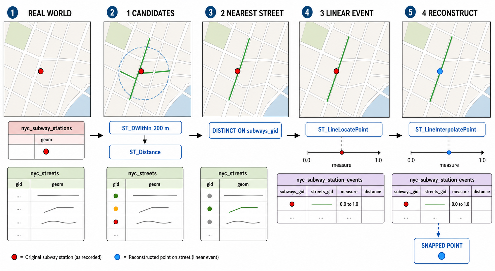
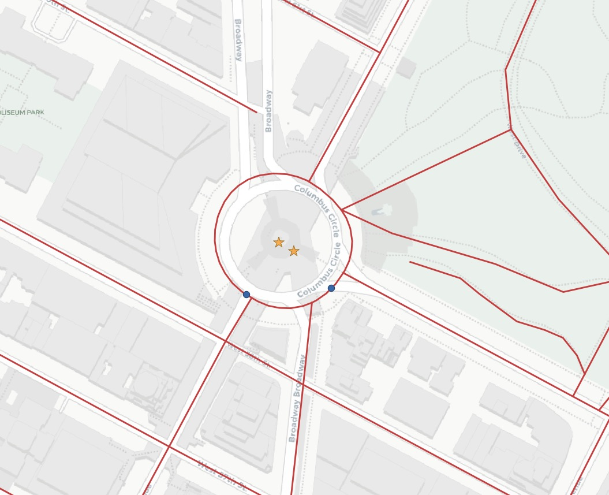

# 25. 선형 참조 (Linear Referencing)

> 공식 원문: [<https://postgis.net/workshops/postgis-intro/linear_referencing.html>](https://postgis.net/workshops/postgis-intro/linear_referencing.html)\
> 공식 소스의 본문·표·SQL·이미지를 현재 페이지 순서대로 반영했습니다.

**선형 참조(Linear Referencing System, LRS)**(또는 동적 세그먼트화, Dynamic Segmentation)는 기준이 되는 선형 네트워크(도로, 철도, 하천 등)를 기준으로 특정 지점이나 구간의 위치를 **거리 측정값(Measure, M-값)**으로 표현하는 방법입니다.

### 선형 참조의 주요 활용 분야
- **도로 시설물 관리**: 고속도로 기점으로부터 몇 킬로미터(이정표 마일) 지점에 가로등, 표지판 등이 위치하는지 기록
- **도로 유지보수 및 사고 지점**: 특정 도로 구간(예: 12.5km ~ 15.2km 구간)에서 발생한 재포장 공사나 사고 이력 관리
- **하천 수문학 분석**: 하천 본류를 따라 상류 측정 지점 사이의 수질 측정값이나 어류 서식처 기록

선형 참조를 사용하면 종속된 이벤트 데이터가 독립적인 지오메트리를 중복 저장할 필요 없이, 기준 도로의 ID와 시작/종료 거리(측정값)만 저장하면 됩니다. 이후 기준 도로의 선형이 변경되더라도 이벤트 객체들이 자동으로 수정된 도로 형상을 따라가게 됩니다.

---

## 1. 선형 상의 위치 찾기: ST_LineLocatePoint

`ST_LineLocatePoint(linestring, point)`는 선형 객체에서 지정된 점과 가장 가까운 지점이 **전체 선 길이의 몇 % 지점(0.0 ~ 1.0 사이의 비율)**에 위치하는지를 반환합니다. 점이 선 위에 직접 닿아 있지 않아도 선상에 수선의 발을 내려 가장 가까운 투영 위치를 계산합니다.

```sql
-- 선의 정중앙(50% 지점)에 위치한 점의 위치 비율 계산
SELECT ST_LineLocatePoint('LINESTRING(0 0, 2 2)', 'POINT(1 1)');
-- 반환값: 0.5

-- 선 외부에 있는 점을 선상에 투영한 위치 비율 계산
SELECT ST_LineLocatePoint('LINESTRING(0 0, 2 2)', 'POINT(0 2)');
-- 반환값: 0.5
```

### 지하철역 데이터를 도로 기반 이벤트 테이블로 변환 실습

`ST_LineLocatePoint`를 사용하여 지하철역(`nyc_subway_stations`)을 인접 도로(`nyc_streets`)에 매핑된 이벤트 테이블로 변환해 보겠습니다.



*그림 25-1. 역에서 200m 이내인 도로를 찾고 가장 가까운 도로 하나를 선택한 다음, 역의 위치를 도로 전체 길이 중 0.0~1.0의 `measure`로 저장합니다. 이후 `ST_LineInterpolatePoint`가 도로 지오메트리와 `measure`를 사용해 도로 중심선 위의 포인트를 다시 생성합니다. 지도는 학습용 개념도이며 실제 축척을 나타내지 않습니다.*

```sql
CREATE TABLE nyc_subway_station_events AS
WITH ordered_nearest AS (
  SELECT
    ST_GeometryN(streets.geom, 1) AS streets_geom,
    streets.gid AS streets_gid,
    subways.geom AS subways_geom,
    subways.gid AS subways_gid,
    ST_Distance(streets.geom, subways.geom) AS distance
  FROM nyc_streets AS streets
  JOIN nyc_subway_stations AS subways
    ON ST_DWithin(streets.geom, subways.geom, 200)
  ORDER BY subways_gid, distance ASC
)
SELECT DISTINCT ON (subways_gid)
  subways_gid,
  streets_gid,
  ST_LineLocatePoint(streets_geom, subways_geom) AS measure,
  distance
FROM ordered_nearest;

ALTER TABLE nyc_subway_station_events ADD PRIMARY KEY (subways_gid);
```

---

## 2. 위치 비율로부터 점 생성: ST_LineInterpolatePoint

거리 비율(Measure)로부터 실제 2차원 공간 점을 생성할 때는 `ST_LineInterpolatePoint(linestring, fraction)` 함수를 사용합니다.

```sql
SELECT ST_AsText(
  ST_LineInterpolatePoint('LINESTRING(0 0, 2 2)', 0.5)
);
```

```text
POINT(1 1)
```

앞서 만든 이벤트 테이블(`nyc_subway_station_events`)과 도로 테이블을 조인하여, 도로 중심선 위에 정확히 스냅(Snap)된 지하철역 공간 뷰를 생성할 수 있습니다.

```sql
CREATE OR REPLACE VIEW nyc_subway_stations_lrs AS
SELECT
  events.subways_gid,
  ST_LineInterpolatePoint(ST_GeometryN(streets.geom, 1), events.measure) AS geom,
  events.streets_gid
FROM nyc_subway_station_events AS events
JOIN nyc_streets AS streets
  ON (streets.gid = events.streets_gid);
```



위 지도에서 원래 지하철역 위치(빨간색 별)가 인접 도로 중심선 위(파란색 원)로 정확히 스냅된 것을 확인할 수 있습니다. 이는 GPS 궤적 데이터를 도로망 네트워크에 맞추어 보정(Map Matching)할 때도 매우 유용합니다.

---

## 함수 목록 (Function List)

- [ST_LineInterpolatePoint(linestring, fraction)](http://postgis.net/docs/ST_LineInterpolatePoint.html): 라인스트링을 따라 지정된 거리 비율(0.0 ~ 1.0)에 위치한 보간 포인트(Point)를 반환합니다.
- [ST_LineLocatePoint(linestring, point)](http://postgis.net/docs/ST_LineLocatePoint.html): 주어진 포인트에서 라인스트링에 가장 가까운 지점의 위치 비율(0.0 ~ 1.0)을 부동소수점 실수로 반환합니다.
- [ST_LineSubstring(linestring, startfraction, endfraction)](http://postgis.net/docs/ST_LineSubstring.html): 라인스트링의 시작 비율과 종료 비율 사이의 부분 선분을 잘라내어 새로운 라인스트링으로 반환합니다.
- [ST_AddMeasure(geometry, from_measure, to_measure)](http://postgis.net/docs/ST_AddMeasure.html): 라인스트링의 시작점부터 끝점까지 선형적으로 증가하는 M-값(측정값, 도로 이정표 마일 등)을 좌표에 부여합니다.


---

[← 이전](24_equality.md) · [목차](00_index.md) · [다음 →](26_de9im.md)
