# 26. 차원 확장 9-교차 모델 (DE-9IM)

> 공식 원문: [<https://postgis.net/workshops/postgis-intro/de9im.html>](https://postgis.net/workshops/postgis-intro/de9im.html)\
> 공식 소스의 본문·표·SQL·이미지를 현재 페이지 순서대로 반영했습니다.

"\`Dimensionally Extended 9-Intersection Model \<[http://en.wikipedia.org/wiki/DE-9IM\\\\\\"(DE9IM)는](http://en.wikipedia.org/wiki/DE-9IM\>\`\_"(DE9IM)는) 두 공간 개체가 상호 작용하는 방식을 모델링하기 위한 프레임워크입니다.

첫째, 모든 공간 개체에는 다음이 포함됩니다.

- 인테리어
- 경계
- 외관

다각형의 경우 내부, 경계 및 외부가 명확합니다.

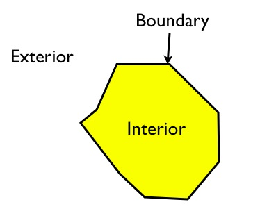

내부는 고리로 둘러싸인 부분입니다. 경계는 고리 그 자체입니다. 외관은 비행기의 다른 모든 것입니다.

선형 특징의 경우 내부, 경계 및 외부는 잘 알려져 있지 않습니다.

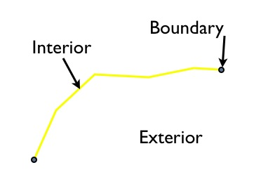

내부는 끝으로 둘러싸인 선의 일부입니다. 경계는 선형 형상의 끝이고 외부는 평면의 다른 모든 것입니다.

점의 경우 상황이 훨씬 더 이상합니다. 내부가 점입니다. 경계는 빈 집합이고 외부는 평면의 다른 모든 것입니다.

내부, 외부 및 경계에 대한 이러한 정의를 사용하면 한 쌍의 객체의 내부/경계/외부 사이에 가능한 9개의 교차점의 차원을 사용하여 공간 특징 쌍 간의 관계를 특성화할 수 있습니다.

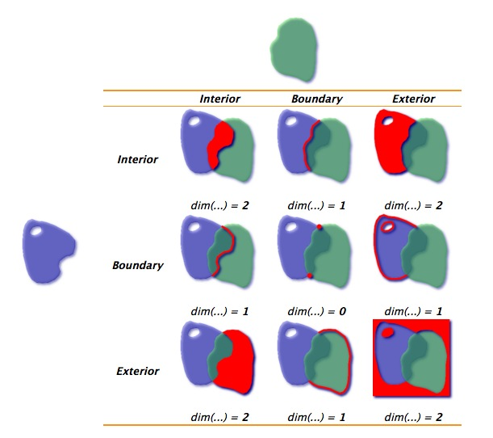

위 예의 다각형의 경우 내부 교차점은 2차원 영역이므로 행렬의 일부는 "2"로 채워집니다. 경계는 0차원인 점에서만 교차하므로 행렬의 일부는 0으로 채워집니다.

구성요소 사이에 교차점이 없으면 행렬의 정사각형이 "F"로 채워집니다.

다음은 부분적으로 다각형을 입력하는 유도선의 또 다른 예입니다.

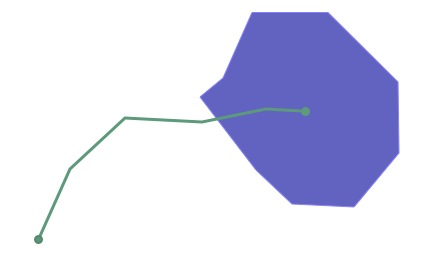

상호 작용을 위한 DE9IM 매트릭스는 다음과 같습니다.

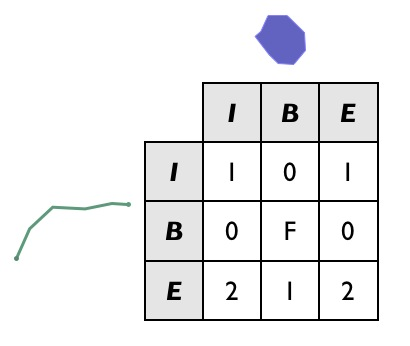

두 개체의 경계는 실제로 전혀 교차하지 않으므로(선의 끝점은 경계가 아닌 다각형의 내부와 상호 작용하며 그 반대도 마찬가지임) B/B 셀은 "F"로 채워집니다.

DE9IM 행렬을 시각적으로 채우는 것은 재미있지만 컴퓨터가 이를 수행할 수 있다면 좋을 것입니다. 이것이 `ST_Relate` 기능의 목적입니다.

이전 예는 다각형 및 선스트링과 동일한 공간 관계를 사용하여 간단한 상자와 선을 사용하여 단순화할 수 있습니다.

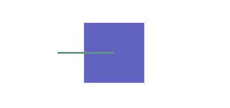

그리고 SQL에서 DE9IM 정보를 생성할 수 있습니다.

```sql
SELECT ST_Relate(
         'LINESTRING(0 0, 2 0)',
         'POLYGON((1 -1, 1 1, 3 1, 3 -1, 1 -1))'
       );
```

답(1010F0212)은 우리가 시각적으로 계산한 것과 동일하지만 테이블의 첫 번째 행, 두 번째 행, 세 번째 행이 함께 추가된 9자 문자열로 반환됩니다.

    101
    0F0
    212

그러나 DE9IM 행렬의 힘은 행렬을 생성하는 데 있는 것이 아니라 서로 매우 특정한 관계가 있는 형상을 찾기 위해 일치하는 키로 사용하는 데 있습니다.

```sql
CREATE TABLE lakes ( id serial primary key, geom geometry );
CREATE TABLE docks ( id serial primary key, good boolean, geom geometry );

INSERT INTO lakes ( geom )
  VALUES ( 'POLYGON ((100 200, 140 230, 180 310, 280 310, 390 270, 400 210, 320 140, 215 141, 150 170, 100 200))');

INSERT INTO docks ( geom, good )
  VALUES
    ('LINESTRING (170 290, 205 272)',true),
    ('LINESTRING (120 215, 176 197)',true),
    ('LINESTRING (290 260, 340 250)',false),
    ('LINESTRING (350 300, 400 320)',false),
    ('LINESTRING (370 230, 420 240)',false),
    ('LINESTRING (370 180, 390 160)',false);
```

**Lakes** 및 **Docks**를 포함하는 데이터 모델이 있고 Dock이 호수 내부에 있어야 하며 한쪽 끝에서 포함된 호수의 경계에 닿아야 한다고 가정합니다. 해당 규칙을 준수하는 데이터베이스에서 모든 도크를 찾을 수 있습니까?

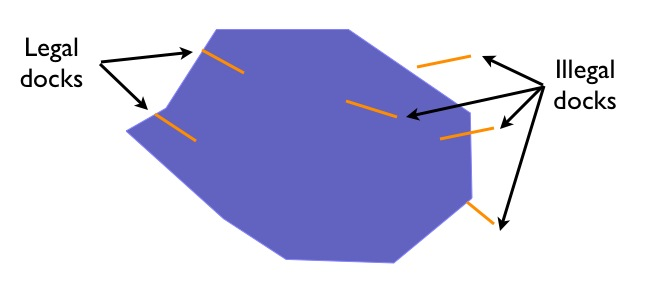

조건을 충족하는 도크는 다음과 같은 특징이 있습니다.

- 내부에는 호수 내부와 선형(1D) 교차점이 있습니다.
- 경계에는 호수 내부와 교차하는 점(0D)이 있습니다.
- 경계에는 호수 경계와도 교차하는 점(0D)이 있습니다.
- 내부에는 호수 외부와 교차점(F)이 없습니다.

따라서 DE9IM 매트릭스는 다음과 같습니다.

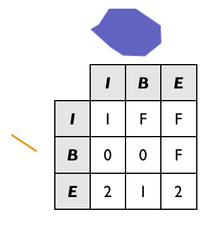

따라서 모든 합법적인 도크를 찾으려면 호수와 교차하는 모든 도크(조인 키에 사용하는 **potential** 후보의 상위 집합)를 찾은 다음 해당 세트에서 법적 관련 패턴이 있는 모든 도크를 찾으려고 합니다.

```sql
SELECT docks.*
FROM docks JOIN lakes ON ST_Intersects(docks.geom, lakes.geom)
WHERE ST_Relate(docks.geom, lakes.geom, '1FF00F212');

-- Answer: our two good docks
```

패턴이 일치하면 true를 반환하고, 일치하지 않으면 false를 반환하는 `ST_Relate`의 3개 매개변수 버전을 사용합니다. 이와 같이 완전히 정의된 패턴의 경우 매개변수 3개 버전이 필요하지 않습니다. 문자열 동등 연산자를 사용할 수도 있었습니다.

그러나 보다 느슨한 패턴 검색의 경우 세 매개변수를 사용하면 패턴 문자열에 대체 문자를 사용할 수 있습니다.

- "\*"는 "이 셀의 모든 값을 사용할 수 있음"을 의미합니다.
- "T"는 "false가 아닌 모든 값(0, 1 또는 2)이 허용됨"을 의미합니다.

예를 들어 예시 그래픽에 포함하지 않은 가능한 부두 중 하나는 호수 경계와 2차원 교차점이 있는 부두입니다.

```sql
INSERT INTO docks ( geom, good )
  VALUES ('LINESTRING (140 230, 150 250, 210 230)',true);
```

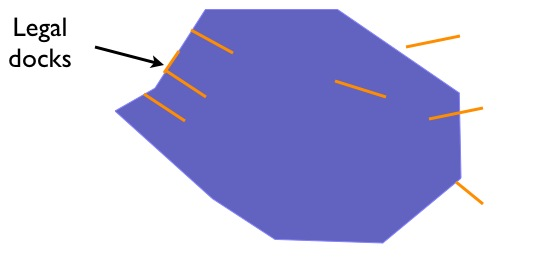

이 사례를 "법적" 도크 세트에 포함하려면 쿼리에서 관련 패턴을 변경해야 합니다. 특히, 부두 내부 호수 경계의 교차점은 이제 1(새 사례) 또는 F(원래 사례)가 될 수 있습니다. 그래서 우리는 패턴에 "\*" 캐치올을 사용합니다.

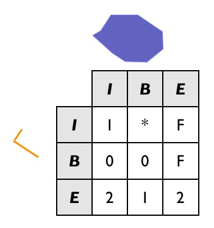

그리고 SQL은 다음과 같습니다:

```sql
SELECT docks.*
FROM docks JOIN lakes ON ST_Intersects(docks.geom, lakes.geom)
WHERE ST_Relate(docks.geom, lakes.geom, '1*F00F212');

-- Answer: our (now) three good docks
```

이전 예의 더 엄격한 SQL이 새 도크를 반환하지 *않는*지 확인하세요.

## 데이터 품질 테스트

TIGER 데이터는 준비 시 품질이 철저하게 관리되므로 데이터가 엄격한 기준을 충족할 것으로 기대합니다. 예를 들어, 인구 조사 블록은 다른 인구 조사 블록과 겹쳐서는 안 됩니다. 테스트해볼까요?

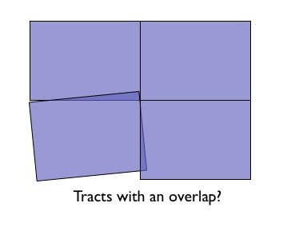

확신하는!

```sql
SELECT a.gid, b.gid
FROM nyc_census_blocks a, nyc_census_blocks b
WHERE ST_Intersects(a.geom, b.geom)
  AND ST_Relate(a.geom, b.geom, '2********')
  AND a.gid != b.gid
LIMIT 10;

-- Answer: 10, there's some funny business
```

마찬가지로 도로 데이터도 모두 엔드 노드로 구성되어 있을 것으로 예상합니다. 즉, 교차점은 선의 중간점이 아닌 선의 끝에서만 발생할 것으로 예상합니다.

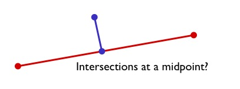

교차하지만(그래서 조인이 있음) 경계 사이의 교차점이 0차원이 아닌(즉, 끝점이 닿지 않는) 거리를 찾아서 이를 테스트할 수 있습니다.

```sql
SELECT a.gid, b.gid
FROM nyc_streets a, nyc_streets b
WHERE ST_Intersects(a.geom, b.geom)
  AND NOT ST_Relate(a.geom, b.geom, '****0****')
  AND a.gid != b.gid
LIMIT 10;

-- Answer: This happens, so the data is not end-noded.
```

### 기능 목록

[ST_Relate(기하학 A, 기하학 B)](http://postgis.net/docs/ST_Relate.html): 기하학 간의 DE9IM 관계를 나타내는 텍스트 문자열을 반환합니다.


---

[← 이전](25_linear_referencing.md) · [목차](00_index.md) · [다음 →](27_clusterindex.md)
