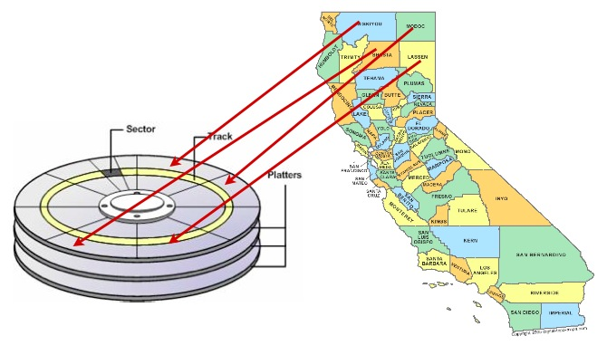
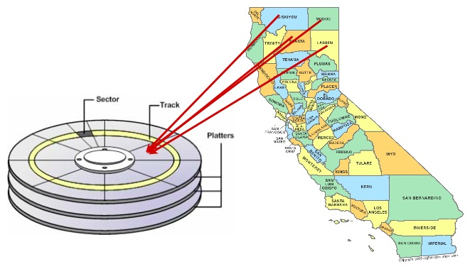
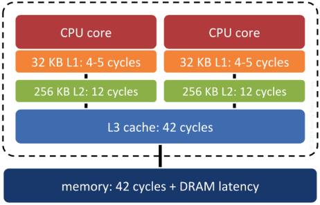

# 27. 인덱스 기반 클러스터링 (Clustering on Indices)

> 공식 원문: [<https://postgis.net/workshops/postgis-intro/clusterindex.html>](https://postgis.net/workshops/postgis-intro/clusterindex.html)\
> 공식 소스의 본문·표·SQL·이미지를 현재 페이지 순서대로 반영했습니다.

데이터베이스는 디스크에서 정보를 가져올 수 있는 만큼만 빠르게 정보를 검색할 수 있습니다. 소규모 데이터베이스는 RAM 캐시에 완전히 떠서 물리적 디스크 제한에서 벗어나지만, 대규모 데이터베이스의 경우 물리적 디스크에 대한 액세스로 인해 디스크 액세스 속도가 제한됩니다.

데이터는 기회주의적으로 디스크에 기록되므로 디스크에 데이터가 저장되는 순서와 응용 프로그램에서 해당 데이터에 액세스하거나 구성하는 방식 간에 반드시 상관관계가 있는 것은 아닙니다.



데이터에 대한 액세스 속도를 높이는 한 가지 방법은 동일한 결과 세트에서 함께 검색될 가능성이 있는 레코드가 하드 디스크 플래터의 유사한 물리적 위치에 있는지 확인하는 것입니다. 이것을 "클러스터링"이라고 합니다.

올바른 클러스터링 체계를 사용하는 것은 까다로울 수 있지만 일반적인 규칙이 적용됩니다. 인덱스는 데이터 검색에 사용되는 액세스 패턴과 유사한 데이터에 대한 자연스러운 순서 체계를 정의합니다.



따라서 인덱스와 동일한 순서로 디스크의 데이터를 정렬하면 경우에 따라 속도 이점을 얻을 수 있습니다.

## R-트리에서의 클러스터링

공간 데이터는 공간적으로 상관된 창에서 액세스하는 경향이 있습니다. 웹이나 데스크톱 애플리케이션의 지도 창을 생각해 보세요. 창에 있는 모든 데이터는 비슷한 위치 값을 갖습니다(또는 창에 있지 않습니다!).

따라서 공간 인덱스를 기반으로 한 클러스터링은 공간 쿼리를 통해 액세스할 공간 데이터에 적합합니다. 유사한 항목은 유사한 위치를 갖는 경향이 있습니다.

공간 인덱스를 기반으로 `nyc_census_blocks`를 클러스터링해 보겠습니다.

```sql
-- Cluster the blocks based on their spatial index
CLUSTER nyc_census_blocks USING nyc_census_blocks_geom_idx;
```

이 명령은 공간 인덱스 `nyc_census_blocks_geom_gist`에 정의된 순서대로 `nyc_census_blocks`를 다시 작성합니다. 속도 차이를 느낄 수 있나요? 어쩌면 그렇지 않을 수도 있습니다. 원본 데이터에 이미 일부 기존 공간 순서가 있을 수 있기 때문입니다(이는 GIS 데이터 세트에서 드문 일이 아닙니다).

## 디스크 대 메모리/SSD

대부분의 최신 데이터베이스는 SSD 스토리지를 사용하여 실행됩니다. SSD 스토리지는 구형 회전 자기 미디어보다 무작위 액세스 속도가 훨씬 빠릅니다. 또한 대부분의 최신 데이터베이스는 데이터베이스 서버의 RAM에 들어갈 만큼 작은 데이터 위에서 실행되며 운영 체제 "가상 파일 시스템"이 이를 캐시할 때 데이터가 저장됩니다.

클러스터링이 여전히 필요합니까?

놀랍게도 그렇습니다. 메모리의 "서로 가까운" 공간에 "서로 가까운" 레코드를 유지하면 관련 레코드가 서버의 "메모리 캐시 계층 구조" 위로 함께 이동하여 메모리 액세스가 더 빨라질 확률이 높아집니다.



최신 컴퓨터에서는 시스템 RAM보다 빠른 캐시 메모리가 CPU와 RAM 사이에 여러 단계로 존재합니다. 운영 체제와 프로세서는 데이터를 블록 단위로 캐시 계층 사이에서 옮깁니다. 캐시로 옮겨진 블록에 곧 사용할 데이터가 들어 있으면 큰 이득을 얻습니다. 메모리의 데이터 배치와 공간적 인접성을 맞추면 그 가능성이 커집니다.

## 인덱스 구조가 중요합니까?

이론적으로는 그렇습니다. 실제로는 그렇지 않습니다. 인덱스가 데이터의 "매우 좋은" 공간 분해인 한, 성능의 주요 결정 요인은 실제 테이블 튜플의 순서입니다.

"인덱스 없음"과 "인덱스"의 차이는 일반적으로 엄청나며 측정 가능성이 높습니다. "보통 지수"와 "훌륭한 지수" 사이의 차이는 일반적으로 식별하기 위해 매우 신중한 측정이 필요하며 테스트되는 작업 부하에 매우 민감할 수 있습니다.

## 기능 목록

[CLUSTER](https://www.postgresql.org/docs/current/sql-cluster.html): 인덱스의 순서와 일치하도록 테이블의 데이터 순서를 다시 지정합니다.


---

[← 이전](26_de9im.md) · [목차](00_index.md) · [다음 →](28_3d.md)
