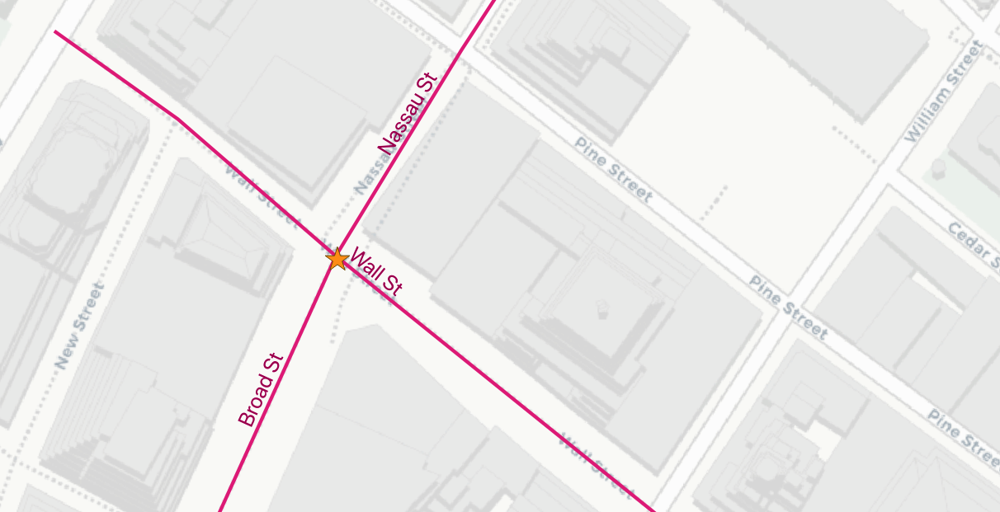
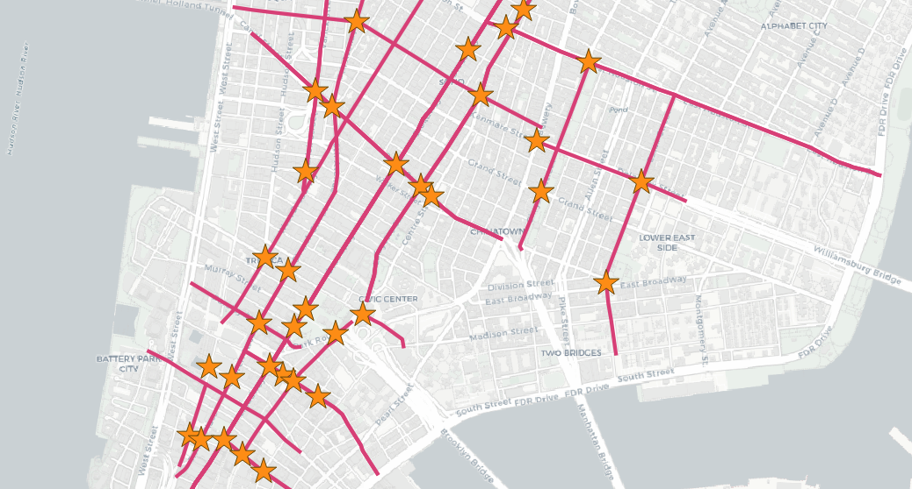

# 29. 최근접 이웃 탐색 (Nearest-Neighbour Searching / KNN)

> 공식 원문: [<https://postgis.net/workshops/postgis-intro/knn.html>](https://postgis.net/workshops/postgis-intro/knn.html)\
> 공식 소스의 본문·표·SQL·이미지를 현재 페이지 순서대로 반영했습니다.

**최근접 이웃 탐색(KNN, K-Nearest Neighbor Searching)**은 GIS 질의에서 가장 빈번하게 요구되는 패턴 중 하나입니다.

> "내 현재 위치에서 **가장 가까운 주유소 3곳**은 어디인가?"

기존의 `ST_Distance(A, B)` 함수를 사용해 `ORDER BY ST_Distance(...) LIMIT N`으로 작성하면, 데이터베이스가 테이블의 모든 행에 대해 거리를 계산한 뒤 정렬해야 하므로 대용량 테이블에서 매우 느립니다.

PostGIS는 공간 인덱스(GiST)를 통해 트리 레벨에서 가장 가까운 노드부터 우선 탐색(Branch-and-Bound)할 수 있는 **거리 기반 인덱스 정렬 연산자(`<->`)**를 제공합니다.

---

## 1. `<->` 연산자를 활용한 고속 KNN 쿼리

`ORDER BY geom <-> 'POINT(...)'::geometry LIMIT N` 구문을 사용하면 테이블 전체를 스캔하지 않고도 **인덱스를 통해 가장 가까운 N개의 결과만 즉시 추출**합니다.

```sql
-- 'Broad St' 지하철역에서 가장 가까운 도로 3개 검색
SELECT
  streets.gid,
  streets.name,
  streets.geom <-> 'SRID=26918;POINT(583571.9 4506714.3)'::geometry AS dist
FROM nyc_streets AS streets
ORDER BY dist
LIMIT 3;
```

```text
  gid  |   name    |        dist
-------+-----------+--------------------
 17385 | Wall St   |  0.749987508809928
 17390 | Broad St  | 0.8836306235191059
 17436 | Nassau St | 1.3368280241070414
```



### EXPLAIN으로 인덱스 스캔 실행 계획 확인

```sql
EXPLAIN
SELECT streets.gid, streets.name
FROM nyc_streets AS streets
ORDER BY streets.geom <-> 'SRID=26918;POINT(583571.9 4506714.3)'::geometry
LIMIT 3;
```

```text
QUERY PLAN
---------------------------------------------------------------------------------
Limit  (cost=0.28..79.58 rows=3 width=31)
  ->  Index Scan using nyc_streets_geom_idx on nyc_streets streets
        Order By: (geom <-> '0101000020266900000EEBD4CF27CF2141BC17D69516315141'::geometry)
```

실행 계획을 보면 전체 테이블을 읽지 않고 `Index Scan`으로 상위 3개 행만 즉시 반환함을 확인할 수 있습니다.

---

## 2. LATERAL 조인을 활용한 다대다 최근접 이웃 조인 (KNN Join)

`<->` 연산자는 우변에 **단일 지오메트리 상수(리터럴)**가 올 때 인덱스를 직접 탈 수 있습니다. 만약 "모든 지하철역 각각에 대해 가장 가까운 도로 1개씩 찾기"와 같은 다대다 조인을 수행하려면 어떻게 해야 할까요?

PostgreSQL의 **`LATERAL` 조인**을 사용하면 각 행마다 서브쿼리를 실행하면서 인덱스 스캔을 적용할 수 있습니다.

```sql
SELECT
  subways.gid AS subway_gid,
  subways.name AS subway_name,
  streets.name AS nearest_street_name,
  streets.dist AS distance_meters
FROM nyc_subway_stations AS subways
CROSS JOIN LATERAL (
  SELECT
    streets.name,
    streets.geom <-> subways.geom AS dist
  FROM nyc_streets AS streets
  ORDER BY dist
  LIMIT 1
) AS streets;
```



`CROSS JOIN LATERAL`은 지하철역 테이블의 491개 행을 하나씩 순회하면서, 내부의 도로 테이블 서브쿼리에 공간 인덱스 스캔을 적용하므로 491개의 최근접 매칭을 순식간에 완료합니다.

---

## 함수 및 연산자 목록

- [geometry_a <-> geometry_b](http://postgis.net/docs/geometry_distance_knn.html): 두 지오메트리 간의 2차원 바운딩 박스/중심점 거리를 계산하며, `ORDER BY` 절에서 GiST 공간 인덱스를 활용한 고속 KNN 탐색을 지원합니다.


---

[← 이전](28_3d.md) · [목차](00_index.md) · [다음 →](30_rasters.md)
