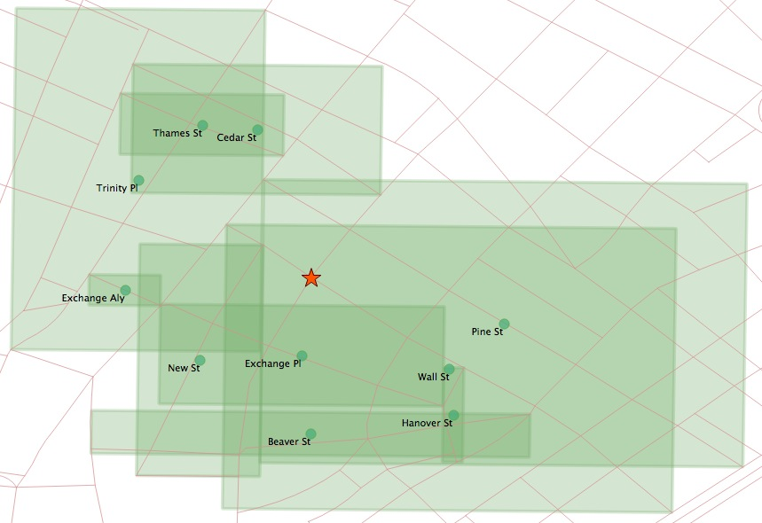

# 29. 최근접 이웃 탐색 (Nearest-Neighbour Searching / KNN)

> 공식 원문: [<https://postgis.net/workshops/postgis-intro/knn.html>](https://postgis.net/workshops/postgis-intro/knn.html)\
> 공식 소스의 본문·표·SQL·이미지를 현재 페이지 순서대로 반영했습니다.

## 최근접이웃 검색이란 무엇인가요?

자주 제기되는 공간 쿼리는 "\<query feature\>에 가장 가까운 \<candidate feature\>는 무엇입니까?"입니다.

거리 검색과 달리 "가장 가까운 이웃" 검색에는 후보 도형이 얼마나 멀리 떨어져 있는지를 제한하는 측정값이 포함되지 않으며 *가장 가까운* 피처인 한 모든 거리에 있는 피처가 허용됩니다.

PostgreSQL은 정렬된 반환 집합의 속도를 높이기 위해 데이터베이스가 인덱스를 사용하도록 유도하는 "거리별 순서"(`<->`) 연산자를 도입하여 최근접 이웃 문제를 해결합니다. "거리별 순서" 연산자를 사용하면 가장 가까운 이웃 쿼리에서 순서를 추가하고 결과 집합을 N 항목으로 제한하는 것만으로 "N개의 가장 가까운 기능"을 반환할 수 있습니다.

"거리별 정렬" 연산자는 기하학과 지리 유형 모두에 작동합니다. 두 유형 간의 작동 방식의 유일한 차이점은 반환되는 거리 값입니다. 기하학의 경우 `<->`는 사용 중인 공간 참조 시스템의 단위에 따라 <span class="title-ref">ST_Distance</span>와 동일한 대답을 반환합니다. 지리의 경우 반환되는 거리 값은 `ST_Distance(geography,geography)`가 반환하는 더 정확한 타원체 거리가 아니라 구형 거리입니다.

'Broad St' 지하철역에서 가장 가까운 3개 거리는 다음과 같습니다.

```sql
-- Get the geometry of Broad St
SELECT ST_AsEWKT(geom, 1)
FROM nyc_subway_stations
WHERE name = 'Broad St';
```

    SRID=26918;POINT(583571.9 4506714.3)

```sql
-- Plug the geometry into a nearest-neighbor query
SELECT streets.gid, streets.name,
  ST_Transform(streets.geom, 4326),
  streets.geom <-> 'SRID=26918;POINT(583571.9 4506714.3)'::geometry AS dist
FROM
  nyc_streets streets
ORDER BY
  dist
LIMIT 3;
```

    gid  |   name    |        dist
    -------+-----------+--------------------
    17385 | Wall St   |  0.749987508809928
    17390 | Broad St  | 0.8836306235191059
    17436 | Nassau St | 1.3368280241070414


인덱스 지원 쿼리를 받고 있는지 어떻게 확인할 수 있나요? 가장 가까운 이웃 쿼리에 대한 `EXPLAIN` 출력을 확인하는 것이 좋습니다. 왜냐하면 인덱싱되지 않은 SQL에서 올바른 답변을 얻을 수 있고 테이블 크기가 확장될 때까지 인덱스 부족이 명확하지 않을 수 있기 때문입니다.

이것은 `EXPLAIN`의 출력입니다. 다음 순서에 대한 인덱스 스캔을 참고하세요.

    QUERY PLAN
    ---------------------------------------------------------------------------------
    Limit  (cost=0.28..79.58 rows=3 width=31)
    ->  Index Scan using nyc_streets_geom_idx on nyc_streets streets
    (cost=0.28..504685.12 rows=19091 width=31)
    Order By:
    (geom <-> '0101000020266900000EEBD4CF27CF2141BC17D69516315141'::geometry)

## 가장 가까운 이웃 조인

연산자에 의한 색인 지원 순서에는 한 가지 주요 단점이 있습니다. 즉, 연산자 한쪽의 **단일 기하학 리터럴**에서만 작동합니다. 이는 하나의 쿼리 개체에 가장 가까운 개체를 찾는 데는 적합하지만 전체 후보 집합 각각에 대해 가장 가까운 이웃을 찾는 것이 목표인 공간 조인에는 도움이 되지 않습니다.

다행히 루프에서 반복적으로 구동되는 쿼리를 실행할 수 있는 SQL 언어 기능인 [LATERAL 조인](https://medium.com/kkempin/postgresqls-lateral-join-bfd6bd0199df)이 있습니다.

여기서는 각 지하철역에서 가장 가까운 거리를 찾아보겠습니다.

```sql
SELECT subways.gid AS subway_gid,
       subways.name AS subway,
       streets.name AS street,
       streets.gid AS street_gid,
       streets.geom::geometry(MultiLinestring, 26918) AS street_geom,
       streets.dist
FROM nyc_subway_stations subways
CROSS JOIN LATERAL (
  SELECT streets.name, streets.geom, streets.gid, streets.geom <-> subways.geom AS dist
  FROM nyc_streets AS streets
  ORDER BY dist
  LIMIT 1
) streets;
```

`CROSS JOIN LATERAL`가 지하철 테이블에 의해 구동되는 루프의 내부 부분으로 작동하는 방식에 유의하십시오. Subways 테이블의 각 레코드는 측면 하위 쿼리에 한 번에 하나씩 입력되므로 각 Subway 레코드에 대해 가장 가까운 결과를 얻을 수 있습니다.


설명은 지하철 역의 루프와 우리가 원하는 루프 내부의 인덱스 지원 순서를 보여줍니다.

    QUERY PLAN
    -------------------------------------------------------------------------
    Nested Loop  (cost=0.28..13140.71 rows=491 width=37)
    ->  Seq Scan on nyc_subway_stations subways
    (cost=0.00..15.91 rows=491 width=46)
    ->  Limit
    (cost=0.28..1.71 rows=1 width=170)
    ->  Index Scan using nyc_streets_geom_idx on nyc_streets streets
    (cost=0.28..27410.12 rows=19091 width=170)
    Order By: (geom <-> subways.geom)

------------------------------------------------------------------------

<details markdown="1">
<summary><strong>기존 로컬 문서 보존본</strong> — 로컬 실습 확장·요약 내용</summary>

# 29. 최근접 이웃 탐색 (Nearest-Neighbour Searching / KNN)

**KNN (K-Nearest Neighbors)**은 기준 위치에서 가장 가까운 상위 $K$개의 객체를 찾는 기법입니다.

기존의 `ORDER BY ST_Distance(geom, point) LIMIT K` 방식은 전체 테이블의 거리를 일일이 계산(전체 스캔)해야 하므로 데이터가 많을 때 매우 느립니다.

PostGIS는 **GiST 인덱스 거리 연산자 (`<->`)**를 제공하여 인덱스 트리를 직접 탐색하는 초고속 인덱스 기반 KNN 검색을 지원합니다.



---

## 1. GiST KNN 연산자 (`<->`)

`<->` 연산자는 바운딩 박스 간 거리를 인덱스 수준에서 계산하여 가장 가까운 행부터 정렬합니다.

```sql
-- 특정 지점(X: 583571, Y: 4509376)에서 가장 가까운 지하철역 3곳 초고속 검색
SELECT
  name,
  routes
FROM nyc_subway_stations
ORDER BY geom <-> ST_SetSRID(ST_MakePoint(583571, 4509376), 26918)
LIMIT 3;
```

---

## 2. 성능 비교
- 일반 `ORDER BY ST_Distance(...) LIMIT 3`: 테이블 100만 건 기준 수 초 소요 (Full Scan)
- GiST KNN `ORDER BY geom <-> point LIMIT 3`: 100만 건 중에서도 **1ms 미만**으로 즉시 완료 (Index Scan)

---

| [⬅️ 28. 3차원 데이터 (3-D)](28_3d.md) | [🏠 워크숍 목차](README.md) | [30. 래스터 (Rasters) ➡️](30_rasters.md) |
| :--- | :---: | ---: |

</details>

---

[← 이전](28_3d.md) · [목차](00_index.md) · [다음 →](30_rasters.md)