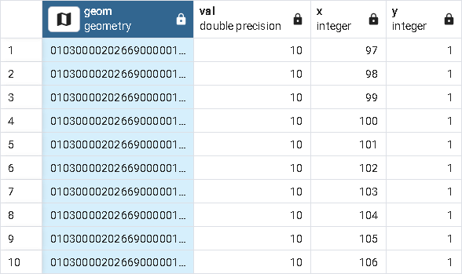
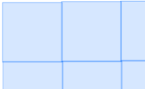
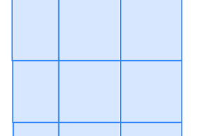

# 30. 래스터 (Rasters)

> 공식 원문: [<https://postgis.net/workshops/postgis-intro/rasters.html>](https://postgis.net/workshops/postgis-intro/rasters.html)\
> 공식 소스의 본문·표·SQL·이미지를 현재 페이지 순서대로 반영했습니다.

PostGIS는 *래스터*라고 불리는 또 다른 종류의 공간 데이터 유형을 지원합니다. 기하 데이터와 마찬가지로 래스터 데이터는 **직교 좌표** 및 공간 참조 시스템을 사용합니다. 그러나 래스터 데이터는 벡터 데이터가 아닌 픽셀과 밴드로 구성된 n차원 행렬로 표현됩니다. 밴드는 가지고 있는 행렬의 수를 정의합니다. 각 픽셀은 각 밴드에 해당하는 값을 저장합니다. 따라서 RGB 이미지와 같은 3밴드 래스터는 빨간색-녹색-파란색 밴드에 해당하는 각 픽셀에 대해 3개의 값을 갖습니다.

TV 화면에서 보는 것과 같은 예쁜 그림은 래스터이지만 래스터는 보기에 그다지 흥미롭지 않을 수 있습니다. 간단히 말해서 래스터는 좌표계에 고정된 행렬로, 표현하려는 모든 것을 나타낼 수 있는 값을 가지고 있습니다.

래스터는 데카르트 공간에 있으므로 래스터는 형상과 상호 작용할 수 있습니다. PostGIS는 래스터와 도형을 모두 입력으로 사용하는 많은 기능을 제공합니다. 래스터에 적용되는 많은 작업으로 인해 형상이 생성됩니다. 일반적인 것들은 <span class="title-ref">ST_Polygon</span>, <span class="title-ref">ST_Envelope</span>, <span class="title-ref">ST_ConvexHull</span>입니다. <span class="title-ref">ST_MinConvexHull</span>는 아래와 같습니다. 래스터를 형상으로 캐스팅하면 래스터의 <span class="title-ref">ST_ConvexHull</span>가 출력됩니다.


래스터 형식은 고도 데이터, 온도 데이터, 위성 데이터 및 환경 오염, 인구 밀도, 환경 위험 발생 등을 나타내는 주제별 데이터를 저장하는 데 일반적으로 사용됩니다. 래스터를 사용하여 의미 있는 좌표 위치가 있는 숫자 데이터를 저장할 수 있습니다. 유일한 제한 사항은 특정 밴드의 모든 데이터에 대해 숫자 데이터 유형이 동일해야 한다는 것입니다.

PostGIS에서 래스터 데이터를 처음부터 생성할 수 있지만 더 일반적인 접근 방식은 PostGIS와 함께 패키지된 `raster2pgsql` 명령줄 도구를 사용하여 다양한 형식의 래스터 데이터를 로드하는 것입니다. 그 전에 다음 명령을 실행하여 데이터베이스에서 래스터 지원을 활성화해야 합니다.

```sql
CREATE EXTENSION postgis_raster;
```

## 기하학에서 래스터 만들기

먼저 벡터 데이터에서 래스터 데이터를 생성하는 것부터 시작한 다음 래스터 소스에서 데이터를 로드하는 보다 흥미로운 접근 방식으로 넘어갑니다. 래스터 데이터는 풍부하게 제공되며 다양한 정부 사이트에서 무료로 제공되는 경우가 많습니다.

다음과 같이 [ST_AsRaster](https://postgis.net/docs/RT_ST_AsRaster.html) 함수를 사용하여 일부 도형을 래스터로 변환하는 것부터 시작하겠습니다.

```sql
CREATE TABLE rasters (name varchar, rast raster);

INSERT INTO rasters(name, rast)
SELECT f.word, ST_AsRaster(geom, width=>150, height=>150)
FROM (VALUES ('Hello'), ('Raster') ) AS f(word)
  , ST_Letters(word) AS geom;

CREATE INDEX ix_rasters_rast
  ON rasters USING gist(ST_ConvexHull(rast));
```

위의 예는 PostGIS 3.2+ [ST_Letters](https://postgis.net/docs/ST_Letters.html) 함수를 사용하여 문자로 구성된 도형에서 테이블(**rasters**)을 생성합니다. 기하학과 유사한 래스터는 공간 인덱스를 활용할 수 있습니다. 래스터에 사용되는 공간 색인은 래스터의 기하학적 볼록선을 색인하는 기능 색인입니다.

Postgis 래스터 [ST_Count](https://postgis.net/docs/RT_ST_Count.html) 함수를 활용하여 데이터가 있는 픽셀 수를 계산하고 [ST_MetaData](https://postgis.net/docs/RT_ST_MetaData.html) 함수를 사용하여 래스터에 대한 모든 종류의 유용한 배경 정보를 제공하는 다음 쿼리를 통해 래스터의 유용한 메타데이터를 볼 수 있습니다.

```sql
SELECT name, ST_Count(rast) As num_pixels, md.*
   FROM rasters, ST_MetaData(rast) AS md;
```

    name  | num_pixels | upperleftx |    upperlefty     | width | height |       scalex       |       scaley        | skewx | skewy | srid | numbands
    --------+------------+------------+-------------------+-------+--------+--------------------+---------------------+-------+-------+------+----------
    Hello  |      13926 |          0 | 77.10000000000001 |   150 |    150 |  1.226888888888889 | -0.5173333333333334 |     0 |     0 |    0 |        1
    Raster |      11967 |          0 |              75.4 |   150 |    150 | 1.7226319023207244 | -0.5086666666666667 |     0 |     0 |    0 |        1
    (2 rows)

> [!NOTE]
> 래스터 기능에는 두 가지 수준이 있습니다. 래스터 수준에서 작동하는 ST_MetaData와 같은 함수가 있고 밴드 수준에서 작동하는 `ST_Count` 함수 및 [ST_BandMetaData](https://postgis.net/docs/RT_ST_BandMetaData.html) 함수와 같은 함수가 있습니다. 밴드 수준에서 작동하는 Postgis 래스터의 대부분 기능은 한 번에 하나의 밴드에서만 작동하며 원하는 밴드는 <span class="title-ref">1</span>라고 가정합니다.

다중 대역 래스터가 있고 1 이외의 대역에서 데이터 값이 아닌 픽셀을 계산해야 하는 경우 <span class="title-ref">ST_Count(rast,2)</span>와 같이 대역 번호를 명시적으로 지정합니다.

모든 래스터의 크기가 어떻게 150x150인지 확인하세요. 이는 이상적이지 않습니다. 이는 이를 강제하기 위해 래스터가 모든 종류의 방법으로 찌그러진다는 것을 의미합니다. 우리 앞에 있는 래스터의 추악함을 볼 수만 있다면.

## raster2pgsql을 사용하여 래스터 로드

[raster2pgsql](https://postgis.net/docs/using_raster_dataman.html#RT_Raster_Loader)은 PostGIS와 함께 패키지로 제공되는 명령줄 도구입니다. Windows에서 애플리케이션 stackbuilder PostGIS 번들을 사용하는 경우 `C:\Program Files\PostgreSQL\15\bin` 폴더에서 `raster2pgsql.exe`를 찾을 수 있으며 여기서 *15*는 실행 중인 PostgreSQL 버전으로 대체되어야 합니다.

Postgres.App을 사용하는 경우 다른 [Postgres.app CLI 도구](https://postgresapp.com/documentation/cli-tools.html) 중에서 raster2pgsql을 찾을 수 있습니다.

우분투와 데비안에서는 다음이 필요합니다.

```sh
apt install postgis
```

PostGIS 명령줄 도구를 설치해야 합니다. 추가 버전의 PostgreSQL도 설치할 수 있습니다. `pg_lsclusters` 명령을 사용하여 Debian/Ubuntu의 클러스터 목록을 확인하고 `pg_dropcluster` 명령을 사용하여 삭제할 수 있습니다.

이 연습과 이후 연습에서는 [PG Raster Workshop Dataset <https://postgis.net/stuff/workshop-data/postgis_raster_workshop.zip>](https://postgis.net/stuff/workshop-data/postgis_raster_workshop.zip) 파일에 있는 <span class="title-ref">nyc_dem.tif</span>를 사용합니다. 일부 기하학/래스터 예제의 경우 이전 장에서 로드된 NYC 데이터도 사용할 것입니다. tif를 로드하는 대신 `pg_restore` 명령줄 도구 또는 pgAdmin **Restore** 메뉴를 사용하여 데이터베이스의 zip 파일에 포함된 <span class="title-ref">nyc_dem.backup</span>를 복원할 수 있습니다.

> [!NOTE]
> 이 래스터 데이터는 건물과 물이 제거된 해수면을 기준으로 한 고도를 나타내는 3GB DEM tif인 [NYC DEM 1-foot Integer](https://data.cityofnewyork.us/City-Government/1-foot-Digital-Elevation-Model-DEM-/dpc8-z3jc)에서 가져온 것입니다. 그런 다음 더 낮은 해상도 버전을 만들었습니다.

`raster2pgsql` 도구는 ESRI 모양 파일을 PostGIS 기하학/지리 테이블에 로드하는 대신 GDAL 지원 래스터 형식을 래스터 테이블에 로드한다는 점을 제외하면 `shp2gpsql`와 유사합니다. `shp2pgsql`와 마찬가지로 소스의 SRID(공간 참조 ID)를 전달할 수 있습니다. `shp2pgsql`와 달리 소스 데이터에 적합한 메타데이터가 있는 경우 소스 데이터의 공간 참조 시스템을 추론할 수 있습니다.

제공되는 모든 가능한 스위치에 대한 전체 정보는 [raster2pgsql 옵션](https://postgis.net/docs/using_raster_dataman.html#RT_Loading_Rasters)을 참조하세요.

우리가 다루지 않을 다른 주목할만한 `raster2pgsql` 옵션은 다음과 같습니다:

- 소스의 SRID를 표시하는 기능. 대신, 우리는 raster2pgsql 추측 기술을 사용할 것입니다.
- <span class="title-ref">nodata</span> 값을 설정하는 기능, 지정되지 않은 경우 raster2pgsql은 파일에서 추론을 시도합니다.
- 데이터베이스 외부 래스터를 로드하는 기능.

폴더에 있는 모든 tif 파일을 로드하고 개요도 생성하려면 아래를 실행합니다.

```sh
raster2pgsql -d -e -l 2,3 -I -C -M -F -Y -t 256x256 *.tif nyc_dem | psql -d nyc
```

- -d 이미 존재하는 테이블을 삭제합니다.
- 위 명령은 <span class="title-ref">-e</span>를 사용하여 트랜잭션에서 커밋하는 대신 즉시 로드를 수행합니다.
- <span class="title-ref">-C</span>는 래스터 제약 조건을 설정합니다. 이는 <span class="title-ref">raster_columns</span>가 정보를 표시하는 데 유용합니다. <span class="title-ref">-x</span>와 결합하여 범위 제약 조건을 제외할 수 있습니다. 이는 검사 속도가 느리고 테이블의 향후 로드를 방해하는 제약 조건입니다.
- <span class="title-ref">-M</span>는 로드 후 진공화 및 분석하여 쿼리 플래너 통계를 개선합니다.
- <span class="title-ref">-Y</span> - 50개 일괄 복사본을 사용합니다. PostGIS 3.3 이상을 실행하는 경우 <span class="title-ref">-Y 1000</span>를 사용하여 1000개 이상의 일괄 복사본을 사용할 수 있습니다. 이렇게 하면 더 빠르게 실행되지만 더 많은 메모리를 사용하게 됩니다.
- <span class="title-ref">-l 2,3</span> 보기 테이블 위에 생성: <span class="title-ref">o_2_ncy_dem</span> 및 <span class="title-ref">o_3_nyc_dem</span>. 이는 데이터를 볼 때 유용합니다.
- - 공간 인덱스를 생성합니다.
- <span class="title-ref">-F</span>를 사용하여 파일 이름을 추가합니다. tif 파일이 하나만 있는 경우 이는 의미가 없습니다. 여러 개가 있는 경우 각 행이 어떤 파일에서 왔는지 알려 주는 데 유용합니다.
- <span class="title-ref">-t</span>는 블록 크기를 설정합니다. 최적의 크기 사용이 확실하지 않은 경우 대신 <span class="title-ref">-t auto</span>를 사용하세요. 그러면 raster2pgql은 tif에 있던 것과 동일한 타일링을 사용합니다. 출력은 선택한 블록 크기를 알려줍니다. 거대하거나 이상해 보이면 취소하세요. 원본 파일의 크기는 300x7로 이상적이지 않습니다.
- `psql`를 사용하여 데이터베이스에 대해 생성된 SQL을 실행합니다. 대신 파일로 덤프하려면 <span class="title-ref">\> nyc_dem.sql</span>를 사용하세요.

이 예에서는 tif 파일이 하나만 있으므로 <span class="title-ref">\*.tif</span> 대신 전체 파일 이름을 지정할 수 있습니다. 파일이 현재 디렉터리에 없으면 <span class="title-ref">\*.tif</span>를 사용하여 폴더 경로를 지정할 수도 있습니다.

> [!NOTE]
> Windows에서 폴더를 참조해야 하는 경우 <span class="title-ref">C:/workshop/\*.tif</span>와 같은 드라이브 문자를 포함해야 합니다.

PostGIS 용어에서 **래스터 타일**과 **raster**라는 용어가 어느 정도 같은 의미로 사용되는 것을 자주 듣게 될 것입니다. 래스터 타일은 실제로 방금 로드한 NYC dem 데이터와 같이 더 큰 래스터의 하위 집합인 래스터 열의 특정 래스터에 해당합니다. 그 이유는 래스터가 큰 래스터 파일에서 PostGIS로 로드될 때 관리하기 쉽도록 많은 행으로 잘려지기 때문입니다. 그러면 각 행의 각 래스터는 더 큰 래스터의 일부가 됩니다. 각 타일은 지정한 블록 크기로 표시된 동일한 크기의 영역을 차지합니다. 래스터는 슬프게도 1GB PostgreSQL [TOAST](https://www.postgresql.org/docs/current/storage-toast.html) 제한과 느린 디토스트 프로세스로 인해 제한되므로 적절한 성능을 달성하거나 저장하기 위해 잘게 잘라야 합니다.

## 브라우저에서 래스터 보기

pgAdmin과 psql에는 아직 Postgis 래스터를 볼 수 있는 메커니즘이 없지만 몇 가지 옵션이 있습니다. 작은 래스터의 경우 가장 쉬운 방법은 [PostGIS 래스터 출력에 나열된 <span class="title-ref">ST_AsPNG</span> 또는 <span class="title-ref">ST_AsGDALRaster</span>와 같은 Postgis 래스터 함수가 포함된 배터리를 사용하여 PNG와 같은 웹 친화적인 래스터 형식으로 출력하는 것입니다. 기능](https://postgis.net/docs/RT_reference.html#Raster_Outputs). 래스터가 커짐에 따라 QGIS와 같은 도구를 사용하여 래스터의 멋진 모습을 보거나 `gdal_translate`와 같은 GDAL 명령줄 도구 제품군을 사용하여 다른 래스터 형식으로 내보내는 것이 좋습니다. 하지만 Postgis 래스터는 분석을 위해 만들어졌지, 보기에 좋은 그림을 생성하기 위해 만들어지지 않았다는 점을 기억하세요.

한 가지 주의할 점은 기본적으로 모든 다른 래스터 유형 출력이 비활성화되어 있다는 것입니다. 이를 활용하려면 [GDAL 래스터 드라이버 활성화](https://postgis.net/docs/postgis_gdal_enabled_drivers.html)에 설명된 대로 드라이버 전체 또는 하위 집합을 활성화해야 합니다.

```sql
SET postgis.gdal_enabled_drivers = 'ENABLE_ALL';
```

각 연결마다 이 작업을 수행하지 않으려면 다음을 사용하여 데이터베이스 수준에서 설정할 수 있습니다.

```sql
ALTER DATABASE nyc SET postgis.gdal_enabled_drivers = 'ENABLE_ALL';
```

데이터베이스에 대한 각각의 새로운 연결은 해당 설정을 사용합니다.

아래 쿼리를 실행하고 출력을 복사하여 웹 브라우저의 주소 표시줄에 붙여넣습니다.

```sql
SELECT 'data:image/png;base64,' ||
   encode(ST_AsPNG(rast),'base64')
   FROM rasters
   WHERE name = 'Hello';
```


지금까지 생성된 래스터의 경우 밴드 수를 지정하지 않았으며 지구와의 관계도 정의하지 않았습니다. 따라서 우리 래스터에는 알 수 없는 공간 참조 시스템(0)이 있습니다.

래스터 외골격을 기하학으로 생각할 수 있습니다. 기하학적 봉투로 둘러싸인 행렬입니다. 유용한 분석을 수행하려면 래스터를 지리참조해야 합니다. 즉, 각 픽셀(사각형)이 의미 있는 공간 플롯을 나타내기를 원합니다.

<span class="title-ref">ST_AsRaster</span>에는 오버로드된 표현이 많이 있습니다. 이전 예제에서는 가장 간단한 구현을 사용했으며 8BUI 및 1 밴드인 기본 인수를 허용했으며 데이터는 0이 아닙니다. 다른 변형을 사용해야 하는 경우 실수로 함수의 잘못된 변형에 빠지거나 **함수가 고유하지 않습니다** 오류가 발생하지 않도록 명명된 인수 호출 구문을 사용해야 합니다.

공간 참조 시스템이 있는 지오메트리로 시작하면 결국 동일한 공간 참조 시스템을 사용하는 래스터가 됩니다. 다음 예에서는 뉴욕에 대한 단어를 밝고 명랑한 색상으로 표현하겠습니다. 또한 래스터 픽셀 크기가 1m x 1m 공간을 나타내도록 너비와 높이 대신 픽셀 크기를 사용합니다.

```sql
INSERT INTO rasters(name, rast)
SELECT f.word || ' in New York' ,
  ST_AsRaster(geom,
    scalex => 1.0, scaley => -1.0,
    pixeltype => ARRAY['8BUI', '8BUI', '8BUI'],
    value => CASE WHEN word = 'Hello' THEN
      ARRAY[10,10,100] ELSE ARRAY[10,100,10] END,
    nodataval => ARRAY[0,0,0], gridx => NULL, gridy => NULL
    ) AS rast
FROM (
    VALUES ('Hello'), ('Raster') ) AS f(word)
  , ST_SetSRID(
      ST_Translate(ST_Letters(word),586467,4504725), 26918
    ) AS geom;
```

그런 다음 이것을 보면 찌그러지지 않은 색상의 기하학을 볼 수 있습니다.

```sql
SELECT 'data:image/png;base64,' ||
   encode(ST_AsPNG(rast),'base64')
   FROM rasters
   WHERE name = 'Hello in New York';
```


래스터에 대해 반복합니다.

```sql
SELECT 'data:image/png;base64,' ||
   encode(ST_AsPNG(rast),'base64')
   FROM rasters
   WHERE name = 'Raster in New York';
```


더 놀라운 것은,

```sql
SELECT name, ST_Count(rast) As num_pixels, md.*
  FROM rasters, ST_MetaData(rast) AS md;
```

뉴욕 항목의 메타데이터를 관찰합니다. 그들은 뉴욕주 평면미터 공간 참조 시스템을 가지고 있습니다. 그들은 또한 같은 규모를 가지고 있습니다. 각 단위가 1x1미터이므로 **Raster** 단어의 너비는 이제 **Hello**보다 넓습니다.

    name         | num_pixels | upperleftx |    upperlefty     | width | height |       scalex       |       scaley        | skewx | skewy | srid  | numbands
    -------------------+------------+------------+-------------------+-------+--------+--------------------+---------------------+-------+-------+-------+----------
    Hello              |      13926 |          0 | 77.10000000000001 |   150 |    150 |  1.226888888888889 | -0.5173333333333334 |     0 |     0 |     0 |        1
    Raster             |      11967 |          0 |              75.4 |   150 |    150 | 1.7226319023207244 | -0.5086666666666667 |     0 |     0 |     0 |        1
    Hello in New York  |       8786 |     586467 |         4504802.1 |   184 |     78 |                  1 |                  -1 |     0 |     0 | 26918 |        3
    Raster in New York |      10544 |     586467 |         4504800.4 |   258 |     76 |                  1 |                  -1 |     0 |     0 | 26918 |        3
    (4 rows)

## 래스터 공간 카탈로그 테이블

기하학 및 지리 유형과 유사하게 래스터에는 데이터베이스의 모든 래스터 열을 표시하는 카탈로그 세트가 있습니다. 이는 [raster_columns 및 raster_overviews](https://postgis.net/docs/using_raster_dataman.html#RT_Raster_Catalog)입니다.

### raster_columns

<span class="title-ref">raster_columns</span> 보기는 <span class="title-ref">geometry_columns</span> 및 <span class="title-ref">geography_columns</span>의 형제에 대한 보기로, 래스터 열에 대해 거의 동일한 데이터와 그 이상을 제공합니다.

```sql
SELECT *
    FROM raster_columns;
```

표를 탐색하면 다음을 찾을 수 있습니다.

    r_table_catalog | r_table_schema | r_table_name | r_raster_column | srid | scale_x | scale_y | blocksize_x | blocksize_y | same_alignment | regular_blocking | num_bands | pixel_types | nodata_values | out_db | extent | spatial_index
    ----------------+----------------+--------------+-----------------+------+---------+---------+-------------+-------------+----------------+------------------+-----------+-------------+---------------+--------+--------+---------------
    nyc             | public         | rasters      | rast            |    0 |         |         |             |             | f              | f                |           |             |               |        |        | t
    nyc             | public         | nyc_dem      | rast            | 2263 |      10 |     -10 |         256 |         256 | t              | f                |         1 | {16BUI}     | {NULL}        | {f}    |        | t
    nyc             | public         | o_2_nyc_dem  | rast            | 2263 |      20 |     -20 |         256 |         256 | t              | f                |         1 | {16BUI}     | {NULL}        | {f}    |        | t
    nyc             | public         | o_3_nyc_dem  | rast            | 2263 |      30 |     -30 |         256 |         256 | t              | f                |         1 | {16BUI}     | {NULL}        | {f}    |        | t
    (4 rows)

<span class="title-ref">rasters</span> 테이블에 대한 대부분 채워지지 않은 정보의 실망스러운 행입니다.

기하학 및 지리와 달리 래스터는 유형 수정자를 지원하지 않습니다. 유형 수정자 공간이 너무 제한되어 있고 유형 수정자에 들어갈 수 있는 것보다 더 중요한 속성이 있기 때문입니다.

대신 Raster는 제약 조건에 의존하고 이러한 제약 조건을 뷰의 일부로 다시 읽습니다.

`raster2pgsql`를 사용하여 로드한 테이블의 다른 행을 살펴보세요. <span class="title-ref">-C</span> 스위치 `raster2pgsql`를 사용했기 때문에 srid 및 기타 정보에 대한 제약 조건이 추가되어 tif에서 읽을 수 있거나 우리가 전달한 정보가 제공되었습니다. <span class="title-ref">-l</span> 스위치로 생성된 개요 테이블 <span class="title-ref">o_2_nyc_dem</span> 및 <span class="title-ref">o_3_nyc_dem</span>도 표시됩니다.

테이블에 몇 가지 제약 조건을 추가해 보겠습니다.

```sql
SELECT AddRasterConstraints('public'::name, 'rasters'::name, 'rast'::name);
```

그리고 래스터 데이터가 얼마나 엉망이고 아무것도 제한할 수 없는지에 대한 수많은 알림을 받게 될 것입니다. raster_columns를 다시 보면 <span class="title-ref">rasters</span>에 대한 많은 빈 행에 대한 실망스러운 이야기가 여전히 동일합니다.

제약 조건을 적용하려면 테이블의 모든 래스터가 최소한 하나의 규칙으로 제약을 받을 수 있어야 합니다.

아마도 그렇게 할 수 있을 것입니다. 우리의 모든 데이터가 뉴욕 주 비행기에 있다고 거짓말을 합시다.

```sql
UPDATE rasters SET rast = ST_SetSRID(rast,26918)
  WHERE ST_SRID(rast) <> 26918;

SELECT AddRasterConstraints('public'::name, 'rasters'::name, 'rast'::name);
SELECT r_table_name AS t, r_raster_column AS c, srid,
  blocksize_x AS bx, blocksize_y AS by, scale_x AS sx, scale_y AS sy,
  ST_AsText(extent) AS e
  FROM raster_columns
WHERE r_table_name = 'rasters';
```

아 진행상황:

    t         |  c   | srid  | bx  | by  | sx | sy |  e
    ----------+------+-------+-----+-----+----+----+------------------------------------------
    rasters   | rast | 26918 | 150 | 150 |    |    | POLYGON((0 -0.90000000000..
    (1 row)

모든 래스터를 더 많이 제한할수록 더 많은 열이 채워지고 래스터의 모든 타일에서 더 많은 작업을 수행할 수 있습니다. 어떤 경우에는 모든 제약 조건을 적용하고 싶지 않을 수도 있습니다.

예를 들어 래스터 테이블에 더 많은 데이터를 로드하려는 경우 모든 래스터가 범위 제약 조건 내에 있어야 하므로 범위 제약 조건을 건너뛰는 것이 좋습니다.

### 래스터_개요

래스터 개요 열은 <span class="title-ref">raster_columns</span> 메타 카탈로그와 <span class="title-ref">raster_overviews</span>라는 다른 메타 카탈로그에 모두 표시됩니다. 개요는 주로 더 높은 확대/축소 수준에서 보기 속도를 높이는 데 사용됩니다. 또한 엔벨로프 분석을 신속하게 수행하는 데 사용할 수 있어 덜 정확한 통계를 제공하지만 원시 래스터 테이블에 적용하는 것보다 속도가 훨씬 빠릅니다.

개요를 검사하려면 다음을 실행하세요.

```sql
SELECT *
    FROM raster_overviews;
```

그러면 출력이 표시됩니다.

    o_table_catalog | o_table_schema | o_table_name | o_raster_column | r_table_catalog | r_table_schema | r_table_name | r_raster_column | overview_factor
    ----------------+----------------+--------------+-----------------+-----------------+----------------+--------------+-----------------+-----------------
    nyc             | public         | o_2_nyc_dem  | rast            | nyc             | public         | nyc_dem      | rast            |               2
    nyc             | public         | o_3_nyc_dem  | rast            | nyc             | public         | nyc_dem      | rast            |               3
    (2 rows)

<span class="title-ref">raster_overviews</span> 테이블은overview_factor와 상위 테이블의 이름만 제공합니다. 이 모든 정보는 개요에 대한 <span class="title-ref">raster2pgsql</span> 명명 규칙을 통해 스스로 알아낼 수 있는 정보입니다.

<span class="title-ref">overview_factor</span>는 상위 행과 관련하여 행의 해상도를 알려줍니다. <span class="title-ref">2</span>의 <span class="title-ref">overview_factor</span>는 2x2 = 4개의 타일이 하나의overview_2 타일에 들어갈 수 있음을 의미합니다. 마찬가지로 <span class="title-ref">3</span>의overview_factor는 원본의 2x2x2 = 8개 타일을overview_3 타일에 넣을 수 있음을 의미합니다.

## 일반적인 래스터 함수

`postgis_raster` 확장에는 선택할 수 있는 기능이 100개 이상 있습니다. PostGIS 래스터 기능은 PostGIS 지오메트리 지원 이후에 패턴화되었습니다. 래스터와 지오메트리 사이에 기능이 겹치는 부분이 있다는 것을 알 수 있습니다. 기하학 세계에서 동등한 것을 사용하게 될 일반적인 것들은 `ST_Intersects`, `ST_SetSRID`, `ST_SRID`, `ST_Union`, `ST_Intersection` 및 `ST_Transform`입니다.

이러한 중첩 기능 외에도 래스터 간, 래스터와 형상 간 <span class="title-ref">&&</span> 중첩 연산자를 지원합니다. 또한 지오메트리와 함께 작동하거나 래스터에 매우 특정한 많은 기능을 제공합니다.

지역을 재구성하려면 `ST_Union`와 같은 기능이 필요합니다. 성능이 느려지기 때문에 함수가 분석해야 하는 픽셀이 많아질수록 분석을 위해 관심 있는 부분으로 래스터를 자르려면 빠르게 작동하는 함수 `ST_Clip`가 필요합니다.

마지막으로 관심 영역이 포함된 래스터 타일을 확대하려면 `ST_Intersects` 또는 `&&`가 필요합니다. <span class="title-ref">&&</span> 연산자는 <span class="title-ref">ST_Intersects</span>보다 빠른 프로세스입니다. 둘 다 래스터 공간 인덱스를 활용할 수 있습니다. 다른 래스터 및 기하학 기능과 함께 사용할 다른 섹션으로 이동하기 전에 먼저 이러한 기본 기능을 다룰 것입니다.

### ST_Union을 사용하여 래스터 통합

래스터에 대한 [ST_Union](https://postgis.net/docs/RT_ST_Union.html) 함수는 `ST_Union`와 동일한 형상과 마찬가지로 래스터 세트를 단일 래스터로 집계합니다. 그러나 기하학과 마찬가지로 모든 래스터를 함께 결합할 수는 없지만 래스터 통합 규칙은 기하학 규칙보다 더 복잡합니다. 기하학의 경우 동일한 공간 참조 시스템만 있으면 되지만 래스터의 경우에는 충분하지 않습니다.

시도하려는 경우 다음을 수행하십시오.

```sql
SELECT ST_Union(rast)
    FROM rasters;
```

오류로 인해 즉석에서 처벌을 받게 됩니다.

**오류: rt_raster_from_two_rasters: 제공된 두 래스터의 정렬이 동일하지 않습니다. SQL 상태: XX000**

귀중한 래스터를 결합하는 것을 방해하는 동일한 정렬 문제는 무엇입니까?

래스터를 결합하려면 말하자면 동일한 그리드에 있어야 합니다. 즉, 동일한 픽셀 크기, 동일한 방향(기울기), 동일한 공간 참조 시스템을 가져야 하며 해당 픽셀이 서로 잘려서는 안 됩니다. 즉, 동일한 세상의 픽셀 그리드를 공유한다는 의미입니다.

동일한 쿼리를 시도하면 단어만으로 뉴욕에서 신중하게 배치됩니다.

이번에도 같은 오류가 발생했습니다. 이는 동일한 공간 참조 시스템, 동일한 픽셀 크기이지만 여전히 충분하지 않습니다. 그리드가 꺼져 있기 때문입니다.

왼쪽 위 y 좌표를 약간 이동한 다음 다시 시도하면 이 문제를 해결할 수 있습니다. 픽셀 크기가 정수이므로 그리드가 정수 수준에서 시작하면 픽셀이 서로 잘리지 않습니다.

```sql
UPDATE rasters SET rast = ST_SetUpperLeft(rast,
  ST_UpperLeftX(rast)::integer,
  ST_UpperLeftY(rast)::integer)
WHERE name LIKE '%New York';

SELECT ST_Union(rast ORDER BY name)
  FROM rasters
  WHERE name LIKE '%New York%';
```

짜잔, 효과가 있었고, 살펴보면 다음과 같은 내용을 볼 수 있습니다.


> [!NOTE]
> 래스터의 정렬이 동일하지 않은 이유가 확실하지 않은 경우 [ST_SameAlignment](https://postgis.net/docs/RT_ST_SameAlignment.html) 함수를 사용할 수 있습니다. 이 함수는 2개의 래스터 또는 래스터 세트를 비교하여 동일한 정렬을 가지고 있는지 알려줍니다. 알림을 활성화한 경우 알림은 문제의 래스터에 어떤 문제가 있는지 알려줍니다. 단순한 알림 대신 [ST_NotSameAlignmentReason](https://postgis.net/docs/RT_ST_NotSameAlignmentReason.html)이 이유를 출력합니다. 그러나 한 번에 두 개의 래스터에서만 작동합니다.

[ST_Union(raster)](https://postgis.net/docs/RT_ST_Union.html) 래스터 함수가 [ST_Union(geometry)](https://postgis.net/docs/ST_Union.html) 기하학 함수에서 벗어나는 주요 방식 중 하나는 *uniontype*이라는 인수를 허용한다는 것입니다. 이 인수는 지정하지 않으면 기본적으로 <span class="title-ref">LAST</span>로 설정됩니다. 즉, 래스터 픽셀 값이 겹치는 경우 **LAST** 래스터 픽셀 값을 사용합니다. 일반적으로 데이터 없음으로 표시된 밴드의 픽셀은 무시됩니다.

PostgreSQL의 대부분 집계와 마찬가지로 이전 예에서 수행된 것처럼 `ORDER BY` 절을 함수 호출의 일부로 넣을 수 있습니다. 순서를 지정하면 어떤 래스터가 우선순위를 갖는지 제어할 수 있습니다. 따라서 이전 예에서는 *Raster*가 *Hello*보다 우선합니다. 왜냐하면 *Raster*가 알파벳순으로 마지막이기 때문입니다.

순서를 바꾸면 다음을 확인하세요.

```sql
SELECT ST_Union(rast ORDER BY name DESC)
  FROM rasters
  WHERE name LIKE '%New York%';
```


그러면 *Hello*가 *Raster*보다 우선합니다. 이제 Hello가 마지막으로 오버레이되기 때문입니다.

`FIRST` 유니온 유형은 `LAST`의 반대 유형입니다.

그러나 경우에 따라 **LAST**가 올바른 작업이 아닐 수도 있습니다. 래스터가 두 개의 서로 다른 장치에서 얻은 두 개의 서로 다른 관측 세트를 표현한다고 가정해 보겠습니다. 이러한 장치는 동일한 것을 측정하므로 경로를 교차할 때 어느 것이 올바른지 확신할 수 없으므로 대신 결과의 <span class="title-ref">MEAN</span>를 사용하고 싶습니다. 우리는 이렇게 할 것입니다:

```sql
SELECT ST_Union(rast, 'MEAN')
  FROM rasters
  WHERE name LIKE '%New York%';
```

짜잔, 효과가 있었고, 살펴보면 다음과 같은 내용을 볼 수 있습니다.


따라서 트럼프를 치는 대신 두 가지 힘을 혼합합니다. `MEAN` 유니온 타입의 경우, 결과가 겹치는 픽셀 값의 평균이 되기 때문에 순서를 지정하는데 의미가 없습니다.

기하학의 경우 기하학은 벡터이므로 그 외에는 값이 없으므로 두 벡터가 교차할 때 결합하는 방법에 실제로 모호함이 없습니다.

우리가 설명한 래스터 `ST_Union`의 또 다른 기능은 모든 밴드를 반환해야 하는지 아니면 일부 밴드만 반환해야 하는지에 대한 아이디어입니다. 통합할 밴드를 지정하지 않으면 `ST_Union`는 동일한 밴드 번호를 결합하고 `LAST` 통합 전략을 사용합니다. 밴드가 여러 개라면 이 방법을 사용하지 않을 수도 있습니다. 아마도 당신은 두 번째 밴드인 유니온만 원할 것입니다. 이 경우 녹색 밴드와 픽셀 값의 개수를 원합니다.

```sql
SELECT ST_BandPixelType(ST_Union(rast, 2, 'COUNT'))
  FROM rasters
  WHERE name LIKE '%New York%';
```

    st_bandpixeltype
    ------------------
    32BUI
    (1 row)

채워진 픽셀 수를 계산하고 해당 값을 반환하는 **COUNT** 공용체 유형의 경우 결과는 항상 **32BUI**입니다. SQL에서 `COUNT`를 수행할 때 결과는 큰 수를 수용하기 위해 항상 bigint입니다.

다른 경우에는 밴드 픽셀 유형이 변경되지 않고 최대값으로 설정되거나 양이 유형의 경계를 초과하는 경우 반올림됩니다. 누군가가 한 위치에서 교차하는 픽셀을 계산하고 싶어하는 이유는 무엇입니까? 각 래스터가 해당 지역의 경찰 대대와 체포 사건을 나타낸다고 가정해 보겠습니다. 각 값은 다양한 종류의 체포 이유를 나타낼 수 있습니다. 각 지역에서 체포된 사람의 수에 대한 통계를 작성하고 있으므로 체포 횟수에만 관심이 있습니다.

아니면 모든 밴드를 하고 싶지만 다른 전략을 원할 수도 있습니다.

```sql
SELECT ST_Union(rast, ARRAY[(1, 'MAX'),
  (2, 'MEAN'),
  (3, 'RANGE')]::unionarg[])
  FROM rasters
  WHERE name LIKE '%New York%';
```

`ST_Union` 함수의 *unionarg\[\]* 변형을 사용하면 밴드 순서를 섞을 수도 있습니다.

### ST_Intersects의 도움으로 래스터 자르기

[ST_Clip](https://postgis.net/docs/RT_ST_Clip.html) 기능은 PostGIS 래스터에 가장 널리 사용되는 기능 중 하나입니다. 주된 이유는 검사하거나 작업을 수행해야 하는 픽셀이 많을수록 처리 속도가 느려지기 때문입니다. **ST_Clip**는 래스터를 관심 영역으로 클립하므로 작업을 해당 영역으로만 격리할 수 있습니다.

이 기능은 또한 래스터 분석을 돕기 위해 기하학의 힘을 활용한다는 점에서 특별합니다. 픽셀 수를 줄이기 위해 `ST_Union`가 처리해야 하며 각 래스터는 먼저 관심 영역에 맞게 잘립니다.

```sql
SELECT ST_Union( ST_Clip(r.rast, g.geom) )
  FROM rasters AS r
      INNER JOIN
        ST_Buffer(ST_Point(586598, 4504816, 26918), 100 ) AS g(geom)
          ON ST_Intersects(r.rast, g.geom)
  WHERE r.name LIKE '%New York%';
```

이 예에서는 함께 작동하는 여러 기능을 보여줍니다. 사용된 `ST_Intersects` 기능은 **postgis_raster**와 함께 패키지된 기능이며 2개의 래스터 또는 래스터와 하나의 형상을 교차할 수 있습니다. 기하학 `ST_Intersects`와 유사하게 [래스터 ST_Intersects](https://postgis.net/docs/RT_ST_Intersects.html)는 래스터 또는 기하학 테이블의 공간 인덱스를 활용할 수 있습니다.

> [!NOTE]
> 기본적으로 ST_Clip은 픽셀 중심이 형상과 교차하지 않는 픽셀을 제외합니다. 이는 큰 픽셀의 경우 성가신 일이 될 수 있으며 대신 픽셀의 일부가 형상에 닿는 경우 픽셀을 포함하는 것을 선호할 수 있습니다. PostGIS 3.5에 도입된 것은 감동적인 주장입니다. <span class="title-ref">ST_Clip(r.rast, g.geom)</span>를 <span class="title-ref">ST_Clip(r.rast, g.geom, touched =\> true)</span>로 바꾸면 어떤 방식으로든 지오메트리와 교차하는 모든 픽셀이 포함됩니다.

## 래스터를 형상으로 변환

래스터는 쉽게 형상으로 변형될 수 있습니다.

### ST_Polygon을 사용한 래스터의 다각형

이전 예제부터 시작하여 [ST_Polygon](https://postgis.net/docs/RT_ST_Polygon.html) 함수를 사용하여 다각형으로 변환해 보겠습니다.

```sql
SELECT ST_Polygon(ST_Union( ST_Clip(r.rast, g.geom) ))
  FROM rasters AS r
      INNER JOIN
        ST_Buffer(ST_Point(586598, 4504816, 26918), 100 ) AS g(geom)
          ON ST_Intersects(r.rast, g.geom)
  WHERE r.name LIKE '%New York%';
```

pgAdmin에서 지오메트리 뷰어를 클릭하면 해킹 없이 이 모든 영광을 볼 수 있습니다.


`ST_Polygon`는 특정 밴드에 값(데이터 없음 아님)이 있는 모든 픽셀을 고려하여 지오메트리로 변환합니다. 래스터의 다른 많은 기능과 마찬가지로 `ST_Polygon`는 1개의 밴드만 고려합니다. 대역을 지정하지 않으면 첫 번째 대역만 고려합니다.

### ST_PixelAsPolygons가 있는 래스터의 픽셀 직사각형

널리 사용되는 또 다른 함수는 [ST_PixelAsPolygons](https://postgis.net/docs/RT_ST_PixelAsPolygons.html) 함수입니다. 각 픽셀마다 하나씩 수백만 개의 행이 생성되기 때문에 먼저 클리핑하지 않고 큰 래스터에서 `ST_PixelAsPolygons`를 거의 사용하지 않아야 합니다.

`ST_PixelAsPolygons`는 geom, val, x 및 y로 구성된 테이블을 반환합니다. 여기서 x는 열 번호이고 y는 래스터의 행 번호입니다.

다른 래스터 기능과 유사한 `ST_PixelAsPolygons`는 한 번에 하나의 밴드에서 작동하며 밴드가 지정되지 않은 경우 밴드 1에서 작동합니다. 또한 기본적으로 값이 있는 픽셀만 반환합니다.

```sql
SELECT gv.*
  FROM rasters AS r
    CROSS JOIN LATERAL ST_PixelAsPolygons(rast) AS gv
  WHERE r.name LIKE '%New York%'
  LIMIT 10;
```

출력은 다음과 같습니다.



기하학 뷰어를 사용하여 검사하면 다음을 볼 수 있습니다.


모든 밴드의 모든 픽셀을 원한다면 아래와 같은 작업을 수행해야 합니다. 이 예에서는 이전 예와 차이점을 확인하세요.

> 1\. 호출 세트가 동일한 수의 행을 반환하도록 모든 픽셀이 반환되도록 `exclude_nodata_value`를 설정합니다. 함수의 행은 자연스럽게 동일한 순서로 됩니다.
>
> 2\. [PostgreSQL ROWS FROM 생성자](https://www.postgresql.org/docs/current/queries-table-expressions.html#QUERIES-TABLEFUNCTIONS)를 사용하고 함수 출력의 각 열 집합에 이름을 붙입니다. 예를 들어 밴드 1 열(geom, val, x, y)은 g1, v1, x1, x2로 이름이 변경됩니다.

```sql
SELECT pp.g1, pp.v1, pp.v2, pp.v3
  FROM rasters AS r
    CROSS JOIN LATERAL
    ROWS FROM (
      ST_PixelAsPolygons(rast, 1, exclude_nodata_value => false ),
      ST_PixelAsPolygons(rast, 2, exclude_nodata_value => false),
      ST_PixelAsPolygons(rast, 3, exclude_nodata_value => false )
      ) AS pp(g1, v1, x1, y1,
        g2, v2, x2, y2,
        g3, v3, x3, y3 )
  WHERE r.name LIKE '%New York%'
   AND ( pp.v1 = 0 OR  pp.v2 > 0 OR pp.v3 > 0) ;
```

> [!NOTE]
> 이 예에서는 우리가 수행하는 작업을 명시적으로 나타내기를 원했기 때문에 CROSS JOIN LATERAL을 사용했습니다. 이들은 모두 반환 함수로 설정되어 있으므로 CROSS JOIN LATERAL을 간단히 로 대체할 수 있습니다. 다음 예제 세트에서는 a를 사용하겠습니다.

### ST_DumpAsPolygons를 사용하여 다각형 덤프

Raster는 `geomval`라는 추가 복합 유형도 도입했습니다. `geomval`를 기하학과 래스터의 자손으로 생각해보세요. 여기에는 형상과 픽셀 값이 포함됩니다.

geomval을 반환하는 여러 래스터 함수를 찾을 수 있습니다.

geomvals를 출력하는 데 일반적으로 사용되는 함수는 [ST_DumpAsPolygons](https://postgis.net/docs/RT_ST_DumpAsPolygons.html)이며, 이는 다각형과 동일한 값을 가진 연속 픽셀 집합을 반환합니다. 다시 말하지만 이는 기본적으로 밴드 1만 확인하고 재정의하지 않는 한 데이터 값을 제외하지 않습니다. 이 예에서는 밴드 2의 다각형만 선택합니다. 값에 필터를 적용할 수도 있습니다. 대부분의 사용 사례에서 `ST_DumpAsPolygons`는 훨씬 적은 수의 행을 반환하므로 `ST_PixelAsPolygons`보다 더 나은 옵션입니다.

그러면 6개의 행이 출력되고 "Raster"의 문자에 해당하는 다각형이 반환됩니다.

```sql
SELECT gv.geom , gv.val
  FROM rasters AS r,
    ST_DumpAsPolygons(rast, 2) AS gv
  WHERE r.name LIKE '%New York%'
      AND gv.val = 100;
```

다각형을 형성하는 동일한 값을 가진 연속적인 픽셀 집합을 찾기 때문에 단일 형상을 반환하지 않습니다. 이러한 값이 모두 동일하더라도 연속적이지는 않습니다.


보다 복잡한 형상을 생성하는 일반적인 접근 방식은 값과 합집합을 기준으로 그룹화하는 것입니다.

```sql
SELECT ST_Union(gv.geom) AS geom , gv.val
  FROM rasters AS r,
    ST_DumpAsPolygons(rast, 2) AS gv
  WHERE r.name LIKE '%New York%'
  GROUP BY gv.val;
```

그러면 "Raster" 및 "Hello"라는 단어에 해당하는 2개의 행이 반환됩니다.

## 통계

래스터에 대해 이해해야 할 가장 중요한 점은 래스터가 배열에 데이터를 저장하기 위한 통계 도구이므로 화면에서 보기 좋게 만들 수 있다는 것입니다.

[래스터 밴드 통계](https://postgis.net/docs/RT_reference.html#RasterBand_Stats)에서 이러한 통계 기능 메뉴를 찾을 수 있습니다.

### ST_SummaryStatsAgg 및 ST_SummaryStats

세트 또는 래스터에 대한 모든 통계를 원하면 [ST_SummaryStatsAgg](https://postgis.net/docs/RT_ST_SummaryStatsAgg.html) 함수에 도달하세요.

이 쿼리는 약 10초가 소요되며 전체 테이블에 대한 요약을 제공합니다.

```sql
SELECT (ST_SummaryStatsAgg(rast, 1, true, 1)).* AS sa
    FROM o_3_nyc_dem;
```

출력:

    count      |    sum     |       mean       |      stddev      | min | max
    -----------+------------+------------------+------------------+-----+-----
    246794100  | 4555256024 | 18.4577184948911 | 39.4416860598687 |   0 | 411
    (1 row)

이는 픽셀이 많고 최대 고도가 411피트임을 나타냅니다.

개요를 구축했고 최소, 최대, 평균에 대한 대략적인 추정이 필요한 경우 개요 중 하나를 사용하세요. 다음 쿼리는 이전 쿼리와 거의 동일한 최소값, 최대값 및 평균 값을 반환하지만 10초가 아닌 약 1초 만에 반환됩니다.

```sql
SELECT (ST_SummaryStatsAgg(rast, 1, true, 1)).* AS sa
    FROM o_3_nyc_dem ;
```

이제 이러한 정보를 바탕으로 더 많은 질문을 할 수 있습니다.

### ST_히스토그램

일반적으로 전체 테이블에 대한 통계를 원하지 않고 대신 특정 영역에 대한 통계만 원할 것입니다. 이 경우 오랜 친구인 `ST_Intersects` 및 `ST_Clip`를 고용하는 것이 좋습니다. 집계 버전이 없는 래스터 통계 기능도 필요한 경우 `ST_Union`를 가지고 다니는 것이 좋습니다.

다음 예에서는 동등한 집계가 없는 다른 통계 함수 [ST_Histogram](https://postgis.net/docs/RT_ST_Histogram.html)를 사용할 것이며, 이 특정 변형의 경우 집합 반환 함수입니다. 이전 예제와 동일한 관심 영역을 사용하고 있지만 NY 주 평면 미터 기하학을 NYC 주 평면 피트 래스터로 변환하려면 기하학 `ST_Transform`도 사용해야 합니다. 래스터 대신 지오메트리를 변환하는 것이 거의 항상 더 성능이 좋으며 지오메트리가 단일인 경우에는 확실히 더 좋습니다.

```sql
SELECT (ST_Quantile( ST_Union( ST_Clip(r.rast, g.geom) ), ARRAY[0.25,0.50,0.75, 1.0] )).*
    FROM nyc_dem AS r
       INNER JOIN
        ST_Transform(
          ST_Buffer(ST_Point(586598, 4504816, 26918), 100 ),
            2263) AS g(geom)
        ON  ST_Intersects(r.rast, g.geom);
```

위 쿼리는 60ms 이내에 완료되고 다음을 출력합니다.

    quantile  | value
    ----------+-------
        0.25  |    52
        0.5   |    57
        0.75  |    68
        1     |    78
    (4 rows)

## 파생 래스터 생성

PostGIS 래스터는 래스터 편집을 위한 다양한 기능과 함께 패키지로 제공됩니다. 이 기능은 파생 래스터 데이터 세트를 편집하고 생성하는 데 모두 사용됩니다. [래스터 편집기](https://postgis.net/docs/RT_reference.html#Raster_Editors) 및 [래스터 관리](https://postgis.net/docs/RT_reference.html#Raster_Management_Functions)에 이러한 항목이 나열되어 있습니다.

### ST_Transform을 사용하여 래스터 변환

대부분의 데이터는 NY State Plane 미터(SRID: 26918)에 있지만 DEM 래스터 데이터세트는 NY State Plane 피트(SRID: 2263)에 있습니다. 가장 덜 번거로운 작업 흐름을 위해서는 핵심 데이터 세트가 동일한 공간 참조 시스템에 있어야 합니다.

[래스터 ST_Transform](https://postgis.net/docs/RT_ST_Transform.html)은 이 작업에 가장 적합한 기능입니다.

NY State Plane 미터에 새로운 nyc dem 데이터 세트를 생성하기 위해 다음을 수행합니다.

```sql
CREATE TABLE nyc_dem_26918 AS
WITH ref AS (SELECT ST_Transform(rast,26918) AS rast
            FROM nyc_dem LIMIT 1)
SELECT r.rid, ST_Transform(r.rast, ref.rast) AS rast, r.filename
FROM nyc_dem AS r, ref;
```

내 시스템에서는 위의 작업이 약 1.5분 정도 걸렸습니다. 더 큰 데이터 세트의 경우 훨씬 더 오래 걸립니다.

앞서 언급한 예에서는 `ST_Transform` 래스터 함수의 두 가지 변형을 사용했습니다. 첫 번째는 모든 타일이 동일한 정렬을 갖도록 보장하기 위해 다른 래스터 타일을 변환하는 데 사용할 참조 래스터를 얻는 것이었습니다. 사용된 `ST_Transform`의 두 번째 변형은 입력 SRID도 사용하지 않습니다. 이는 SRID와 모든 픽셀 크기 및 블록 크기가 참조 래스터에서 읽혀지기 때문입니다. <span class="title-ref">ST_Transform(rast, srid)</span> 형식을 사용한 경우 모든 래스터가 다른 정렬로 나타나 `ST_Union`와 같은 작업을 적용하는 것이 불가능할 수 있습니다.

앞서 언급한 `ST_Transform` 접근 방식의 유일한 문제점은 변환할 때 변환된 항목이 다른 타일에 존재하는 경우가 많다는 것입니다. 래스터의 볼록 껍질을 출력하여 위 출력을 충분히 자세히 살펴보면 다음 예에서는 테두리 주위에 성가신 겹침을 볼 수 있습니다.

```sql
SELECT rast::geometry
  FROM nyc_dem_26918
  ORDER BY rid
LIMIT 100;
```

pgAdmin에서 보면 다음과 같습니다.



### ST_MakeEmptyCoverage를 사용하여 균일한 타일 래스터 생성

조금 느리기는 하지만 더 나은 접근 방식은 [ST_MakeEmptyCoverage](https://postgis.net/docs/RT_ST_MakeEmptyCoverage.html)를 사용하여 처음부터 자신만의 커버리지 타일 구조를 정의한 다음 각 새 타일에 대해 교차하는 타일을 찾고 이를 ST_Union한 다음 <span class="title-ref">ST_Transform(ref, ST_Union...)</span>를 사용하여 각 타일을 생성하는 것입니다.

이를 위해 우리는 이전에 배운 꽤 많은 기능을 사용할 것입니다.

```sql
DROP TABLE IF EXISTS nyc_dem_26918;
CREATE TABLE nyc_dem_26918 AS
SELECT ROW_NUMBER() OVER(ORDER BY t.rast::geometry) AS rid,
  ST_Union(ST_Clip( ST_Transform( r.rast, t.rast, 'Bilinear' ), t.rast::geometry ), 'MAX') AS rast
FROM (SELECT ST_Transform(
    ST_SetSRID(ST_Extent(rast::geometry),2263)
        , 26918) AS geom
      FROM nyc_dem
    ) AS g, ST_MakeEmptyCoverage(tilewidth => 256, tileheight => 256,
                  width => (ST_XMax(g.geom) - ST_XMin(g.geom))::integer,
                  height => (ST_YMax(g.geom) - ST_YMin(g.geom))::integer,
                  upperleftx => ST_XMin(g.geom),
                  upperlefty => ST_YMax(g.geom),
                  scalex =>  3.048,
                  scaley => -3.048,
                  skewx => 0., skewy => 0., srid => 26918) AS t(rast)
          INNER JOIN nyc_dem AS r
            ON ST_Transform(t.rast::geometry, 2263) && r.rast
GROUP BY t.rast;
```

이전과 동일한 운동을 반복합니다.

```sql
SELECT rast::geometry
  FROM nyc_dem_26918
  ORDER BY rid
LIMIT 100;
```

pgAdmin에서 보면 더 이상 겹치는 부분이 없습니다.



내 시스템에서는 이 작업에 약 10분이 걸렸으며 3,879개의 행이 반환되었습니다. 테이블을 생성한 후 다음과 같이 공간 인덱스, 기본 키 및 제약 조건을 추가하는 일반적인 작업을 수행하려고 합니다.

```sql
ALTER TABLE nyc_dem_26918
  ADD CONSTRAINT pk_nyc_dem_26918 PRIMARY KEY(rid);

CREATE INDEX ix_nyc_dem_26918_st_convexhull_gist
    ON nyc_dem_26918 USING gist( ST_ConvexHull(rast) );

SELECT AddRasterConstraints('nyc_dem_26918'::name, 'rast'::name);
ANALYZE nyc_dem_26918;
```

이 데이터 세트의 경우 2분 미만이 소요됩니다.

### ST_CreateOverview를 사용하여 개요 테이블 만들기

원래 데이터 세트와 마찬가지로 일부 작업의 성능을 높이기 위해 개요 테이블을 갖는 것이 유용할 것입니다. [ST_CreateOverview](https://postgis.net/docs/RT_CreateOverview.html)는 이러한 목적에 적합한 함수입니다. raster2pgsql 로드 중에 개요 생성을 무시했거나 더 많은 개요가 필요하다고 결정한 경우에도 `ST_CreateOverview`를 사용하여 개요를 생성할 수 있습니다.

이 코드를 사용하여 원본에서 했던 것처럼 레벨 2 및 3 개요를 생성하겠습니다.

```sql
SELECT ST_CreateOverview('nyc_dem_26918'::regclass, 'rast', 2);
SELECT ST_CreateOverview('nyc_dem_26918'::regclass, 'rast', 3);
```

이 프로세스는 슬프게도 시간이 걸리며 행이 많을수록 시간이 더 오래 걸리므로 인내심을 가지십시오. 이 데이터세트의 경우 개요 요소 <span class="title-ref">2</span>의 경우 약 3~5분이 걸렸고 개요 요소 <span class="title-ref">3</span>의 경우 1분이 걸렸습니다.

`ST_CreateOverView` 함수는 또한 <span class="title-ref">raster_columns</span> 및 <span class="title-ref">raster_overviews</span> 카탈로그에 열이 전체 세부 정보와 함께 표시되도록 필요한 제약 조건을 추가합니다. 그러나 인덱스를 추가하지 않으며 제거 열도 추가하지 않습니다. 편집할 기본 키가 필요하지 않은 한,rid 열은 필요하지 않을 것입니다. 아마도 다음을 사용하여 생성할 수 있는 인덱스가 필요할 것입니다.

```sql
CREATE INDEX ix_o_2_nyc_dem_26918_st_convexhull_gist
    ON o_2_nyc_dem_26918 USING gist( ST_ConvexHull(rast) );

CREATE INDEX ix_o_3_nyc_dem_26918_st_convexhull_gist
    ON o_3_nyc_dem_26918 USING gist( ST_ConvexHull(rast) );
```

> [!NOTE]
> ST_CreateOverview에는 샘플링 방법을 나타내는 선택적 인수가 있습니다. 지정하지 않으면 일반적으로 계산 속도가 가장 빠르지만 이상적이지 않을 수 있는 기본 <span class="title-ref">NearestNeighbor</span>를 사용합니다. 리샘플링 방법은 이 워크숍의 범위를 벗어납니다.

## 래스터와 기하학의 교차점

래스터와 도형의 교차점을 계산하는 데 일반적으로 사용되는 몇 가지 함수가 있습니다. 우리는 이미 래스터와 도형의 교차점을 래스터로 반환하는 `ST_Clip`의 작동을 보았지만 다른 것들도 있습니다. 포인트 데이터의 경우 가장 일반적으로 사용되는 것은 `ST_Value`이며, 일부는 래스터를 반환하고 일부는 <span class="title-ref">geomval</span> 집합을 반환하는 여러 오버로드가 있는 `ST_Intersection`가 있습니다.

### 기하학적 점의 픽셀 값

여러 임시 기하학 점의 교차점을 기반으로 래스터에서 값을 반환해야 하는 경우 [ST_Value](https://postgis.net/docs/RT_ST_Value.html) 또는 가장 가까운 상대 [ST_NearestValue](https://postgis.net/docs/RT_ST_NearestValue.html)를 사용합니다.

```sql
SELECT g.geom, ST_Value(r.rast, g.geom) AS elev
  FROM nyc_dem_26918 AS r
    INNER JOIN
    (SELECT id, geom
      FROM nyc_homicides
      WHERE weapon = 'gun') AS g
      ON r.rast && g.geom;
```

이 예에서는 2444개의 행을 반환하는 데 약 1초가 걸립니다. `&&` 대신 `ST_Intersects`를 사용한 경우 프로세스가 약 3초 정도 소요됩니다. <span class="title-ref">ST_Intersects</span>가 느린 이유는 경우에 따라 픽셀 단위로 추가 재검사를 수행하기 때문입니다. 모든 포인트가 래스터 세트의 데이터로 표시되고 래스터가 적용 범위(겹치지 않는 연속 세트 래스터 타일)를 나타내는 경우 일반적으로 <span class="title-ref">&&</span>가 더 빠른 옵션입니다.

래스터 데이터가 조밀하게 채워지지 않았거나 래스터가 겹치거나(예: 서로 다른 시간 관측값을 나타냄) 왜곡된 경우(축 정렬되지 않음) ST_Intersects가 잘못된 긍정을 제거하는 이점이 있습니다.

### ST_Intersection 래스터 스타일

`ST_Intersection`를 사용하여 두 도형의 교차점을 계산할 수 있는 것처럼 [raster ST_Intersection](https://postgis.net/docs/RT_ST_Intersection.html)을 사용하여 두 래스터 또는 래스터와 도형의 교차점을 계산할 수 있습니다.

이 짐승에게서 얻는 것은 두 가지 종류입니다.

- 래스터를 사용하여 형상을 교차하면 <span class="title-ref">geomval</span> 자손 세트가 생성됩니다. 아마도 하나일 수도 있지만 대부분은 여럿입니다.
- 2개의 래스터를 교차하면 단일 <span class="title-ref">raster</span>가 반환됩니다.

래스터 교차와 지오메트리 교차 모두에 대한 황금률은 관련된 두 당사자 모두 동일한 공간 참조 시스템을 가져야 한다는 것입니다. 래스터/래스터의 경우 정렬도 동일해야 합니다.

다음은 여러분이 궁금해할 수도 있는 질문에 대한 답변의 예입니다. 고도를 5개의 고도 값 버킷으로 버킷화하면 총기 사망자가 가장 많이 발생하는 고도 범위는 무엇입니까? 이전 요약 통계를 기반으로 <span class="title-ref">0</span>가 가장 낮은 값이고 <span class="title-ref">411</span>가 nyc dem 데이터세트의 고도에 대한 가장 높은 값이라는 것을 알고 있으므로 이를 [width_bucket](https://www.postgresql.org/docs/current/functions-math.html) 호출의 최소 및 최대 값으로 사용합니다.

```sql
SELECT ST_Transform(ST_Union(gv.geom),4326) AS geom ,
  MIN(gv.val) AS min_elev, MAX(gv.val) AS max_elev,
    count(g.id) AS count_guns
  FROM nyc_dem_26918 AS r
    INNER JOIN nyc_homicides AS g
      ON ST_Intersects(r.rast, g.geom)
    CROSS JOIN
     ST_Intersection( g.geom,
      ST_Clip(r.rast,ST_Expand(g.geom, 4) )
      ) AS gv
  WHERE g.weapon = 'gun'
  GROUP BY width_bucket(gv.val, 0, 411, 5)
  ORDER BY width_bucket(gv.val, 0, 411, 5);
```

총기 살인과 높이 상승 사이에 중요한 상관관계가 있나요? 아마도 그렇지 않을 것입니다.

래스터/래스터 교차점을 살펴보겠습니다.

```sql
SELECT ST_Intersection(r1.rast, 1, r2.rast, 1, 'BAND1')
  FROM nyc_dem_26918 AS r1
    INNER JOIN
        rasters AS r2 ON ST_Intersects(r1.rast,1, r2.rast, 1);
```

우리가 얻는 것은 NULLL이 포함된 두 행이며, PostgreSQL이 알림을 표시하도록 설정한 경우 다음과 같은 내용이 표시됩니다.

**주의사항: 제공된 두 래스터의 정렬이 동일하지 않습니다. NULL 반환**

이 문제를 해결하기 위해 [ST_Resample](https://postgis.net/docs/RT_ST_Resample.html)을 사용하여 게이트에서 나올 때 서로 정렬할 수 있습니다.

```sql
SELECT ST_Intersection(r1.rast, 1,
  ST_Resample( r2.rast, r1.rast ), 1,
    'BAND1')
  FROM nyc_dem_26918 AS r1
    INNER JOIN
        rasters AS r2 ON ST_Intersects(r1.rast,1, r2.rast, 1);
```

또한 이를 단일 통계 레코드로 롤업해 보겠습니다.

```sql
SELECT (
  ST_SummaryStatsAgg(
    ST_Intersection(r1.rast, 1,
      ST_Resample( r2.rast, r1.rast ), 1, 'BAND1'),
        1, true)
    ).*
  FROM nyc_dem_26918 AS r1
    INNER JOIN
        rasters AS r2 ON ST_Intersects(r1.rast,1, r2.rast, 1);
```

출력은 다음과 같습니다.

```sql
count  |  sum  |      mean       |      stddev      | min | max
-------+-------+-----------------+------------------+-----+-----
  2075 | 99536 | 47.969156626506 | 9.57974836865737 |  33 |  62
(1 row)
```

## 지도 대수 함수

지도 대수학은 픽셀 값에 대해 수학을 수행할 수 있다는 아이디어입니다. 앞서 다룬 `ST_Union` 및 `ST_Intersection` 함수는 맵 대수학의 특별한 빠른 사례입니다. 그런 다음 [ST_MapAlgebra](https://postgis.net/docs/RT_ST_MapAlgebra.html) 함수 계열을 사용하면 자신만의 미친 수학을 정의할 수 있지만 성능이 저하됩니다.

사람들은 `ST_MapAlgebra`로 뛰어드는 습관이 있습니다. 아마도 그 이름이 너무 멋지고 정교하게 들리기 때문일 것입니다. 누가 친구들에게 말하고 싶지 않겠습니까? *저는 ST_MapAlgebra라는 함수를 사용하고 있습니다.* 조언하자면, 샷건을 꺼내기 전에 다른 함수를 탐색해 보세요. 당신의 삶은 더 단순해지고, 성능은 100배 향상되며, 코드는 더 짧아질 것입니다.

<span class="title-ref">ST_MapAlgebra</span>를 소개하기 전에 <span class="title-ref">Map Algebra</span> 함수 제품군에 적합하고 일반적으로 <span class="title-ref">ST_MapAlgebra</span>보다 더 나은 성능을 갖는 다른 함수를 살펴보겠습니다.

### ST_Reclass를 사용하여 래스터를 재분류합니다.

종종 간과되는 맵 대수 함수는 [ST_Reclass](https://postgis.net/docs/RT_ST_Reclass.html) 함수입니다. 이 함수는 백그라운드에서 누군가가 제공할 수 있는 성능과 속도를 발견하기를 기다리고 있습니다.

**ST_Reclass**의 기능은 무엇인가요? 이름에서 알 수 있듯이 최소 범위 대수를 기반으로 픽셀 값을 재분류합니다.

NYC Dems를 다시 살펴보겠습니다. 아마도 우리는 고도를 1) 낮음, 2) 중간, 3) 높음, 4) 매우 높음으로 분류하는 데에만 관심이 있을 것입니다. 411개의 값은 필요하지 않고 4개만 있으면 됩니다. 그러면 재분류를 해보겠습니다.

분류 체계는 [재클래스 표현식](https://postgis.net/docs/reclassarg.html)에 의해 관리됩니다.

```sql
WITH r AS ( SELECT ST_Union(newrast) As rast
  FROM nyc_dem_26918 AS r
        INNER JOIN ST_Buffer(ST_Point(586598, 4504816, 26918), 1000 ) AS g(geom)
          ON ST_Intersects( r.rast, g.geom )
        CROSS JOIN ST_Reclass( ST_Clip(r.rast,g.geom), 1,
          '[0-10):1, [10-50):2, [50-100):3,[100-:4','4BUI',0) AS newrast
        )
SELECT SUM(ST_Area(gv.geom)::numeric(10,2)) AS area, gv.val
    FROM r, ST_DumpAsPolygons(rast) AS gv
    GROUP BY gv.val
    ORDER BY gv.val;
```

출력은 다음과 같습니다.

    area      | val
    ------------+-----
      6754.04 |   1
    1753117.51  |   2
    1355232.37  |   3
      1848.75 |   4
    (4 rows)

이것이 우리가 선호하는 분류 방식이라면 ST_Reclass를 사용하여 새 테이블을 생성하여 각 타일을 다시 계산할 수 있습니다.

### ST_ColorMap으로 래스터 색칠하기

[ST_ColorMap](https://postgis.net/docs/RT_ST_ColorMap.html) 함수는 픽셀 값을 재분류하는 또 다른 mapalgebraish 함수입니다. 밴드를 만드는 것 외에는. Dems와 같은 단일 밴드 래스터를 시각적으로 표시 가능한 3 또는 4 밴드 래스터로 변환합니다.

생성하는 데 어려움을 겪고 싶지 않다면 아래와 같이 내장된 컬러맵 중 하나를 사용할 수 있습니다.

```sql
SELECT ST_ColorMap( ST_Union(newrast), 'bluered') As rast
   FROM nyc_dem_26918 AS r
       INNER JOIN
         ST_Buffer(
           ST_Point(586598, 4504816, 26918), 1000
           ) AS g(geom)
       ON ST_Intersects( r.rast, g.geom)
        CROSS JOIN ST_Clip(rast, g.geom) AS newrast;
```

다음과 같습니다.


파란색일수록 고도가 낮고, 빨간색일수록 고도가 높습니다.

------------------------------------------------------------------------

<details markdown="1">
<summary><strong>기존 로컬 문서 보존본</strong> — 로컬 실습 확장·요약 내용</summary>

# 30. 래스터 (Rasters)

PostGIS는 점, 선, 면과 같은 벡터(Vector) 데이터뿐만 아니라, 위성 사진, 항공 사진, 수치표고모델(DEM), 기상 데이터와 같은 격자형 **래스터(Raster)** 데이터 타입을 완벽하게 지원합니다 (`postgis_raster` 확장).


---

## 1. PostGIS Raster 확장 활성화

```sql
CREATE EXTENSION postgis_raster;
```

---

## 2. raster2pgsql 도구를 통한 래스터 로딩

`raster2pgsql`은 GeoTIFF 등의 래스터 파일을 타일(Tile) 단위로 분할하여 PostGIS 테이블로 로드하는 유틸리티입니다.

```bash
# 100x100 픽셀 타일로 분할하여 인덱스(-I)와 함께 로드
raster2pgsql -s 26918 -I -C -M -t 100x100 ny_dem.tif nyc_dem | psql -U postgres -d nyc
```

- `-s <SRID>`: 좌표계 지정
- `-t <WxH>`: 래스터 타일 크기 (타일 단위로 나누어 저장해야 초고속 공간 인덱싱 가능)
- `-C`: 공간 참조 및 해상도 제약조건 자동 추가
- `-I`: GiST 공간 인덱스 자동 생성

---

## 3. 래스터 분석 함수

- `ST_Value(rast, band, pt_geom)`: 특정 지점(Point) 위치의 픽셀 값(예: 고도, 온도, 반사율) 추출
- `ST_Slope(rast, ...)`: 고도 래스터(DEM)로부터 경사도 래스터 자동 계산
- `ST_Aspect(rast, ...)`: 사면 방위각 계산
- `ST_Hillshade(rast, ...)`: 지형 음영기복도(Hillshade) 생성
- `ST_Clip(rast, geom)`: 벡터 폴리곤 영역에 맞춰 래스터 잘라내기
- `ST_Intersection(rast, geom)`: 래스터와 벡터 간의 교차 통계 분석 (Zonal Statistics)

```sql
-- 특정 지하철역 위치의 해발 고도(Elevation) 추출
SELECT
  s.name,
  ST_Value(r.rast, 1, s.geom) AS elevation_meters
FROM nyc_subway_stations s
JOIN nyc_dem r
  ON ST_Intersects(r.rast, s.geom)
LIMIT 5;
```

---

| [⬅️ 29. 최근접 이웃 탐색 (Nearest-Neighbour Searching / KNN)](29_knn.md) | [🏠 워크숍 목차](README.md) | [31. 토폴로지 (Topology) ➡️](31_topology.md) |
| :--- | :---: | ---: |

</details>

---

[← 이전](29_knn.md) · [목차](00_index.md) · [다음 →](31_topology.md)