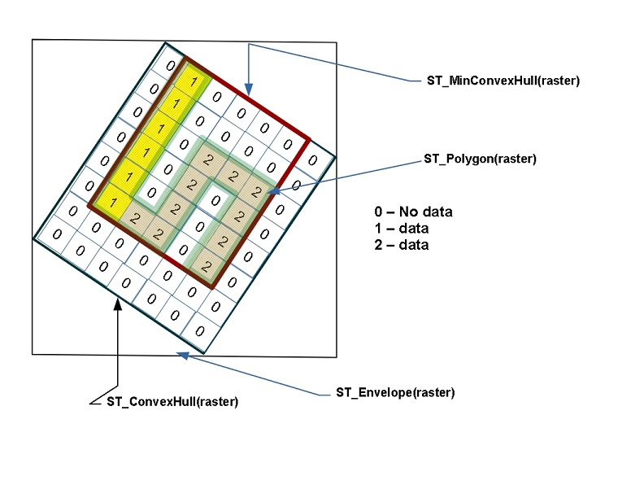
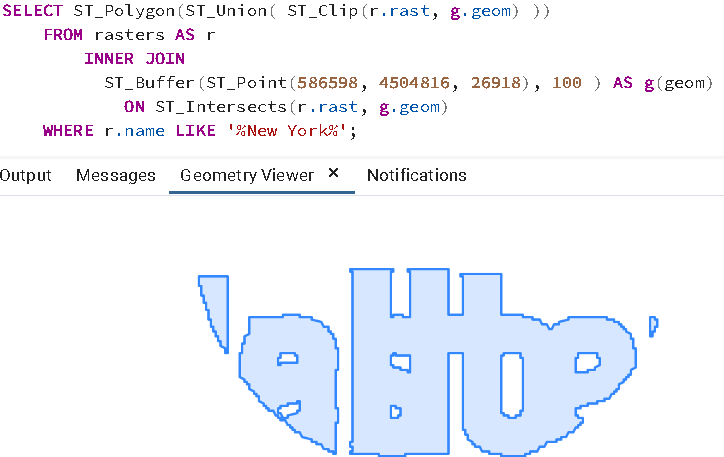
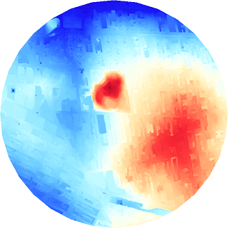

# 30. 래스터 데이터 (Rasters)

> 공식 원문: [<https://postgis.net/workshops/postgis-intro/rasters.html>](https://postgis.net/workshops/postgis-intro/rasters.html)\
> 공식 소스의 본문·표·SQL·이미지를 현재 페이지 순서대로 반영했습니다.

PostGIS는 벡터 형태의 지오메트리뿐만 아니라 연속적인 격자 그리드 형태의 공간 데이터인 **래스터(Raster)** 데이터 타입을 지원합니다.

래스터 데이터는 픽셀(Pixel/Cell)과 밴드(Band)로 구성된 n차원 수치 행렬(Matrix)입니다.
- **밴드(Band)**: 래스터가 포함하는 독립적인 행렬 레이어의 개수입니다. 예를 들어 RGB 항공사진은 Red, Green, Blue 3개 밴드를 가집니다.
- **픽셀(Pixel)**: 각 밴드별로 특정 지점의 측정 수치(수치 표고, 온도, 반사도 등)를 저장하는 최소 격자 단위입니다.



래스터 역시 데카르트 평면 좌표계(SRID)에 지리참조(Georeferenced)되어 있으므로, 벡터 지오메트리와 자유롭게 공간 조인 및 교차 분석을 수행할 수 있습니다.

---

## 1. 래스터 확장 활성화 및 지오메트리로부터 래스터 생성

래스터 기능을 사용하려면 먼저 `postgis_raster` 확장을 활성화해야 합니다.

```sql
CREATE EXTENSION postgis_raster;
```

`ST_AsRaster` 함수를 사용하면 기존 벡터 지오메트리를 래스터 격자로 래스터화(Rasterization)할 수 있습니다.

```sql
CREATE TABLE rasters (name varchar, rast raster);

INSERT INTO rasters(name, rast)
SELECT f.word, ST_AsRaster(geom, width => 150, height => 150)
FROM (VALUES ('Hello'), ('Raster')) AS f(word),
     ST_Letters(word) AS geom;

-- 래스터 바운딩 볼록 껍질(ConvexHull)에 GiST 공간 인덱스 생성
CREATE INDEX ix_rasters_rast
  ON rasters USING gist(ST_ConvexHull(rast));
```

### 래스터 메타데이터 및 픽셀 수 조회
`ST_MetaData(raster)`와 `ST_Count(raster)` 함수로 래스터의 상세 규격을 확인할 수 있습니다.

```sql
SELECT name, ST_Count(rast) AS num_pixels, md.*
FROM rasters, ST_MetaData(rast) AS md;
```

```text
  name  | num_pixels | upperleftx |    upperlefty     | width | height |       scalex       |       scaley        | skewx | skewy | srid | numbands
--------+------------+------------+-------------------+-------+--------+--------------------+---------------------+-------+-------+------+----------
 Hello  |      13926 |          0 | 77.10000000000001 |   150 |    150 |  1.226888888888889 | -0.5173333333333334 |     0 |     0 |    0 |        1
 Raster |      11967 |          0 |              75.4 |   150 |    150 | 1.7226319023207244 | -0.5086666666666667 |     0 |     0 |    0 |        1
```

---

## 2. raster2pgsql 명령줄 도구를 활용한 대용량 래스터 로딩

실무에서 DEM 수치표고모델이나 위성 영상을 데이터베이스로 적재할 때는 PostGIS와 함께 제공되는 **`raster2pgsql` CLI 도구**를 사용합니다.

```sh
raster2pgsql -d -e -l 2,3 -I -C -M -F -Y -t 256x256 *.tif nyc_dem | psql -d nyc
```

### raster2pgsql 주요 옵션 설명
- `-d`: 기존 테이블이 존재할 경우 삭제(Drop) 후 새로 생성합니다.
- `-e`: 개별 트랜잭션으로 각 타일을 즉시 적재합니다.
- `-l 2,3`: 피라미드 축소본인 **개요(Overview)** 테이블(`o_2_nyc_dem`, `o_3_nyc_dem`)을 자동으로 생성합니다 (확대/축소 시 렌더링 및 통계 가속).
- `-I`: 래스터 컬럼에 GiST 공간 인덱스를 자동으로 생성합니다.
- `-C`: 래스터 제약 조건(SRID, 픽셀 크기, 정렬 등)을 테이블에 등록하여 `raster_columns` 카탈로그 뷰에 반영합니다.
- `-M`: 데이터 적재 완료 후 테이블에 `VACUUM ANALYZE`를 실행하여 통계를 최적화합니다.
- `-F`: 각 타일이 어떤 파일에서 로딩되었는지 파일명 컬럼을 추가합니다.
- `-Y`: 대량 적재 시 `COPY` 모드를 사용하여 로딩 속도를 극대화합니다.
- `-t 256x256`: 대용량 래스터를 256×256 픽셀 크기의 **타일(Tile)** 단위로 분할하여 저장합니다. (PostgreSQL의 1GB TOAST 제한을 피하고 공간 쿼리 효율을 높이기 위해 필수적임)

---

## 3. 웹 브라우저에서 래스터 시각화 (ST_AsPNG)

PostGIS 래스터를 웹용 PNG 이미지로 출력하려면 `ST_AsPNG` 함수를 사용합니다.

외부 GDAL 드라이버를 활성화합니다.

```sql
SET postgis.gdal_enabled_drivers = 'ENABLE_ALL';
```

```sql
SELECT 'data:image/png;base64,' || encode(ST_AsPNG(rast), 'base64')
FROM rasters
WHERE name = 'Hello';
```


---

## 4. 래스터 카탈로그 뷰 (raster_columns & raster_overviews)

- **`raster_columns`**: 데이터베이스 내 모든 래스터 테이블의 SRID, 픽셀 크기(`scale_x`, `scale_y`), 블록 크기(`blocksize_x`, `blocksize_y`), 밴드 수, 픽셀 데이터 타입 등의 메타데이터를 제공합니다.
- **`raster_overviews`**: 개요 테이블과 원본 래스터 간의 관계 및 축소 배율(`overview_factor`)을 관리합니다.

```sql
SELECT r_table_name, srid, scale_x, scale_y, blocksize_x, blocksize_y, num_bands, pixel_types
FROM raster_columns;
```

---

## 5. 래스터 공간 연산 및 가공

### 1) 래스터 병합: ST_Union(raster)
여러 래스터 타일을 하나의 래스터로 병합합니다. 겹치는 픽셀 영역에 대해 다양한 결합 전략(`uniontype`)을 지정할 수 있습니다.
- `LAST` (기본값): 나중에 처리된 타일의 픽셀 값 사용
- `FIRST`: 먼저 처리된 타일의 픽셀 값 사용
- `MEAN`: 겹치는 픽셀들의 평균값 계산
- `COUNT`: 겹치는 유효 픽셀의 개수 집계
- `MAX` / `MIN`: 최댓값 / 최솟값 선택

```sql
SELECT ST_Union(rast, 'MEAN')
FROM rasters
WHERE name LIKE '%New York%';
```


> [!NOTE]
> 래스터 병합을 수행하려면 모든 타일이 동일한 SRID, 동일한 픽셀 크기, 동일한 그리드 원점을 공유하는 **동일 정렬(Same Alignment)** 상태여야 합니다. 정렬 일치 여부는 `ST_SameAlignment(rast1, rast2)` 함수로 검사할 수 있습니다.

### 2) 지오메트리 영역으로 래스터 클리핑: ST_Clip
`ST_Clip(raster, geometry)`은 래스터에서 지정한 벡터 지오메트리 영역만큼만 잘라냅니다.

```sql
SELECT ST_Union(ST_Clip(r.rast, g.geom))
FROM rasters AS r
JOIN ST_Buffer(ST_Point(586598, 4504816, 26918), 100) AS g(geom)
  ON ST_Intersects(r.rast, g.geom)
WHERE r.name LIKE '%New York%';
```

> [!TIP]
> 기본적으로 `ST_Clip`은 픽셀의 중심점이 지오메트리 내부에 있을 때만 포함합니다. 픽셀 중심점이 경계선 밖에 있더라도 지오메트리와 조금이라도 맞닿는 모든 픽셀을 포함하려면 PostGIS 3.5+에서 도입된 **`touched => true` 매개변수**(`ST_Clip(r.rast, g.geom, touched => true)`)를 사용합니다.

---

## 6. 래스터를 벡터 지오메트리로 변환

### 1) ST_Polygon: 유효 픽셀 전체를 폴리곤으로 변환
특정 밴드에 데이터가 존재하는 영역 전체를 하나의 폴리곤(MultiPolygon)으로 추출합니다.

```sql
SELECT ST_Polygon(ST_Union(ST_Clip(r.rast, g.geom)))
FROM rasters AS r
JOIN ST_Buffer(ST_Point(586598, 4504816, 26918), 100) AS g(geom)
  ON ST_Intersects(r.rast, g.geom)
WHERE r.name LIKE '%New York%';
```



### 2) ST_DumpAsPolygons: 동일 값을 가진 픽셀 그룹을 폴리곤으로 추출
`ST_DumpAsPolygons`는 동일한 수치값을 가진 인접 픽셀들을 그룹화하여 지오메트리와 픽셀 값을 함께 담은 **`geomval` 복합 타입**으로 반환합니다.

```sql
SELECT gv.val, ST_Union(gv.geom) AS geom
FROM rasters AS r,
     ST_DumpAsPolygons(rast, 2) AS gv
WHERE r.name LIKE '%New York%'
GROUP BY gv.val;
```


---

## 7. 래스터 통계 및 분석

- **`ST_SummaryStatsAgg(raster set)`**: 래스터 집합 전체에 대한 픽셀 개수(`count`), 합계(`sum`), 평균(`mean`), 표준편차(`stddev`), 최솟값(`min`), 최댓값(`max`)을 초고속 집계합니다.
- **`ST_Quantile` / `ST_Histogram`**: 래스터의 분위수(Quantile) 및 히스토그램 빈(Bin) 분포를 집계합니다.

```sql
-- DEM 고도 래스터 전체의 요약 통계 계산
SELECT (ST_SummaryStatsAgg(rast, 1, true, 1)).*
FROM o_3_nyc_dem;
```

```text
   count   |    sum     |       mean       |      stddev      | min | max
-----------+------------+------------------+------------------+-----+-----
 246794100 | 4555256024 | 18.4577184948911 | 39.4416860598687 |   0 | 411
```

---

## 8. 포인트 지점에서의 래스터 값 추출 (ST_Value)

특정 GPS 포인트나 사건 발생 위치의 표고(고도) 값을 DEM 래스터로부터 추출할 때는 **`ST_Value(raster, point)`** 함수를 사용합니다.

```sql
SELECT
  g.id,
  g.geom,
  ST_Value(r.rast, g.geom) AS elevation_ft
FROM nyc_dem_26918 AS r
JOIN nyc_homicides AS g
  ON r.rast && g.geom
WHERE g.weapon = 'gun'
LIMIT 5;
```

---

## 9. 지도 대수 (Map Algebra) 및 재분류 (ST_Reclass)

- **`ST_Reclass`**: 연속적인 픽셀 수치 범위를 이산적인 등급 코드로 재분류합니다 (예: 고도값을 1: 저지대, 2: 평지, 3: 구릉지, 4: 산악지로 변환).
- **`ST_ColorMap`**: 단일 밴드 흑백 수치 래스터에 색상 팔레트(`bluered`, `grayscale` 등)를 적용하여 시각화용 3~4밴드 컬러 래스터를 생성합니다.

```sql
SELECT ST_ColorMap(ST_Union(newrast), 'bluered') AS rast
FROM nyc_dem_26918 AS r
JOIN ST_Buffer(ST_Point(586598, 4504816, 26918), 1000) AS g(geom)
  ON ST_Intersects(r.rast, g.geom)
CROSS JOIN ST_Clip(rast, g.geom) AS newrast;
```




---

[← 이전](29_knn.md) · [목차](00_index.md) · [다음 →](31_topology.md)
