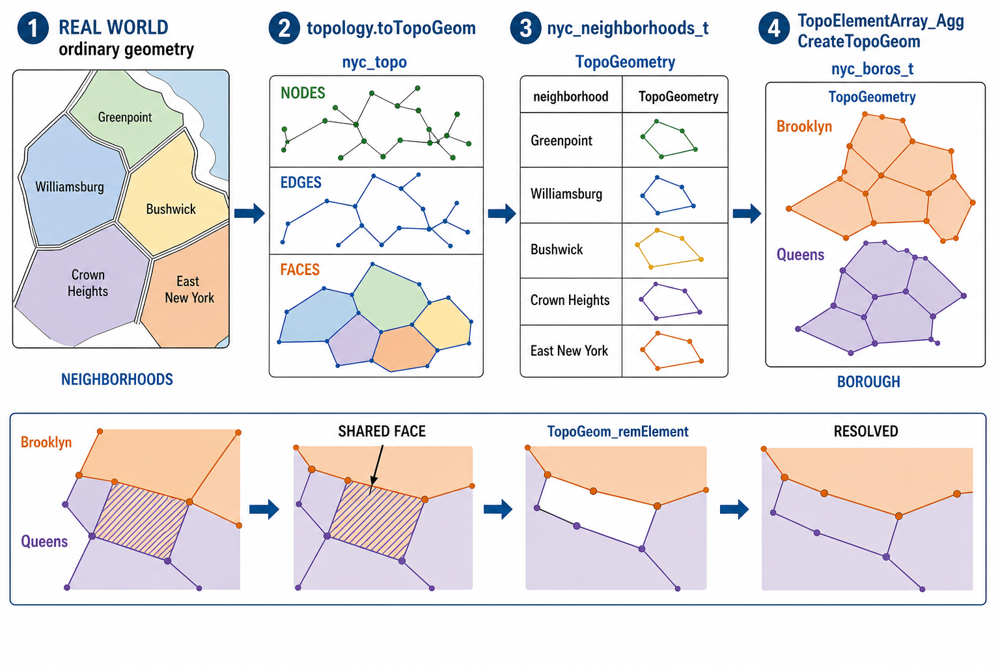
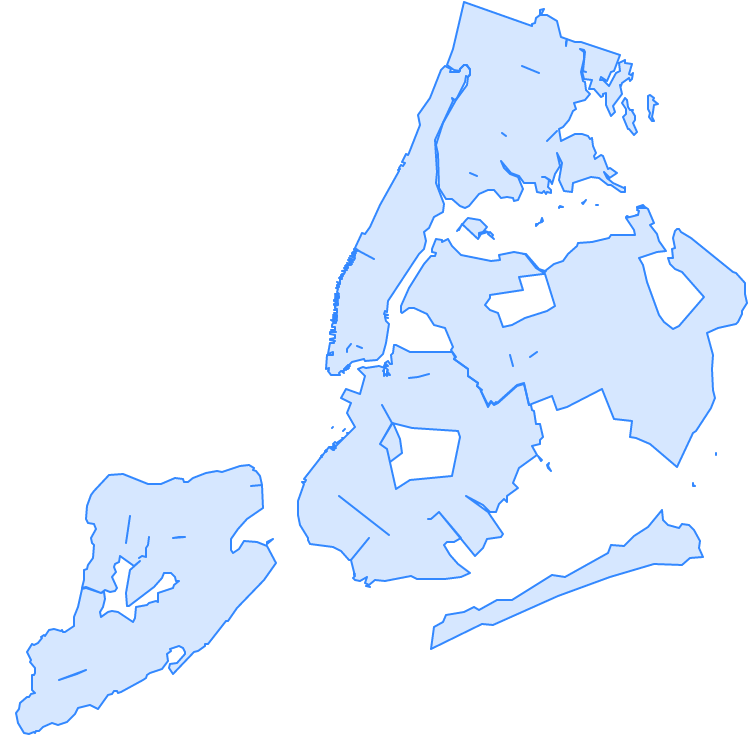

# 31. 공간 토폴로지 (Topology)

> 공식 원문: [<https://postgis.net/workshops/postgis-intro/topology.html>](https://postgis.net/workshops/postgis-intro/topology.html)\
> 공식 소스의 본문·표·SQL·이미지를 현재 페이지 순서대로 반영했습니다.

래스터가 공간을 픽셀 격자로 표현한다면, 토폴로지는 벡터 객체 사이의 **공유 경계와 연결 관계**를 명시적으로 저장합니다. 이번 장에서는 좌표 형상뿐 아니라 객체 간 구조적 관계까지 관리하는 모델을 살펴봅니다.

PostGIS는 **`postgis_topology` 확장**을 통해 ISO SQL/MM Topo-Geo 및 Topo-Net 규격을 준수하는 위상학적 공간 데이터 모델링을 지원합니다.

일반 지오메트리(`geometry`)는 각 객체가 서로 독립적으로 존재하므로, 인접한 두 필지나 행정구역의 경계를 수정할 때 미세한 틈(Gap)이나 겹침(Sliver Polygon)이 쉽게 발생합니다. 반면 **토폴로지(Topology)** 모델에서는 인접한 면들이 동일한 경계선(에지/Edge)을 공유하므로, 경계선을 한 번만 수정하면 인접한 모든 객체에 수정 사항이 자동으로 반영되어 데이터의 무결성을 완벽하게 유지할 수 있습니다.

---

## 1. 토폴로지 확장 활성화 및 토폴로지 생성

```sql
CREATE EXTENSION postgis_topology;
```

확장을 설치하면 데이터베이스에 토폴로지 카탈로그를 관리하는 `topology` 스키마(`topology.topology`, `topology.layer`)가 생성됩니다.

`CreateTopology` 함수를 사용하여 허용 오차(Tolerance) 0.5m를 가진 `nyc_topo` 토폴로지를 생성합니다.

```sql
SELECT topology.CreateTopology('nyc_topo', 26918, 0.5);
```

이 명령을 실행하면 데이터베이스에 `nyc_topo`라는 전용 스키마가 생성되며, 그 내부에 다음 핵심 테이블들이 자동으로 구성됩니다.

- **`node`**: 모든 에지의 시작점과 끝점, 그리고 독립된 고립 점(Isolated Node)을 저장하는 테이블
- **`edge_data`**: 토폴로지를 구성하는 모든 방향성 선분(Edge)과 좌우 인접 면(Face) 정보를 저장하는 테이블
- **`face`**: 에지들로 둘러싸인 모든 폐곡선 영역(Face / 면)의 경계 상자를 관리하는 테이블
- **`relation`**: 사용자 정의 지오메트리가 토폴로지의 어떤 노드, 에지, 페이스로 구성되어 있는지 매핑하는 테이블

---

## 2. TopoGeometry 컬럼 정의 및 데이터 적재

토폴로지 기반 객체를 다루려면 일반 테이블에 **`TopoGeometry` 컬럼**을 추가해야 합니다.

```sql
-- 동네 테이블 생성
CREATE TABLE nyc_neighborhoods_t (
  boroname varchar(43),
  name varchar(67),
  CONSTRAINT pk_nyc_neighborhoods_t PRIMARY KEY(boroname, name)
);

-- TopoGeometry 컬럼 추가 (layer_id 반환)
SELECT topology.AddTopoGeometryColumn(
  'nyc_topo', 'public', 'nyc_neighborhoods_t', 'topo', 'POLYGON'
) AS layer_id;
```

### toTopoGeom 함수를 통한 지오메트리 변환 적재
`toTopoGeom` 함수는 지오메트리를 파싱하여 공유되는 노드, 에지, 페이스를 `nyc_topo` 스키마에 자동으로 등록하고 `relation` 관계를 구축합니다.

```sql
INSERT INTO nyc_neighborhoods_t(boroname, name, topo)
SELECT
  boroname,
  name,
  topology.toTopoGeom(geom, 'nyc_topo', 1)
FROM nyc_neighborhoods
WHERE ST_IsValid(geom);
```

---

## 3. 계층적 레이어 구축 (Neighborhoods ➔ Boroughs)

동네(Neighborhoods) 단위의 TopoGeometry들을 모아서 상위 자치구(Boroughs) 레이어를 구축할 수 있습니다.



*그림 31-1. `toTopoGeom`은 독립적으로 저장된 근린지역 폴리곤을 공유 노드·에지·페이스로 분해하고, `nyc_neighborhoods_t.topo`는 이 요소의 관계를 참조합니다. 근린지역 TopoGeometry를 묶으면 자치구 TopoGeometry가 되며, 둘 이상의 객체가 같은 페이스를 소유한 경우에는 이를 검출해 한쪽 관계에서 제거합니다. 공간 모양은 개념도입니다.*

```sql
CREATE TABLE nyc_boros_t (
  boroname varchar(43),
  CONSTRAINT pk_nyc_boros_t PRIMARY KEY(boroname)
);

SELECT topology.AddTopoGeometryColumn(
  'nyc_topo', 'public', 'nyc_boros_t', 'topo', 'POLYGON',
  (topology.FindLayer('public', 'nyc_neighborhoods_t', 'topo')).layer_id
) AS layer_id;
```

```sql
INSERT INTO nyc_boros_t(boroname, topo)
SELECT
  n.boroname,
  topology.CreateTopoGeom(
    'nyc_topo',
    3,
    (topology.FindLayer('public', 'nyc_boros_t', 'topo')).layer_id,
    topology.TopoElementArray_Agg(n.topo::topoelement)
  )
FROM nyc_neighborhoods_t AS n
GROUP BY n.boroname;
```



---

## 4. 경계 중복(공유 페이스) 검출 및 분쟁 해결

원래 소스 지오메트리가 정밀하지 못해 두 자치구(브루클린과 퀸즈)가 동시에 동일한 영역 면(Face)을 공유하고 있는 경계 분쟁을 검출해 보겠습니다.

`GetTopoGeomElements` 함수를 사용하여 둘 이상의 자치구에 속한 **공유 페이스(Shared Face)**를 조회합니다.

```sql
SELECT
  te,
  t.geom,
  ST_Area(t.geom) AS area,
  array_agg(DISTINCT d.boroname) AS shared_boros
FROM nyc_boros_t AS d,
     topology.GetTopoGeomelements(d.topo) AS te,
     topology.ST_GetFaceGeometry('nyc_topo', te[1]) AS t(geom)
GROUP BY te, t.geom
HAVING count(DISTINCT d.boroname) > 1
ORDER BY area;
```

```text
  te   |  area  |    shared_boros
-------+--------+--------------------
 {44,3}|  ...   | {Brooklyn, Queens}
 {51,3}|  ...   | {Brooklyn, Queens}
```

### 중복 페이스 제거: TopoGeom_remElement
중복된 페이스를 특정 동네에서 제거하여 경계 분쟁을 깔끔하게 해소합니다.

```sql
WITH to_remove AS (
  SELECT
    te,
    max(ST_Area(d.topo::geometry)) AS max_area,
    array_agg(DISTINCT d.name) AS shared_d
  FROM nyc_neighborhoods_t AS d,
       topology.GetTopoGeomelements(d.topo) AS te,
       topology.ST_GetFaceGeometry('nyc_topo', te[1]) AS t(geom)
  GROUP BY te
  HAVING count(DISTINCT d.name) > 1
)
UPDATE nyc_neighborhoods_t AS d
SET topo = topology.TopoGeom_remElement(topo, te)
FROM to_remove
WHERE d.name = ANY(to_remove.shared_d)
  AND ST_Area(d.topo::geometry) = to_remove.max_area;
```

수정을 완료한 후 다시 검사하면 자치구와 동네 간의 모든 경계 중복이 완벽하게 제거된 것을 확인할 수 있습니다.


---

[← 이전](30_rasters.md) · [목차](00_index.md) · [다음 →](32_topology_base_types.md)
